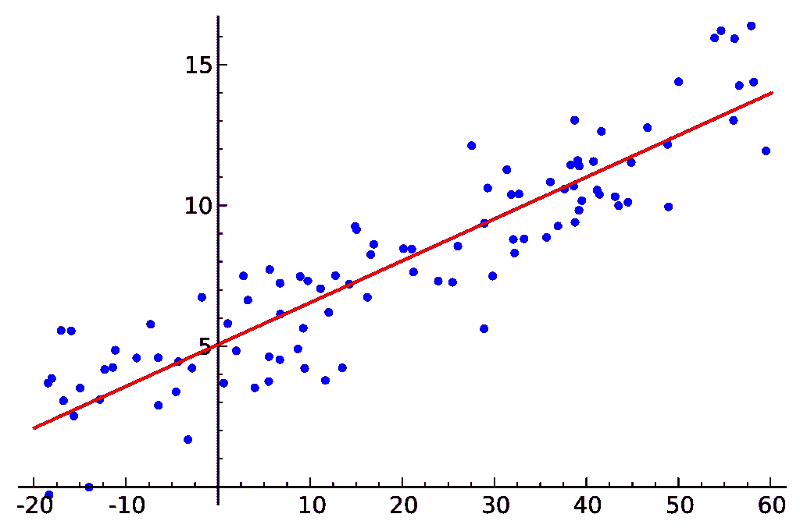
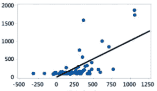
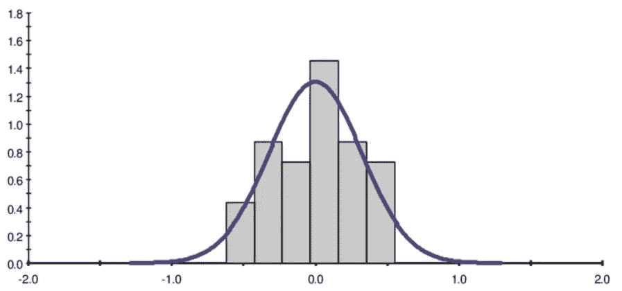
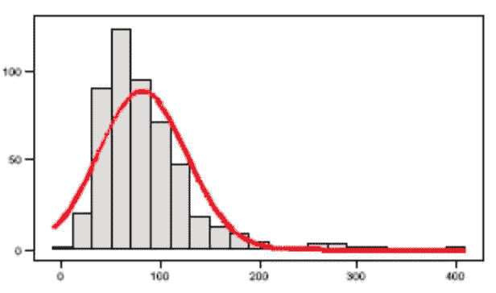
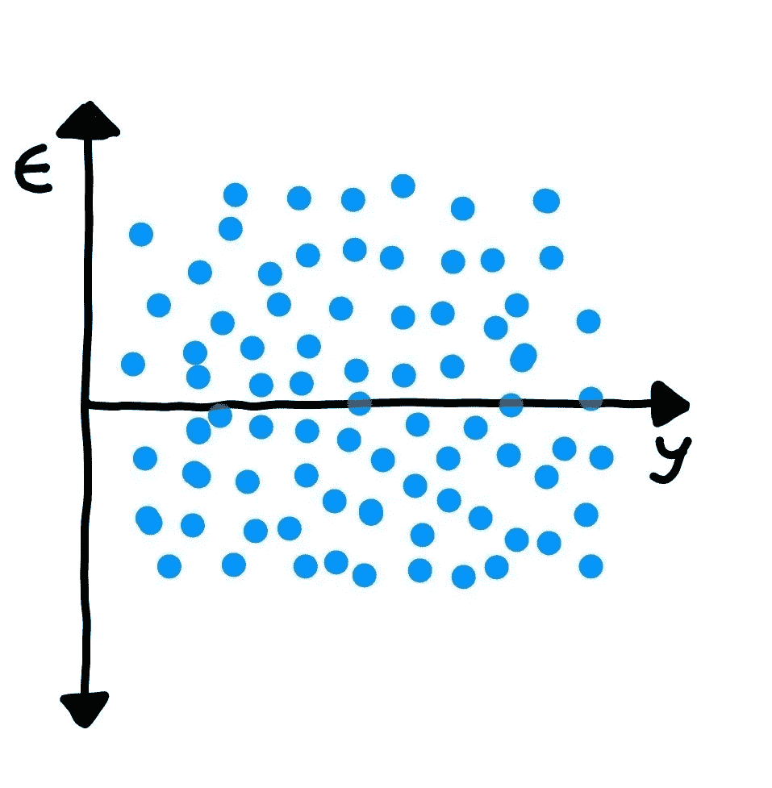
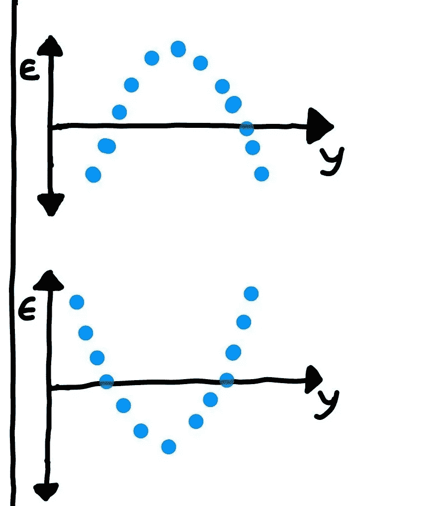
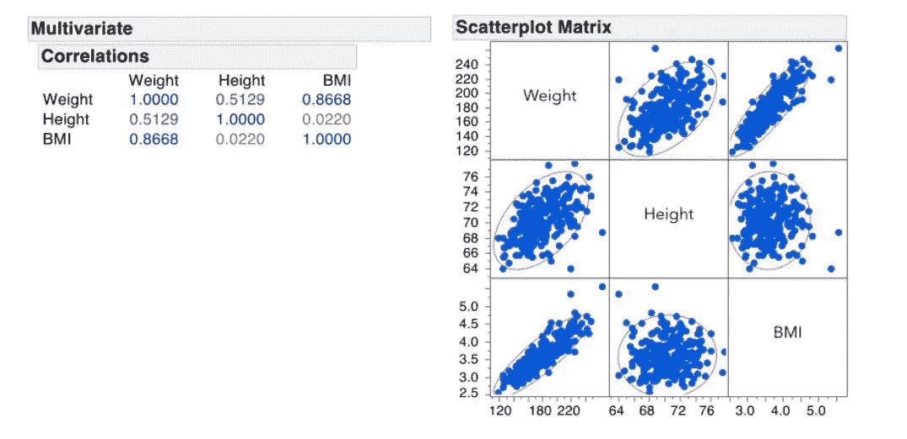

# 线性回归假设及其对模型的影响

> 原文：<https://medium.com/analytics-vidhya/assumption-of-linear-regression-and-their-effect-on-the-model-2f9c483da4c6?source=collection_archive---------14----------------------->

在建立我们的线性回归模型时，我们需要记住一些假设，以使回归线更好地适合我们的模型。

线性回归是监督机器学习算法，其中一个或多个自变量解释因变量(预测变量)。线性回归有五个假设。

1.  **自变量与因变量(预测变量)之间的线性关系。**

**什么意思——**它说明自变量和因变量应该是线性相关的。您可以通过绘制自变量的散点图、线图来检查线性。

来源:-维基百科

**如果错过了**怎么办——如果自变量和因变量不是线性相关的，我们仍然试图拟合直线。它不会在模型中给出更好的精度。如下图所示，它将符合一些直线，但它不会是最佳拟合回归线。

来源:-维基百科

**2。误差项正态分布，均值为零。**

**其含义——**它陈述了误差项(error = y_pred - y_actual)应呈正态分布。

来源:-维基百科

**如果遗漏了怎么办:-** 如果误差项不是正态分布，如果你只是想拟合一条线，而不想做任何进一步的解释，那就没有问题。但是如果你愿意对你建立的模型做一些推论(你将在接下来的部分看到)，你需要对误差项的分布有一个概念。非正态分布的误差项的一个特殊影响是，在确定系数显著性的假设检验期间获得的 p 值变得不可靠。

来源:- [online.stat](https://online.stat.psu.edu/)

**3。误差项应相互独立**

**含义:-** 表示误差项(y_pred - y_actual)不应依赖于任何其他误差项。就像在误差项依赖于先前值的时间序列中一样。下图显示误差项是随机分布的，不遵循任何模式。

**错过了怎么办:-** 这意味着模型还有改进的空间，极端的序列相关性往往是严重误指定模型的征兆。串行相关(也称为自相关)有时是违反线性假设的副产品。在非时间序列模型中，如果误差在特定条件下总是具有相同的符号，独立性也会被破坏。

**4。同质性——误差项应具有恒定方差**

**含义:-** 表示如果误差项改变(增加或减少)，方差不应增加或减少。此外，随着误差项的变化(增加或减少)，它不应遵循某种模式。如下图所示，误差项具有恒定的方差。

来源:维基百科

**如果错过了怎么办:-** 这将使测量预测误差的真实标准差变得困难，通常会导致置信区间过宽或过窄。特别是，如果误差的方差随着时间的推移而增加，样本外预测的置信区间将会变得非常窄。

估计系数时，异方差也可能会对数据的一个小子集(即误差方差最大的子集)赋予过多的权重。如下图所示。

**5。多重共线性-**

**含义:-** 表示自变量之间不应该有任何相关性。为了检查这个问题，我们可以绘制成对相关图，避免使用高度相关的变量。有时，两个或多个变量与一个独立变量相关，这很难从相关图中识别。在这种情况下，您可以检查 VIF(方差膨胀系数)。

多重共线性的典型示例是包含体重、身高和身体质量指数指数的数据，其中 BMI 指数取决于身高和体重。

资料来源:-jmp.com

**如果遗漏了怎么办:-** 如果我们的模型中存在多重共线性问题，则不适合从模型中进行推断，并且一个变量可以由许多其他变量来解释。此外，由于这个问题，标准误差往往会增加，这使得估计不太精确。

感谢阅读！！请喜欢如果你喜欢读这个。