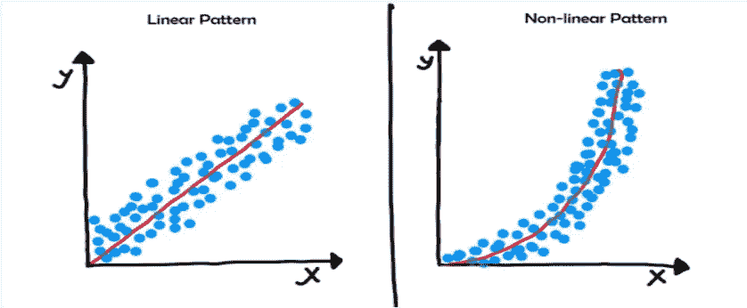
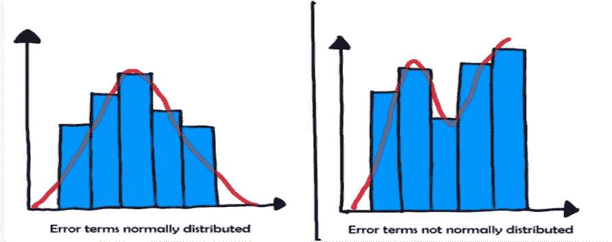
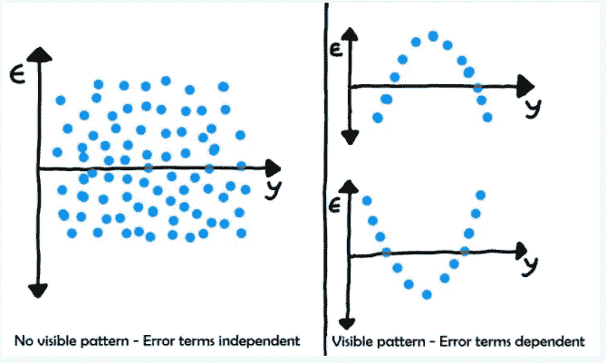
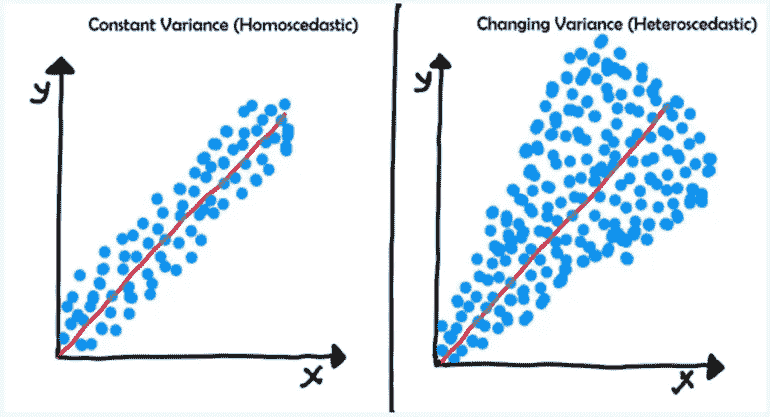
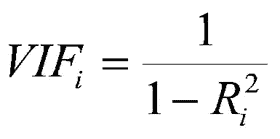

# 线性回归的假设

> 原文：<https://medium.com/analytics-vidhya/assumptions-of-linear-regression-61ce2d4915e0?source=collection_archive---------11----------------------->

线性回归需要满足一些假设，否则线性模型给出的输出是不可信的。这是面试中很常见的问题。

**简单线性回归:**当数据只有 1 个独立特征时，则称之为简单线性回归。

**多元线性回归:**当数据有 1 个以上的独立特征时，称为多元线性回归。

我们将借助简单线性回归来理解线性回归的假设。

## 1.X 和 y 变量之间存在线性关系。

这种假设认为独立和从属特征具有线性关系。为了检验这个假设，我们可以使用散点图，散点图应该看起来像上面的左图。

## 2.误差项呈正态分布。

这个假设认为误差项是正态分布的。这里预测误差减去实际目标。要检查这一假设，请根据数据拟合模型并进行预测。现在计算误差，并画出这个误差的分布(直方图)，这个分布应该看起来像正态分布。

3.**误差项相互独立**

为了检验这个假设，在目标变量和误差项之间画一个散点图。散点图不应显示明显的模式。

## 4.同方差:误差项具有恒定的方差。

要检查这一点，在独立特征和目标特征之间绘制一个散点图，然后在同一轴上，在独立特征和预测之间绘制一个散点图。您应该会得到一个类似上面左图的图形。

## **5。最小多重共线性:**

多重共线性意味着 1 个要素与其他要素相关，我们希望最小化多重共线性。很明显，这个问题出现在多个线性回归中，因为它包含不止一个特征。为了检验这一假设，使用 VIF(方差膨胀系数)

VIF 值越高，多重共线性越高。在大多数情况下，VIF 值不应大于 10。

***感谢您的宝贵时间！***

[***想了解完整的线性回归概念？***](https://link.medium.com/LU8C6wAsM9)