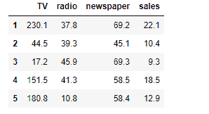
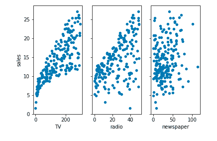
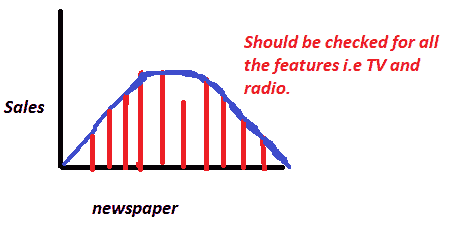
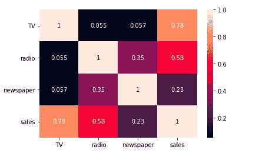
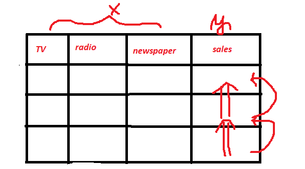
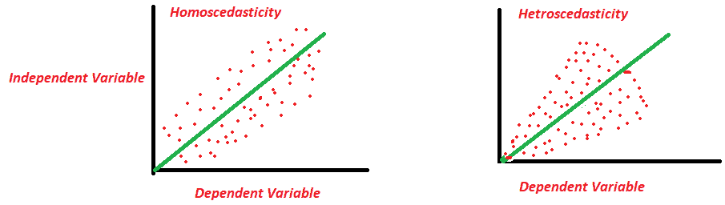

# 线性回归的假设

> 原文：<https://medium.com/analytics-vidhya/assumptions-of-linear-regression-d4c42567aa1b?source=collection_archive---------12----------------------->

线性回归是用于分析两个变量之间关系的标准技术。这是一个假设输入变量(x)和单个输出变量(y)之间存在线性关系的模型。更具体地说，y 可以从输入变量(x)的线性组合中计算出来。

在这篇博客中，我们将了解它的一些假设，以及如何检查它们在数据集中的存在。

1.  线性分布
2.  常态的存在
3.  [统]多重共线性
4.  自相关
5.  同方差性

让我们逐一讨论:

1.**线性分布**:它被定义为两个特征之间的关系，其中一个特征的变化可以很容易地解释另一个特征的变化，即每个自变量和目标变量之间的关系应该是线性的，为了检查线性分布，我们可以简单地绘制一个散点图。

2.**正态性的存在**:我们知道在统计学中有 N 种分布，如果任何变量的观测值大于 30，那么我们可以简单地假设它是正态分布的(中心极限定理)。

正态性的存在仅仅意味着将成为“X”特征矩阵的一部分的所有特征应该服从正态分布，并且为了检查其存在，我们可以使用直方图。

**3。多重共线性:**它被定义为用于回归分析的特征之间的相关性。它是“X”特征矩阵中使用的所有列之间的相关性的度量。

对于一个好的回归分析，我们不希望特性严重依赖于彼此，因为改变一个可能会改变另一个。我们需要很少或不需要多重共线性，要检查多重共线性，我们可以使用皮尔逊相关系数或热图。

**4。自相关:**可以定义为预测向量(或因变量)中相邻观测值之间的相关性。有时，y(x+1)的值取决于 y(x)的值，而 y(x)的值又取决于 y(x-1)的值。大多数情况下，股票市场或任何时间序列分析数据集都可以作为自相关数据的一个例子，我们可以使用折线图或几何图来检查它的存在。

5.**Homo scedassity:**(Homo = similar | scedassity = error)它可以被定义为回归模型的一个属性，其中误差(“噪声”或输入和输出变量之间的随机扰动)在输入变量的所有值上几乎是相似的。

如果误差持续剧烈变化，这将导致漏斗形散点图，并可能破坏我们的回归模型，并且条件遵循异方差，我们可以使用散点图来检查其在数据集中的存在。

现在，让我们用图解的方式一个一个地理解它们

考虑一个包含三个要素和一个目标变量的数据集。

**有哪些特点**？

**电视**:在给定市场中，某个产品在电视上的广告费用(以千美元计)

**电台**:花在电台上的广告费

报纸:花在报纸上的广告费

什么是**回应**？

**销售额**:某一特定市场中某一单一产品的销售额(成千上万件)

1.  线性分布:为了检查这一点，我们需要在每个自变量和目标变量之间绘制一个散点图。

2.正态性的存在:我们需要画出每个自变量和因变量之间的直方图。

3.**多重共线性:**要检查多重共线性，我们可以使用皮尔逊相关系数或热图。

4.**。自相关:**

**5。同方差:**

