# 线性回归的假设—如何验证和修正

> 原文：<https://medium.com/analytics-vidhya/assumptions-of-linear-regression-how-to-validate-and-fix-ec1bd9149bc2?source=collection_archive---------9----------------------->

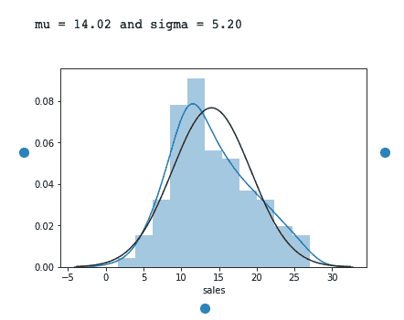

# 介绍

我假设你对线性回归有相当的理解。如果没有，我已经用 python 写了一个简单易懂的例子[这里](https://machinelearningmind.com/2019/10/06/introduction-to-linear-regression-e-commerce-dataset/)。在继续下一步之前，请阅读它。

线性回归对数据做出某些假设，并在此基础上提供预测。自然地，如果我们不考虑这些假设，线性回归会用一个糟糕的模型惩罚我们(你不能真的责怪它！)
我们将获取一个数据集，尝试拟合所有的假设，检查指标，并与我们没有处理假设的情况下的指标进行比较。
那么，我们就直入主题吧。

# 无假设的线性回归

让我们以著名的广告数据集为例。

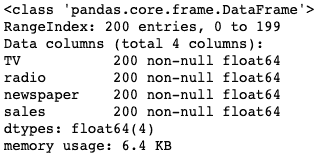

df.info()

```
# Creating DataFrame out of Advertising.csv
df = pd.read_csv("Advertising.csv")
df.drop("Unnamed: 0", axis=1,inplace=True)# Separating Independent and dependent variables
X=df.drop(['sales'],axis=1)
Y=df.sales# Fit Linear Regression
lr = LinearRegression()
model=lr.fit(X,Y)
y_pred = model.predict(X)
print("R-squared: {0}".format(metrics.r2_score(Y,y_pred)))
```

**输出:** R 的平方:0。58660 . 68868886861

```
# Plot the Residuals vs Fitted Values
plt.scatter(ypred, (Y-ypred)) 
plt.xlabel("Fitted values") 
plt.ylabel("Residuals")
```

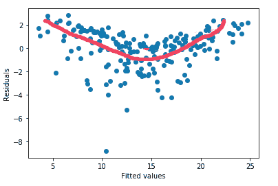

发现模式

我们可以在残差与拟合值图中看到一种模式，这意味着模型没有很好地捕捉到数据的非线性。

现在，让我们继续假设，看看 R 平方值和残差与拟合值图是否有所改善。

# 假设 1:

> *因变量和自变量必须有线性关系。*

## 怎么查？

一个简单的数据图表可以帮助我们了解自变量和因变量之间是否存在线性关系。

## 怎么修？

要修复非线性，可以对独立变量 log(X)进行对数变换，或者进行其他非线性变换，如√X 或 X。

让我们绘制一个配对图来检查自变量和因变量之间的关系。

```
sns.pairplot(df)
```

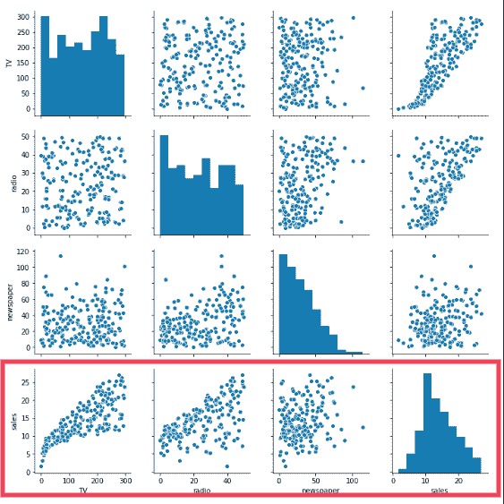

我们可以在残差与拟合值图中看到一种模式，这意味着模型没有很好地捕捉到数据的**非线性。**

一阶方程不能完全捕捉非线性，这将导致模型不符合标准。为了对变量进行平方并拟合模型，我们将使用具有多项式特征的线性回归。

```
from sklearn.preprocessing import PolynomialFeatures 

poly = PolynomialFeatures(degree = 2) 
X_poly = poly.fit_transform(X) 

poly.fit(X_poly, Y) 
X_poly = sm.add_constant(X_poly)
results = sm.OLS(Y,X_poly).fit()print(results.summary())
```

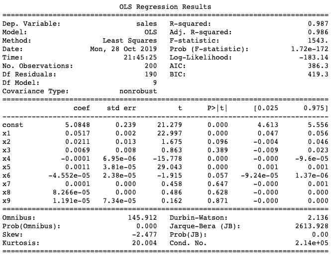

r 平方:0.987，德宾-沃森:2.136

# 假设 2:

> 残差中没有自相关。

## 怎么查？

使用德宾-沃森测试。
DW = 2 将是这里的理想情况(无自相关)
0 < DW < 2 - >正自相关
2 < DW < 4 - >负自相关
statsmodels 的线性回归总结为我们提供了 DW 值以及其他有用的见解。

## 怎么修？

*   添加一个相对于自变量滞后的列
*   将变量居中(用平均值减去列中的所有值)

我们可以看到， **Durbin-Watson :~ 2** (摘自上面的 results.summary()一节)这似乎非常接近理想情况。所以，我们什么都不用做

# 假设 3:

> 没有[异方差](https://www.investopedia.com/terms/h/heteroskedasticity.asp)。

## 怎么查？

残差对拟合值图可以判断是否存在异方差。
如果该图显示漏斗形模式，那么我们说异方差存在。

> *残差只不过是实际值和拟合值之间的差异*

## 怎么修？

我们可以对因变量进行非线性转换，如 log(Y)或√Y。此外，您可以使用加权最小二乘法来处理异方差。

```
plt.subplots(figsize=(10,5))plt.subplot(1,2,1)
plt.title("Before")
plt.scatter(ypred1, (Y-ypred1))
plt.xlabel("Fitted values")
plt.ylabel("Residuals")plt.subplot(1,2,2)
plt.title("After")
plt.scatter(ypred2, (Y-ypred2))
plt.xlabel("Fitted values")
plt.ylabel("Residuals")
```

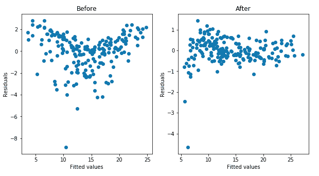

在这里，我们绘制了基于假设的之前的**和**之后的**的残差与拟合值的曲线图。我们在“之后”或“之前”部分没有看到类似漏斗的模式，所以没有异方差。**

# 假设 4:

> 没有完美的多重共线性。

我已经写了一篇关于[多重共线性](https://machinelearningmind.com/2019/10/19/multicollinearity-how-to-fix-it/)以及如何修复的帖子。如果您不熟悉多重共线性，请阅读它。

## 怎么查？

在变量非常少的情况下，可以使用热图，但是在列数很大的情况下不太可行。
另一种常见的检查方法是计算 VIF(方差膨胀因子)值。
如果 VIF=1，非常少的多重共线性
VIF < 5，中度多重共线性
VIF > 5，极度多重共线性(这是我们必须避免的)

## 怎么修？

具有高度多重共线性的变量可以一起移除，或者如果您可以找出哪两个或更多变量彼此具有高度相关性，您可以简单地将这些变量合并为一个。确保 VIF < 5.

```
# Function to calculate VIF
def calculate_vif(data):
    vif_df = pd.DataFrame(columns = ['Var', 'Vif'])
    x_var_names = data.columns
    for i in range(0, x_var_names.shape[0]):
        y = data[x_var_names[i]]
        x = data[x_var_names.drop([x_var_names[i]])]
        r_squared = sm.OLS(y,x).fit().rsquared
        vif = round(1/(1-r_squared),2)
        vif_df.loc[i] = [x_var_names[i], vif]
    return vif_df.sort_values(by = 'Vif', axis = 0, ascending=False, inplace=False)X=df.drop(['sales'],axis=1)
calculate_vif(X)
```

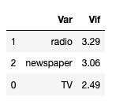

VIF < 5 for all Independent variables

Great! we have all VIFs<5 . If you want to know what to do in case of higher VIF values, check [这个](https://machinelearningmind.com/2019/10/19/multicollinearity-how-to-fix-it/#fixit)出来。

# 假设 5:

> 残差必须是正态分布的。

## 怎么查？

对残差使用分布图，看看它是否正态分布。

## 怎么修？

如果残差不是正态分布，可以尝试因变量或自变量的非线性变换。

```
plt.subplots(figsize=(8,4))plt.subplot(1,2,1)
plt.title("Before")
sns.distplot(Y-ypred1 , fit=norm);
plt.xlabel('Residuals')plt.subplot(1,2,2)
plt.title("After")
sns.distplot(Y-ypred2 , fit=norm);
plt.xlabel('Residuals')
```

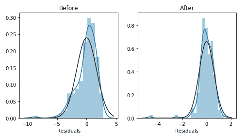

图中的黑线显示的是正态分布，蓝线显示的是当前的分布。

“之前”部分显示分布从正态分布略微偏移，而“之后”部分几乎与正态分布一致。

另一种我们可以确定的方法是使用 Q-Q 图(分位数-分位数)

```
plt.subplots(figsize=(8,4))plt.subplot(1,2,1)
stats.probplot(Y-ypred1, plot=plt)plt.subplot(1,2,2)
stats.probplot(Y-ypred2, plot=plt)
plt.show()
```

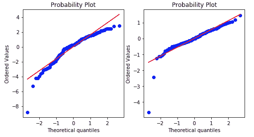

在“之前”部分，您将看到剩余分位数并不完全遵循它应该遵循的直线，这意味着分布不正常。而在假设验证之后，我们可以看到剩余分位数遵循一条直线，这意味着分布是正态的。

这标志着假设验证的结束。现在让我们比较两个模型的指标。

# 比较

我们来对比一下这两款，看看有没有改进的地方。

## 以前

r 平方: **0.8972**

```
plt.title("Before")
plt.plot(Y,Y, color="red")
plt.scatter(ypred1, Y)
plt.xlabel("Fitted values")
plt.ylabel("Actuals")
```

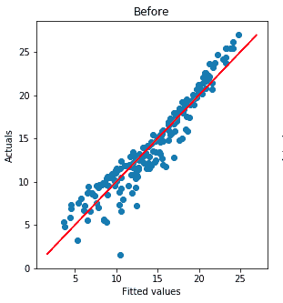

## 在...之后

r 平方: **0.987**

```
plt.title("After")
plt.plot(Y,Y, color="red")
plt.scatter(ypred2, Y)
plt.xlabel("Fitted values")
plt.ylabel("Actuals")
```

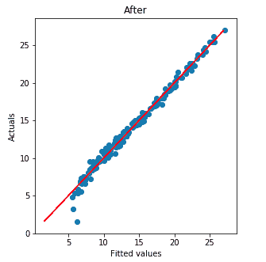

r 平方值已得到改进，在上面的图中，我们还可以看到假设验证前后的实际值与拟合值。
98%+以上的拟合值与实际值一致。这意味着模型能够捕捉数据集的非线性并从中学习。

# 结论

我们现在已经验证了线性回归的所有假设都被考虑到了，我们可以有把握地说，如果我们考虑到这些假设，我们可以期望得到好的结果。

所以，基本上，如果你的线性回归模型给出了低于标准的结果，请确保这些假设是有效的，如果你已经修正了数据以符合这些假设，那么你的模型肯定会有所改进。

这个帖子到此为止！。

这是我为 Jupyter 笔记本设计的关于线性回归的 GitHub。寻找用于这篇文章的笔记本->[media-sales-linear-regression-verify-assumptions . ipynb](https://github.com/fahadanwar10/LinearRegression/blob/master/media-sales-linear-regression-verify-assumptions.ipynb)
请随时查看，并在回复中提出更多改进指标的方法。

感谢您的阅读！

相关职位:

[](/analytics-vidhya/introduction-to-linear-regression-e-commerce-dataset-cfa65b2c1213) [## 线性回归简介—电子商务数据集

### 在这篇文章中，我们将了解什么是线性回归，它背后的一点数学知识，并试图拟合一个…

medium.com](/analytics-vidhya/introduction-to-linear-regression-e-commerce-dataset-cfa65b2c1213) [](/analytics-vidhya/multicollinearity-how-to-fix-it-905b110d1968) [## 多重共线性-如何解决？

### 这篇文章将回答诸如什么是多重共线性？，由…产生的问题是什么

medium.com](/analytics-vidhya/multicollinearity-how-to-fix-it-905b110d1968) 

*原载于 2019 年 10 月 27 日*[*https://machinelearningmind.com*](https://machinelearningmind.com/2019/10/27/assumptions-of-linear-regression-how-to-validate-and-fix/)*。*