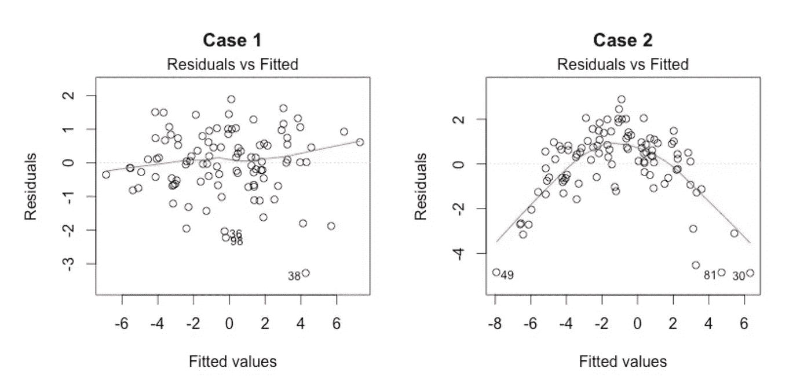
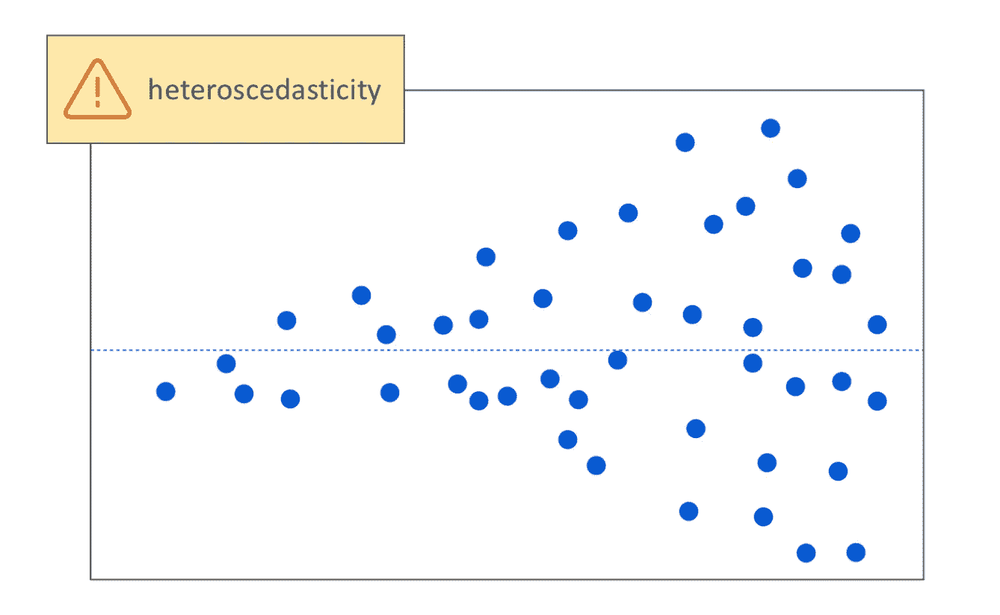
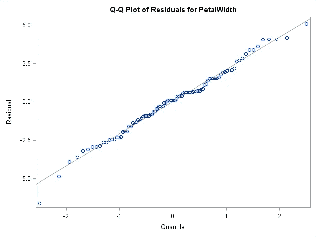

# 线性回归模型的假设

> 原文：<https://medium.com/analytics-vidhya/assumptions-of-linear-regression-model-90ac17f7a315?source=collection_archive---------11----------------------->

为了推断和预测线性回归模型，有五个基本假设。这些问题如下:

**1。回归模型在参数上是线性的**

参数中的线性意味着响应变量的平均值是回归系数和预测变量的线性组合。如果我们用一个线性模型来拟合一个非线性和非加性的数据集，回归模型将无法从数学上捕捉到这种关系。这将导致对未知数据集的错误预测。我们将剩余定义为，

残差=观察值 y-模型预测值 y

为了检查线性，我们应该始终寻找残差与预测图

参考消息-【https://data.library.virginia.edu/diagnostic-plots/ 

相对于相应的预测值绘制了两个残值图。在案例 1 中，我们没有看到任何显示线性的模式，在案例 2 中，我们可以观察到抛物线代表非线性。我们可以考虑对因变量进行非线性变换，例如对数变换。我们可以做的另一件事是包含多项式项，如(x2，x3 等。)来捕捉我们模型中的非线性。

**2。残差或等方差的同方差**

目标变量的不同值在误差方面将具有相同的方差，而与它们的预测变量值无关。在异方差的情况下，样本外预测的置信区间往往以一种荒谬的方式变宽或变窄。

参考-[https://www . jmp . com/en _ us/statistics-knowledge-portal/what-is-regression/simple-linear-regression-assumptions . html](https://www.jmp.com/en_us/statistics-knowledge-portal/what-is-regression/simple-linear-regression-assumptions.html)

在上图中，我们看到残差随着预测变量的增加而增加，并形成漏斗形模式，这证实了数据中异方差的存在。此外，我们可以使用 breu sch-Pagan/Cook-Weisberg 检验来检测异方差性。为了消除异方差性，我们可以对目标变量使用非线性变换(如对数变换)。

**3。残差的正态性**

如果误差项不是正态分布的，则有置信区间变得不稳定的风险(过宽或过窄)。这导致难以基于最小二乘法来估计系数。

reference-blogsas.com

使用 qq 图，我们可以推断数据是否来自正态分布。如果残差恰好位于一条相当直的线上，那么残差是正态分布的。然而，在接近生产线末端时，可能会出现一些偏差，但这种偏差应该非常小。在上图中，我们可以推断残差的正态分布。

我们可以对残差的正态性进行额外的统计检验，如 Kolmogorov-Smirnov 检验、Shapiro-维尔克检验、Jarque-Bera 检验和 Anderson-Darling 检验。

**4。误差的独立性**

误差的独立性假设响应变量的误差不相关。响应变量误差中相关性的存在降低了模型的准确性。这通常发生在时间序列模型中，其中一个时刻依赖于前一个时刻。在这种情况下，置信区间和预测区间变得更窄。

我们可以通过残差时间序列图(残差对行号)和残差自相关表(图)来检查序列相关性。我们也可以用杜宾—沃森(DW)统计量来检验它。DW 必须介于 0 和 4 之间。

DW = 2—→无自相关，

0 < DW < 2 — →positive autocorrelation

2 < DW < 4 — →negative autocorrelation.

**5。缺乏完美的多重共线性**

多重共线性可由两个或多个完全相关的预测变量触发。例如，如果错误地给定了同一个预测变量两次，要么不转换其中一个，要么线性转换其中一个副本。那么找出哪个变量对响应变量的预测有贡献就变得非常困难。

我们可以使用散点图来显示变量之间的相关性，也可以使用 VIF 因子。当 VIF 值<= 4 then it suggests no multi-collinearity whereas a VIF value of > = 10 时意味着严重的多重共线性。一个简单的相关表也可以解决这个问题。

**参考文献**

 [## 使用假设、图表和解决方案深入回归分析

### 所有的模型都是错误的，但有些是有用的-乔治盒回归分析标志着第一步…

www.analyticsvidhya.com](https://www.analyticsvidhya.com/blog/2016/07/deeper-regression-analysis-assumptions-plots-solutions/)  [## 线性回归

### 在统计学中，线性回归是一种建模标量响应(或变量)之间关系的线性方法

en.wikipedia.org](https://en.wikipedia.org/wiki/Linear_regression)  [## 弗吉尼亚大学图书馆研究数据服务+科学

### 你进行了线性回归分析，统计软件给出了一堆数字。结果是有意义的…

data.library.virginia.edu](https://data.library.virginia.edu/diagnostic-plots/)  [## 检验线性回归的假设

### 线性回归分析注释(pdf 文件)线性回归分析介绍回归实例啤酒…

people.duke.edu](http://people.duke.edu/~rnau/testing.htm)