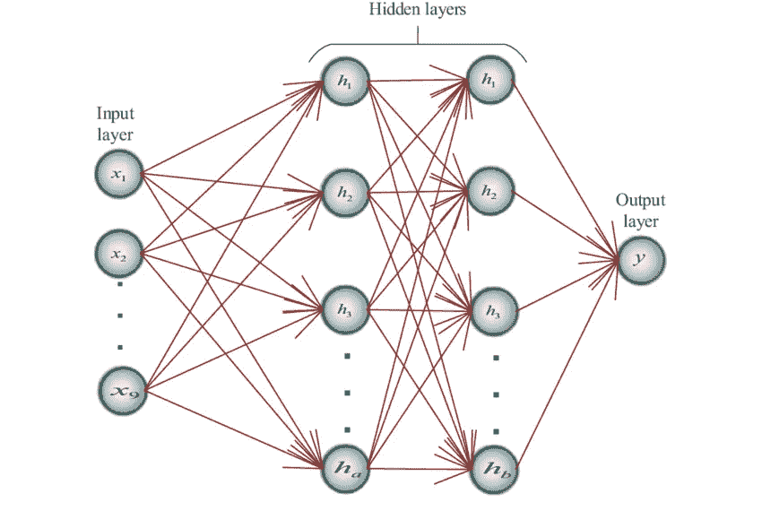
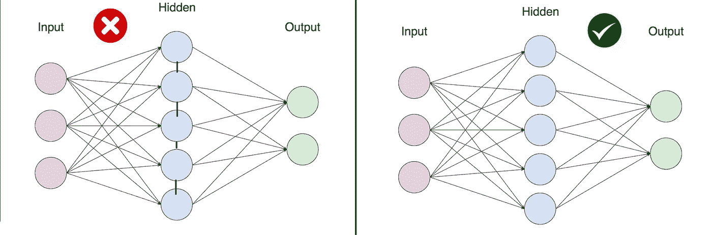
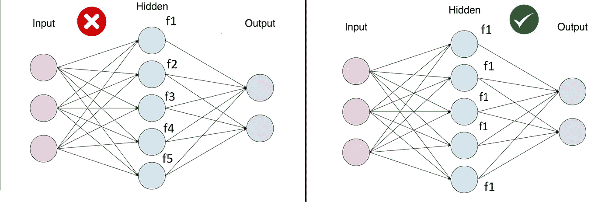
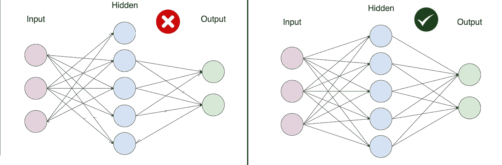

# 使人工神经网络简单的假设

> 原文：<https://medium.com/analytics-vidhya/assumptions-which-makes-artificial-neural-network-simple-81ba7f46abbc?source=collection_archive---------4----------------------->

为了使神经网络更简单，我们对信息从一层到另一层的流动做了某些假设。

由[提莫·沃尔茨](https://unsplash.com/@magict1911?utm_source=medium&utm_medium=referral)在 [Unsplash](https://unsplash.com?utm_source=medium&utm_medium=referral) 上拍摄的照片

人工神经网络(ANN)架构基于动物大脑的类比，这意味着 ANN 试图模仿大脑的功能。

但是你认为这是一个简单的任务吗？

我们知道机器的计算能力随着时间的推移已经有了巨大的增长，但是我们仍然能够像动物大脑那样做所有的操作/功能吗？当然，我们不是。我们离这一点还很远。

我们在提高机器的计算能力和存储能力方面取得了巨大的成功。我们将来肯定会到达一个点，在那里我们可能不需要遵循这些假设。在那之前，让我们看看这些假设是什么。

**01。人工神经元分层排列，依次排列。**

在人工神经网络中，我们有输入层、人工神经元层(隐藏层)和输出层。与动物大脑相比，这种假设可能不成立，因为在动物大脑中，神经元不是按顺序排列的。它们在自然界中是随机连接的，而在人工神经网络中是按顺序排列的。

*正如你在下图中看到的，有 2 个隐藏层的神经网络按顺序排列。*

**02。同一层内的神经元不会相互作用或相互通信。**

*在上图中，有两个隐藏层神经网络，输入层将信息传递给第一个隐藏层网络，然后将输出传递给第二个隐藏层网络。由第二网络层生成的输出 Y。来自层 1 的神经元是 h1、h2、h3，但是 h2 和 h3 彼此不相互作用，这在大脑的类比中也是不真实的。如果我们看图像的左侧，隐层网络的神经元都是相连的。*

来自同一层的神经元不相互作用

**03。所有输入都通过输入层进入网络，然后通过输出层。**

*神经网络的输入只能通过输入层提供。你不能向神经网络的隐藏层添加任何信息。所有信息都从输入层传递到隐藏层激活函数，然后该函数将对该信息执行操作。*

来源:维基百科

04 年。同一级别的所有隐藏层应具有相同的激活功能。

存在于神经网络中相同级别的隐藏层应该具有相同的激活函数。如果我们在同一水平的不同神经元上有不同的激活函数，这将需要大量的计算能力，并且求解起来将变得非常复杂。在下面的例子中，左侧的隐藏层对每个神经元 f1，f2 …f5 有不同的激活函数。

**05。连续层上人工神经元紧密相连。**

*这也是神经网络中的一个重要假设，所有的网络都是密集连接的。这意味着所有输入值将被传递到下一个神经元，并且它们的输出将被传递到网络层中的下一个神经元。*

*在下图中，你可以清楚地看到左侧图像不是密集连接的。因为隐藏层神经元 1 没有连接到输出，并且有另一个神经元没有连接到下一层神经元。*

密集连接的神经元

**6。每个相互连接的神经网络都有自己的权重和与之相关的偏差。**

*将所有输入层信息传递给隐含层 1 的所有神经元，隐含层 1 对所有神经元具有相同的激活函数。这里，输入层和隐藏层之间的互连具有每个输入的权重和隐藏层的偏差。每一层都遵循这一点。*

*像对于隐藏层 2 输出一样，隐藏层 1 将隐藏层 2 的权重和偏置输入到隐藏层 2，如下例*

来源:维基百科

快乐阅读！！