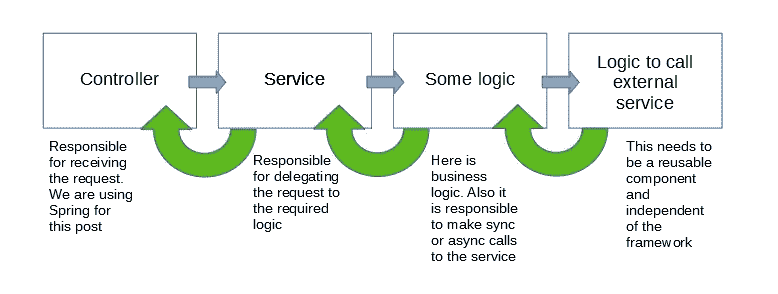
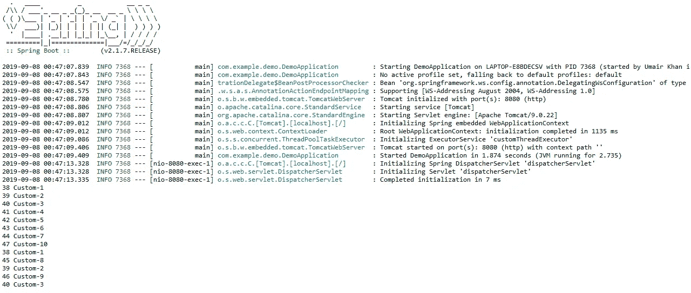

# @Async 和 Spring Boot

> 原文：<https://medium.com/analytics-vidhya/async-and-spring-boot-d0f5c38f82c2?source=collection_archive---------1----------------------->

多线程很好…感觉我们实际上是在利用 CPU 的计算能力！虽然默认情况下每个应用程序有不同的线程用于不同的目的，但是根据需要生成我们自己的线程是个好主意。

幸运的是，Spring Boot 是 JEE 最流行的应用程序开发框架之一，它有自己内置的线程池支持。这是一个关于我们如何使用 Spring 的 **@Autowire** 和 **CompletableFuture** 在我们的 Web 应用中实现多线程的故事。这不是 Spring 的教程，而是我们如何为已经了解 Spring 和多线程环境的观众解决一个特殊的问题。

**我们应用的结构和问题**

所以我们利用 Spring Boot 框架开发了一个 RESTful Web 服务。应用程序还需要与一些外部服务对话，这些对外部服务的调用可以是同步的，也可以是异步的。

此外，我们还需要有一个结构，新来的开发人员可以灵活地编写多线程代码。下面是一个简化的应用程序图，有助于理解整个场景。

讨论中的应用程序的结构

因此，问题是要编写一个好的多线程代码，可以在同一个守护线程中执行，还有一些框架，重用逻辑会更容易。

**关于@Async 的问题**

Spring 自带@Async 注释，让我们的工作变得简单。你所需要做的，就是注释你想要异步执行的函数。但是有一个问题。@Async 暗示不能使用 **this 调用这种带注释的函数。**关键词。此外，将任何函数标记为@Async 意味着它将总是在其他线程中运行，而不是我们想要的。

**我们是如何解决的**

这里我会一步一步来。

第一件事是为我们的应用程序创建一个线程池 bean。创建它将使我们能够控制正在创建、排队和重用的线程的策略。在源代码中，**Executor.java**是负责这个的代码。**@ Bean(" custom thread executor ")**就是发生这种情况的地方。这意味着出于其他目的，我们也可以以类似的方式创建其他池。

正如上面所讨论的，我们不能在外部服务调用中实现任何并发性，因为该部分需要是可重用的组件并且是分离的。**ExternalService.java**是执行任何资源扩展操作的类。在这篇文章中，我通常引用外部服务调用，但在现实世界中，任何被认为是资源密集型的操作，比如 io 操作，从一些输入设备读取输入，都应该在专用线程中执行。

控制器和服务层都需要解耦和自由，因为它们的工作只是将请求转移到所需的逻辑/实现。

真正的魔术发生在**CustomLogicExtension.java**档。这是 CustomLogic.java 的**的扩展，其中我们所有的业务逻辑相关的方法被分组进行抽象。**

现在在**CustomLogixExtension.java 文件中，****do function()**方法使用 **CompletableFuture** 类进行异步调用。在 **java.util.concurrent** 包中有一大堆不同的类和方法，使异步调用变得轻而易举。因此，在我们的实现中，我们在 **supplyAsync** 方法中进行异步调用。这个方法调用一些外部服务。现在，外部服务可能需要很长时间，并且不在我们的控制之下，所以我们不能停止应用程序。更确切地说，调用进一步移动，一个通用文本被返回给控制器，在这种情况下是来自定制逻辑的 ***hello。***

现在，作为我们从外部服务获得的响应或任何异常，我们对其采取行动。**然后 AcceptAsync** 就是发生这种情况的地方。任何企业应用程序都可能需要更新数据库，调用其他服务，或者根据收到的结果打印日志。这是可以执行所有此类操作的地方。在文档中，有多种实现，允许我们在执行完成后返回或不返回任何数据。*详细文档可以在* [*这里找到*](https://docs.oracle.com/javase/8/docs/api/java/util/concurrent/CompletableFuture.html) *。*

那么，遗嘱执行人在哪里发挥作用呢？CompletableFuture 允许指定我们自己的线程执行器。这意味着我们可以指定接口使用的线程池，或者返回 Spring 的默认线程池。然而，在我看来，创建和配置一个单独的线程池是至关重要的，因为它可以对应用程序的资源进行更多的控制，并使监控更加容易。上面讨论的 **@async** 也允许传入线程池。

同步和异步执行的灵活性如何？通过使用 CompletableFuture 类，我们确保了代码在单独的线程中执行。但是如果我们需要在同一个守护线程上运行呢？很简单 **new ExternalService()。callToExternalService()；**就是所谓的外部服务。我们能做的是在 CustomLogicExtension.java 类中创建一个简单的函数，比如说**callAsync()***—***我还没有在回购代码中创建这样的函数—* 它将保存异步实现，而同步实现将驻留在 CustomLogicExtension.java 的 doFunction()方法中。小菜一碟！*

*一旦代码被执行并且 GET call 被发送到:[https://localhost:8080/hello](https://localhost:8080/hello)我们开始接收响应。但是在控制台中，我们可以看到实际发生的情况。我让创建的线程休眠 10000 毫秒。因此可以清楚地看到效果。*

*在下面的屏幕截图中，您可以看到正在创建的新线程。请注意，只创建了 10 个线程，因为我们的线程池有 10 个线程。在 10 个线程之后，先前的线程被重用。*

**

*螺纹名称打印在上面的屏幕截图中，前缀为**自定义**。*

***结论***

*所以这只是使用**线程执行器**和 **CompletableFuture** 实现并发的一种方式。也可以有其他方法来实现相同的结果。但是对于我们的目的来说，这已经足够了。*

> *如果不小心实现，线程有时会带来麻烦和意想不到的结果。在我的职业生涯中，我就遇到过这样的情况。我已经在 [**Java Threads 和 Chaos**](/@umairkhan62/multi-threaded-chaos-69216bb2c45a) 中解释了这个问题，从生产数据中获得了意想不到的模糊结果。*

*你可以在 [Github](https://github.com/umairk83/Some-code-stuff/tree/master/async-demo) 库找到完整的代码。请随意使用代码。是时候结束我的 java 进程了。*

*.*

*.*

*下一篇文章再见…*