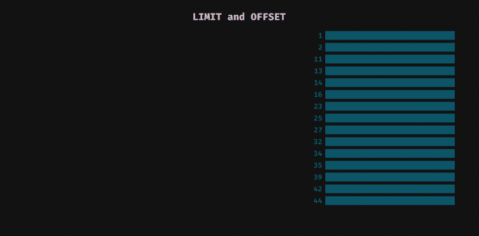

# JavaScript 中的异步迭代器 NodeJS 中的数据库迭代

> 原文：<https://medium.com/analytics-vidhya/async-iterators-in-js-database-iteration-in-nodejs-31a813cf7ec3?source=collection_archive---------17----------------------->


在本文中，我将给出一个简单的例子，说明如何使用现代 JavaScript 工具处理整个数据库(比如 MongoDB、Elasticsearch 或 PostgreSQL 之类的 RDBS)。我们将把 async/await、迭代器和函数生成器结合成一个简单而强大的模式，可以在很多情况下使用。

**参见** [**Runkit**](https://runkit.com/kmoskwiak/5e07544f761b77001b44c45f) **上的工作示例。**

# 问题是

我们的例子是逐个条目地处理整个数据库(RDB 的表，Mongo 的集合)。最简单的方法是选择所有文档，将它们放入运行时内存并执行所有操作。然而，这不是答案，尤其是当数据集很大而我们的内存有限的时候。

## 经典方法:极限和偏移



在 SQL 中使用限制和偏移

在 SQL 中有一个选项可以将`limit`与`offset`结合使用:

```
SELECT * FROM my_table LIMIT 50 OFFSET 100;
```

在 Mongo 中应该是这样的:

```
db.my_collection.find({}).skip(100).limit(50)
```

注意，在大多数数据库中，这种技术的性能根据偏移值而变化。偏移量越大，查询就越慢。这是因为在大多数情况下，数据库会在返回我们感兴趣的条目之前处理所有跳过的条目。由于这一障碍，一些数据库指定了偏移量的最大值，因此如果不对数据库设置进行一些额外的调整，可能无法处理整个数据库。

## 有状态游标

我们可以使用`cursors`来利用有状态技术。游标是由数据库创建并保存在内存中的对象。它会记住查询的上下文，例如分页的当前状态。通常我们必须创建游标，然后在进一步的查询中使用对它的引用。


用光标迭代数据库

请注意，在某些数据库中，游标有其生存期。例如，在 Elasticsearch 中，我们可以在`scroll` 参数中指定搜索上下文的到期时间。

您可能还会遇到同时打开的游标的最大数量限制。

## 另一种方法:范围查询

下一项技术——范围查询——有几个有趣的特性。

*   是**无状态**。这意味着您不必关心网络中所有数据库节点之间的状态过期或状态同步。
*   它具有**恒定且可控的内存使用量**。这意味着它可以在低内存机器上成功使用，并且其性能不会因数据集大小或分页进度而变化。
*   它**不是数据库特有的**。毕竟，这只是一种如何构造查询以便在大多数数据库中使用的方法。

范围查询非常类似于限制和偏移的组合。然而，我们没有提供要跳过的文档数量，而是指定了边界条件，排除了已经处理的文档。
在示例数据集(如下图所示)中，文档按 id 升序排列。条件`id > 16`跳过 6 个 id 为 **1** ， **2** ， **11** ， **13** ， **14** ， **16** 的文档。结果等同于提供等于 6 的偏移。


SQL 中的范围查询

在批量大小为 6 的数据集上迭代归结为 3 个步骤:

1.  请求前 6 个文件并记住最后一个文件的 id(**16**)，
2.  请求条件 id > **16** 的下 6 个文档，记住最后一个 id ( **35** )，
3.  请求条件 id > **35** 的下 6 个文档。注意，这次只返回了 3 个文档，这意味着它是我们数据集的结尾。

要记住的事情:

*   数据集必须按我们的条件所应用的关键字进行排序，
*   为实现最佳性能并保持恒定的内存使用量，条件中使用的字段应由**索引**，
*   该字段下的值也必须是唯一的**。如果不是范围查询可能会“丢失”一些文档。**

**我们将在示例中使用范围查询。**

# **JavaScript 中的异步迭代**

**我们将使用`async-await`结合`functions generator`和自定义`iterator`。这个组合叫做`async iteration`，它的提议可以在[这里](https://github.com/tc39/proposal-async-iteration)找到。然而，从版本 10 开始，NodeJS 中的单个部分可以在循环[中使用。](https://node.green/#ES2018-features-Asynchronous-Iterators)**

****最终我们希望能够使用 for-loop 来同步迭代数据库。****

**在本文的代码片段中，我假设我们在方法`select`的作用域中有`Database`对象，该方法返回`Promise`解析到文档数组。它接受具有两个属性的参数对象:`idGreaterThan` —确定数据库中的条件，以及`limit` —返回文档的数量，例如`db.select({idGreaterThan: 6, limit: 2})`相当于 SQL 查询`SELECT * FROM exoplanets WHERE id > 6 ORDER BY id ASC LIMIT 2`。在本文中，我省略了`Database`类的实现，但是简单的模拟可以在这个 [RunKit 笔记本](https://runkit.com/kmoskwiak/5e07544f761b77001b44c45f)中找到。这个笔记本还包含了我们将要编写的代码的工作示例。**

## **readDocuments 函数生成器**

> **生成器是可以退出并在以后重新进入的功能。它们的上下文(变量绑定)将在重入时被保存。
> (来源:[函数* — JavaScript | MDN](https://developer.mozilla.org/en-US/docs/Web/JavaScript/Reference/Statements/function*) )**

**MDN Web Docs 对 Javascript 中的[函数生成器](https://developer.mozilla.org/en-US/docs/Web/JavaScript/Reference/Statements/function*)和[迭代器](https://developer.mozilla.org/en-US/docs/Web/JavaScript/Reference/Iteration_protocols)给出了很好的解释。对于本文，我们必须知道的是，生成器在被调用后会返回一个迭代器。迭代器是一个可以用于 for 的对象..循环的。**

**让我们写我们的生成器`readDocuments`。**

```
/**
* Iterate over database
* [@generator](http://twitter.com/generator)
* [@function](http://twitter.com/function) readDocuments
* [@param](http://twitter.com/param) {number} limit maximum number of documents
* [@yields](http://twitter.com/yields) {array} list of planets
*/
async function* readDocuments(limit) {
 const db = new Database();
 let lastId = 0; // initialize with min value
 let done = false; // indicates end of iteration while(!done) {
   // select batch of documents and wait for database response
   // TODO: error handling
   const result = await db.select({
     idGreaterThan: lastId,
     limit: limit
   }); // get id of last document
   lastId = result[result.length — 1].id; // end iteration if there are less documents than limit
   if(result.length < limit) {
     done = true;
   } // yield result
   yield result
 }
};
```

**注意上面代码中的两件重要事情:`readDocuments`是用`async`关键字和`function*`表达式声明的。这个函数是异步函数和函数生成器的混合体，具有两者的功能。我们从两个角度来分析一下。**

**作为一个异步函数，它允许我们等待异步数据库操作。这意味着 while 循环将同步运行。每个 select from database 只有在前一个完成后才会执行。**

**我们没有返回它，而是返回了它。这是函数生成器的一部分。正如我上面提到的，生成器返回一个可以在 for 循环中使用的迭代器。每当生成器产生一些东西时，程序就从函数中分离出来，进入循环体。**

**这给我们带来了众所周知的..的循环，但在异步变化。**

```
async function run() {
 // We need to place our loop inside another async function 
 // so we can use await keyword for await (let documents of readDocuments(4)) { 
   // This for loop behaves synchronously. 
   // Next iteration will begin after execution of this loop
   await doSomethingWithDocuments(documents);
 }}
run();
```

**就是这样！在 [Runkit](https://runkit.com/kmoskwiak/5e07544f761b77001b44c45f) 的例子中，我只是记录行星来安慰每次迭代。您应该会看到类似下面的输出。**

```
DATABASE: SELECT * FROM exoplanets ORDER BY id ASC LIMIT 4
APP: Got 4 items from database: Proxima Centauri b, Gliese 667 Cc, Kepler-442b, Kepler-452b. Done: falseDATABASE: SELECT * FROM exoplanets WHERE id > 7 ORDER BY id ASC LIMIT 4
APP: Got 4 items from database: Wolf 1061c, Kepler-1229b, Kapteyn b, Kepler-62f. Done: falseDATABASE: SELECT * FROM exoplanets WHERE id > 14 ORDER BY id ASC LIMIT 4
APP: Got 4 items from database: Kepler-186f, Luyten b, TRAPPIST-1d, TRAPPIST-1e. Done: falseDATABASE: SELECT * FROM exoplanets WHERE id > 18 ORDER BY id ASC LIMIT 4
APP: Got 4 items from database: TRAPPIST-1f, TRAPPIST-1g, LHS 1140 b, Kepler-1638b. Done: falseDATABASE: SELECT * FROM exoplanets WHERE id > 24 ORDER BY id ASC LIMIT 4
APP: Got 1 items from database: Teegarden c*. Done: true
```

**我希望你喜欢这篇文章。在本系列的下一篇文章中，我将展示如何在内存有限的情况下使用这个工具读取大文件。敬请期待！**

## **ack🦄**

*   **照片由[大卫·梅尼德雷](https://unsplash.com/@cazault?utm_source=unsplash&utm_medium=referral&utm_content=creditCopyText)在 [Unsplash](https://unsplash.com/s/photos/planet?utm_source=unsplash&utm_medium=referral&utm_content=creditCopyText) 上拍摄**
*   **取自[维基百科](https://en.wikipedia.org/wiki/List_of_potentially_habitable_exoplanets)的例子中的系外行星**