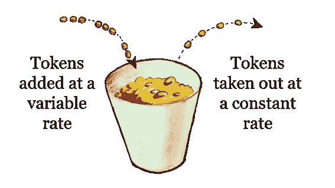
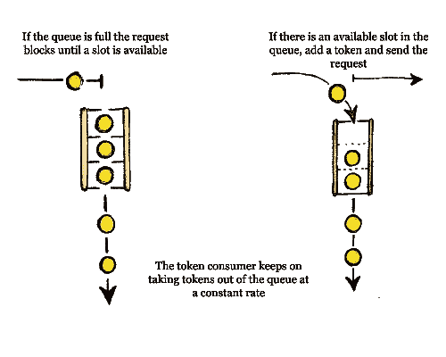

# 客户费率限制器

> 原文：<https://medium.com/analytics-vidhya/async-python-client-rate-limiter-911d7982526b?source=collection_archive---------3----------------------->

使用基于队列的**令牌桶算法**实现异步 python 客户端速率限制器

首先，我们为什么要限制我们的优秀软件每秒发出大量的请求呢？

嗯，有时候我们别无选择。
大多数可用的数据提供商不能不对他们的客户通过他们的 API 消费的数量和速率加以限制。
对服务使用进行限制不仅有助于控制资源分配，最终转化为花费的金钱，
而且也是应对 DDoS 攻击的工具。

好的，我们知道数据提供商需要设置费率限制，但是我们为什么要这样做呢？我们如何做到这一点？

回答为什么很简单，**我们只需要以某种方式处理它！**

但是如何做的问题有多种答案。
我们将通过实现其中一个解决方案来回答这个问题，
它被称为**令牌桶。**

# **令牌桶算法**

## **第一，最初的想法！**

想象一个可以容纳 n 个代币的桶。
新令牌以恒定速率添加到桶中。
就在发送请求之前，必须从桶中取出令牌。
在桶为空的情况下，请求需要等待，直到新的令牌被添加到桶中并且可以被取出。
如果桶已满，不再添加代币，直到取出代币

## 我们要做的恰恰相反！

试图发送请求的一方必须首先向桶中添加一个令牌(像缴税一样)，同时以恒定的速率从桶中取出一个令牌。
在这种情况下，当桶已满时，请求需要等待，直到可以添加新令牌，当桶为空时，不取出令牌(dah！！！)

让我们来制定计划。我们需要一个队列来保存在任何给定时间允许的请求的令牌总量。令牌的最大数量是速率限制。如果我们想要创建一个请求，我们首先尝试向队列中添加一个令牌。如果队列已满，我们阻塞请求，直到队列中有一个空闲位置。在添加令牌时，我们需要一个以恒定速率消耗令牌并从队列中释放插槽的任务，这将确保我们永远不会超过允许的速率。

**现在让我们实施吧！**

让我们根据计划为一个 **RateLimiter** 类建立一个框架

我们用一个 **rate_limit** 参数初始化该类，该参数是每秒的**个请求**或**个 RPS** 简而言之，
个**令牌 _ 队列**队列，最大大小为 **rate_limit、**
和**令牌 _consumer_task** ，以相当恒定的速率消耗队列中的令牌。

**我们需要实现两个函数，即
add_token 和 consume _ token**

## **添加 _ 令牌**

add_token 相当简单，因为这里所有的繁重工作都由 asyncio 完成。队列 **的** put 函数:

> 将一个项目放入队列。如果队列已满，请等到有空闲位置时再添加项目。

因此，我们将 **1** 放入 **tokens_queue，**如果队列已满，它将阻塞请求，直到队列中的令牌用完。

## **消费 _ 代币**

**这就是全部逻辑所在！**

我们首先设置一个**消耗 _ 速率**为**1/速率 _ 限制**。

*例如，如果我们有一个****rate _ limit******每秒 100 个*** *请求，
它的意思是速率是***请求每秒 0.01 个******

***我们开始一个无限循环，不断消耗队列中的令牌并释放队列中的槽。***

***如果队列是空的，我们除了休眠 **consumption_rate** 秒(或几分之一秒)并再次尝试之外什么也不做。***

***现在我们只需要确保以恒定的速度进行。问题是我们无法控制协程的调度。因此，我们需要做的是找出自上次迭代以来已经过了多长时间，并将其转化为我们需要消耗的令牌数。***

***所以让我们实现函数**get _ tokens _ amount _ to _ consume*****

*****time _ from _ last _ consumption**是迭代之间的时间。
**calculated _ tokens _ to _ consumption**基本上是找出如果汇率是 **consumption_rate，到目前为止应该消费了多少代币。** 我们需要“ *floor* ”这个值，因为我们不能从队列中消耗 3.5 个代币。
最后，**token _ to _ consume**是**total _ token**和**token _ to _ consume**之间的最小值，因为我们不能消耗比队列中更多的令牌。***

***例如，如果***的消耗率上限是****20 RPS****那么* ***消耗率*** *就是* ***0.05。*** *现在让我们说***距离我们上次消耗代币已经过去了 0.2 秒。我们现在最多需要消耗* ***4 个代币来弥补。
0.2/0.05 = 4 表示 0.05 的多少个单位构成一个 0.2。*** *但是姑且说只有* ***3*** *令牌被放入队列的那段时间，
那么本例中的* ***令牌 _to_consume*** *就是* ***3*******

**好，现在我们可以一次消费一个或多个代币。我们同步进行，因为这是我们跟上步伐的机会。我们知道事件循环调度不考虑我们的速率。**

**我们实际上已经完成了速率限制的实施。但是还有一个我们没有谈到的问题需要处理。**

# ****并发限制****

**有时，数据提供者还会限制一个客户端可以并发发送的请求数量。这是我们创造的限速器无法解决的问题。**

***为了论证速率限制器不充分的原因，
我们假设有一个* ***速率限制*******20 RPS*******并发限制*******10*** *我们可以误、 同时启动* ***20 个请求*** *，我们的速率限制器将允许这样的请求突发，因为它在允许的限制范围内，但是我们将被服务拒绝，因为我们超过了允许的并发连接数。
另一个问题出现了，并发限制器还不够充分吗？
嗯，没有！假设我们的并发限制是一次 1 个请求，
服务速率限制是每秒 2 个请求，一个请求需要 0.25 秒才能完成，那么我们可能每秒发送 4 个请求******

**幸运的是，asyncio 给了我们一个工具来处理这个问题，它叫做 [**信号量**](https://docs.python.org/3/library/asyncio-sync.html#semaphore) **！** 信号量其实是一个古老的同步概念。
它限制了在任何给定时间可以访问共享资源的进程的数量，所以它也是一种限制，但对于进程的并发性来说。**

**让我们升级我们的限速器吧。
我们将用一个额外的参数 **concurrency_limit** 初始化这个类，并创建一个**信号量。** 我们还将创建一个名为 **throttle** 的函数，用户可以使用它来限制并发性和速率。**

## ****油门****

**在实施 throttle 之前，我们需要了解我们需要做什么来以安全的方式实施限制。
流程应按以下顺序进行:**

1.  **获取信号量**
2.  **向速率限制器队列添加令牌**
3.  **发送一个请求(或任何其他我们想要控制其速率的异步操作)**
4.  **释放信号量**

**所以我们需要以某种方式确保在阶段 **3** 执行完毕后释放信号量。我们不介意在那个阶段运行什么，我们只需要某种方式在我们的上下文中运行它。
幸运的是，我们可以用[异步生成器上下文管理器](https://docs.python.org/3/library/contextlib.html#contextlib.asynccontextmanager)来实现**

**在生成令牌之前，我们将尝试获取信号量。
如果超过**个 concurrency_limit** 个协程正在尝试添加令牌，那么我们会一直阻塞，直到一个完成为止，
记住，生成令牌也可能会阻塞。**

****太好了，我们完成了！**
我们仍然需要做一些成人软件的事情，比如
清理和安全游戏。
我们还可以添加一个上下文管理器，这是一个很好的实践。
但由于这不是重点，我们将直接跳到完整的代码。让我们把所有的东西都加起来，然后结束这堂课**

## ****速率限制器****

# **用例**

**让我们看看如何使用它**

# **笔记**

## **这个类不是线程安全的！**

**它只能在“异步世界”中使用。
因为它意味着在多个协程中被用作共享资源，所以它在多线程/多进程领域中实际上是无用的。**

## *****还有其他方案*****

**队列基础令牌桶很棒！但是也有其他的解决方案。
还有**滑动窗口日志**、**滑动窗口计数器**、**漏桶**、**等**……
还有 **HTTP 协议**方式，它响应状态码为 **429、**的响应，这表明您已经超过了速率限制，等待一个名为`**Retry-After**`的头中给定的时间间隔，然后重新发送请求。
关于 **429** 状态码的事情是，并不是所有的 API 都足够好来使用 HTTP 约定，并使用头`**Retry-After**`(如果有的话)来让你知道在重新发送之前应该等待多长时间。
即使 API 运行良好，`**Retry-After**`值也可能是日期、秒、毫秒……所以你必须逐个实现重试机制。同样，如果你不知道要等多长时间，你只需要等一段固定的时间，这是非常低效的。
速率限制器为速率限制提供了一个很好的抽象，你所需要做的就是从服务的 API 文档或实验中获得限制以获得估计值，但是你永远无法预测外部服务行为，所以你至少应该捕捉一个 **429** 错误并重试**

## **服务器速率限制器**

**服务器实现比客户端实现更加细致和复杂。
例如，当试图限制请求以防止 DDoS 攻击时，
服务可能希望过滤掉攻击者，让真正的用户仍然可以访问。此外，在分布式系统中，解决方案从来没有那么简单。**

## **AioHTTP**

**aiohttp 是一个非常好的值得推荐的异步 HTTP python 库。
它在内部管理一个连接池，你可以利用它来获益。
可以通过设置连接池的大小来控制并发连接数，甚至可以做到每台主机一个，酷吧？**