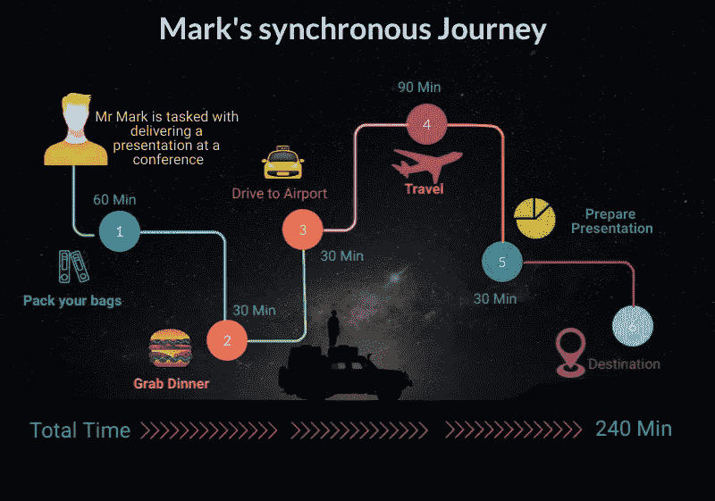
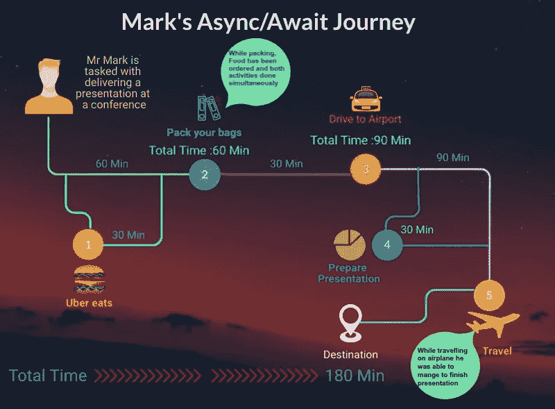

# 异步/异步编程—解开

> 原文：<https://medium.com/analytics-vidhya/asynchronous-async-programming-untangled-c05de24a428?source=collection_archive---------18----------------------->

近年来，人们越来越重视构建高性能应用程序，这种应用程序可以在大规模运行时表现更好，从而为用户提供无缝体验。随着高性能应用程序的出现，web 服务可用性的增加以及基于微服务的架构的适应，为重新想象这些微应用程序之间的交互方式带来了独特的挑战。

计算能力和多任务处理能力的进步为异步编程方式充分利用这些计算能力铺平了道路。到目前为止，大多数人可能已经知道本文的方向，这是对另一种编程技术的另一种技术解释。我们向你保证不是。坚持下去..

> “简单是复杂的。保持事情简单从来都不简单。简单的解决方案需要最先进的思维。”— **里奇·诺顿**

受上面引用的启发，本文承诺提供异步编程概念的简单解释，尽可能少地引用编程类比，所以请耐心等待，不要着急，开始吧。

让我们考虑一个简单的例子，我们有马克先生，可能是你们中的一个，他的任务是在拉斯维加斯做一个演讲。马克很兴奋，并开始布置他下面的执行计划。

*   为他的旅行打包行李，为会议做准备。
*   由于他对美食的渴望，他决定在去机场的路上去他最喜欢的餐馆吃饭。
*   开车去机场。
*   登上飞机。
*   准备演讲。

## 同步方式——已经存在多年的经典编程技术..

图片由帕里蒂·伊拉姆使用 visme.co

很简单，马克按照规定的顺序一次执行一个任务，他已经准备好实现他的目标，假设他花了大约 ***240 分钟*** 完成他的任务。

这是一段时间以来程序执行的方式，直到异步编程方式的到来。

## 异步方式——所有当前模糊的

图片由帕里蒂·伊拉姆使用 visme.co

以异步方式，马克在打包行李时，使用他最喜欢的食品配送应用程序(技术进步)订购了食品，当他忙着打包行李时，食品已经被送到了他家。包装和食物任务同时完成，因此以同步方式(60 分钟+30 分钟)花费 90 分钟的任务设法只用了 60 分钟。

同样，马克在他的飞行旅程中，设法扭曲了他的演示，所以花了 120 分钟的任务，他设法在 90 分钟内完成。通过优化任务和提高效率，他能够在仅仅 ***180 分钟内完成整个目标。***

也就是说，在异步编程中，任务被优化为彼此独立地执行，最终结果将等待所有独立活动结束，最终结果被汇总并呈现给用户。

# 摘要

我们在开始这篇文章时承诺保持简单，远离所有的编程术语，希望我们没有失望，如果我们失望了，总会有下一次做得更好的机会。

最后，让我们回顾一个实例，看看异步编程如何重新定义了当前应用程序的构建方式，以提高效率。

考虑一个高吞吐量的移动应用程序，它显示关于加密价格图表、分析师评级及其 twitter 趋势的信息。由于这些信息可通过三个不同的 API 获得，每当用户登录到应用程序时，对这三个 API 的请求就会同时触发，最终结果会被整理并与用户共享。

在 [Unsplash](https://unsplash.com?utm_source=medium&utm_medium=referral) 上由 [Balázs Kétyi](https://unsplash.com/@balazsketyi?utm_source=medium&utm_medium=referral) 拍摄的照片

向用户提供数据的总响应时间将是用最长时间完成其请求的 API 的响应时间。由于所有的 API 都是并发触发的，所以在花费最长时间的 API 完成之前，所有其他 API 都将返回结果，从而优化了用户体验。

直到下次..快乐阅读…