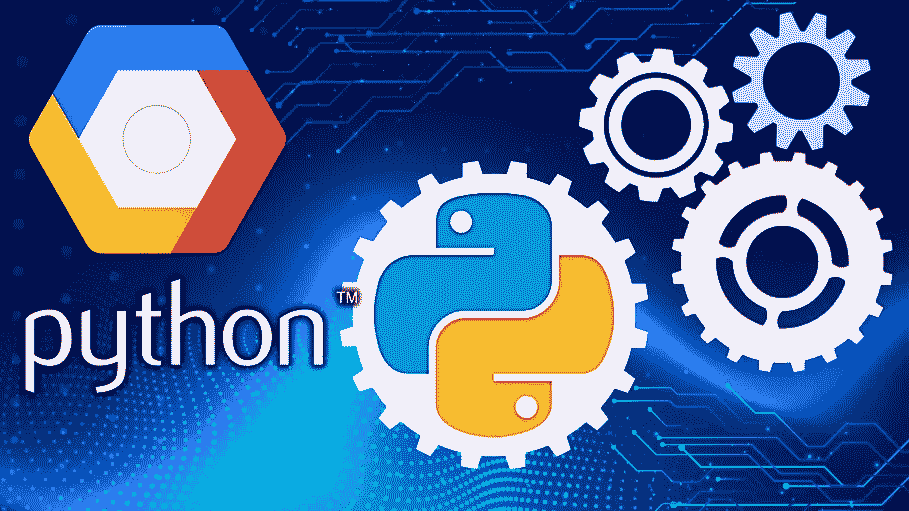
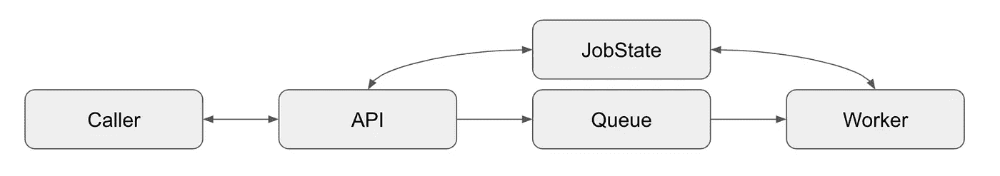
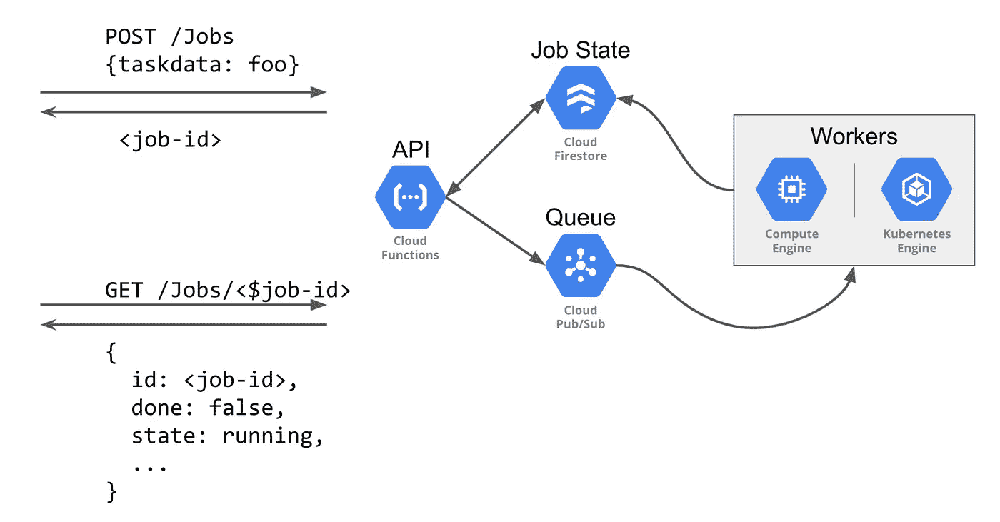
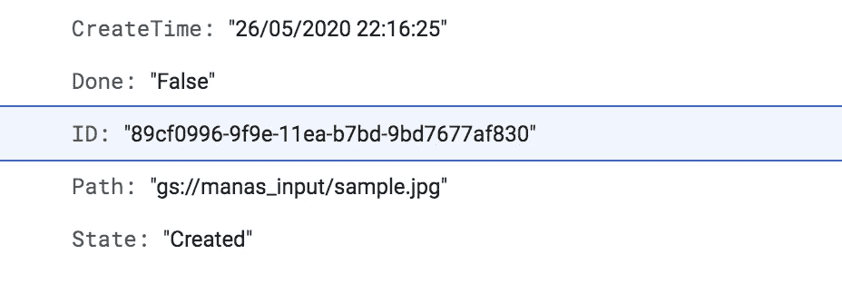
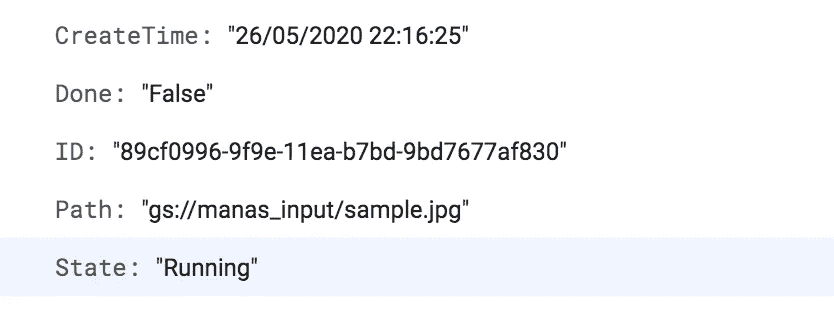

# GCP 的异步云功能

> 原文：<https://medium.com/analytics-vidhya/asynchronous-cloud-functions-in-gcp-python-307130ce6c2b?source=collection_archive---------9----------------------->



本文讨论如何使用云函数以异步方式跟踪长时间运行的作业，重点是可跟踪的和有状态的长时间运行的操作。在服务请求的生命周期中，调用者使用所需的参数发出请求，然后请求服务执行一些工作。

在同步工作空间中，调用者等待 API，直到工作完成，并且它可以直接由单独的云函数处理。*在我们的例子中，API 是 http 触发的云函数*。


同步请求/响应

在异步工作区中，调用者不会等待任务完成。它通过 PubSub 通知将基本参数传递给 worker(另一个云函数或 Kubernetes 引擎)，但是它需要能够*查询请求*的完成情况。



异步请求/响应

一旦 API 云函数被 http 触发，它在 nosql 数据库(firestore)中创建一个作业状态为“已创建”的有状态字典后，将字典中的参数作为 pubsub 消息在指定的 *topic_name* 中发布。firestore 中存储的信息将用于跟踪作业的状态，因为“已创建”、“正在运行”和“已完成”将是作业状态的三个离散值。一旦工人使用来自 pubsub 消息的所需参数接受作业，它就将 firestore 中的作业状态更改为“正在运行”,并执行任务。在这个时间空间中，如果 API 询问作业的状态，它将返回“正在运行”。当工作完成时，工人在 firestore 中将作业的状态更改为“已完成”,之后，如果 API 检查状态，它将知道作业已完成，并将相应地采取行动以获取结果。



异步云功能架构

让我们深入了解异步云功能的整个架构是如何工作的。

*i)set_task* ():它是云函数 http 触发 API 的入口点，POST 请求创建作业，并使用 *add_job()将作业状态字典添加到 firestore。*http 触发 api 的相应部署命令为:

```
gcloud functions deploy set_task --runtime python37 --trigger-http --allow-unauthenticated
```

为了获得 http 触发的云功能的 URL，我们需要在终端中运行以下命令:

```
export URL=$(gcloud functions describe set_task --format='value(httpsTrigger.url)')
```

调用基于函数的 API 来创建一个带有简单任务的作业。我们的任务有一个字段`path`，它指向 GCP 的路径，文件存储在该路径上，要对其执行操作:

```
JOBID=$(curl -s --header "Content-Type: application/json" --request POST --data '{"path":"gs://manas_input/sample.jpg"}' $URL )
```

ii) *add_job():* 该函数处理 firestore 集合中作业文档的创建，并将*作业 id* 和*路径*属性传递给 pubsub 消息。



在 firestore 中创建工作文档

iii) *worker_task()* :这是一个 worker Cloud 函数，由部署时指定的 pubsub 主题触发。在工人云函数的要点中，我包含了一个 50 秒的休眠时间，它可以被删除，并且可以包含在 GCP 路径上要完成的实际工作的代码。该函数在执行实际工作之前将状态设置为“正在运行”。



任务完成后，作业文档的状态更新为已完成。为了部署上述云功能，我们必须运行以下命令:

```
gcloud pubsub topics create jobsgcloud functions deploy process_task --runtime python37 --trigger-topic jobs --entry-point worker_task
```

iv) *get_job():* 该函数处理函数调用方 API 的 get 请求的实现，该 API 返回作业的状态。

为了使用 GET request 获得作业的状态，我们需要运行以下命令:

```
curl -s $URL/$JOBID
```

这就完成了关于如何异步使用云函数来完成一个特定的长时间运行的任务的教程。

学分:[https://cloud . Google . com/community/tutorials/cloud-functions-async](https://cloud.google.com/community/tutorials/cloud-functions-async)