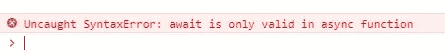

# 异步 Javascript (2) —关于 promise 和异步 await 的更多信息

> 原文：<https://medium.com/analytics-vidhya/asynchronous-javascript-2-418e0d27c006?source=collection_archive---------14----------------------->


三一学院的图书馆

1.  更多关于承诺

*   Promise.resolve()

大多数情况下，我们返回一个具有给定值的已解析的承诺对象，该值可以是任何东西，它可以是另一个承诺或可有陈述，如果该值是可有陈述，那么履行状态将取决于它。更多信息，请参考 [MDN 文档](https://developer.mozilla.org/en-US/docs/Web/JavaScript/Reference/Global_Objects/Promise/resolve)

```
Promise.resolve("finished").then(data=> {console.log(data)})//output
//finished
```

*   承诺.拒绝()

与 Promise.resolve()相同，但返回一个被拒绝的承诺，其他相同

_______________________________________________________________

下面是处理多重承诺的内置承诺函数

我们将重复使用上一篇文章中的例子

```
//Promisfied setTimeout
const delay = (msg, ms) => new Promise(resolve => setTimeout(
() => resolve(msg), ms));//Promisfied navigator.geolocation.getCurrentPosition
const geoLocation = (opts) => new Promise((resolve, reject) => navigator.geolocation.getCurrentPosition(
posData=>{resolve(posData)}, error=>{reject(error)}, opts));
```

*   Promise.race()
    同时启动多个承诺并只返回最快承诺的结果

```
Promise.race([delay("abc", 0), geoLocation()]).then(data => {console.log(data)});//print abc, as we wait 0 second(immediately) to do that
//abcPromise.race([delay("abc", 3000), geoLocation()]).then(data => {console.log(data)});//print location data, as it faster than print abc this time
//GeolocationPosition {coords: GeolocationCoordinates, timestamp: 1608386922668}
```

*   同时启动多个承诺，如果其中一个失败，它将停止并返回错误——全有或全无。

```
Promise.all([delay("abc", 3000), geoLocation()]).then(data => {console.log(data)});//allow the location access this time
//print result of both promise
//["abc", GeolocationPosition]Promise.all([delay("abc", 3000), geoLocation()]).then(data => {console.log(data)}).catch(error => {console.log(error)});//prints the error as we block the retrieve of location
//GeolocationPositionError {code: 1, message: "User denied Geolocation"}
```

*   Promise.allSettled()

同时启动多个承诺，并返回每个承诺的详细状态

```
Promise.allSettled([delay("abc", 3000), geoLocation()]).then(data => {console.log(data)}).catch(error => {console.log(error)});//allow the location access this time
//print detail status for both promise
//[{status: "fulfilled", value: "abc"}, {status: "fulfilled", value: GeolocationPosition}]Promise.allSettled([delay("abc", 3000), geoLocation()]).then(data => {console.log(data)}).catch(error => {console.log(error)});//block the location access this time
//print detail status for both promise
//[{status: "fulfilled", value: "abc"}, {status: "rejected", reason: GeolocationPositionError}]
```

2.异步等待

除了回调和承诺，Javascript 中还有另一种编写异步代码的语法——async await，它们是两个保留关键字，但我们经常一起使用它们。它类似于承诺，有时我们甚至说这是承诺的句法糖。

像 promise 一样，我们不能仅仅用 async await 来包装异步代码，如果它们没有返回 promise，我们必须首先向它们许诺。详情请参考[最后一段](/analytics-vidhya/asynchronous-javascript-1-callbacks-and-promise-5f9ffc61b2e5)

```
//Promisfied setTimeout
const delay = (msg, ms) => new Promise(resolve => setTimeout(
() => resolve(msg), ms));//Promisfied navigator.geolocation.getCurrentPosition
const geoLocation = (opts) => new Promise((resolve, reject) => navigator.geolocation.getCurrentPosition(
posData=>{resolve(posData)}, error=>{reject(error)}, opts));
```

请考虑 promise 中的以下代码片段

```
delay('Some task required before retrieving location', 0)
.then(data => console.log(data))
.then(() => geoLocation())
.then(data => {console.log(data); return delay('Some task after getting the location', 0)})
.catch(err => {console.log(err); return delay('Some task after fail getting the location', 0)})
.then(data => console.log(data));
```

我们可以像这样在异步等待中实现它

```
async function doSomeTask() { const msgBeforeLoc = await delay('Some task required before retrieving location', 0);
   console.log(msgBeforeLoc); try {
      const loc = await geoLocation();
      console.log(loc);
      const msgAfterLoc = await delay('Some task after getting the location', 0);
      console.log(msgAfterLoc);
   }  catch(error) {
      console.log(error);
      const msgAfterLoc = await delay('Some task after fail getting the location', 0);
      console.log(msgAfterLoc);      
   }
}doSomeTask();
```

让我们看看细节

*   函数前面的“async”关键字

我们必须用“async”来包装函数中的所有内容。这个函数将**返回一个解析的承诺**不管我们现在返回什么，甚至我们没有返回语句
，这意味着我们可以在后面附加一个“then”语句，它将成为一个承诺链。

*   语句前面的“await”关键字

如上所述，它只支持 promise，如果异步代码没有返回 promise，你必须首先承诺它。在上面的例子中，我承诺 setTimeout 和 navigator . geolocation . getcurrentposition，它们分别在“delay”和“geoLocation”中。

所以，我们只是像使用一个普通函数一样使用它们，在它的前面加上“await”。在 Javascript 引擎中，它会将每个语句转换成“then”语句并依次执行，就像 promise 中的“then”语句一样。结果将存储在我们为其分配 await 语句的变量中，而不是存储在 promise 链中的下一个“then”语句中

*   错误处理

Async await 不像 promise 那样提供任何错误处理，但是如上所示，我们可以使用 try catch 语句

*   没有等待的异步怎么样？

让我们试着移除函数中的“await”。

我们仍然可以运行代码，但很快我们会发现那些异步代码不起作用，似乎 Javascript 引擎没有意识到它们是异步调用，它不再“等待”它们返回结果，因此我们会在日志中看到“Promise

来自 [Mozilla docs](https://developer.mozilla.org/en-US/docs/Web/JavaScript/Reference/Statements/async_function#Description)

*“Await 表达式通过一个异步函数挂起进程，产生控制，然后仅当一个等待的基于承诺的异步操作被完成或拒绝时才恢复进程。”*

这意味着我们必须在每个调用异步代码的语句前添加“await”

*   没有异步的 await 怎么样？

让我们试着去掉函数前面的“async”关键字。

这将导致编译错误，没有异步，我们不能使用 await



*   调用多个异步 await 函数

考虑下面的例子

```
const delay = (msg, ms) => new Promise(resolve => setTimeout(
() => resolve(msg), ms));async function funcA() {
   console.log('before a')
   await delay('a', 2000).then(data=> {console.log(data)});
   console.log('after a')
}
async function funcB() {
   console.log('before b')
   await delay('b', 2000).then(data=> {console.log(data)});
   console.log('after b')
}
function run() {
      funcA();
      funcB();
}
run();
```

它可以打印

```
before a
before b
a
after a
b
after b
```

代替

```
before a
a
after a
before b
b
after b
```

事实上，调用者也必须用异步 await 来实现

```
async function run() {
      await funcA();
      await funcB();
}
run();
```

或者我们也可以用承诺来实现

```
funcA().then(data => {funcB()})
```

3.承诺 vs 异步等待

*   更简单、更少的代码

Async await 得到的代码量少得多，只包装在一个“Async”函数中，并在调用异步代码的每个语句中添加了一个“await”关键字，结果将只存储在我们将 await 语句分配给它的变量中。相比之下，承诺链总是需要另一个。然后()语句进行下一步操作，或者只处理响应

*   隐形然后屏蔽

考虑 promise
中的代码(只是重复使用上一节的例子，但是添加了一个控制台日志来打印其他任务)

```
function trackUserHandler() {
delay('Some task required before retrieving location', 0)
.then(data => console.log(data))
.then(() => geoLocation())
.then(data => {console.log(data); return delay('Some task after getting the location', 0)})
.catch(err => {console.log(err); return delay('Some task after fail getting the location', 0)})
.then(data => console.log(data));console.log("other task");
}
```

以及 async await
中的代码(只是重复使用上一节中的例子，但是添加了一个控制台日志来打印其他任务)

```
async function doSomeTask() {
   const msgBeforeLoc = await delay('Some task required before retrieving location', 0);
   console.log(msgBeforeLoc);
   try {
      const loc = await geoLocation();
      console.log(loc);
      const msgAfterLoc = await delay('Some task after getting the location', 0);
      console.log(msgAfterLoc);
   }  catch(error) {
      console.log(error);
      const msgAfterLoc = await delay('Some task after fail getting the location', 0);
      console.log(msgAfterLoc);      
   }
   console.log("other task");
}
```

在上一节中，我提到它们产生相同的输出，让我们再试一次新版本

Promise 示例首先打印“other task”
像回调一样，它首先执行同步任务

```
other task
Some task required before retrieving location
GeolocationPosition {coords: GeolocationCoordinates, timestamp: 1608277437934}
Some task after getting the location
```

然而，async await 示例最后打印了“其他任务”
，因为在 async 函数中，即使我们没有在 console . log(‘其他任务’)前面添加 await，但是 Javascript 引擎仍然会用一个不可见的“then”来包装它们，这就是为什么

```
Some task required before retrieving location
GeolocationPosition {coords: GeolocationCoordinates, timestamp: 1608277486716}
Some task after getting the location
other task
```