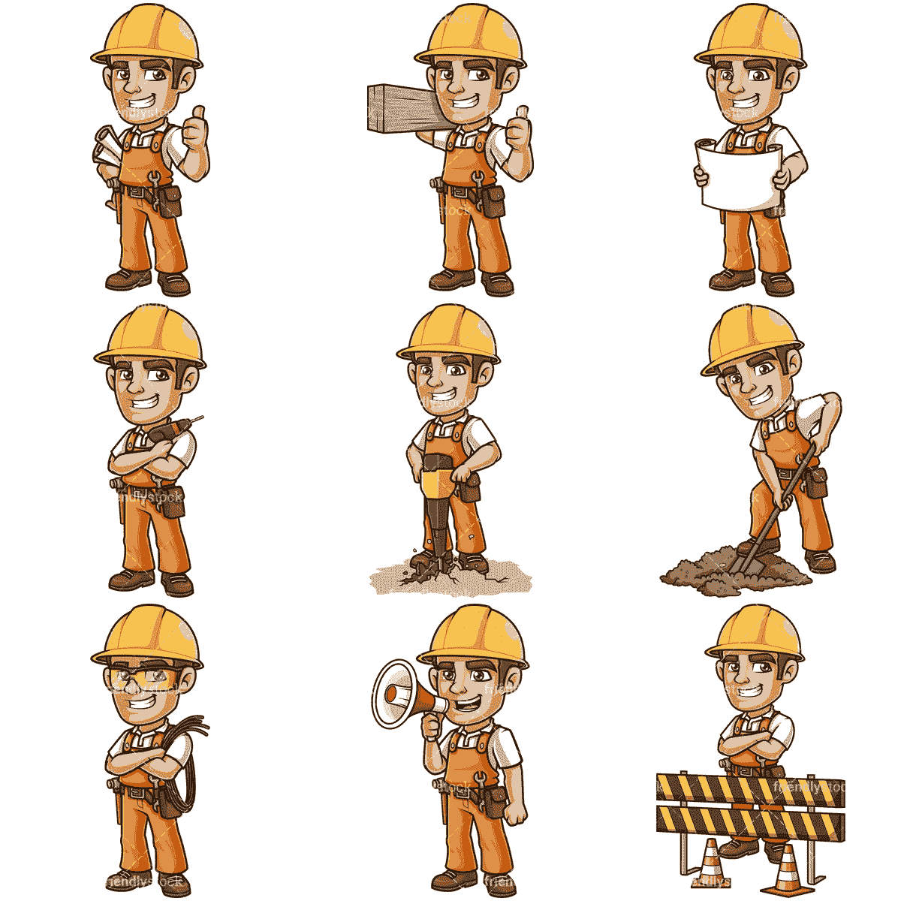

# 简言之，异步编程(理论)

> 原文：<https://medium.com/analytics-vidhya/asynchronous-programming-in-a-nutshell-theory-d5fd07cf3b22?source=collection_archive---------13----------------------->


在程序员的日常生活中，您很可能遇到过异步编程。你可能已经通过 API 使用过它，比如 Java 中的[线程 API](https://docs.oracle.com/javase/7/docs/api/java/lang/Thread.html) ，C#中的[任务 API](https://docs.microsoft.com/en-us/dotnet/api/system.threading.tasks.task?view=netcore-3.1) ，或者是一个库，比如 [RXJS](https://rxjs-dev.firebaseapp.com/guide/overview) 。如果对异步编程没有很好的理解，就很难欣赏或使用这些 API 和库。本文的目标是用简单的术语解释异步编程的概念。

大多数编程语言以“**从上到下的垂直线**执行，这意味着执行将从顶部开始，逐行执行，一次只发生一件事。如果一个方法或函数依赖于另一个函数，那么它必须等到那个函数完成才能继续。这将一直持续到程序结束。在编程术语中，这被称为“**同步**

这里有一个 stack blitz 上的同步类型脚本代码示例。代码将执行第一行并打印到控制台“Hello world”，然后移动到下一行，这是一个“for 循环”,并迭代 10 次以完成循环，之后，它将继续执行最后一段代码，将“Goodbye word”打印到控制台。

[https://stackblitz.com/edit/typescript-rze6xw](https://stackblitz.com/edit/typescript-rze6xw)

## 现实生活中的例子

让我们用一个真实的例子来理解“同步”这个术语。想象一下，你在一家餐厅，和其他客人坐在一张桌子旁，其他客人也坐在四张不同的桌子旁，你们都在等着点菜。


有一个服务员被分配到你的桌子和其他四张桌子。如果女服务员要以同步方式操作，她将以下列方式操作:

1.  注意第一桌
2.  请他们点菜
3.  把它拿到厨房
4.  等待厨师准备他们的食物
5.  把他们的食物放回他们的桌子


只有在上述 5 个步骤之后，女服务员才会继续到下一张桌子，重复同样的动作。如果这真的是现实，想象一下你会多么沮丧地等着轮到你。

但是，如果第四步需要更长的时间来完成，那么女服务员在等待厨师准备食物的同时继续从不同的桌子上接受其他人的订单，而不是停下来，这难道没有意义吗？这就是异步编程的概念。

使用异步编程，程序不是暂停等待一个长任务完成(就像上面的餐馆例子)，而是将长任务传递给另一个处理器并继续流程，然后当另一个处理器完成时，它会通知主处理器。

## 为什么异步编程是必要的？

异步编程解决了“阻塞代码”的问题。如上所述，当一个程序正在执行，并且它到达一段密集的并且花费大量时间来完成的代码时，应用程序将停止或暂停，以等待该特定任务在继续之前完成。

这方面的一个例子是在 web 浏览器上运行的 web 应用程序，想象一下需要一段时间才能完成的大量代码。它将阻止 web 应用程序在完成之前在浏览器中呈现。这对任何用户来说都是极其糟糕的体验。


此时，您可能想知道，为什么编程应用程序会出现这种情况？为什么他们一次只能操作一个任务？这个的答案是**线程**！

## 线程…单线程还是多线程？

在上一节中，我提到如果一个 web 应用程序正在加载一个页面，并到达一个密集的代码，应用程序将会停止。这是因为“ **JavaScript(引擎)是单线程的**

在软件开发领域，在涉及多任务处理的讨论中，你会几次碰到术语**线程**。

**线程是一段可以独立运行的程序的执行。每个线程一次只能执行一个任务。**


在计算机编程的早期，大多数计算机都是单核的，这意味着应用程序只能在单核上运行，也就是说一次只能执行一项任务。快进到今天，许多计算机都采用了多核技术。这提供了一次完成多个任务的能力。

支持多线程的编程语言，如 [Java](https://www.java.com/en/) 和 [C#](https://docs.microsoft.com/en-us/dotnet/csharp/) ，可以利用这些多核来允许程序同时运行多个任务。

## 多线程应用程序如何工作？

这很简单，主线程将执行应用程序，当它遇到一个密集型任务时，它将把它传递给另一个线程(A)，而主线程继续执行。当线程 A 结束时，它将把结果返回给主线程。

```
Main Tread -> Executes Task A -> Task B -> Task C -> Task E -> 
Thread A: Executes intensive Task D
```

## 等一下！你说 JavaScript 是单线程的？

是的，这是正确的！JavaScript(JS)本身，这意味着 [JavaScript 引擎](https://en.wikipedia.org/wiki/JavaScript_engine)是一种**单线程**语言，即使它运行在多核计算机上。

您可能会对自己说“我很确定我以前在普通 JavaScript 中执行过异步操作”。

哪个是真的！

JavaScript 执行异步任务有两种方式。

1.  容器级别的多线程
2.  [事件循环](https://developer.mozilla.org/en-US/docs/Web/JavaScript/EventLoop)(这值得自成一篇)

由于 JS 事件循环需要一篇自己的文章，所以在本文中我将集中讨论第一点。

我之前强调过 JavaScript 引擎**是单线程的。JavaScript 是一种需要在容器(浏览器或 OS(NodeJS))中执行的语言。**

JavaScript 在其上运行的容器可以提供供 JavaScript 使用的多线程能力。这方面的一个例子是 [Web Workers API](https://developer.mozilla.org/en-US/docs/Web/API/Web_Workers_API) 。



Web workers 允许 JS 脚本在后台独立的线程中运行，与 Web 应用程序的主线程隔离。这种多线程能力是由浏览器容器提供的，因此[并不是所有的浏览器都支持 web workers。](https://caniuse.com/webworkers)

NodeJS 也是 JS 引擎的另一个容器。它通过 libuv 库证明了多线程处理 I/O 和网络操作的能力

理解异步编程的概念对于任何软件开发人员来说都是至关重要的。如今，如果不使用某种形式的异步编程，很难设计出一个应用程序。我希望这篇文章能够帮助您理解异步编程的基本理论。

如果你喜欢这篇文章，一定要点击拍手按钮，也检查我下面的其他文章！

*   [**地图 vs WeakMap**](/p/b324d20cc277)
*   [**角度路由:命令式 vs PopState**](https://medium.com/p/7d254b495c54/edit)
*   [**什么是打字稿元组**](/@ericsarpong/what-is-a-typescript-tuple-814a016f61fd)
*   [**深度潜入 Javascript 图**](/@ericsarpong/deep-dive-into-javascript-map-object-24c012e0b3fe)