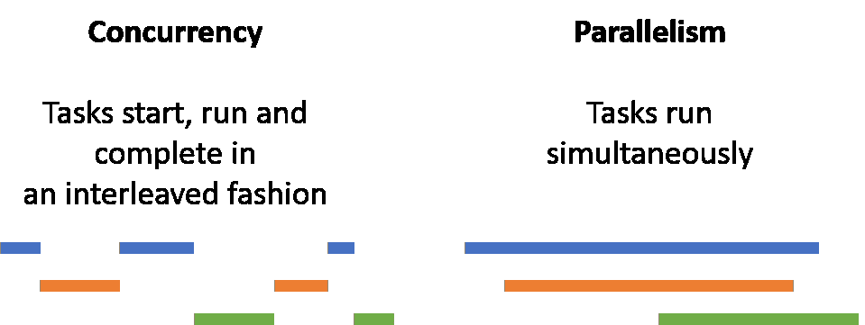

# Python 中的异步编程—第 1 部分

> 原文：<https://medium.com/analytics-vidhya/asynchronous-programming-in-python-part-1-86d48b23e387?source=collection_archive---------6----------------------->

这篇文章基本介绍了在`python`中`asynchronous`编程的内容和原因。

AsyncIO 在哪里？

在我们开始之前，让我们了解一下编程世界中的一些执行范例。

`parallelism`同时执行多项操作。

`concurrency`在重叠的时间框架内执行多项任务的方式是否给人一种近乎并行执行的错觉。



`multiprocessing`是`parallelism`的一种方式，可以通过催生多个进程来利用 CPU 上的多个内核。

`threading`和`asyncio`是`concurrency`的一种方式，可以在一些任务被 IO 绑定的情况下，以重叠的方式执行多个操作。

**什么构成了**的核心`**asyncio?**`

1.  `EventLoop`是 Python 中`asyncio`的核心。它管理、分配不同任务之间的执行和控制流程。
2.  `coroutine`是一种特殊类型的 Python 生成器，它在遇到`await`关键字时将控制返回给事件循环。
3.  `Coroutine`应该服从关键字`async`和`await`

```
**import** asyncio
**import** datetime

**async def** task(duration):
    print(**"starting task"**, datetime.datetime.now())
    **await** asyncio.sleep(duration) *# or do some IO operation* print(**"stopping task"**, datetime.datetime.now())

**async def** main():
    # We execute 2 task with sleep duration of 5 seconds and 10 seconds.
    **await** asyncio.gather(task(5), task(10))

**if** __name__ == **"__main__"**:
    **import** time
    s = time.perf_counter()
    asyncio.run(main())
    elapsed = time.perf_counter() - s
    print(**f"{**__file__**} executed in {**elapsed**:0.2f} seconds."**)
```

**输出**

```
**starting task 2019-12-12 18:10:03.103732
starting task 2019-12-12 18:10:03.103732
stopping task 2019-12-12 18:10:08.105232
stopping task 2019-12-12 18:10:13.100231
C:/Users/bakthavatchalam.g/asynchronous.py executed in 10.00 seconds.**
```

让我们一步一步地深入研究代码。

1.  当你用`async`关键字声明一个函数时，你是在告诉`eventloop`这个函数是一个异步生成器或者一个协同程序。
2.  当你用`await`关键字声明一个表达式时，你是在告诉`eventloop`暂停当前操作，让别的东西运行，直到结果到达【https://docs.python.org/3/library/asyncio-task.html#id2】对象()。
3.  `**asyncio.gather**` 是管理和运行协同程序的高级 API([https://docs . python . org/3/library/asyncio-task . html # asyncio . gather](https://docs.python.org/3/library/asyncio-task.html#asyncio.gather))


**同步方式的相同代码**

```
**import** datetime
**import** time **def** task(duration):
    print(**"starting task"**, datetime.datetime.now())
    time.sleep(duration) *# or do some IO operation* print(**"stopping task"**, datetime.datetime.now())

**def** main():
    **task(5)
    task(10)** **if** __name__ == **"__main__"**:
    s = time.perf_counter()
    main()
    elapsed = time.perf_counter() - s
    print(**f"{**__file__**} executed in {**elapsed**:0.2f} seconds."**)
```

**输出**

```
**starting task 2019-12-12 18:16:34.553006
stopping task 2019-12-12 18:16:39.554006
starting task 2019-12-12 18:16:39.554006
stopping task 2019-12-12 18:16:49.556006
C:/Users/bakthavatchalam.g/synchronous.py executed in 15.00 seconds.**
```

显然，当我们以同步的方式做同样的事情时，对于运行同样的操作，代码的运行时间将是 5 + 10 -> 15 秒。

**螺纹版本**

```
**import** datetime
**import** threading
**import** time**def** task(duration):
    print(**"starting task"**, datetime.datetime.now())
    time.sleep(duration) *# or do some IO operation* print(**"stopping task"**, datetime.datetime.now())**def** main():
    t1 = threading.Thread(target=task, args=(5,))
    t2 = threading.Thread(target=task, args=(10,))
    t1.start()
    t2.start()
    t1.join()
    t2.join()**if** __name__ == **"__main__"**:
    s = time.perf_counter()
    main()
    elapsed = time.perf_counter() - s
    **print**(**f"{**__file__**} executed in {**elapsed**:0.2f} seconds."**)
```

**输出**

```
**starting task 2019-12-13 12:44:38.243503
starting task 2019-12-13 12:44:38.244003
stopping task 2019-12-13 12:44:43.244503
stopping task 2019-12-13 12:44:48.246003
C:/Users/bakthavatchalam.g/thread.py executed in 10.00 seconds.**
```

**那么，** `**asyncio**` **和** `**threading?**`有什么不同呢

好吧，要知道区别，你必须知道`multithreading`在 python 中是如何工作的。下图说明了同样的情况。


`threading`和`asyncio`都适合 IO 绑定代码。

主要区别在于，

1.  在`threading`中，线程的执行和交换不是我们可以控制的。
2.  由于`threads`使用相同的内存，在它们之间共享对象有点棘手。意味着，那些对象必须`thread-safe.`例如，一个`queue`
3.  很难理解线程如何运行以及它们的顺序，因此很难发现任何错误。例如，如果多个线程正在访问和更改一个`non-thread safe` 全局变量，有时可能会导致不一致的结果。

**使用** `**asyncio**` **优于** `**threading are**`的优势

1.  它让开发人员对任务的执行有更多的控制权
2.  管理任务之间的对象变得更加容易，并且不用担心竞争条件([https://stack overflow . com/questions/34510/what-is-a-race-condition](https://stackoverflow.com/questions/34510/what-is-a-race-condition))
3.  代码可读性更强，重量更轻。
4.  越来越多的库支持`async & await.`的`asyncio`协议

**缺点**

1.  主要适用于操作受限于 IO 的情况。当操作变得 CPU 密集型时，`multiprocessing`成为更好的选择。
2.  `async/await`应在非阻塞调用之前使用。换句话说，我们应该找到支持`async/await`语法的特定包装器。

**对于支持** `**asyncio**` **的库，请看下面来自**`**timofurrer**`[**(https://github.com/timofurrer/awesome-asyncio**](https://github.com/timofurrer/awesome-asyncio)**)**的 github 项目

在下一部分，我们可以看到一个使用`asyncio`的更实际的例子，以及它如何提高代码的性能。敬请期待！