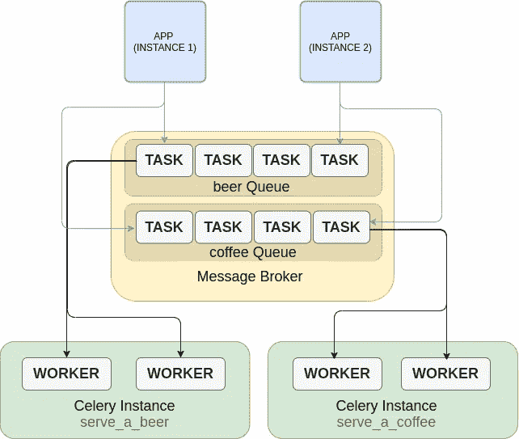

# Python 中的异步任务与芹菜

> 原文：<https://medium.com/analytics-vidhya/asynchronous-tasks-in-python-with-celery-e6a9d7e3b33d?source=collection_archive---------1----------------------->

Celery 是一个基于分布式消息传递的异步任务队列/作业队列。理解什么是同步/异步编程这是理解芹菜的基础。下面一节解释一下，如果你已经知道了，可以跳到**什么时候用？**路段或者直接去**芹菜**路段。

# **同步&异步代码。**

在[这个问题中](https://stackoverflow.com/questions/748175/asynchronous-vs-synchronous-execution-what-does-it-really-mean)在 stackoverflow 中，用户[**the mighty sapien**](https://stackoverflow.com/users/1428344/themightysapien)做了一个很棒的类比来解释同步和异步代码:

> **同步执行**
> 
> 我的老板是个大忙人。他告诉我写代码。我告诉他:好吧。我刚开始，他就像秃鹰一样盯着我，站在我身后，从我的肩膀上。我就像“老兄，WTF:你为什么不去做点什么，而我完成这个？”
> 
> 他说:“不，我就在这里等着，直到你结束。”这是同步的。
> 
> **异步执行**
> 
> 老板告诉我去做，而不是在那里等待我的工作，老板去做其他的任务。当我完成我的工作时，我只是向我的老板报告说:“我完成了！”这是异步执行。

异步代码是一段独立运行的代码，与程序的执行流分离。当我们不想阻塞程序的主执行流时，我们使用这个。

> 你可能会想:—好吧，我想到了！但是我为什么想要或者需要这么做呢？？？

一个很好的理由是这段代码可能需要很长时间才能完成，而你不想等待。

# 什么时候用？

## 例 01:注册

让我们假设我们有一个网站，我们正在开发一个注册功能。在注册过程中，我们必须:

验证用户的凭据；

将用户信息存储在数据库中；

发送确认电子邮件；

负责发送电子邮件的 SMTP 服务器有时需要 3、4 甚至 6、7 秒才能完成。用户无需确认即可开始使用平台。我们不想让他们等这么久，看一个无聊的加载屏幕。在此期间，用户可以放弃注册。在这种情况下，除了电子邮件部分，我们需要同步做所有事情。我们只是把邮件放在盒子里，等会儿再送。查看下面的片段。

只有函数**start _ to _ send _ confirmation _ email**应该是异步的。在执行时，解释器会在邮件发送前从第 3 行跳到第 4 行。函数**start _ to _ send _ confirmation _ email**中的这段代码将与该流程分开执行。在电子邮件发送之前，用户将被返回**。**

## 例 02:财务报告

财务分析师点击一个按钮来查看每月结果。这将需要一段时间，分析师不希望等待漫长而无聊的加载屏幕来查看结果，他希望继续使用该平台，并在结果准备就绪后检查结果。

作为一名开发人员，您不希望请求被搁置几分钟，甚至几小时。实际上，这个请求很有可能达到您的 web 服务器或 DNS 提供商的超时限制(该死的 cloudflare)。

> —好了，现在我知道什么是异步代码，什么时候应该使用它。但是，用 python 怎么做呢？

要做到这一点，我们可以使用 python 线程模块，手动完成，或者使用类似芹菜的任务作业。

# **芹菜**

原理非常简单:一个(或多个)程序将任务添加到要执行的队列中。这个队列也被称为**消息代理。Celery 不仅仅是一个库，它运行在不同于应用程序的服务中，比如数据库、SMTP 服务器等。该服务监视队列，每次添加新任务时，celery 都会执行它。**

芹菜任务在很多情况下是一个复杂的代码，需要一个强大的机器来执行它。就像我之前说的，celery 运行在一个从应用程序中分离出来的服务中，这意味着您可以在一个单独的机器上运行它，并且可以有任意多的队列。这对于扩展应用程序非常有帮助。

## **我们的第一款芹菜应用**

我们将创建我们的第一个芹菜应用程序。这必须是简单的，重点是理解芹菜的概念。

## 先决条件:

*   [Redis](https://redis.io/topics/quickstart)
*   [芹菜](http://www.celeryproject.org/install/)

*我们将使用 Redis 作为* ***消息代理。*** *基本上，消息代理组织队列，这是一个抽象概念。芹菜没有组织队列的意图，它只是执行任务。*

创建一个空目录，命名为你想要的，并在里面做以下步骤。

*   创建一个名为 **first_app.py** 的业务逻辑**文件**；
*   创建一个**文件夹**名为**celery _ stuff**；
*   在 **celery_stuff** 文件夹中，创建一个 **__init__。py** 文件；
*   在 **celery_stuff** 文件夹中，创建一个 **tasks.py** 文件；

您的项目树应该如下所示:

├──芹菜 _stuff
│ ├── __init__。py
│└──tasks . py
└──first _ app . py

让我们在 **first_app.py** 中创建一个异步执行芹菜任务的函数。注意 **start_serve_a_beer** 这是我们创建的一个普通的同步函数。 **serve_a_beer.delay()** 将任务放入队列(*消息代理*)中，由 celery 服务执行。serve_a_beer 任务尚不存在，将在接下来的步骤中创建。

现在，在 **celery_stuff/tasks.py** 中，创建一个 **celery app 实例，**任务 **serve_a_beer** 和**将其注册**到 **celery app 中。**

## 运转

在运行我们的应用程序之前，我们需要运行 celery 服务，因为当我们运行 **first_app.py** 时，代码会将一个任务添加到**队列(第 11 行)**中，如果 celery 服务没有运行，该任务将不会被执行。

**跑芹菜**

*$ celery-A celery _ stuff . tasks worker-l 调试*

**运行第一个 App**

*$ python first_app.py*

如果一切都好，您应该在芹菜日志中看到这一点:

## 处理多项任务

让我们回到 **celery_stuff/tasks.py** 并添加一个名为 **serve_a_coffee 的新任务。**

在 **first_app.py** 文件中，让我们导入一个名为 serve_a_coffee 的新任务并启动它们。文件现在应该是这样的。

提示:不要忘记导入新任务(第 1 行)

再次运行**芹菜**和 **first_app** 。

*$ celery-A celery _ stuff . tasks worker-l 调试*

*$ python first_app.py*

两个任务都应该执行。

## 使用多个队列

想象一下生产中这段代码，每分钟执行数千个任务。当然这两个任务非常相似，但是假设任务**比 **serve_a_coffee** 更慢更复杂。制作咖啡的过程非常简单，你只需要水、咖啡和一个过滤器。但是，要做一瓶啤酒，你需要很多原料，并且至少要等一个月！当您有不同的特性时，将它拆分到不同的队列中是一个明智的选择。这样，您可以选择不同的机器来运行不同的任务。**

在生产中，您可以在不同的机器上为每个队列运行服务。您还可以让多个应用程序实例向这些队列添加任务。

**定义队列**

我们没有定义队列。因此，任务将被发送到默认的芹菜队列。啤酒和咖啡一起排队。这很糟糕，因为每次生产大量啤酒时，咖啡都要等很长时间。

让我们更改代码，将我们的任务分成特定的队列。在 **celery_stuff/tasks.py** 文件中，配置 app 中的路线。在 task_routes 配置中，我们可以为每个任务指定队列。

## **跑芹菜排不同的队！**

在上一节中，我们运行了两个服务:

*   *App 服务*
*   *芹菜服务*

现在，我们将运行 3 项服务:

*   *应用服务*
*   *芹菜服务提供啤酒*
*   *另一种供应咖啡的芹菜服务*

运行下面的命令来设置它们；

*$ python first_app.py*

*$芹菜-一根芹菜 _ stuff . tasks worker-l debug-Q beer*

*$芹菜-一根芹菜 _ stuff . tasks worker-l debug-Q coffee*

我们使用-Q 参数来指定队列。如果我们有 10 个不同的队列，我们可以为每个队列运行一个芹菜服务！

当然，如果您愿意，可以对许多队列使用相同的芹菜服务。这在开发模式中很常见。

$芹菜-芹菜 _stuff.tasks worker -l debug -Q 啤酒、咖啡

你是否觉得一步一步安装所有东西很懒？只需在 github 上克隆这个库，然后用 docker 运行它。

首先，将**celery _ stuff/first _ app . py**上的第 4 行改为:

现在，运行容器。

*$ docker-撰写运行-构建*

你应该在日志里看到啤酒和咖啡！

# 结论

Celery 是在 python 中执行异步任务的一个很好的选择。它是分布式的，易于使用和扩展。在本文中，我们学习了什么是芹菜应用程序，如何创建任务，如何将任务路由到不同的队列，以及如何将芹菜服务运行到特定的队列。芹菜在第一步可能会有点令人沮丧，特别是对于文档中的一些空白，但它非常容易使用，并抽象了许多复杂性。我希望我已经填补了这些空白，特别是第一步！