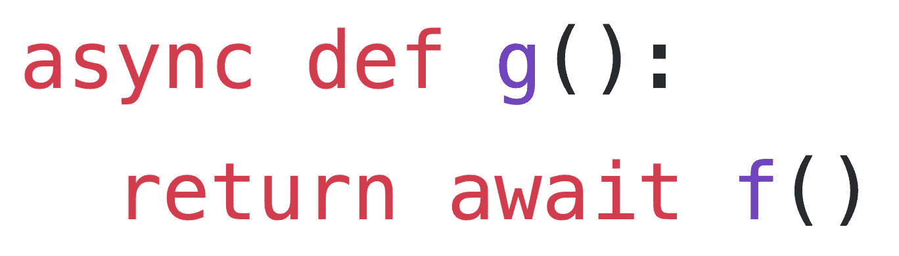

# asyncio——迈向 Python 的异步未来

> 原文：<https://medium.com/analytics-vidhya/asyncio-moving-towards-the-async-future-of-python-28d3231608?source=collection_archive---------2----------------------->

在 Python 社区中，比十年之久的从 2 到 3 的转变更大的分裂正在进行中。自 2015 年发布 3.5 版以来，Python 中就存在协同例程和异步/等待语法，但利用该功能的工具和项目发布缓慢。构建异步应用程序的成熟库开始变得可用，我们喜欢的库正在向异步应用程序转移…