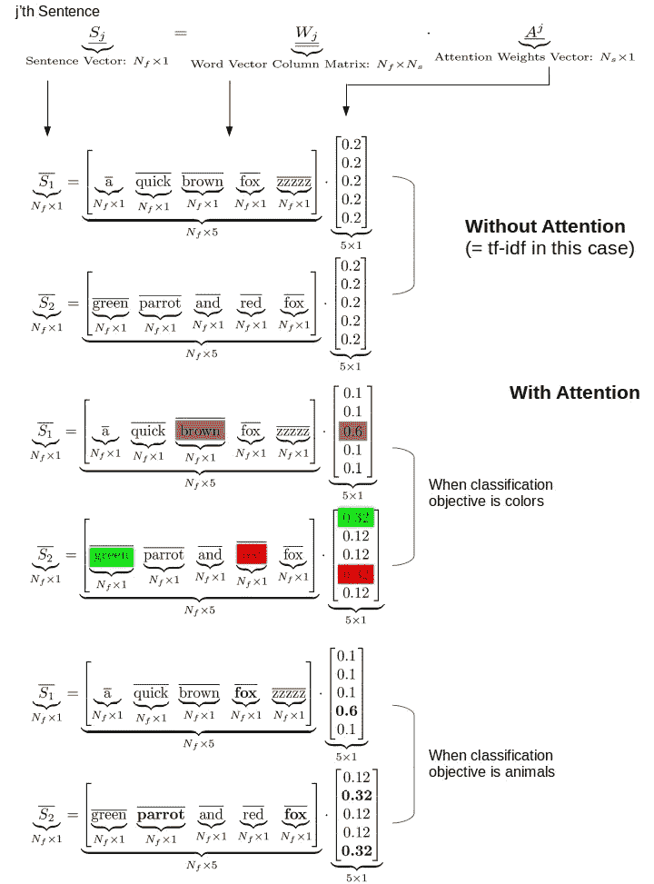
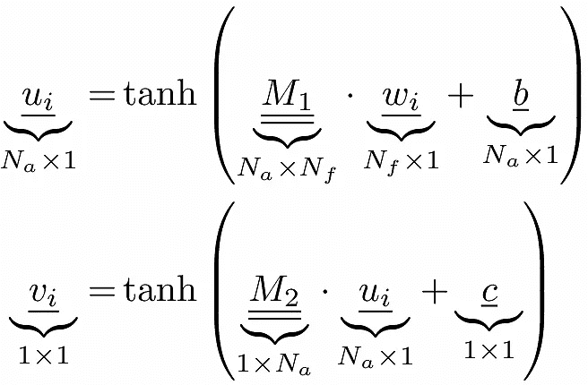
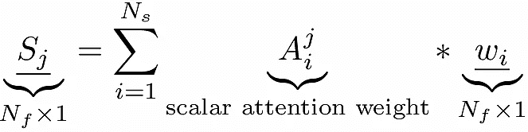
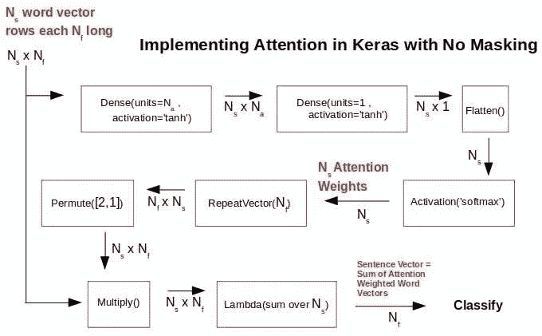
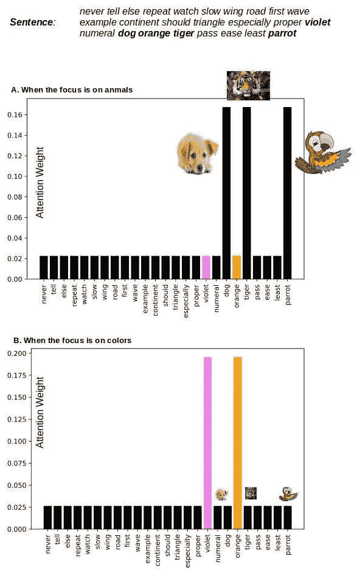
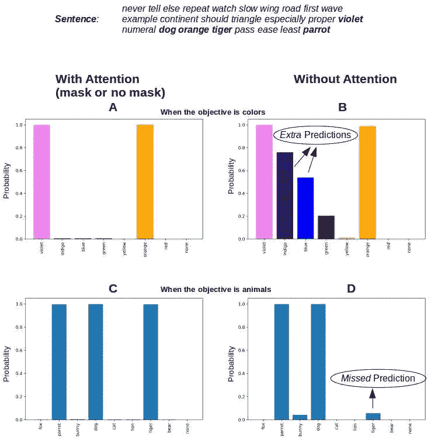

# 注意力作为深度学习的自适应 TF-IDF 技术

> 原文：<https://medium.com/analytics-vidhya/attention-as-adaptive-tf-idf-for-deep-learning-549cbee1a61a?source=collection_archive---------2----------------------->

*注意力就像深度学习的 TF-IDF。注意力和 TF-IDF 都提升了一些单词的重要性。但是，虽然 TF-IDF 权重向量对于一组文档是静态的，但是注意力权重向量将根据特定的分类目标进行调整。注意力为那些影响分类目标的单词导出更大的权重，从而在深度学习黑盒中打开了进入决策过程的窗口…*

注意了！你父母告诉你了，对吗？也是好事。当我们集中注意力时，我们实际上可能会学到一些东西。深度学习也不例外！注意，对于同样的预测任务，一个浅层网络可能比一大堆层更聪明。或者它可能需要更少的数据来训练，或者使用更少的参数来获得相同的技能。就像通过在课堂上集中注意力来考试，而不是在考试前一天晚上苦读到凌晨！所有好的东西和天生的吸引力，对不对？

TF-IDF 长期以来，单词的权重一直是构建各种 NLP 任务的文档向量的主要方法。但是对于给定的文档库，不管分类目标是什么，TF-IDF 向量都是固定的。然而，有一个文本语料库需要根据不同的目标进行分类是很常见的。可能是根据其内容的性质，即政治/科学/体育，或者可能是根据其适用的地方，即美洲/亚洲/欧洲，或者可能是根据情绪积极/中立/消极等。在每种情况下，影响特定分类目标的决策过程的单词/短语自然会不同。但是 TF-IDF 向量是静态的。因此，即使在分类目标改变时，为相同的预测向量产生不同的预测的全部负担基本上落在分类算法上。

使深度学习技术能够有利地根据所讨论的 NLP 任务对不同的单词、*和*使用不同的权重，这就是[注意力机制](https://arxiv.org/abs/1409.0473)的目的。而且是自动的。注意力嵌入到整体优化过程中，并挑选出哪些单词/短语正在驱动特定的分类目标。因此，预测步骤的最终向量是为所讨论的目标定制的。这种额外的灵活性允许更好的预测性能。

这篇文章的目的是说明在一个简单的多类、多标签文档分类任务的环境中注意力的好处。单词的顺序与这里的分类任务无关。我们在嵌入层的顶部实现了 [Bahdanau Attention](https://arxiv.org/abs/1409.0473) 。当屏蔽不存在时，使用 Keras 中的功能 API。当需要掩蔽时，使用来自[克里斯特斯巴兹奥蒂斯](https://gist.github.com/cbaziotis/6428df359af27d58078ca5ed9792bd6d)的定制注意层。然而，这对我们这里的图解问题没有影响。我们将在这里浏览一些代码片段，但是完整的代码可以从 [github](https://github.com/ashokc/Attention-as-Dynamic-Tf-Idf-for-Deep-Learning) 下载。那就让我们继续吧。

# 1.注意识别重要的单词

并非文档中的所有单词对其分类都很重要。我们可能有一个确定的想法。例如，出现像 *good* 这样的词可能表示对一部电影的正面评价。短语*不好*将指示负面评价，而*不太好*可能指示中性，其中*如此如此好*回到正面，而*如此如此*指示中性。你可以用坏的来代替好的，也可以颠倒积极和消极的分类。虽然*很好*可能表示正面评价，但*不太好*可能是中性的。你明白了。实际上有无限多的常用单词和短语的组合，它们的净情感可以有不同的方式。试图用 grep/regex(或者甚至用一个成熟的搜索引擎，使用复杂的布尔逻辑和 slop 短语)来解释它们都是徒劳的。此外，这些有影响力的词可能会因语料库的不同而有所差异。因此，在一个语料库上精心构建的脚本在另一个语料库上不会起作用。这种方法根本无法扩展。

相反，我们想要一台机器来为我们做这件事。给定一组训练文档，我们希望算法学习哪些单词及其组合正在驱动所指示的分类目标。这就是深度学习中[注意机制](https://arxiv.org/abs/1409.0473)的内容。它为算法提供了一种识别控制词和短语的方法，作为正在进行的分类任务的一部分。因此，根据分类任务，分别为相同的句子/文档自动导出单词/句子的不同权重。下面的图 1 用一个句子说明了这一点。为颜色(或动物，如果目标是通过动物参考分类的话)单词获得的较大注意力权重有助于驱使句子向量落入正确的颜色(或动物)桶中。

图一。一个句子是词向量的加权和。注意机制根据分类目标给出不同的权重。对于给定的文档存储库，Tf-idf 权重是静态的。上面的重量数字是为了说明的目的。

一个极好的附带好处是，我们对算法为什么将文档放入它所做的任何类中有了一些了解。这是巨大的，因为我们正在谈论可解释的人工智能。这里实现的单词级注意机制来自 [Bahdanau 等人的工作。艾尔。](https://arxiv.org/abs/1409.0473)另一个很好的参考文献是[杨等人的，该文献将这一思想扩展到了句子级注意的层次。al](https://www.cs.cmu.edu/~./hovy/papers/16HLT-hierarchical-attention-networks.pdf) 。

# 2.在喀拉斯实施 Bahdanau 关注

一个句子是一系列单词。每个单词都是一定长度的数字向量——每个单词的长度都相同。单词的数字向量可以通过 Keras 中的嵌入层直接获得，也可以从外部源(如 FastText)导入到模型中。注意力权重向量是按照 [Yang 等人提出的等式作为训练过程的一部分而获得的。al](https://www.cs.cmu.edu/~./hovy/papers/16HLT-hierarchical-attention-networks.pdf) 。方程式很简单。这是我们的命名和索引惯例。

*   *N_s* :任意一句话的最大字数
*   *N_a* :第一个 *tanh* 密集层的任意/可选单元数
*   *N_f* :每个词向量的长度
*   *w_i* :句子中第 I 个单词的单词向量。
*   *A^j_i* :第 j 个句子中第 I 个单词的注意权重
*   S_j :第 j 句

一个句子的这些 *N_s* 个词向量中的每一个首先通过具有 *N_a* 个单元的 *tanh* 密集层([杨等人 a](https://www.cs.cmu.edu/~./hovy/papers/16HLT-hierarchical-attention-networks.pdf) l 选择 *N_a* 约为 100)。接着是另一个具有 1 个单位的 tanh 密集层。第二个 *tanh* 层的目的是将第一层的 *N_a* long 向量减少为一个标量。我们当然可以在 1 个单元中只使用一个 *tanh* 层，但是具有两个 *tanh* 层，第一个层具有 *N_a* > 1，这提供了更多的灵活性。此外，代替第二个 *tanh* 层，也许可以在第一个 *tanh* 层之后的矢量中累加 *N_a* 值来获得这个标量——但这里没有尝试。在任何情况下，最终结果都是句子中的每个单词有一个标量值。

等式 1。按照 NLP 任务的总体目标，句子中的单词向量通过几个 *tanh* 层回归到每个单词的标量权重。

为第 j 个句子中的每个单词收集上面的 *v_i* 产生了一个 *N_s* 长向量 *v* ，该向量在 softmax 上给出该句子的 *N_s* 长注意力权重向量 *A^j* 。然后，句子向量被简单地获得为注意力加权的单词向量的总和。

等式 2:用于分类的句子向量是注意力加权词向量的总和。很像那个句子的 tf-idf 向量。

## 2.1 无掩蔽

虽然等式很简单，但在 Keras 中实现注意力有点棘手。当不使用屏蔽时——也就是说，当每个句子都有完全相同的字数时，这就简单多了，我们可以用函数式 API 来实现它。如果我们走这条路，所有较短的句子都需要添加一个虚拟/未使用的单词(如图 1 中的 *zzzzz* )来使它们和最长的句子一样长。有点低效，但是对于简单的演示问题，比如这篇文章中的问题，这不是问题。下面的图 2(来自 [Philippe Rémy](https://github.com/philipperemy/keras-attention-mechanism) 的修改想法，以及来自[王菽一](https://www.youtube.com/watch?v=oaV_Fv5DwUM)的 you-tube 视频)显示了当不使用掩蔽时，我们需要在 Keras 中做些什么来实现注意。

图二。当不使用屏蔽时，使用功能 API 的注意的 Keras 实现。获取表示句子的单词向量数组，并产生注意力加权的句子向量，该向量可用于任何分类目标。所有的句子都有相同数量的单词(包括虚拟单词),没有屏蔽。

上述内容可以定义为一个函数，它将一系列单词向量作为自变量，并按照等式 2 返回一个句子向量。

## 2.2 带掩蔽

克里斯特斯·巴兹奥蒂斯有一个注意力的实现，作为一个支持屏蔽的自定义层，这样我们就不必显式地在句子中添加虚拟单词。当我们想要使用屏蔽时，我们在模型中使用该实现。

对于我们的演示问题，它产生了与 2.1 节中没有屏蔽的实现相同的结果。

# 3.示例:注意多类、多标签分类

现在剩下要做的就是把它应用到文本语料库中，并展示注意力在给定 NLP 任务目标的情况下动态识别重要单词的工作。重现结果的代码可以从 [github](https://github.com/ashokc/Attention-as-Dynamic-Tf-Idf-for-Deep-Learning) 下载。

长度为 15-25 个单词的句子是通过从 1000 个独特的单词列表中随机选择单词来生成的，包括一些颜色和动物单词。一个句子最多可以有 4 个不同的颜色词和/或动物词。目的是根据颜色或包含的动物来对句子进行分类。当目标是按颜色分类时，一个句子属于它作为单词包含的所有颜色类别。同样，当分类目标是动物参考时。因此，无论分类标准是什么，我们都在讨论一个多类、多标签的分类问题。下面的代码片段生成文档。

句子的标签向量是 number_of_colors + 1 长(当按颜色分类时),其中 1 位于出现在句子中的颜色词的位置，否则为 0。例如，我们使用 7 种彩虹颜色的 VIBGYOR，因此标签向量的长度为 8——包括“无”标签。

构建整个 Keras 模型非常简单。我们定义了一个中间模型，这样我们就可以从名为“attention_vector_layer”的层中输出注意力权重。由于这是一个多类别、多标签的分类问题，我们在最终的密集层中使用 sigmoid 激活，并使用具有分类准确性的二元交叉熵作为度量。查看托拜厄斯·斯特巴克的文章和 T2 关于为什么这些是正确选择的讨论。

模型在有/无关注和有/无屏蔽的情况下运行。Keras 制作的张量流图证实了我们在第 2 节中的模型。

图二。有和没有注意的数据流，有和没有屏蔽的数据流。当掩蔽到位时，使用来自克里斯特斯 Baziotis 的注意层。

# 4.结果

当目标是颜色和动物时，运行有/无注意/遮蔽的模拟。在所有四次运行中，使用了 1300 个句子，其中训练/有效/测试:832/208/260 拆分。每当一个类别的预测概率对于一个句子大于 0.5 时，我们用那个类别来标记那个句子。图 3 示出了针对不同分类目标获得的一个这样的句子中的单词的注意力权重。这肯定是我们想看到的，因为重要的词已经被注意力机制自动*挑选出来，并给予比其他词更大的权重。这直接转化为一个句子的正确类别的更大概率，因为这些单词正在驱动分类决策。*

图 3。注意机制识别控制分类目标的正确单词，并为这些单词获得更大的权重。因此，当分类目标改变时，相同单词的权重是不同的。这与独立于 NLP 任务的 tf-idf 加权不同。

对于同一个句子，下面的图 4 显示了类别概率。注意，正确类别的概率接近 1.0，其余类别的概率接近 0.0。正是我们想要的。如果不加注意，我们会看到，对于不正确的类别*靛蓝*预测的概率高达 0.75，而对于正确的类别*老虎*预测的概率低至 0.05。

图 4。当注意力到位时，控制分类的词的较大权重允许精确的分类..屏蔽对这个简单的问题没有任何影响。但是如果不加注意，预测会有额外的&缺失的类。

注意分类对所有 260 个测试文档产生了 100%准确的预测。也就是说，对于每个测试文档，预测了每个实际的类，并且只有实际的类(概率> 0.5)。如果不注意，一些正确的类别会被遗漏(预测概率< 0.5) and some wrong classes were predicted (predicted probability > 0.5)，如图 4 所示。

# 5.结论

注意机制使得模型能够将较大的权重赋予对于给定分类任务重要的单词。这增强了分类的准确性，同时阐明了为什么特定的文档被分类到特定的桶中——这对于现实世界的应用程序来说是一条非常有用的信息。

在这个例子中，单词的顺序与分类无关。因此不需要更花哨的递归层或卷积层。但是单词的顺序和单词的相对接近度对于真实文档中所传达的意思是很重要的。在接下来的文章中，我们将在 LSTM(单向或双向，return_sequences=True)层上应用相同的注意机制，它可以更好地处理单词序列很重要的文档。

*原载于 2019 年 7 月 22 日【http://xplordat.com】**。***