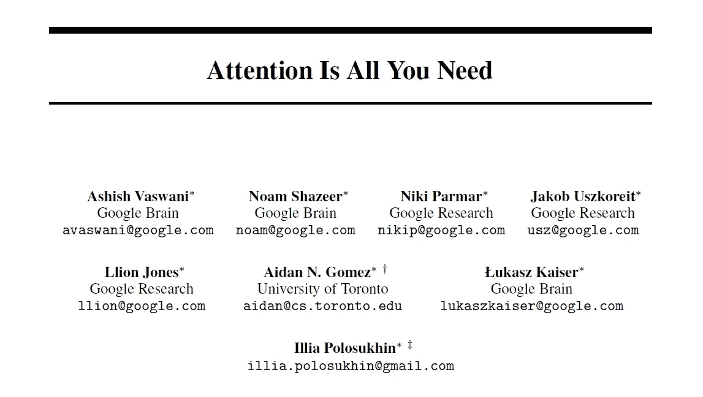

# 你需要的只是关注(1)

> 原文：<https://medium.com/analytics-vidhya/attention-is-all-you-need-1-3b960b7b6500?source=collection_archive---------9----------------------->

[原文谷歌的论文](https://arxiv.org/abs/1706.03762)有解释，给那些看过论文但还没有信心的新手。

在著名的论文“[注意力是你所需要的全部](https://arxiv.org/abs/1706.03762)”(一篇著名的论文)中，作者“*提出了一种新的简单的网络架构，转换器，完全基于注意力机制，完全免除了递归和卷积*”

*   这篇文章(连同其他连续的…