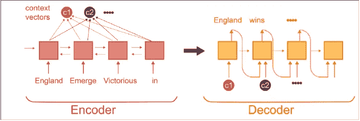
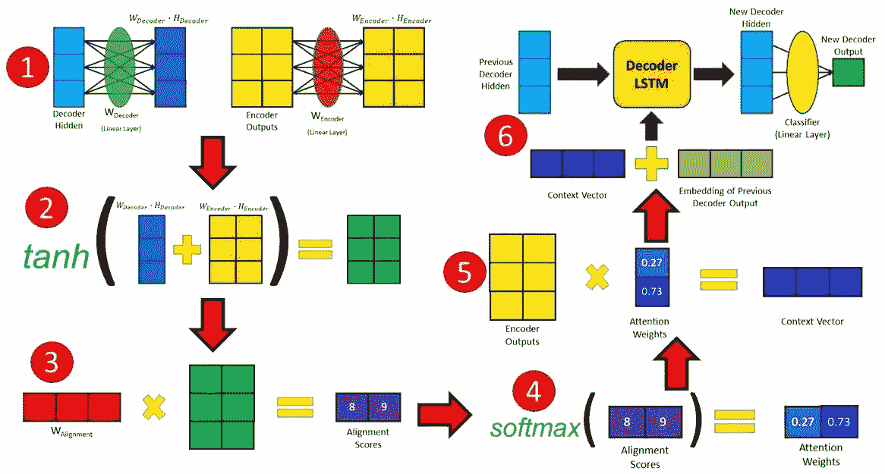

# 注意机制:一种快速直觉

> 原文：<https://medium.com/analytics-vidhya/attention-mechanism-a-quick-intuition-26e154cdb49a?source=collection_archive---------5----------------------->


斯蒂芬·科斯马在 [Unsplash](https://unsplash.com?utm_source=medium&utm_medium=referral) 上拍摄的照片

# **内容:**

1.  介绍
2.  序列间模型
3.  Seq2Seq 型号的问题
4.  需要关注
5.  自定义 Keras 关注层-代码示例
6.  使用 TensorFlow 2.0 更新
7.  结论
8.  参考

## **1。简介**

在这篇文章中，我们将试图理解注意机制的基本直觉以及它为什么会出现。我们的目标是理解编码器-解码器模型的工作原理，以及注意力如何帮助获得更好的结果。

我们将看到如何使用 Keras 和 TensorFlow 2.0 提供的默认关注层来构建自定义关注层。

## **2。序列间模型**

序列到序列模型旨在将固定长度的输入映射到固定长度的输出，其中输入和输出的长度可能不同。
示例:*“您正在阅读这篇文章”*在英语中是*“Vous lisez cet article”*在法语中
输入长度= 5 个单词
输出长度= 4 个单词
在这里，LSTM/GRU 无法将英语的每个单词映射到法语，因此我们使用一个序列到序列模型来解决类似这样的问题。

递归神经网络(RNN)的编码器-解码器模型是一种强大的序列到序列模型。这些模型在自然语言处理领域有很多使用案例，如机器翻译、图像字幕和文本摘要。


谷歌翻译

序列到序列模型有两个组件，一个**编码器**和一个**解码器**。编码器将源句子编码成一个简洁的向量(称为**上下文向量**)，解码器将上下文向量作为输入，并使用编码的表示计算翻译。

## 3.Seq2Seq 型号的问题

这些模型的一个问题是，性能随着输入句子长度的增加而衰减。原因是—

*   要预测的单词取决于输入句子的上下文，而不是单个单词。所以，基本上要预测一个法语单词，我们可以利用英语句子中的 2-3 个单词。这就是人类如何将一种语言翻译成另一种语言。
*   另一个限制是，对于较长的句子，我们必须将输入句子的所有信息压缩到一个固定长度的向量中。并非句子中的所有单词对于预测正确的单词都很重要。

现在，随着输入句子长度的增加，随着时间的推移，我们的 LSTM/GRU 失去了长句的上下文，从而失去了整个句子的意义，并最终导致较差的性能。

## 4.需要关注

为了解决上述局限性，引入了注意机制。

注意力的整体思想是，解码器可以访问编码器的过去状态，而不是仅仅依赖于上下文向量。在每个解码步骤中，解码器都会查看编码器的任何特定状态。

注意机制试图识别输入序列的哪些部分与输出中的每个单词相关，并使用**相关信息**来选择适当的输出。

## 工作

这里，我们利用双向 GRU 单元，其中输入序列向前和向后传递。输出然后被连接并传递给解码器。



双向 GRU 细胞

为了解决这一限制，我们使用选定数量的过去编码状态的加权和。我们有两个约束:-
1。必要的过去状态数
2。所选过去状态的权重
由于这些约束可以通过反向支持来学习，我们可以假设这是适合编码器和解码器之间的层


编解码模型中的注意机制

## 5.自定义 Keras 关注层-代码示例

这是一个代码片段，用于为其中一个问题创建关注层。

```
from keras.layers import Layer
import keras.backend as Kclass Attention(Layer):
    def __init__(self,**kwargs):
        super(attention,self).__init__(**kwargs)

    def build(self,input_shape): 
        ***"""
        Matrices for creating the context vector.
        """*** self.W=self.add_weight(name="att_weight",shape=(input_shape[-1],1),initializer="normal")
        self.b=self.add_weight(name="att_bias",shape=(input_shape[1],1),initializer="zeros")        
        super(attention, self).build(input_shape)

    def call(self,x):
        ***"""
        Function which does the computation and is passed through a softmax layer to calculate the attention probabilities and context vector. 
        """***et=K.squeeze(K.tanh(K.dot(x,self.W)+self.b),axis=-1)
        at=K.softmax(et)
        at=K.expand_dims(at,axis=-1)
        output=x*at
        return K.sum(output,axis=1)

    def compute_output_shape(self,input_shape):
        ***"""
        For Keras internal compatibility checking.
        """*** return (input_shape[0],input_shape[-1])

    def get_config(self):
        ***"""
        The get_config() method collects the input shape and other information about the model.
        """*** return super(attention,self).get_config()
```



来源:[链接](https://blog.floydhub.com/attention-mechanism/)

## 模型结构

```
input_text_bgru = Input(shape=(MAX_SEQUENCE_LENGTH,), dtype='float32')
embedding_layer_bgru = Embedding(len(tokenizer.word_index) + 1,
                                    300,
                                    weights=[embedding_matrix],
                                    input_length=MAX_SEQUENCE_LENGTH,
                                    trainable=**False**)
g = embedding_layer_bgru(input_text_bgru)
g = SpatialDropout1D(0.4)(g)
g = Bidirectional(GRU(64, return_sequences=**True**))(g)
att = Attention(MAX_SEQUENCE_LENGTH)(g)
g = Conv1D(64, kernel_size = 3, padding = "valid", kernel_initializer = "he_uniform")(g)
avg_pool1 = GlobalAveragePooling1D()(g)
max_pool1 = GlobalMaxPooling1D()(g)
g = concatenate([att,avg_pool1, max_pool1])
g = Dense(128, activation='relu')(g)
bgru_output = Dense(2, activation='softmax')(g)
```

## 6.使用 TensorFlow 2.0 更新

在 TensorFlow 2.0 中，注意力层被添加为其中一个层，现在可以直接实现，而无需显式定义。

```
query_value_attention_seq = **tf.keras.layers.Attention()**(
    [query_seq_encoding, value_seq_encoding])
```

这使得它更容易实现，并且在设计复杂的架构时，对于机器学习开发者来说变得不那么麻烦。

## 7.结论

注意力机制并不局限于机器翻译。它用于图像字幕，在 CNN 的帮助下，我们利用视觉注意力来获得特征地图。

注意力机制的用途超出了我们在本文中提到的范围。希望你能对注意力机制试图解决的问题有一个大致的了解。本文用 RNNs 实现了 Seq2Seq 模型中的基本注意机制。然而，像**谷歌的 BERT** 和 **XLNet** 这样的变形金刚模型是利用自我关注机制的重大进步，目前是 NLP 领域的最新技术。

## 8.参考

*   [https://towards data science . com/light-on-math-ml-attention-with-keras-DC 8 db C1 fad 39](https://towardsdatascience.com/light-on-math-ml-attention-with-keras-dc8dbc1fad39)
*   [https://machine learning mastery . com/how-does-attention-work-in-encoder-decoder-recurrent-neural-networks/](https://machinelearningmastery.com/how-does-attention-work-in-encoder-decoder-recurrent-neural-networks/)
*   [https://blog.floydhub.com/attention-mechanism/](https://blog.floydhub.com/attention-mechanism/)
*   【https://arxiv.org/abs/1409.0473 号
*   【https://arxiv.org/abs/1502.03044 
*   [https://towardsdatascience.com/transformers-141e32e69591](https://towardsdatascience.com/transformers-141e32e69591)
*   [https://towards data science . com/understanding-Bert-is-it-a-game-changer-in-NLP-7 CCA 943 cf 3 ad](https://towardsdatascience.com/understanding-bert-is-it-a-game-changer-in-nlp-7cca943cf3ad)

## 与我联系

*   [**LinkedIn**](https://www.linkedin.com/in/nihal-das/)
*   [**GitHub**](https://github.com/Nihal2409/)

*****感谢大家阅读本文。非常感谢您的建议！*****