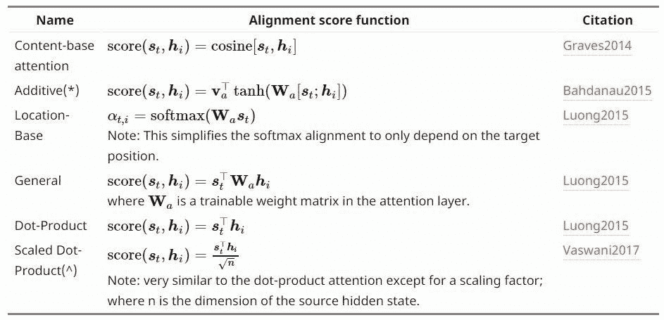

# 注意机制和 Softmax

> 原文：<https://medium.com/analytics-vidhya/attention-mechanism-and-softmax-65d8d50f7786?source=collection_archive---------7----------------------->

肖恩·奥尔登多夫在 [Unsplash](https://unsplash.com/s/photos/attention-mechanism?utm_source=unsplash&utm_medium=referral&utm_content=creditCopyText) 上拍摄的照片

在自然语言处理中，Seq2Seq 模型是处理语言的重要模型之一。在该模型中，编码器读取输入句子一次并对其进行编码。在每个时间步，解码器使用这种嵌入并产生一个输出。但是人类不会翻译这样的句子。我们不会记住输入的内容并试图重新创造，如果我们这样做，我们很可能会忘记某些单词。此外，在说出每个单词时，整个句子在每个时间点都很重要吗？不。只有某些词是重要的。理想情况下，我们只需要向解码器输入相关信息(相关单词的编码)。
*“学会只关注句子的某些重要部分。”*

**什么是关注？** 在心理学中，注意是选择性地专注于一件或某些事物而忽略其他事物的心理过程。

神经网络被认为是试图以一种简化的方式模仿人脑的行为。注意机制是另外一种努力，在深层神经网络中实现选择性地专注于一些相关事物而忽略其他事物的相同动作。

让我解释一下这意味着什么。假设你正在看一堆你第一所学校的照片。通常，会有一群孩子坐在几排，老师也会坐在中间。现在，如果有人问这个问题，“我们有多少人？”，你会怎么回答？

仅仅通过数人头，对吗？你不必考虑照片中的其他东西。现在，如果有人问一个特别的问题，“照片里的老师是谁？”你的大脑完全知道该做什么。它会开始尝试在照片中找到一个成年人的特征。其余的功能将被忽略。这可能是我们的大脑非常擅长实施的“注意力”。

**目标:**

注意力只是一个向量，通常是使用 softmax 函数的密集层的输出。在注意机制之前，翻译依赖于阅读一个完整的句子，并将所有信息压缩到一个固定长度的向量中，正如你将能够想象到的那样，一个由几个单词代表的单词很多的句子肯定会造成信息丢失，翻译不充分等。然而，注意力部分地解决了这个问题。它允许机器翻译者查看主句包含的所有知识，然后根据它处理的单词和上下文生成正确的单词。它甚至可以让翻译者聚焦或聚焦(聚焦于局部或全局特征)。注意力并不神秘也不复杂。它只是一个由参数和微妙的数学公式表达的界面。你可以把它插在任何你认为合适的地方，潜在地，结果也会得到增强。
概率语言模型的核心是通过马尔可夫假设给句子分配一个概率。由于包含不同数量单词的句子的特性，RNN 毕竟被引入来建模单词之间的概率。

在建模时，基本的 RNN 结构经常陷入困境:

1.  结构困境:在全球范围内，输出和输入的长度可能完全不同，而香草 RNN 只能处理难以对齐的定长问题。考虑一个 EN-FR 翻译的例子:“他不喜欢苹果”→“Il n ' aime pas les pommes”。
2.  数学本质:它遭受梯度消失/爆炸，这意味着当句子足够长时(可能最多 4 个单词)，很难指导。

翻译常常需要任意的输入长度和输出长度，为了弥补上述不足，采用了编解码模型，将基本的 RNN 单元修改为 GRU 或 LSTM 单元，用 ReLU 代替双曲正切激活。我们在这里使用 GRU 细胞。

嵌入层将离散单词映射到密集向量中以提高计算效率。然后，嵌入的字向量被依次送入编码器，也称为 GRU 单元。编码过程中发生了什么？信息从左到右流动，并且不仅根据当前输入而且根据所有先前的单词来学习每个单词向量。当句子被完全读取时，编码器在时间步长 4 产生一个输出和一个隐藏状态，用于进一步处理。对于编码部分，解码器(GRUs 也是)从编码器获取隐藏状态，由教师强制训练(前一个单元的输出作为当前输入的模式)，然后顺序生成翻译单词。

类似于基本的编码器-解码器架构，这种奇特的机制将上下文向量插入编码器和解码器之间的间隙。根据上面的示意图，蓝色代表编码器，红色代表解码器；我们可以看到，上下文向量将所有细胞的输出作为输入，来计算解码器想要返回的每个单词的语言单词的概率分布。通过利用这种机制，解码器可以捕获一些全局信息，而不仅仅是推断支持的一个隐藏状态。并且形成一个上下文向量是相当简单的。对于一个困难而快速的目标单词，首先，我们循环所有编码器的状态来测试目标和源状态，以返回编码器中每个状态的分数。然后，我们可以使用 softmax 来标准化所有分数，这将生成以正确的轨道状态为条件的概率分布。最后，引入权重，形成易于教学的上下文向量。就是这样。数学如下所示:

为了理解看似复杂的数学，我们要记住三个要点:

*   在解码期间，为每个输出单词计算上下文向量。所以我们会有一个 2D 矩阵，它的大小是#个目标单词乘以#个源单词。等式(1)展示了给定一个目标单词和一组源单词来计算一个值的方法。
*   一旦计算了上下文向量，就可以通过上下文向量、目标词和焦点函数 f 来计算注意力向量
*   我们需要注意力机制是可训练的。与等式(4)一致，两种风格都提供了可训练的重量(Luong 的 W，Bahdanau 的 W1 和 W2)。因此，不同的风格可能导致不同的表现。

下面是几种流行的注意力机制和相应的对齐分数函数的汇总表:

