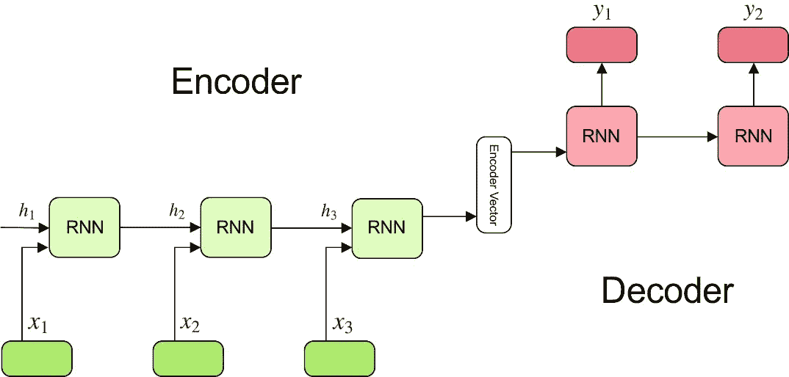
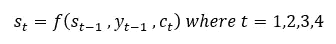

# 深度神经网络中的注意机制简化

> 原文：<https://medium.com/analytics-vidhya/attention-mechanism-in-deep-neural-network-simplified-6b3142b1be78?source=collection_archive---------23----------------------->

DNN 利用注意力将文本转化为图像

注意力是以高分辨率观看图像或文字的特定部分，而以低分辨率观看其余部分的过程。假设我想预测这个句子中的下一个单词"*我在卡纳塔克邦出生并长大，因此我说流利的 _ _ _ _ _ _ _ _ _ "*。要预测这个句子中的下一个单词，注意"*卡纳塔克邦*"并说"*卡纳达语*"是非常容易的，而不是必须查看整个句子并处理每个单词。注意力是一个重要的向量，它估计一个元素如何与其他元素紧密相关。

注意力广泛应用于自然语言处理和计算机视觉任务，如机器翻译、图像字幕生成、微软的注意力甘等。

seq2seq 模型

之前 attention 神经机器翻译是用编码器解码器模型或者 sequence2sequrnce 模型完成的，如上图所示。这里，编码器给出“编码器向量”或“上下文向量”,这是迄今为止它所看到的所有内容的汇总(这是编码器的最后隐藏状态),这是解码器的初始隐藏状态，该系统的主要缺点是，如果编码器做出了错误的汇总，解码器输出将是错误的，这发生在输入大小很长时，这被称为长距离依赖性问题。

***注意力是如何工作的？***

注意力被提出作为 seq2seq 模型的问题的解决方案。这里，上下文向量通过在上下文向量和输入序列之间创建快捷方式来访问整个输入序列，并且这些快捷方式的权重对于不同的解码器单元是不同的。

具有注意机制的编解码模型

上图是 bahda nau 2015 年关于注意力的论文中提到的具有注意力机制的编码器-解码器模型。

假设我们要把一个句子从英语翻译成印地语，

“你好*我是杜鲁夫*”对“ *नमस्ते मैं ध्रुव हूँ* ”。

为此，输入序列 x 的长度为 4，输出序列 y 的长度为 4。

图 2 中的编码器是双向 RNN，具有前向和后向隐藏状态，所有向量 h1、h2..等。，在他们的工作中使用的基本上是编码器中前向和后向隐藏状态的串联，其中 i = 1，2，3，4。

解码器网络的隐藏状态如下所示，

其中 ct 是上下文向量，它是由比对分数加权的输入序列的隐藏状态的加权和。

align 函数分配一个分数，该分数告诉位置 I 处的输入对于位置 t 处的输出有多重要，比方说对于必须将“ *Hello* ”转换为“ *नमस्ते* ”的第一解码器单元，上下文向量可以如下

比对分数如下

其中第一个隐藏向量(“你好”)的重要性最高，这意味着当将“*你好*”转换为“ *नमस्ते* ”时，网络更多地关注“你好”，而较少关注序列的其余部分。

在原始论文中，利用具有单个隐藏层的 FFN 来计算对齐分数，并且分数函数如下给出，

其中 va 和 Wa 是要学习的权重。

进一步阅读

[https://lilian Weng . github . io/lil-log/2018/06/24/attention-attention . html](https://lilianweng.github.io/lil-log/2018/06/24/attention-attention.html)

[https://www . analyticsvidhya . com/blog/2019/11/comprehensive-guide-attention-mechanism-deep-learning/](https://www.analyticsvidhya.com/blog/2019/11/comprehensive-guide-attention-mechanism-deep-learning/)

[https://towards data science . com/intuitive-understanding-of-attention-mechanism-in-deep-learning-6c 9482 aecf 4 f](https://towardsdatascience.com/intuitive-understanding-of-attention-mechanism-in-deep-learning-6c9482aecf4f)

[https://towards data science . com/understanding-encoder-decoder-sequence-to-sequence-model-679 e 04 af 4346](https://towardsdatascience.com/understanding-encoder-decoder-sequence-to-sequence-model-679e04af4346)

[https://www.youtube.com/watch?v=W2rWgXJBZhU](https://www.youtube.com/watch?v=W2rWgXJBZhU)