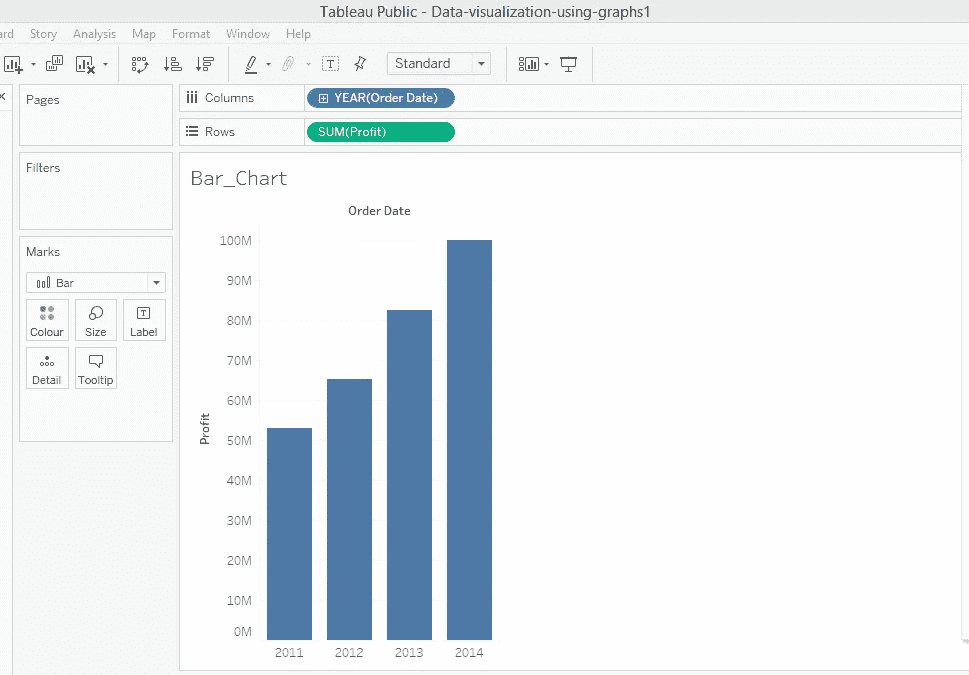
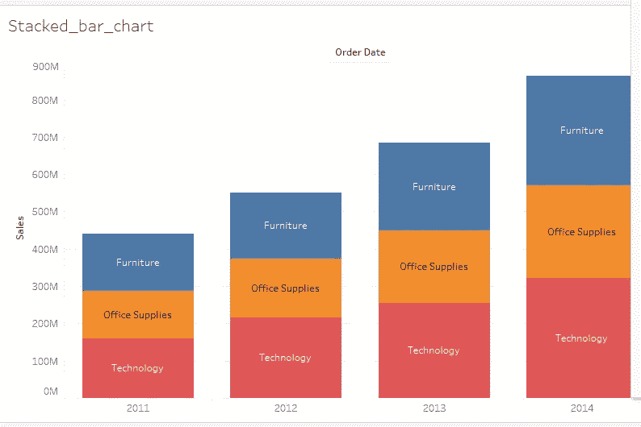
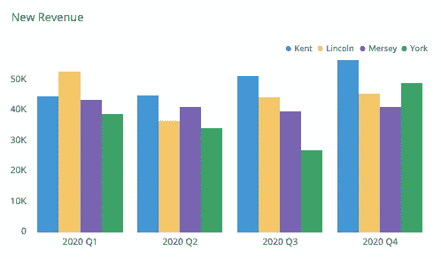
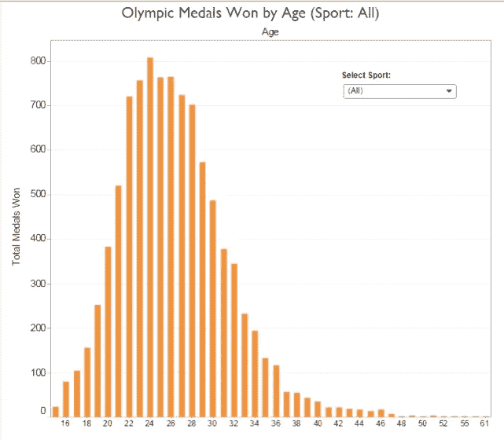
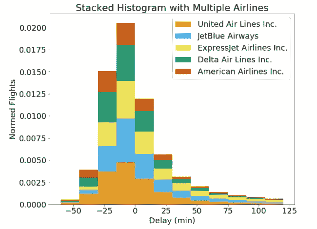
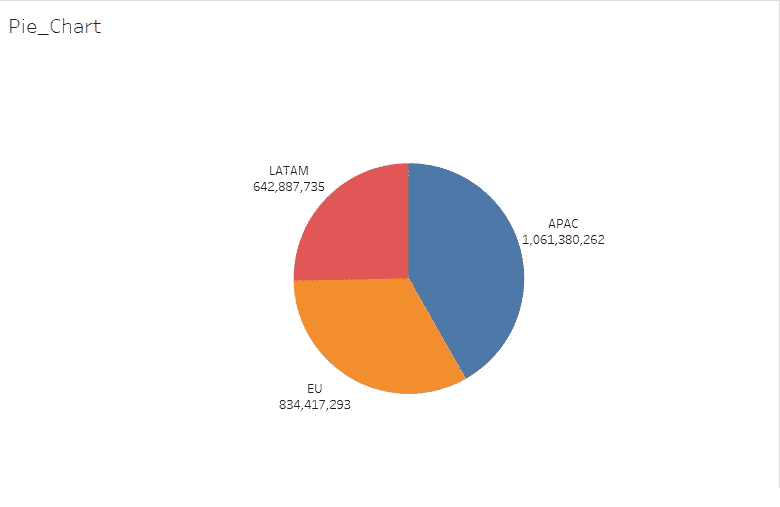
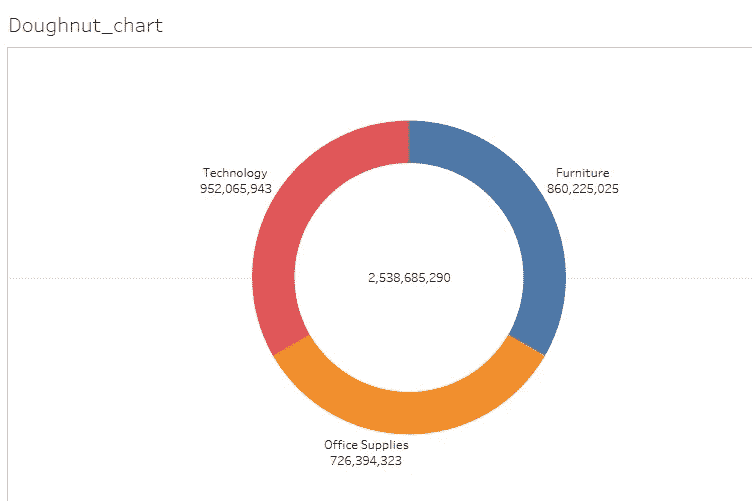
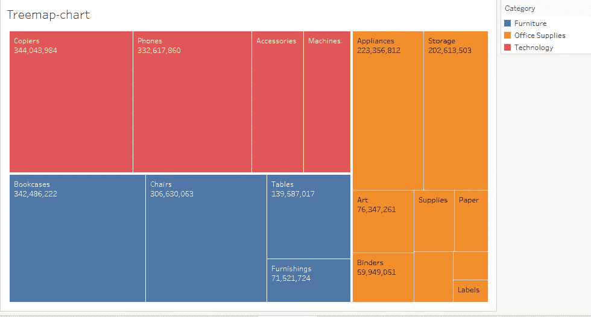

# 引人入胜的数据可视化:熟悉工业中使用的所有流行图表(第 1 部分)

> 原文：<https://medium.com/analytics-vidhya/attractive-data-visualization-get-familiar-with-all-popular-graphs-used-in-industry-part-1-b36fe0164e47?source=collection_archive---------20----------------------->

用图形可视化数据

用能给任何人留下深刻印象的图表来可视化你的数据。这篇文章将让你知道哪种类型的图表对你的数据是完美的，哪种不是完美的。

当您考虑可视化数据时，首先想到的可能是图形或图表。图表就像一个讲故事的工具，通过它我们可以获得隐藏在数据中的重要信息。

我们必须选择适合数据的正确图表。选择错误的图表可能会提供误导性的结果。因此，在这篇文章中，我们将研究工业中广泛使用的图表类型&我们也将研究它们适用于哪些数据。我使用 Tableau 软件来演示本文中使用的概念。您可以在此找到 Tableau 工作簿[，在这里您可以找到所有的图表/图形。](https://public.tableau.com/profile/mayur.rindhe1543#!/vizhome/Data-visualization-using-graphs1/Bar_Chart)

这是本文的第 1 部分，我们将看到:

> (**这里可以找到**[**part 2**](/@mayurrindhe001/attractive-data-visualization-get-familiar-with-all-popular-graphs-used-in-industry-part-2-7860609aa982))

1.  条形图
2.  柱状图
3.  圆形分格统计图表
4.  圆环图
5.  树形图

# 1.条形图:

它由一系列条形组成，显示变量的发展情况。

***何时使用条形图:***

*   当我们想要跟踪一个或两个变量随时间的发展时，条形图非常有用。

它显示了利润随时间的变化

《出埃及记》上图显示了公司在给定时间段(2011 年至 2014 年)的利润增长情况

*   当我们想要显示一个变量在一段时间内的发展以及其他一些变量时，我们可以使用 ***堆积条形图*** 。

《出埃及记》上图是一个堆积条形图，显示了一段时间内的销售发展情况，条形图与产品类别堆积在一起。所以堆积条形图比简单的条形图能容纳更多的信息。

***何时避免使用条形图:***

*   你不应该用条形图来显示一段时间内两个以上变量的发展。因为有时候可能会误导解读。

这是一个例子-

从这个图表中，不容易跟踪某个特定变量的趋势。因此，人们不应该在一段时间内想象两个以上变量。

# 2.直方图:

显示给定变量观察频率的一系列信息仓。

***何时使用:***

*   当我们想要显示我们正在处理的“数据分布”时。
*   通过将连续数据分组，我们可以知道观察值集中在哪里。

该直方图显示了赢得的奖牌总数在玩家年龄范围内的分布情况(年龄在 18-38 岁之间的玩家赢得的奖牌比其他玩家多。)

***何时回避:***

*   如果我们有一个变量的多个类别，那么直方图不应该是我们的选择。(应该避免多栏直方图，因为它们不容易被每个人理解)。

这是多列直方图(如你所见，它不容易理解，因此我们应该避免使用这个可怕的东西)。

# 3.饼图:

它是一个分成若干片的圆形图形。切片越长，它所代表的总量就越大。

**T5 什么时候用:**

*   当我们想要显示整体的贡献时，我们应该使用饼图。

《出埃及记》假设有一家公司在世界上的三个地区销售其产品，即:欧盟、拉美和 APAC。最高管理层想知道，在公司的总销售额中，世界上哪个地区贡献了多少。

公司的区域销售

我们可以使用上面显示的饼状图找到一个地区的贡献。因此可以得出结论，公司的销售更多是在 APAC(亚太地区)。

***注:*** 如果没有考虑细分的所有数值部分，那么结果可能会产生误导(例如。如果我们跳过欧盟地区的销售并尝试绘制饼图，那么它将给出错误的结果)

***何时回避:***

*   当你想显示一个变量如何随时间发展时，不应该使用饼图。

# 4.圆环图:

基本上它是一个中间有洞的饼图。

***何时使用:***

*   饼图和圆环图的使用是相同的
*   圆环图允许我们通过在中间添加文本框来表示总量。

我们可以在甜甜圈中间看到总销售额。

***何时回避:***

*   类似饼状图的案例
*   如果你的观众对看到总数不感兴趣，不要用甜甜圈图，用饼状图。

# 5.树形图:

允许我们将整体的总和分成层次，并显示每个层次的细分。

***何时使用:***

*   当我们想要可视化大量类别中的部分到整体的关系时。

前任。上面的树形图显示了每个部门的产品对公司总销售额的贡献。长方形或正方形的大小说明了它在销售中的贡献。矩形的尺寸越大，对销售的贡献越大。

***何时回避:***

*   当我们正在处理的数据不可分为类别和子类别时。
*   如果我们想追踪变量随时间的发展。

这是第一部分的结尾。我希望现在你可以使用不同的图表来更直观地显示你的数据。感谢阅读。 ***为第二部分点击*** [***此处***](/@mayurrindhe001/attractive-data-visualization-get-familiar-with-all-popular-graphs-used-in-industry-part-2-7860609aa982) 。