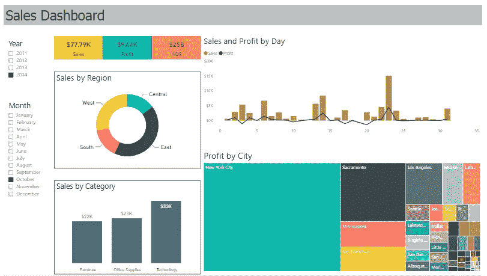
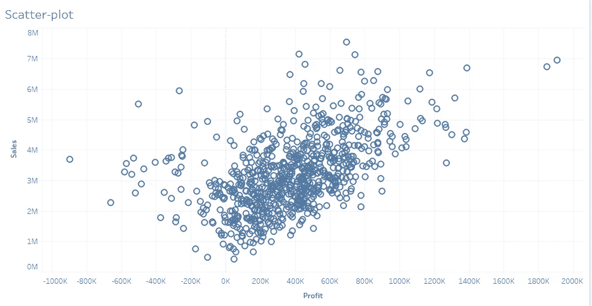
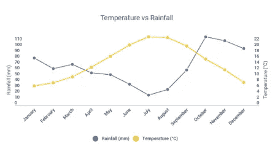
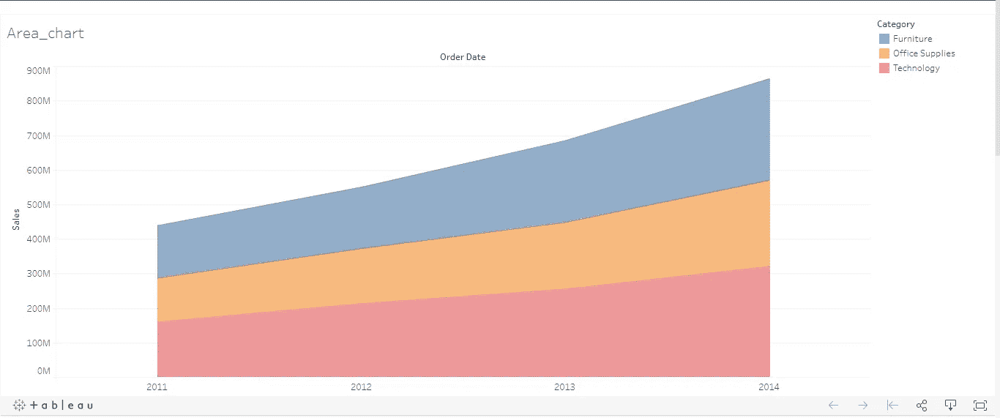
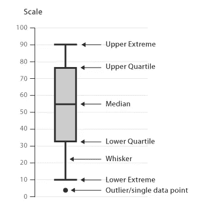
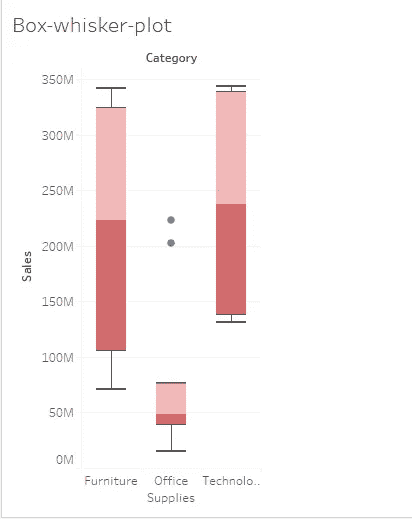

# 引人入胜的数据可视化:熟悉工业中使用的所有流行图表(第 2 部分)

> 原文：<https://medium.com/analytics-vidhya/attractive-data-visualization-get-familiar-with-all-popular-graphs-used-in-industry-part-2-7860609aa982?source=collection_archive---------25----------------------->

这是这篇数据可视化文章的第 2 部分。如果你没有读过它的第一部分，我强烈建议你先读第一部分(点击[此处](/@mayurrindhe001/attractive-data-visualization-get-familiar-with-all-popular-graphs-used-in-industry-part-1-b36fe0164e47)阅读第一部分)，然后再读这个。

在这一部分，我们将探讨:

1.  散点图(广泛用于数据科学)
2.  折线图
3.  对比图
4.  盒须图

让我们深入了解每个图表的细节。

# 1.散点图:

它由跨两个轴绘制的多个数据点组成。

***何时使用:***

*   它用于查看变量之间是否存在模式。
*   它用于查看两个变量之间是否存在任何相关关系。

销售与利润

上面的散点图显示了销售与利润图&我们清楚地看到了这两个变量之间的模式。随着销售额的增加，公司的利润也增加了。所以这两个变量是正相关的。

***何时回避:***

*   如果我们没有二维数据。
*   散点图不适合观察时间模式。
*   如果数据不是数字，我们就不能使用散点图。

# 2.线形图:

显示单个或多个变量如何随时间发展的一行或多行。

***何时使用:***

*   同时跟踪几个变量的发展。

多线图表

在上面的曲线图中，我们可以看到一段时间内降雨量和温度的变化。

***何时回避:***

*   当我们想显示整体的各个部分如何随时间变化时，千万不要使用折线图。

# 3.面积图:

面积图以折线图为基础。彩色区域(面积)向我们展示了每个变量随时间的发展。

***何时使用:***

每当我们想显示整体的各个部分是如何随时间变化的，我们就可以使用面积图。

从上图中我们可以看到，一家公司有三类产品:家具、办公用品和技术。这张图表显示了这三个类别在一段时间内的销售发展情况。

***何时回避:***

*   代表一个时期内整体的比例。

# 4.盒须图:

盒须图(或盒图)是一种直观显示四分位数数据分布的便捷方式。

要理解方框图，我们应该理解

1.  最小值:数据集中的最小值
2.  第二个四分位数:低于该值的 25%的数据包含在内
3.  中值:一系列数字中的中间数
4.  第三个四分位数:包含高于该值的 25%的数据
5.  最大值:数据集中的最大值
6.  该图的方框是一个矩形，包围了样品的中间一半。

***何时使用:***

*   盒须图允许对不同类别的数据进行比较，以便更容易、更有效地做出决策。

在这个方框图中，我们可以看到 3 类产品及其销售情况。我们可以在一张图中看到所有类别的中间值，也可以跟踪办公用品类别中的异常值。

***何时回避:***

*   当我们想要显示单个变量在一段时间内不同类别的发展时，不应该使用它。

这个吸引人的数据可视化系列到此结束，我们学习了如何使用各种图表来可视化数据。明智地使用图表。因为选择不合适的图表可能会在讲述数据时传递错误的信息。感谢阅读。快乐学习。