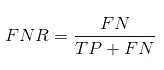

# AUC-ROC 曲线在机器学习中解释得很清楚

> 原文：<https://medium.com/analytics-vidhya/auc-roc-curve-in-machine-learning-clearly-explained-1849b3fa4bfc?source=collection_archive---------21----------------------->

# AUC-ROC 曲线——明星选手！


你已经建立了你的机器学习模型——那么下一步是什么？您需要评估它并验证它有多好(或多坏)，这样您就可以决定是否实现它。这就是 AUC-ROC 曲线出现的原因。

这个名字可能有点拗口，但它只是说我们正在计算“受试者特征算子”(ROC)的“曲线下面积”(AUC)。迷茫？我感觉到你了！我曾处于你的地位。但是不要担心，我们将看到这些术语的详细含义，一切都将是小菜一碟！


现在，只需要知道 AUC-ROC 曲线有助于我们可视化我们的机器学习分类器的表现。虽然它只适用于二元分类问题，但我们将在最后看到如何扩展它来评估多类分类问题。

我们还将涵盖敏感性和特异性等主题，因为这些是 AUC-ROC 曲线背后的关键主题。

我建议浏览一下关于 [*混淆矩阵*](https://www.analyticsvidhya.com/blog/2020/04/confusion-matrix-machine-learning/?utm_source=blog&utm_medium=auc-roc-curve-machine-learning) *的文章，因为它会介绍一些我们将在本文中用到的重要术语。*

# 目录

*   什么是敏感性和特异性？
*   预测概率
*   什么是 AUC-ROC 曲线？
*   AUC-ROC 曲线是如何工作的？
*   Python 中的 AUC-ROC
*   多类分类的 AUC-ROC

# 什么是敏感性和特异性？

这是混乱矩阵的样子:


从混淆矩阵中，我们可以得出一些在前一篇文章中没有讨论的重要指标。下面就来说说他们。

# 敏感度/真阳性率/召回率


敏感度告诉我们有多少比例的积极类被正确分类。

一个简单的例子是确定模型正确检测到的实际病人的比例。

# 假阴性率



假阴性率(FNR)告诉我们被分类器错误分类的阳性类的比例。

较高的 TPR 和较低的 FNR 是理想的，因为我们想要正确地分类阳性类别。

# 特异性/真阴性率


特异性告诉我们有多少比例的负类被正确分类。

以灵敏度为例，特异性意味着确定被模型正确识别的健康人的比例。

# 假阳性率


FPR 告诉我们被分类器错误分类的负面类别的比例。

较高的 TNR 和较低的 FPR 是可取的，因为我们想要正确地分类负类。

在这些指标中，**灵敏度**和**特异性**可能是最重要的，我们将在后面看到如何使用它们来构建评估指标。但在此之前，我们先了解一下为什么预测的概率比直接预测目标类要好。

# 预测概率

可以使用机器学习分类模型来直接预测数据点的实际类别，或者预测其属于不同类别的概率。后者让我们对结果有更多的控制。我们可以确定自己的阈值来解释分类器的结果。这有时比仅仅构建一个全新的模型更加谨慎！

为数据点的正类分类设置不同的阈值会无意中改变模型的灵敏度和特异性。其中一个阈值可能会给出比其他阈值更好的结果，这取决于我们的目标是降低假阴性还是假阳性的数量。

请看下表:


度量随着阈值的变化而变化。我们可以生成不同的混淆矩阵，并比较我们在上一节中讨论的各种度量。但这样做并不明智。相反，我们可以做的是在这些指标之间生成一个图，这样我们就可以很容易地看到哪个阈值给了我们更好的结果。

AUC-ROC 曲线正好解决了这个问题！

# 什么是 AUC-ROC 曲线？

**受试者操作者特征(ROC)** 曲线是二元分类问题的评价尺度。这是一条概率曲线，它绘出了在不同阈值下 **TPR** 与 **FPR** 的关系，并且基本上**将“信号”与“噪声”**分开。曲线下的**面积(AUC)** 是分类器区分类别的能力的量度，并用作 ROC 曲线的总结。

> *AUC 越高，模型区分阳性和阴性类别的性能越好。*


当 AUC = 1 时，分类器能够完全正确地区分所有阳性和阴性类点。然而，如果 AUC 为 0，那么分类器将预测所有阴性为阳性，所有阳性为阴性。


当 0.5


当 AUC=0.5 时，则分类器不能区分正类点和负类点。这意味着分类器预测所有数据点的随机类别或恒定类别。

因此，分类器的 AUC 值越高，其区分阳性和阴性类别的能力就越强。

# AUC-ROC 曲线是如何工作的？

在 ROC 曲线中，较高的 X 轴值表示假阳性的数量高于真阴性。而较高的 Y 轴值表示较高数量的真阳性而非假阴性。因此，阈值的选择取决于平衡假阳性和假阴性的能力。

让我们更深入一点，了解不同阈值下我们的 ROC 曲线会是什么样子，特异性和敏感性会如何变化。


我们可以通过为对应于阈值的每个点生成混淆矩阵来尝试和理解该图，并讨论我们的分类器的性能:


A 点是灵敏度最高而特异性最低的地方。这意味着所有的正类点被正确分类，而所有的负类点被错误分类。

> *实际上，蓝线上的任何一点对应的都是真阳性率等于假阳性率的情况。*
> 
> *该线以上的所有点对应于属于正类的正确分类点的比例大于属于负类的错误分类点的比例的情况。*


虽然 B 点与 A 点具有相同的敏感性，但它具有更高的特异性。这意味着与先前的阈值相比，不正确的负类点的数量较低。这表明这个阈值优于前一个阈值。


在 C 点和 D 点之间，对于相同的特异性，C 点的灵敏度高于 D 点。这意味着，对于相同数量的错误分类的负类点，分类器预测到更高数量的正类点。所以 C 点的阈值比 d 点好。

现在，根据我们的分类器能容忍多少错误分类的点，我们将在点 B 或 C 之间选择，来预测你是否能在 PUBG 中击败我。

> "虚幻的希望比恐惧更危险。"-托尔金


E 点是特异性最高的地方。意味着没有被模型分类的假阳性。模型可以正确分类所有的负类点！如果我们的问题是向用户提供完美的歌曲推荐，我们会选择这一点。

按照这种逻辑，你能猜出对应于完美分类器的点在图上的位置吗？

是啊！它将位于 ROC 图的左上角，对应于笛卡尔平面中的坐标(0，1)。正是在这里，灵敏度和特异性都是最高的，并且分类器将正确地分类所有的正类点和负类点。

# 理解 Python 中的 AUC-ROC 曲线

现在，我们可以手动测试每个阈值的灵敏度和特异性，或者让 [sklearn](https://www.analyticsvidhya.com/blog/2020/02/everything-you-should-know-scikit-learn/?utm_source=blog&utm_medium=auc-roc-curve-machine-learning) 为我们做这项工作。我们肯定要选后者！

让我们使用 sklearn make_classification 方法创建我们的任意数据:

我将在这个数据集上测试两个分类器的性能:

Sklearn 有一个非常有效的方法 roc_curve()，它可以在几秒钟内为您的分类器计算 roc！它返回 FPR、TPR 和阈值:

可以使用 sklearn 的 roc_auc_score()方法计算 AUC 分数:

```
0.9761029411764707 0.9233769727403157
```

我们还可以使用 [matplotlib](https://www.analyticsvidhya.com/blog/2020/02/beginner-guide-matplotlib-data-visualization-exploration-python/?utm_source=blog&utm_medium=auc-roc-curve-machine-learning) 绘制两种算法的 ROC 曲线:


从图中明显看出，逻辑回归 ROC 曲线的 AUC 高于 KNN ROC 曲线的 AUC。因此，我们可以说，逻辑回归在对数据集中的正类进行分类方面做得更好。

# 多类分类的 AUC-ROC

就像我之前说的，AUC-ROC 曲线只针对二元分类问题。但是我们可以通过使用“一个对全部”技术将它扩展到多类分类问题。

因此，如果我们有三个类 0、1 和 2，则类 0 的 ROC 将被生成为分类 0 而不是 0，即 1 和 2。类别 1 的 ROC 将生成为分类 1 而非 1，依此类推。

多类分类模型的 ROC 曲线可以确定如下:


# 结束注释

我希望您发现这篇文章有助于理解 AUC-ROC 曲线度量在衡量分类器性能方面有多么强大。在行业中，甚至在数据科学或机器学习黑客马拉松中，你会经常用到这一点。最好熟悉一下！

更进一步，我向您推荐以下课程，这些课程将有助于培养您的数据科学洞察力:

*   [数据科学导论](https://courses.analyticsvidhya.com/courses/introduction-to-data-science-2?utm_source=blog&utm_medium=auc-roc-curve-machine-learning)
*   [应用机器学习](https://courses.analyticsvidhya.com/courses/applied-machine-learning-beginner-to-professional?utm_source=blog&utm_medium=auc-roc-curve-machine-learning)

您也可以在我们的移动应用程序上阅读这篇文章


*原载于 2020 年 6 月 15 日 https://www.analyticsvidhya.com*[](https://www.analyticsvidhya.com/blog/2020/06/auc-roc-curve-machine-learning/)**。**