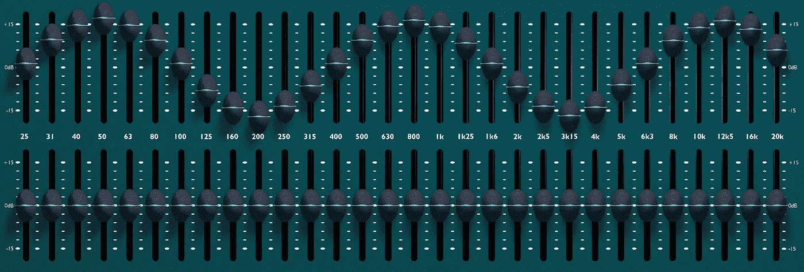
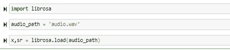
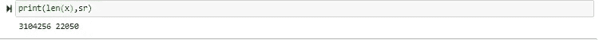
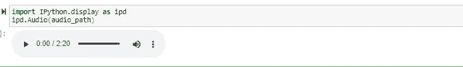
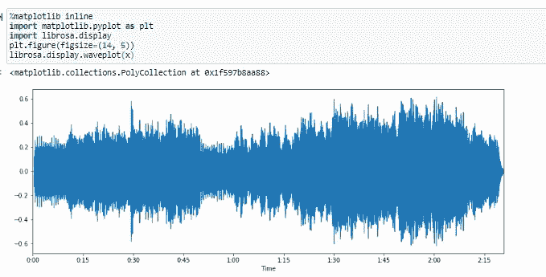
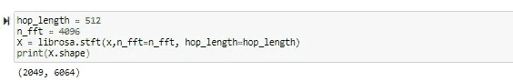
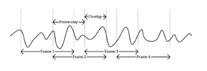
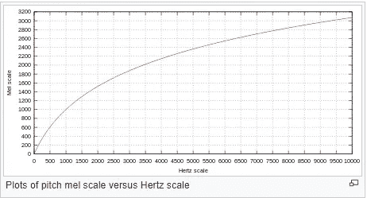
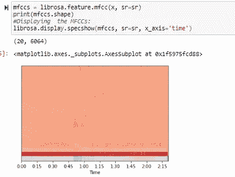

# 音频数据处理—特征提取—背后的基本科学和概念—第二部分

> 原文：<https://medium.com/analytics-vidhya/audio-data-processing-feature-extraction-essential-science-concepts-behind-them-part-2-9c738e6a7f99?source=collection_archive---------8----------------------->

音频处理—第 2 部分，src — [链接](https://pro.harman.com/insights/enterprise/education/types-of-audio-processing-a-primer/)

注意:本系列的第 1 部分详细解释了这些概念，可在[这里](/analytics-vidhya/audio-data-processing-feature-extraction-science-concepts-behind-them-be97fbd587d8)找到。

在之前的[部分](/analytics-vidhya/audio-data-processing-feature-extraction-science-concepts-behind-them-be97fbd587d8)，我们已经详细了解了与音频数据处理相关的各种理论概念。在这篇文章中，我们将直接进入处理方面，看看如何从音频文件中提取特征。

让我们直接开始加载音频文件，为此我们将使用著名的“librosa”库。

如您所见，我们已经导入了库并加载了音频文件。加载时，load 函数返回 2 个值——x 和 sr。

这里，“x”对应于音频中捕获的样本数，“sr”对应于采样率(每秒采样的振幅数)。

让我们看看“x”和“sr”的值。

音频文件中的样本数是 3104256，采样率是 22050。

让我们找出音频文件的持续时间:

> *音频持续时间=样本数/采样率= 3104256/22050 = 140.78 秒*

根据我们的计算，音频文件持续时间应该是 140 秒。让我们核实一下。是的，它是 140 秒(2 分 20 秒，如下所示)。

现在，让我们绘制音频文件的波形图，这是振幅与时间的关系图。

看起来不错，但在我们之前的文章中，我们已经研究过音频信号是三维的，还有一个重要的维度叫做频率。

如何从这个图中提取不同波信号的频率？你们还记得我们在上一篇文章中详细讨论的快速傅立叶变换(FFT)吗？。

让我们应用 FFT 并提取频率相关信息。Librosa 有一个强大的 api 来应用 FFT，只需几行代码就能提取频率，如下所示:

等等！！！我们将“x”值(音频文件中的总帧数)传递给 librosa 的“stft”函数，它提供了一些 2D 矩阵作为具有某些维度的输出。发生了什么事？！？！

这是它变得有点颠簸的地方。让我解释一下这里发生了什么。

正如您所观察到的，这是一个 140 秒的音频剪辑，我们无法一次将整个音频传递给 FFT 函数。这对于计算来说太多了。因此，我们需要将音频剪辑分割成不同的恒定帧长的窗口，并对它们进行累积处理。我们称这个长度为“窗口长度”。

因为它是一个音频文件，并且为了在处理时保持连续性，我们让来自后续窗口的一些帧彼此重叠，并且每个窗口处理的帧的实际唯一计数被称为“跳跃长度”。

如此处所示，每个窗口都包含“跳跃长度”+“重叠窗口”的帧数。

让我们回到我们的数据和计算。我们有一个持续时间为 140 秒和 3104256 帧的音频文件。一旦我们将它馈送到 FFT，其中“hop_length”为 512,“n _ FFT”为 4096，我们就获得了(2049，6064)维的结果。

这里，“2049”对应于(1 + n_fft/2)的值，即(1 + (4096/2))。

类似地，在结果中,“6064”对应于(“总帧数”/“hop _ length”四舍五入到最接近的 2 的幂)，在我们的例子中是(3104256/512=6063)。

**梅尔频率倒谱系数(MFCC)**

那些处理音频处理的人可能会遇到 MFCC 系数，但它们是什么呢？在到达那里之前，我们需要了解什么是‘梅尔标度’。

如你所知，人类的听觉范围只有 20Hz-20KHz 之间。对于大多数音频处理应用来说，不在这个范围内的任何声波都不是关键的。因此，相对于其他声波而言，属于这个范围的声波需要特别考虑。此外，与识别“10100 Hz”和“10200 Hz”之间的差异相比，人类听到“100 Hz”和“200Hz”声波之间的差异的感知要高得多，尽管 Hz 值的差异是相同的。

因此，mel 标度是一种非线性变换标度，它将音频的频率范围变换到不同的值范围，其差异对于最终用户来说听起来是相同的，与值无关。

考虑到这一点，用 mel 比例变换处理我们的音频会更有意义，我们可以用下面的代码将我们的音频转换成“mfcc”系数:

这里输出的维数是(20，6064)。值 6064 已经用值‘hop _ length’以相同的方式计算，而 20 行对应于与音频文件的频率范围相对应的各种系数范围。

你可以在这里找到描述上述解释[的代码。](https://github.com/VVasanth/MachineLearning/blob/master/AudioDataProcessing/AudioProcessing_Part2.ipynb)

关于音频处理的 2 部分系列到此结束。

请随时评论您的疑问，祝您学习愉快！！

参考资料:

 [## mfcc

### 信号的 mel 倒谱系数(MFCCs)是一个很小的特征集(通常大约 10-20 ),它…

musicinformationretrieval.com](https://musicinformationretrieval.com/mfcc.html)  [## MFCC 虚拟指南

### 免责声明 1:这篇文章只是一个 MFCC 功能的介绍，是为那些需要一个简单和…

medium.com](/prathena/the-dummys-guide-to-mfcc-aceab2450fd)