# 音频数据处理—特征提取—基础科学及其背后的概念—第一部分

> 原文：<https://medium.com/analytics-vidhya/audio-data-processing-feature-extraction-science-concepts-behind-them-be97fbd587d8?source=collection_archive---------4----------------------->

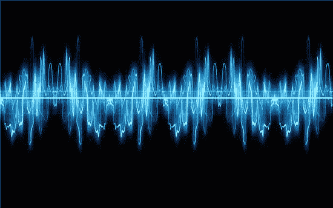

音频信号处理— [src](https://www.eeweb.com/quizzes/audio-signal-processing)

注意:本系列的第 2 部分有工作代码解释，可在[这里](/analytics-vidhya/audio-data-processing-feature-extraction-essential-science-concepts-behind-them-part-2-9c738e6a7f99)找到。

互联网上有很多有用的博客，解释了针对深度学习的各种应用的特征提取活动处理音频数据背后的概念。这些博客信息量很大，但我还是学到了关于音频文件中特征提取过程的新东西，这个博客系列是为了向其他爱好者总结这些理解。

首先，与图像处理相比，音频信号处理的概念有点复杂，因为可视化音频数据不像图像那样容易。然而，这个概念非常相似，python 中有非常强大的库，比如 librosa——它为我们完成了大部分任务。本文使用的 Python 笔记本可以在[这里](https://github.com/VVasanth/MachineLearning/tree/master/AudioDataProcessing)找到。

音频背后的理论

让我们从一些理论开始，什么是声波？声波是每当任何声音发生时空气分子的振动，声音以波的形式从发出者传播到接收者。

因此，这种波有 3 个属性——振幅、频率和时间。

→振幅代表波信号的大小，通常以分贝(dB)为单位。

→时间就是时标，我们都知道。

→频率代表波在一秒钟内经历的完整周期数，单位为 Hz。

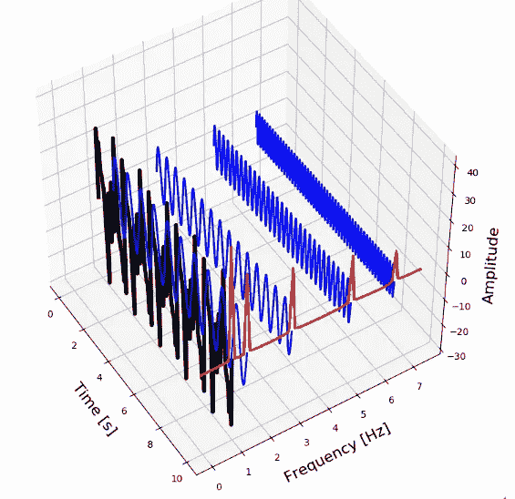

音频波的 3D 视图。 [src](http://ataspinar.com/2018/04/04/machine-learning-with-signal-processing-techniques/)

每个生物都有不同的声波听觉范围。我们(人类)可以听到 20 赫兹到 20，000 赫兹范围内的声波。狗可以听到高达 45K Hz 的声波，海豚可以听到 150K Hz。

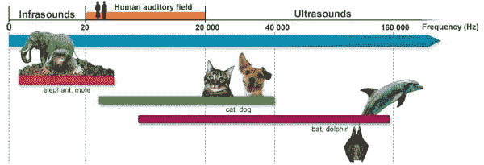

不同动物的听觉范围。 [src](http://www.cochlea.org/en/hear/human-auditory-range)

由于人类听觉范围约为 20K Hz，许多库中音频文件的采样率默认设置为每秒 22050 次。我们可以根据需要增加/减少它。

等等，首先，什么是音频采样速率？假设你有一台录音机，正在播放一首音乐，你想把它录下来。注意:音频波本质上是连续的，但我们的大多数处理引擎都是为处理数字/离散信号而设计的。

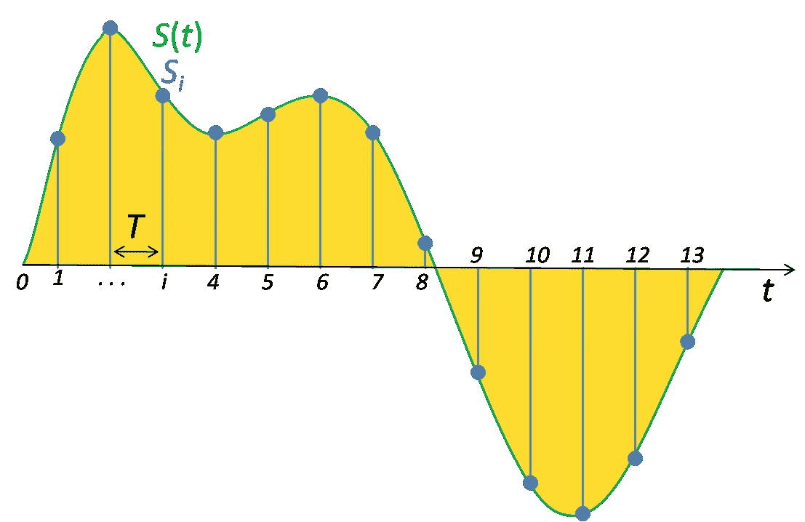

采样率。

开始录音时，录音机会以非常高的速率记录音频信号的幅度，范围为每秒 22K 值。假设您已经录制了 5 秒钟的音频，那么音频文件将包含(22K * 5)个录制信号的幅度值。因此，采样率对应于每秒记录这些音频波的速率。

此外，请注意，我们处理的声波通常是 1000 个独立波信号的组合，每个信号的频率都不同。客观地说，假设你正在听一场音乐会，吉他、鼓和键盘乐器一前一后地演奏。当我们录制这种音频时，每种乐器都会产生不同的音频波，我们听到的是由各种乐器产生的 1000 个单个音频波的合并音频波。

在处理音频数据时，该合并的音频波将被分离成其各自频率的单独的波。这个过程对于在三维(振幅、频率和时间)中观察音频波非常关键，并且为此目的使用了“**快速** **傅立叶变换(FFT)** ”的概念。我们不会深入讨论什么是“傅立叶变换”的理论，但我们会在下一节看到它有多强大。

理论已经讲得够多了，让我们研究几个波浪数据来理解上面的概念。为了理解“快速傅立叶变换”的概念，这个[博客](https://towardsdatascience.com/understanding-audio-data-fourier-transform-fft-spectrogram-and-speech-recognition-a4072d228520)包含了很好的解释——我将用我的语言和代码复制同样的内容。

让我们生成一个频率为 3Hz、幅度为 1 单位的简单正弦波，如下所示:

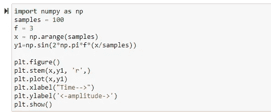

Python 代码生成频率为 3 Hz 的正弦波

这将产生正弦波，如下所示:

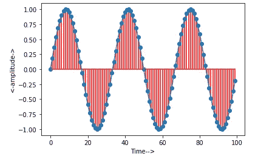

如上所述，FFT 用于获得给定波的频率和幅度。让我们使用 sklearn 编写从上述波形中提取频率的函数:

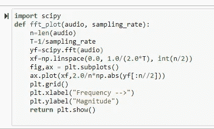

当我们将上述波值传递到这个“fft_plot”函数中时，它将识别波的频率和大小。

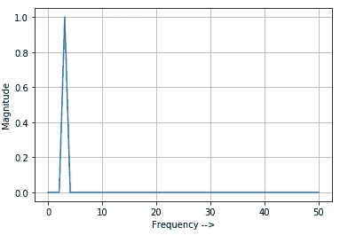

由“fft_plot”功能识别的频率值

您可以使用不同的频率值和幅度值来尝试相同的函数，并观察“fft_plot”函数是否能正确识别频率值。

现在，让我们假设你有一个声波，它是两个波的组合，我们想看看“FFT”如何帮助我们。让我们继续。

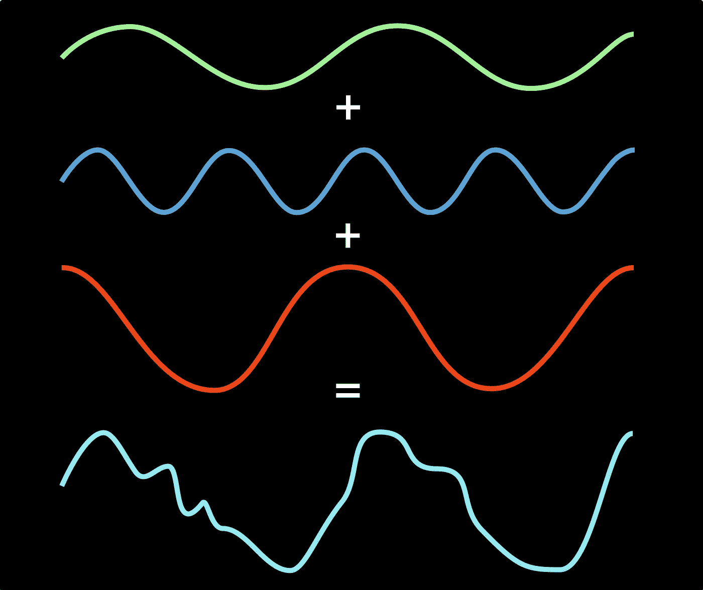

快速傅里叶变换

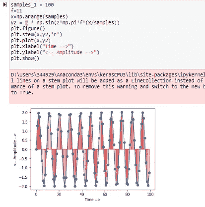

产生频率为 11Hz、幅度为 2 个单位的正弦波。一旦生成，正弦波将看起来像这样。

现在将两个正弦波相加，得到合并的正弦波。合并的正弦波看起来如下所示。

合并正弦波:

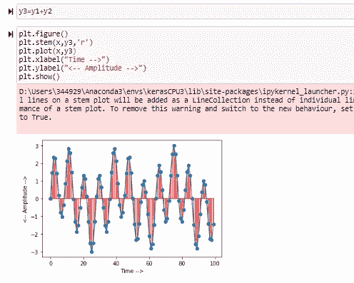

两个不同频率的合并正弦波

一旦我们馈入合并波，FFT 函数将帮助我们分离两个波，并找到各自波的频率，如下所示:

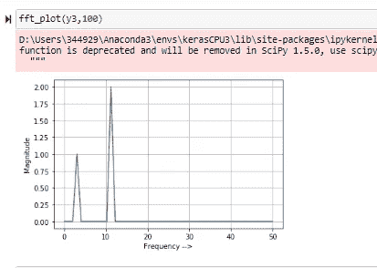

FFT 有助于识别合并波中出现的单个波的频率

如前所述，我们听到的实时声音是 1000 个单个波的组合，通过应用 FFT，我们可以将它们提取到各自的频率。让我们在实时音频上试试这个。

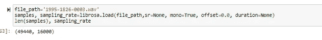

当我们在 wave plt 上绘制音频时，这是音频波形的样子:

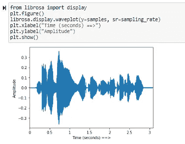

实时样本音频波形图

现在，让我们将该音频波传递给 FFT 函数，观察该音频包含多少个单独的频率波:

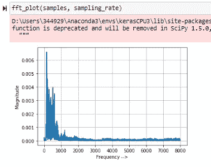

样本音频波的 FFT 输出

正如您在上面的图中观察到的，FFT 函数已经识别了给定音频中的 8000 多个单独的波，其中 100–1000hz 范围内的波具有较高的幅度。

总结一下:

→每个声波都有 3 个不同的维度——振幅、频率和时间。

→我们听到的实时音频是数千个独立声波的组合。

→为了处理音频文件，我们需要处理三维音频数据。

→傅里叶变换用于从合并波中提取单个波的信息。

提取频率信息后，我们可以使用声谱图以 3D 形式显示声波，如下所示:

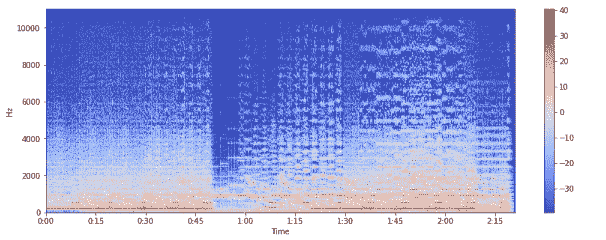

音频文件的样本频谱图

这是该系列的第 1 部分，在下一篇文章中，我们将详细讨论 Mel 频率系数以及音频数据在特征提取过程中是如何转换的。请小心。谢谢！

参考资料:

 [## 了解音频数据、傅立叶变换、FFT、频谱图和语音识别

### 使用 python 进行音频数据分析(声音分析)的介绍

towardsdatascience.com](https://towardsdatascience.com/understanding-audio-data-fourier-transform-fft-spectrogram-and-speech-recognition-a4072d228520)  [## 提取音乐特征

### 特征提取是机器学习的重要组成部分。我们将在这里提取音乐的特征，并将使用它…

towardsdatascience.com](https://towardsdatascience.com/extract-features-of-music-75a3f9bc265d)