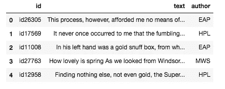

# 使用双向 LSTM 和 Keras 的作者(多类文本)分类

> 原文：<https://medium.com/analytics-vidhya/author-multi-class-text-classification-using-bidirectional-lstm-keras-c9a533a1cc4a?source=collection_archive---------2----------------------->

使用双向递归神经网络的多类文本分类，长短期记忆，Keras & Tensorflow 2.0。


[https://nlpforhackers . io/WP-content/uploads/2016/08/text-classification . png](https://nlpforhackers.io/wp-content/uploads/2016/08/text-classification.png)

# 目标:

在本文中，我们将了解 LSTM 网络的基本架构。然后我们将学习如何使用 Tensorflow 2.0 和 Keras 构建 LSTM 机器学习模型。对于这个应用程序，我们将使用来自 Kaggle 的竞争数据集。

# 让我们开始:

**T3【递归神经网络:**

递归神经网络(RNN)是一种神经网络，其中前一步的输出作为输入馈送到当前步骤。这是一种处理连续数据(语音数据、音乐、文本中的单词序列)的短期记忆。这是一个示例架构图。


来源:[https://doi.org/10.1371/journal.pone.0180944.g004](https://doi.org/10.1371/journal.pone.0180944.g004)

***优点:***

i) RNN 有一种记忆，能捕捉到迄今为止已经计算过的东西。

ii)rnn 是文本和语音数据分析的理想选择。

***缺点:***

i) RNN 遭受爆炸和消失梯度，这使得 RNN 模型通过向后传播更少量的误差而学习得更慢。

ii)这对于短句很有效，当我们处理一篇长文章时，会有一个长期依赖问题

***【长短期记忆】(LSTM) :***

长短期记忆网络通常简称为“LSTM”——是一种特殊的 RNN。它能够学习长期依赖性。它是由[hoch Reiter&schmid Huber(1997)](http://www.bioinf.jku.at/publications/older/2604.pdf)介绍的。LSTM 的设计明确避免了长期依赖问题。

***建筑:***

LSTM 有重复 LSTM 街区的链条。它被称为 LSTM 细胞。每个 LSTM 细胞有四个神经网络层相互作用。

1.  细胞状态
2.  忘记大门
3.  输入门
4.  输出门

每个 LSTM 单元接收来自输入序列的输入、先前的单元状态和来自先前的 LSTM 单元的输出。


来源:[https://www . researchgate . net/publication/334360853/figure/fig 1/AS:778955447599106 @ 1562728859405/The-LSTM-cell-internals . png](https://www.researchgate.net/publication/334360853/figure/fig1/AS:778955447599106@1562728859405/The-LSTM-cell-internals.png)

***双向 LSTM***

双向 LSTM 在输入序列上训练两层。输入序列上的一个 LSTM 层和输入序列的反向副本上的第二个 LSTM 层为学习序列提供了更多的上下文:

# 让我们开始编码:

现在我们将解决一个基于文本文档的作者分类问题。

***数据描述:***

这是一个 Kaggle 竞赛数据集，包含由公共领域的幽灵作者写的小说作品的文本:埃德加·爱伦·坡，惠普·洛夫克拉夫特和玛丽·雪莱。这些数据是通过使用 CoreNLP 的 MaxEnt 句子标记器将较大的文本分成句子来准备的，所以我们可能会注意到这里和那里奇怪的非句子。我们的目标是准确识别测试集中句子的作者。

数据来源:【https://www.kaggle.com/c/spooky-author-identification/data 

***导入所有需要的库***

在开始编写代码之前，让我们导入所有需要的库。

```
import pandas as pd
import numpy as np
import matplotlib.pyplot as plt
from nltk.tokenize import word_tokenize
from nltk.stem import WordNetLemmatizer
from nltk.stem import PorterStemmer
from tqdm import tqdm
from keras.models import Sequential
from keras.layers.recurrent import LSTM, GRU
from keras.layers.core import Dense, Activation, Dropout
from keras.layers.embeddings import Embedding
from keras.layers.normalization import BatchNormalization
from keras.utils import np_utils
from keras.layers import GlobalMaxPooling1D, Conv1D, MaxPooling1D, Flatten, Bidirectional, SpatialDropout1D
from sklearn.model_selection import train_test_split
from keras.preprocessing import sequence
from keras.preprocessing.text import Tokenizer
from keras.callbacks import EarlyStopping
import matplotlib.pyplot as plt
from nltk.corpus import stopwordsstop_words = stopwords.words('english')import tensorflow as tf
print(tf.__version__)
```


我们正在导入用于数组操作的 NumPy 和用于处理数据的 pandas。还从 nltk 库中导入 PorterStemmer 和 WordNetLemmatizer 进行数据预处理。还导入了用于开发我们的 Keras 模型的基本库。

***加载数据:***

```
df = pd.read_csv(‘/kaggle/input/author-classify/train.csv’)
```

现在我们将看到一些示例数据行。

```
df.head()
```



现在，我们将检查我们的数据中有多少独特的作者。

```
df.author.unique()
```


所以我们的标签数据集中只有三个作者。

让我们检查数据集的其他基本细节。

```
df.info()
```


因此，我们总共有 19579 个条目没有空值。太棒了。

***数据预处理:***

在继续之前，我们将做一些数据清理和预处理。有几种数据预处理技术，

I)删除停用词、标点符号、URL 等。

ii)俚语查找

iii)转义 html 条目。

iv)拼写纠正

v)引理满足

六)词干

这里我们只应用词汇化和词干化。其余的事情你可以自己尝试。

将所有文本转换成小写。

```
df[‘text’]=df[‘text’].str.lower()
```

***词汇化:***

```
def getLemmText(text):
 tokens=word_tokenize(text)
 lemmatizer = WordNetLemmatizer()
 tokens=[lemmatizer.lemmatize(word) for word in tokens]
 return ‘ ‘.join(tokens)df[‘text’] = list(map(getLemmText,df[‘text’]))
```

***炮泥:***

```
def getStemmText(text):
    tokens=word_tokenize(text)
    ps = PorterStemmer()
    tokens=[ps.stem(word) for word in tokens]
    return ' '.join(tokens)df['text'] = list(map(getStemmText,df['text']))
```

现在，我们将数据分为训练集和测试集。我们将使用 scikit-learn 的 model_selection 模块中的 train_test_split 来完成。在这里，我们将以这样的方式分割数据，2/3 的数据行将用作训练数据，1/3 的数据行将用于验证模型。

```
xtrain, xtest, ytrain, ytest = train_test_split(
 df[‘text’], df[‘author’], 
 test_size=0.33, 
 random_state=53)print(xtrain.shape)
print(xtest.shape)
print(ytrain)
```


***定义超参数:***

现在我们将定义我们的超参数。我们有六个重要的超参数。

```
EMBEDDING_DIMENSION = 64
VOCABULARY_SIZE = 2000
MAX_LENGTH = 100
OOV_TOK = '<OOV>'
TRUNCATE_TYPE = 'post'
PADDING_TYPE = 'post'
```

“EMBEDDING_DIMENSION:它定义了我们的向量的嵌入维数。

“VOCABULARY_SIZE”:它定义了 tokenizer 中的最大字数。

“MAX_LENGTH”:定义每个句子的最大*长度，包括填充。*

“OOV _ 托克”:这是在遇到一个看不见的单词时放入一个特殊的值

***标记化:***

下一步是对我们的数据进行标记化，并从中构建 word_index。我们将使用 Keras Tokenizer。在我们的例子中，需要 2000 个最常见的单词。我们将为那些不在`word_index`中的单词加上<00V>。`fit_on_text.`

```
tokenizer = Tokenizer(num_words=VOCABULARY_SIZE, oov_token=OOV_TOK)
tokenizer.fit_on_texts(list(xtrain) + list(xtest))
```

下一步是将这些标记转换成序列列表。我们将使用 *texts_to_sequences()* 方法来做到这一点。所以，我们的单词字典会是这样的。

```
xtrain_sequences = tokenizer.texts_to_sequences(xtrain)
xtest_sequences = tokenizer.texts_to_sequences(xtest)
word_index = tokenizer.word_index
print('Vocabulary size:', len(word_index))
dict(list(word_index.items())[0:10])
```


下面是已经变成序列的训练数据中的第 101 篇。

```
print(xtrain_sequences[100])
```


***填充:***

现在，我们将添加填充到我们的数据，使其统一。Keras 通过使用 pad_sequences 函数使填充数据变得很容易。我们将在应用填充后打印第 101 个文档。

```
xtrain_pad = sequence.pad_sequences(xtrain_sequences, maxlen=MAX_LENGTH, padding=PADDING_TYPE, truncating=TRUNCATE_TYPE)
xtest_pad = sequence.pad_sequences(xtest_sequences, maxlen=MAX_LENGTH, padding=PADDING_TYPE, truncating=TRUNCATE_TYPE)print(len(xtrain_sequences[0]))
print(len(xtrain_pad[0]))
print(xtrain_pad[100])
```


然后我们对验证序列做同样的事情。

```
label_tokenizer = Tokenizer()
label_tokenizer.fit_on_texts(list(ytrain))training_label_seq = np.array(label_tokenizer.texts_to_sequences(ytrain))
test_label_seq = np.array(label_tokenizer.texts_to_sequences(ytest))
print(training_label_seq[0])
print(training_label_seq[1])
print(training_label_seq[2])
print(training_label_seq.shape)
```


在训练一个深度神经网络之前，我们应该探索一下我们的原始文本和填充后的文本是什么样子的。

```
reverse_word_index = dict([(value, key) for (key, value) in word_index.items()])
def decode_article(text):
 return ‘ ‘.join([reverse_word_index.get(i, ‘?’) for i in text])
print(decode_article(xtrain_pad[11]))
```


***长短期记忆的实现(LSTM):***

我们完成了数据预处理和单词嵌入。现在我们将创建一个序列模型，嵌入一个 LSTM 层。

***模型初始化:***

```
model = Sequential()
model.add(Embedding(len(word_index) + 1,
                     EMBEDDING_DIMENSION))
model.add(SpatialDropout1D(0.3))
model.add(Bidirectional(LSTM(EMBEDDING_DIMENSION, dropout=0.3, recurrent_dropout=0.3)))
model.add(Dense(EMBEDDING_DIMENSION, activation='relu'))
model.add(Dropout(0.8))model.add(Dense(EMBEDDING_DIMENSION, activation='relu'))
model.add(Dropout(0.8))model.add(Dense(3))
model.add(Activation('softmax'))
model.compile(loss='sparse_categorical_crossentropy', optimizer='adam',metrics=['accuracy'])
```

***模特培训:***

```
num_epochs = 10
history = model.fit(xtrain_pad, training_label_seq, epochs=num_epochs, validation_data=(xtest_pad, test_label_seq), verbose=2)
```


***模型评估:***

```
def graph_plots(history, string):
  plt.plot(history.history[string])
  plt.plot(history.history['val_'+string])
  plt.xlabel("Epochs")
  plt.ylabel(string)
  plt.legend([string, 'val_'+string])
  plt.show()

graph_plots(history, "accuracy")
graph_plots(history, "loss")
```


在下一篇文章中，我们将看到如何使用手套单词嵌入技术来构建一个 LSTM 模型。

参考资料:

我)[https://en.wikipedia.org/wiki/Recurrent_neural_network](https://en.wikipedia.org/wiki/Recurrent_neural_network)

二)[http://www.bioinf.jku.at/publications/older/2604.pdf](http://www.bioinf.jku.at/publications/older/2604.pdf)

三)[https://colah.github.io/posts/2015-08-Understanding-LSTMs/](https://colah.github.io/posts/2015-08-Understanding-LSTMs/)

iv)[https://en.wikipedia.org/wiki/Long_short-term_memory](https://en.wikipedia.org/wiki/Long_short-term_memory)

[https://en.wikipedia.org/wiki/Recurrent_neural_network](https://en.wikipedia.org/wiki/Recurrent_neural_network)