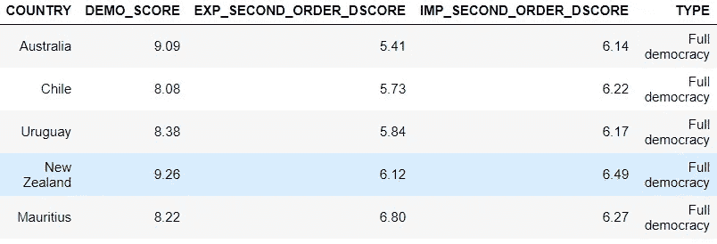

# 代理独裁:使用 Neo4j 和 Python 从贸易数据计算二阶民主指数

> 原文：<https://medium.com/analytics-vidhya/authoritarian-by-proxy-using-neo4j-and-python-to-calculate-second-order-democracy-indices-ccca92695d74?source=collection_archive---------10----------------------->


以下是一个小爱好项目的第一部分，我在儿子午睡时和我休陪产假的晚上玩得很开心。我开始使用它是为了更好地熟悉 Neo4j 和 Cypher 查询语言语法，但是我选择了用 Python 来做一个来回的排序，以展示一起使用它们是多么容易和强大。鉴于可能还有其他人有类似的兴趣，我认为尝试用一种相对简洁的形式来介绍它是值得的。

**这将不是一个“Neo4j 基础介绍”或 Cypher 查询语言**的基础。然而，我们将看到如何从 Python 用 Neo4j 构建图的**示例，如何从 Python(和 Neo4j) **运行带有查询结构注释**的 **Cypher 查询**，以及如何**用图中的计算值**更新现有节点。
除了学习一些关于 Neo4j/Cypher 的知识，**在这个过程中还会有一些有趣的发现**(至少对我来说是这样)，例如，当涉及到其对手的民主性时，专制政权比完全民主的政权更具异质性。
**完整笔记本** (wip)包含的代码比我下面要展示的多得多，这里**可用** [**这里**](https://github.com/Kenneth-HM-Nielsen/Neo4j) 。
最后，我解释了这里提出的**想法**如何**转化为公司的 ESG 分数和信用风险评估**。**

好了，关于我和我的动机已经说得够多了，我们到底要看什么？这和二阶民主分数有什么关系，我(指你)为什么要关心？如果你以前没听说过，民主分数/指数是由经济学人智库编制的指数，它试图根据五个类别(60 个基本因素)来衡量一个国家的民主程度。这五个类别是:选举进程和多元化、政府运作、政治参与、政治文化和公民自由。基于潜在的因素，每个类别被赋予一个 0 到 10 之间的值，取平均值，然后你就有了你的民主分数。

> 一件事是一个国家本身的民主分数，但它在世界上的作用呢？

现在，在我看来，一个国家可以凭借自身的权利变得如此民主，但如果它通过贸易帮助维持严酷的政权，或者严重依赖于同样的出口，那么这难道不值得考虑吗？这让我想到“为什么我们不构建一个二阶民主指数来反映这一点？”这个分数自然可以告诉我们，哪些国家应该/可以对哪些政权施加影响。但是它也可以用来识别那些更容易受到潜在不稳定政府规则影响的国家。(通过添加关于交换哪些商品的信息，我们可以分析哪些商品最容易受到影响，例如，石油成为不太重要的商品。为了得出这个分数，我深入到经济复杂性观察站的数据宝库中去寻找一长串国家的出口数据。这将结合我在 [wiki](https://en.wikipedia.org/wiki/Democracy_Index) 上找到的 2019 年最新民主得分，最终计算出二阶民主指数。(老实说，如果你以前没有看过 oec，我鼓励你去看一看，因为有很多很酷的数据和可视化。)

> **[……]以这种方式看待贸易模式，对于(民主)世界的其他国家来说，压力是如何施加的以及由哪个国家施加的更加透明**

基于我们将要看到的分数

*   如果不同体制类型之间的交易行为存在**差异，**
*   如果一些独裁政权非常依赖一群民主国家，那么这些民主国家就有机会以更民主的方式推动这个政权
*   哪些**民主国家**拥有**最不民主的对手**(贸易加权)

**下一次**，我们将使用 Neo4j 中可用的一些功能来确定**中心性和社区**，并且可能**将**一些**更多的数据**添加到组合中。

# 民主数据

我们首先检索一系列国家的民主分数信息。我实际上花了相当长的时间试图用美丽的汤做到这一点，但最终放弃并选择了熊猫的内置 read_html 函数。因此，如果任何人有一个很好的代码片段来做这件事，为 wiki 表提供漂亮的汤，也包含< li >元素，那么让我知道，因为我有其他类似项目的想法，这将是必要的！

```
democracy_rank = r’[https://en.wikipedia.org/wiki/Democracy_Index'](https://en.wikipedia.org/wiki/Democracy_Index')
demo_df = pd.read_html(democracy_rank, header=0)[2][:-1]
```

在进行一些基本的清理和操作(我将省去读者)以允许与 oec 数据合并之后，我们最终得到一个数据帧，其头部和尾部如下所示


我们看到**诺威**被评为**最民主的国家**其次是冰岛，而**朝鲜被淘汰**，刚果民主共和国紧随其后。除了完全民主和威权政府，还有缺陷民主和混合政体。
我们可以在“地区”栏中进行分组，然后**看看不同地区在民主评分方面如何比较**，也就是说，我们确实如此

```
demo_df.groupby('Region[n 1]')['Score'].describe().reset_index()
```


我们看到北美(只包括加拿大和美国)的平均民主分数最高，而中东和北非最低。对基于地区的不同统治形式的快速计数给了我们一个提示，为什么平均分数会这样


快速浏览了民主得分数据后，现在让我们来看看贸易数据。

# 贸易数据

我们将在这里看到的数据可以在 oec 上找到，并且有一个 API 可以提供这些数据。基于我能找到的 python 库，我就是不能让它工作，并且看到我*真的*想要使用 Python 和 Neo4j 之间的接口，而不是花时间从 github repo 更新代码，我选择了老式的非常耗时的下载、解压缩和重命名 csv 文件的方式。不是很 2020 年(甚至 2014 年)，我知道！
随着我对分析什么的想法发生了变化，我希望收集数据的国家的列表逐渐包括了民主数据集中的所有国家。所以，事后看来，我真希望我花了更多的时间来研究这个 API。总之…
OEC 上找不到民主数据中的一些国家(反之亦然)。这些国家是卢森堡、博茨瓦纳、比利时、莱索托、纳米比亚和斯威士兰。在 oec 数据中，比利时和卢森堡似乎已经被添加到比利时-卢森堡中，但是由于我不能轻易地将这两个国家的值分开，所以我选择暂时不考虑它们。
**对于其余 161 个国家中的每一个，我们都有相对于其每个贸易伙伴的 2018 年美元出口额**—一个国家的**出口额**显然**是接收国的进口额**。
如果我们从图表的角度来看，这意味着在这 161 个国家中的每一个国家和它们所有的交易对手之间(其中一些我们没有民主评分),我们可以添加出口关系，或边，我们可以通过对特定交易对手的出口值来加权它们。但是我现在想得太多了。让我们看一看贸易数据


我们在这里看到交易数据中 221 行的前 5 行和总共 164 行的前 8 列。221 行，因为在贸易数据中有 221 个国家和地区。164 列，因为我们已经下载了 161 个国家的完整出口信息，我们有民主分数，加上三列“复杂性指数”，“国家 ID”和“国家”。
“export _ value _[country]”列应读作，例如，丹麦向日本出口价值~2*10⁹的美元。因此，当我们到达国家/地区列中包含丹麦的行时，Export_Value_Denmark 中的值将为零，就像我们在这里看到的德国一样。(顺便说一下，不要担心复杂性指数和国家 ID 列...)
贸易数据与民主数据相结合，我们准备好构建我们的图表了！

# 创建节点和关系

首先，您需要在 Neo4j 中设置并运行一个图形。我使用 Neo4j 的免费桌面版本，对于这个特殊的例子，我运行的服务器版本是 3.5.6。我将使用 [py2neo](https://py2neo.org/v4/index.html#) 与 Python 中的 Neo4j 进行交互。

```
from py2neo import Node, Relationship, Graph, Path
# Database Credentials
uri             = "bolt://localhost:7687"
userName        = "neo4j"
password        = "test"
# Connect to the neo4j database server
g = Graph("bolt://localhost:7687", auth=(userName, password))
```

现在我们可以开始使用 Node 方法创建节点。菜谱挺基础的，你做节点(<node_type>、 <key>= <value>、…、 <key>= <value>)。对于我们的数据集，我们将从创建国家节点开始，如下所示(df_cnt 是包含连接数据的 221 行数据帧)</value></key></value></key></node_type>

```
create_nodes = []
for i in range(df_cnt.shape[0]):
    node = Node('Country'
                , name=df_cnt['Country'][i]
                , country_id = df_cnt['Country ID'][i]
                , complexity_index = df_cnt['Complexity Index'][i]
                , democracy_score = df_cnt['Score'][i]
                , regime_type = df_cnt['Regime type'][i]
                )
    create_nodes.append(node)
```

如果我们从这里前往 Neo4j 并查看浏览器，我们将什么也看不到！这是因为，目前节点只存在于笔记本领域。我们必须使用 Graph 对象的 create 方法来编写它们，如下所示

```
for i in range(df_cnt.shape[0]):
    g.create(create_nodes[i])
```

现在，如果我们看 Neo4j，我们会看到类似这样的东西


在 Neo4j 中，如果您将鼠标悬停在其中一个节点上，您可以看到我们在创建它们时定义的其他属性。但是目前没有连接，这是意料之中的，因为我们还没有创建任何连接。
为了有一些不同的节点，我们还将根据给定国家所属的地区创建一些节点。然而，如前所述，贸易数据集中的一些国家不在我们获取区域信息的民主数据中。对于这些，我们将简单地指定区域= '未知'。政体类型也是如此。
要创建区域节点，我们只需运行

```
create_regions = []
for i in range(len(df_reg)):
    node = Node('Region'
                , name=df_reg[i])
    create_regions.append(node)
for i in range(len(df_reg)):
    g.create(create_regions[i])
```

有了数据库中的节点，我们可以使用 Graph 对象的 run 方法查询数据库。假设我们想找到安哥拉，并得到有关安哥拉的所有信息，那么我们会这样做

```
g.run("MATCH (a:Country {name:'Angola'}) RETURN a").data()
```

并接收


在上面的查询中，我们匹配了查找一个国家节点的非常简单的模式，我们将其分配给“a”，其中属性键“name”的值为“Angola ”,然后我们返回该节点上的所有内容。
接下来，我们将在图表中添加一些关系——现在它只包含国家和地区节点。
下面代码片段中的逻辑基本上是遍历国家列表中的每个国家，然后根据对这些国家的出口建立与所有其他国家的关系。

尘埃落定后，我们会发现我们的数据中有 22，846 个出口关系。让我们以五种出口关系为例，看看这种关系是如何建立的。运转

```
**list(np.random.choice(exp_rel, 5))**
```

返回


(重新运行它当然会返回一些不同的东西)。
我们看到的是格式为 start _ node-relationship->end _ node 的 Cypher 查询路径。节点用()表示，关系用[]表示，我们看到关系类型是“exports_to”，有两个关系关键字，“export_value”和“export_value_pct”。后者就是出口占出口国总出口的多少。
现在的问题是运行类似于我们为国家节点所做的 create 语句，并且关系也将出现在 Neo4j 中。我们也可以在其他地区做同样的事情，但是我不会在这里打扰你。

# 计算二阶民主分数

有了节点和关系之后，让我们首先做(在 Neo4j 浏览器中)

```
**MATCH (c: Country {regime_type: 'Full democracy'})-[:belongs_to]->(r:Region) RETURN c, r**
```

应该会回来


因此，这看起来就像我们预期的那样:我们有许多完全的民主国家以及它们所属的地区。**下一步是计算二阶民主分数**。(我们将实际计算两个不同的值，一个基于出口，一个基于进口。)**这就是将数据存储在图形数据库中开始真正获得回报的地方！**代码如下所示

一个国家的出口是另一个国家的进口。运行 res.head()返回


如果在 Neo4j 中直接执行代码，需要 277 毫秒。如果我们想在 Python 中做同样的事情，获得导出分数将是轻而易举的事情(参见下面的代码片段)。但是要获得导入分数需要做更多的工作(至少基于我对数据的组织方式)。
一种方法是按照 Export_Value_[country]列的排序方式对 Country 列进行排序，然后进行点积。在代码形式中，我们可能会以类似于

这总共需要大约 500 毫秒，比 Neo4j 中的查询需要更多的大脑活动。
酷，现在我们有了二阶分数，但是**为什么不更新图中的节点以包含该信息**，这样我们就可以在以后的查询中包含它？为此，我们执行(同时我们还对二阶分数进行四舍五入)

起作用的“词”是固定从句。运行之后，节点现在有了两个附加属性，即 EXP_SECOND_ORDER_DSCORE 和 IMP_SECOND_ORDER_DSCORE。

# 获得洞察力——贸易伙伴的民主化

分数确定后，让我们绘制进口与出口二阶分数，以了解国家和政府类型的分布情况


我们可以看到一种趋势，即完全民主国家的得分都在中上范围，而独裁政权的得分则更高。稍后，当我们分析二级分数是否存在统计学显著差异时，我们将回到这一点。

> 哪些完全民主国家的二阶出口民主得分最低？

我们还可以对完全民主的**的二阶出口(当然也包括进口)分数**进行排序，以找出**哪些国家最依赖不那么民主的对手**。如果我们返回五个最差的，我们看到



所以我们发现澳大利亚垫底，新西兰也在倒数五名之列。智利、乌拉圭和毛里求斯我并不感到惊讶，只是考虑到它们的地理位置和周边国家的分数。但是澳大利亚和新西兰让我有点吃惊。当你深入研究这些数据时，你会发现中国是这两个国家最大的出口市场——对澳大利亚来说，它是第二大出口市场的 3 倍，对新西兰来说，它是第二大出口市场的 1.5 倍。

> 有没有民主国家进口了专制政权的大部分出口商品？

接下来，我们可以**去寻找**是否有任何**完全或有缺陷的民主国家构成了某个威权国家出口的很大一部分**，因为我们希望这些对手方能够对该政权施加一些压力。然而，考虑到其他独裁政权也可能是主要的出口市场，简单地让所有国家从一个政权进口 x %可能会更好，我们将任意设置 x 为 10。为什么要包含这些信息？可以想象，这样一个政权可能会增加对拥有类似政府统治的国家的出口……
我们将执行的密码查询是

```
MATCH (a: Country {regime_type: 'Authoritarian'})-[e:exports_to]->(d:Country) WHERE e.export_value_pct>=10 RETURN a.name AS AUTHORITARIAN, e.export_value_pct, d.name as COUNTERPART, d.democracy_score as SCORE, d.regime_type as REGIME_TYPE ORDER BY AUTHORITARIAN, SCORE DESC
```

这方面的一个“问题”是，我们最好只与至少一个从独裁政权手中夺走 10 %以上出口的对手方是民主国家的情况合作。但在这里我们也看到了这种情况只适用于独裁和/或混合政权。为了补救这一点，在将数据加载到名为 df_t 的数据帧中之后，我简单地删除了 Python 中不需要的情况，如下所示

在代码的最后一行，我进一步限制了 df_t，以包含有缺陷的和完全的民主政体(从专制政体引入≥ 10 %)的情况...yadayadayada)共同构成了一个比专制贸易伙伴更大的出口市场。好吧！说了很多，让我们把“reset_index()”放进去，结果是


这里的名单上似乎有一些候选人，但在我们对这些专制国家可能转向更民主的方式抱太大希望之前，我们可能必须考虑他们到底在出口什么……在一些情况下，是石油、金属或钻石。进口这些商品的民主国家不想没有这些商品，这意味着他们可能不会太积极地努力改变专制国家的状况。
还有**交易在很多情况下是双向的，有某种程度的相互依赖**。(下一次我们将详细介绍，在处理相似性得分和其他图形算法时，我们将计算进/出关系，并将这些信息添加到我们的节点中。)因此，如果这个民主国家威胁要减少进口，那么这一举措很可能会得到回报。
说了这么多，我仍然认为**以这种方式看待贸易模式，对(民主)世界的其他国家来说，如何施加压力以及由哪个国家施加压力更加透明**。接下来，其他民主国家应该支持那些施加压力的国家。

> **完全民主政体和威权政体的交易行为有区别吗？**

我们在这一部分要看的最后一件事是，与完全民主政体相比，专制政体是否倾向于与不那么民主的对手进行更多的交易。为了回答这个问题，我们将在两组国家的二阶得分之间用 Python 运行一个双样本 Kolmogorov-Smirnov 测试，但是让我们先来看看两组的汇总统计数据。


目测，似乎有差异，事实上，测试表明在 5 %的显著性水平上**没有差异的假设被拒绝！这意味着民主国家倾向于与更民主的对手进行更多的贸易。这当然是由于历史和地理原因。因此，对这一分析的一个有趣补充可能是类似于同一地区之外的国家的统计数据，这是我们留给读者的一个练习。**

# 要考虑的其他数据

人们可以很容易地扩展我在上面介绍的工作，例如，通过添加文化水平分数、幸福指数、哪个国家曾经是哪个国家的殖民地，以及如介绍中提到的(我假设你现在已经忘记了)关于每个国家之间(主要)交易哪些产品的信息等等。从理解的角度来看，特别是后两个问题会很有趣，如果仍然存在你可能称之为代理殖民统治的地方，或者如果前殖民地比他们的前殖民统治者更民主或更不民主，尤其是石油崩溃将如何波及贸易体系。

# 相关使用案例

**环境、社会和治理得分** 除非你在过去几年里完全脱离了社会，否则你可能会注意到，越来越多的公司必须报告良好的环境、社会和治理(ESG)得分，才能被许多投资者视为合格的投资对象。(对于那些最近从朝鲜监狱的非自愿休假中出来的人来说，ESG 分数基本上反映了一家公司在保护环境、远离不正当商业行为以及拥有平等机会文化方面做了多少事情。)但是给定公司的 ESG 是一回事，那它的业务关系得分呢？他们的关系呢？

**信用风险评估** 如果我们是一家银行，我们可能会对贷款给我们的公司有高度相似的兴趣。公司支付的贷款利率取决于他们的信用风险/分数，从高层次来看，这是衡量公司有能力偿还欠款的可能性的指标。但是正如上面所说，一个公司可能有一个非常好的信用评分，基于它现在和过去的表现。然而，假设我们有一个公司之间的贸易联系的观点。有了这个，我们可以计算一个平均加权二阶信用评分。我们甚至可以更进一步，分析(一阶和二阶)地理风险、政权的稳定性、供应商/买家对石油的依赖(石油是世界运转的基础)、天气等。一个相关的问题当然是，为什么这些公司愿意与他们的银行分享这些细节？嗯，银行可以向公司提供这种精确的分析，以便公司更好地对冲自己——公司将更加稳健，并可能获得利率折扣，而银行的账簿上也有一个波动性较小的客户(甚至可能通过分析盈利)。下一个问题是，公司不能自己做这个分析吗？答案是否定的，因为它不能像银行那样访问大量的信息。(我并不是说银行应该出售竞争对手的交易信息，而是应该提供类似于他们已经提供的市场分析的浓缩结果和指导。)

以上两个案例实际上是我想做的，但不用说，这样的数据并不容易获得，所以我开始寻找一些类似的东西。我希望你看到相似之处，并且你喜欢它，甚至可能学到了一些东西，请留下评论(建设性的反馈总是受欢迎的！)或者拍手。下一次，我们将深入探讨传统的图形算法。