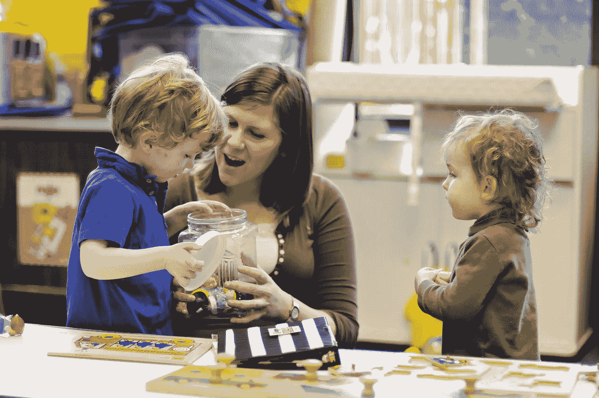

# 自闭症、ABA 和数据科学

> 原文：<https://medium.com/analytics-vidhya/autism-aba-and-data-science-aa8487ae9d77?source=collection_archive---------13----------------------->

你想出去，但天气很冷，你需要穿上夹克，所以让我们打破这一点！你首先需要知道你的夹克在哪里。假设它挂在前门附近的壁橱里。我们走向壁橱，打开门(是滑动门还是推拉门？)我们看到了我们的夹克(你被告知这件颜色的夹克是你的)。现在你需要把夹克从衣架上拿出来，所以当你用一只手拿着衣架的时候，你先把一只手臂拿出来，然后再把另一只手臂拿出来。如果是反过来呢？我们假设不是。现在你手头有了夹克，你需要弄清楚哪个手臂孔对应你的手臂？你寻找拉链朝向哪个方向，它就朝向你。这意味着右边的臂孔对应的是你的左臂。现在你用右手抓住夹克的领子，把你的左臂滑进去。你就快到了！你现在必须用左手握住上衣的左胸，用右臂向后伸，滑入右袖孔。唷！现在你只要拉上夹克的拉链就可以上路了。

对我们大多数人来说，所有这些都可以在几秒钟内完成，对许多人来说，最长的部分是选择合适的夹克(搭配你的鞋子，废话)。但是对于自闭症谱系中的一些儿童来说，这些步骤可能需要几周甚至几个月才能完善。首先，这些步骤通常会在坐在办公桌前时得到完善，然后推广到真实环境中。有时候，只做其中的一个步骤就要花上几个星期的时间，还要进行大量的强化。

这只是 ABA 治疗师在世界各地为他们被诊断为自闭症谱系障碍的客户所努力的许多技能之一。

# 什么是自闭症？

美国精神病学协会将自闭症谱系障碍(ASD)定义为“……一种神经发育障碍，其特征是社交沟通和互动困难，行为、兴趣或活动模式受限或重复。”根据疾病预防控制中心的数据，仅在美国，每 54 名儿童中就有 1 名患有自闭症。

一旦孩子被诊断患有这种疾病(这可能是一个漫长的等待，长达 2 年)，父母有很多选择。其中之一是应用行为分析。

更多信息请访问:[国家精神卫生研究所](https://www.nimh.nih.gov/health/topics/autism-spectrum-disorders-asd/index.shtml)

# ABA 是什么？

应用行为分析是学习和行为的科学。这是一种方法，通过一个奖励和结果的系统来教授期望的行为/技能的目标。这些目标包括行为管理、情绪调节、社会交流、认知治疗等。奖励可以是主要或次要的强化物。首选食物或饮料。二次强化是独特的，可以包括电子游戏、滑板车、电视、拼图等

委员会认证的行为分析师(BCBA)根据基线数据为目标行为创建行为计划。由于自闭症的范围很广，每个孩子都有自己独特的行为计划。

# 我的经历

作为一名行为治疗师工作了将近两年，我已经帮助整合了各种行为计划来达到某种技能/行为。这是我一生中最有收获的时光，尽管也有很多令人沮丧的时刻。作为团队的一部分，包括其他治疗师、委员会认证的行为分析师、父母以及任何看护者或教师，我们都必须达成共识，以增加孩子试图实现的目标的成功可能性。这主要是通过收集每项技能和行为的数据来完成的。有时这是压倒性的，因为治疗师必须在实时记录所有数据的同时处理一种行为。但是团队中的每个人都知道，这对于了解什么可行，什么不可行非常重要。

**ABA 数据科学和机器学习的潜力**

我相信 ABA 领域对数据科学和机器学习有着巨大的需求。由于自闭症的异质性，使用统计分析和机器学习技术可以帮助创建更有效的行为计划，为每个人量身定制更高水平的成功。

# 自闭症中的人工智能

[Qt robot](http://luxai.com/qtrobot-for-autism/)——一个设计用来帮助训练儿童学习社交技能的类人机器人。

[Cognoa](https://cognoa.com)——一种通过机器学习和预测分析创建的诊断工具，帮助父母发现自闭症的早期迹象。这可以帮助父母了解他们下一步可以采取什么措施。Cognoa 也是 FDA 批准的！

Manatee & Me —一款免费的应用程序，父母可以在其中为孩子设定目标。聊天机器人与孩子互动，并使用认知行为疗法来提供锻炼。