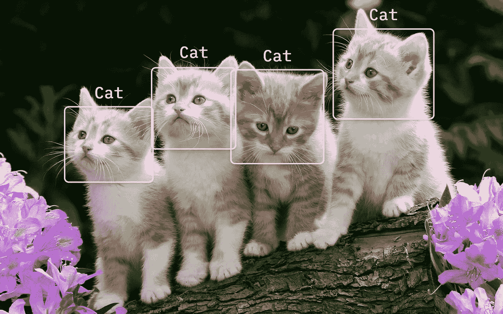
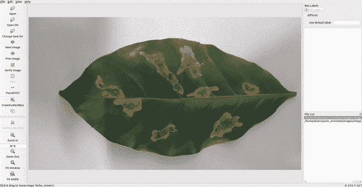
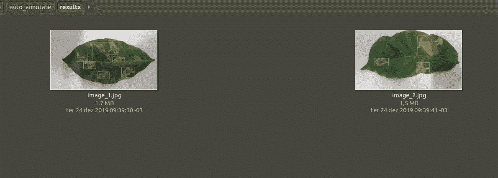
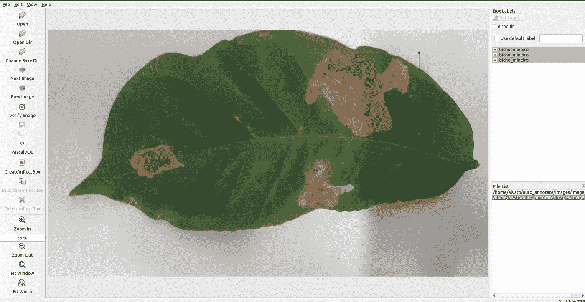

# 用于张量流对象检测自动注释图像

> 原文：<https://medium.com/analytics-vidhya/auto-annotate-images-for-tensorflow-object-detection-19b59f31c4d9?source=collection_archive---------2----------------------->



[https://hacker noon . com/HN-images/1 * _ ptbwjav 6 fgvpgoyd 5 uzvg . png](https://hackernoon.com/hn-images/1*_ptBWjaV6FgVPgOYd5UZVg.png)

> 这篇文章和库版本都过时了，请参考我的新文章查看新库版本:【https://medium.com/p/acf410a600b8

每个处理过对象检测问题的人都知道注释图像的过程是多么的无聊和耗时。

注释它本身非常简单，如下面的 GIF 所示，我们只需要标记对象的位置并告诉它的类。对于一些图像来说这样做没有问题，但是当我们的数据集中有数百甚至数千个数据时，这在深度学习中是很正常的，这就变成了我们工作的瓶颈。



一个无聊又费时的注释图像的过程。

在我最后的作品之一中，我需要创建我自己的咖啡叶数据集，并标记它们的疾病。起初，我在 [**LabelImage**](https://github.com/tzutalin/labelImg) 软件中手工注释图像，并训练模型，但我对这种方法真的不满意，因为我把所有时间都花在创建和注释数据集上，这使得扩大项目规模变得困难。

所以我想到了一个简单的方法来改变这个过程，把它变成一个更加自动化的过程。

使用这种新方法，我创建了一个名为 **generate XML** 的 Python 类，它负责为我做艰苦的工作，通过预训练模型的推理来注释图像，以获得边界框的位置，并创建一个在训练中使用的 XML。

# 自动化流程

要在您的机器上运行这个项目，您需要在 [GitHub](https://github.com/tensorflow/models) 上克隆 TensorFlow 存储库，并安装所有的依赖项。由于第一次可能会有点困难，[在这里](https://neptune.ai/blog/how-to-train-your-own-object-detector-using-tensorflow-object-detection-api)你可以找到一个完整的教程，解释这个过程的步骤。

[auto_annotate](https://github.com/AlvaroCavalcante/auto_annotate) 项目是在 TensorFlow 1.14 中完成的，但它也与 TF 2.x 兼容。

在文件夹**research/object _ detection**里面几乎是我们需要的一切，你可以查看名为**object _ detection _ tutorial**的笔记本，在那里他们详细解释了加载模型和创建新推论的过程。

在我的例子中，我在 NodeJS API 中使用了 auto annotate，但是我们将创建一个目录方案来显示行为，然后您可以修改它以在任何您想要的地方使用。

该方案有一个名为 **auto_annotate** 的文件夹，在这个文件夹中，我有以下文件夹:**图像、脚本、结果、图表和 xml** 。

*   **图片**包含所有你想推断和创建一个 XML 的照片
*   **结果**是推理的结果
*   **脚本**包含了我们将使用的所有 python 算法。
*   **图**是冻结的推理图和标签图。
*   **xml** 是包含生成的 xml 文件的文件夹。

你可以找到我在 GitHub 上使用的代码:[https://github.com/AlvaroCavalcante/auto_annotate](https://github.com/AlvaroCavalcante/auto_annotate)

主文件是 **detection_images.py** ，负责加载冻结的模型并为文件夹中的图像创建新的推断。如果有必要，您需要更改第一行来添加您自己的路径。我还添加了一些行来改变图像的尺寸并保存结果，其他的都和你在 TensorFlow 目录中找到的原始文件相似。

**generate_xml.py** 文件接收推断类的名称、图像尺寸、文件名和带有边界框坐标的字典数组。

所有这些信息都通过文件 **visualization_utils.py 传递，**也可以在 TensorFlow 目录中找到，我们只需要做如下一些修改。

```
array_position = []im_height, im_width, shape = image.shape #get image dimensionsfor box, color in box_to_color_map.items(): #loop in predicted boxesymin, xmin, ymax, xmax = boxdict_position = {'xmin': 0, 'xmax': 0, 'ymin': 0, 'ymax': 0}dict_position['ymin'] = ymin * im_height #add the positions to the #dict, we multiply to get the real value in pixelsdict_position['xmin'] = xmin * im_widthdict_position['ymax'] = ymax * im_heightdict_position['xmax'] = xmax * im_widtharray_position.append(dict_position)
```

有了这个设置，我们只需要实例化这个类并运行方法**generate _ basic _ structure**来生成 XML。

```
if new_xml != False: #this statement prevents to call the class with # we don't have predictions in the image.xml = generate_xml.GenerateXml(array_position, im_width, im_height, class_name, file_name)xml.gerenate_basic_structure()
```

在这个方法中，我们使用 ElementTree(需要从 pip 安装)来创建一个基于 LabelImage 自动生成的 XML 结构，用 for 循环传递盒子位置并保存文件。请务必记住，XML 的名称必须与推断出的图像文件的名称相同。

# 运行脚本

在运行该算法之前，您需要将 TensorFlow 文件夹**research/object _ detection/utils**中的文件 visualization_utils.py 替换为我们修改过的文件(请记住，他们总是在 TensorFlow 存储库中添加新的更改，因此根据您完成本教程的时间，如果您将 TF 中的可视化文件替换为 mine，这可能不起作用，复制并粘贴已更改的行更安全，但您可以先尝试替换)。

您还需要将文件 **generate_xml.py** 复制并粘贴到 utils 文件夹，位置与 **visualization_utils.py** 相同。

之后，你只需要进入你的文件夹(auto_annotate for me)并运行:

```
python3 scripts/detection_images.py
```

如果一切正常，您将在结果文件夹中看到推断的图像，如下所示:



模型推断出的我的咖啡叶！

在 XML 文件夹中，您将找到包含注释的文件，让我们打开 LabelImage 中的图像和 XML。



我们到了！！！自动创建的标签

显然，它还不完善，您可能希望将盒子位置调整得更精确(取决于您的问题领域)，并且当您预先训练的模型不能正确推断时，肯定需要创建新的标签，但我们可以说，这比手动完成所有工作更快。

只要我们更多地训练我们的模型，推论就更准确，注释过程也变得更容易。

# 结论

一种更自动化的方式来注释数据集对于每个使用对象检测的人来说都是非常重要的，这使得我们可以专注于真正重要的事情，而不是在这上面浪费时间。这只是第一步，我希望很快出现新的方法和算法来促进这一进程。

感谢你的阅读，我希望这篇教程能帮助你，如果你有困难或有疑问，请告诉我，我很乐意帮助你。:)