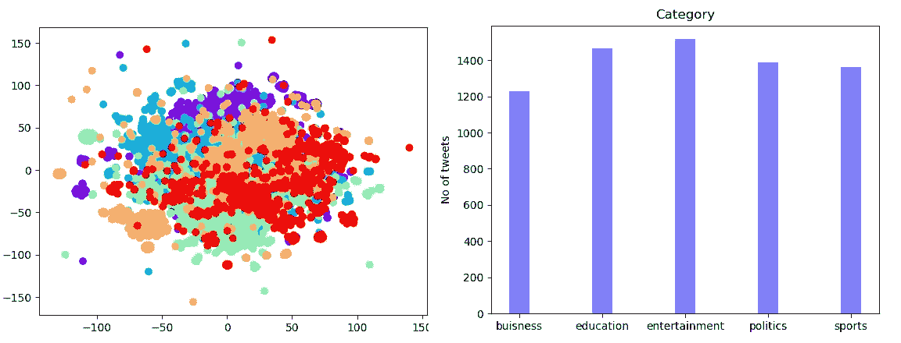
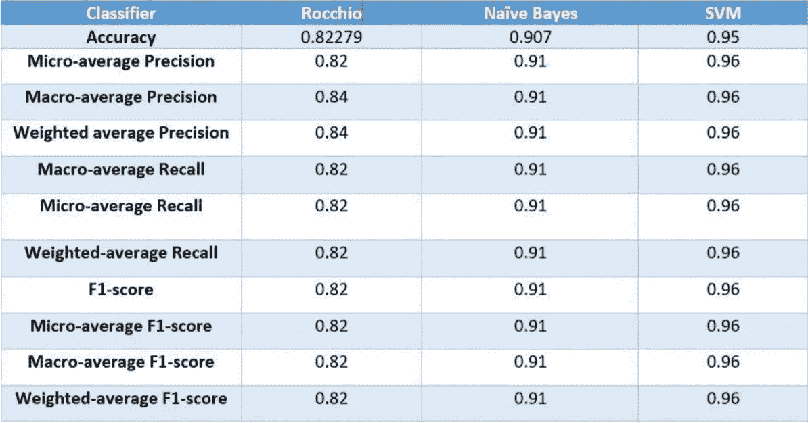
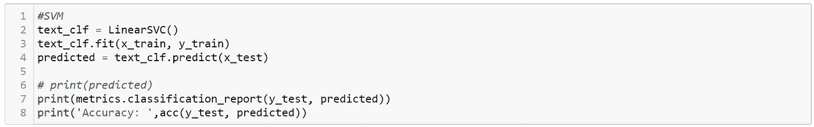
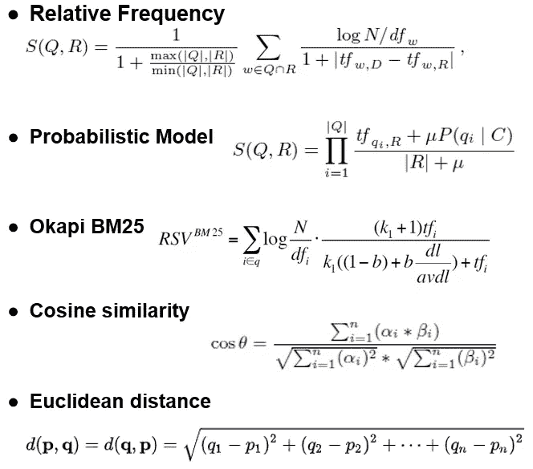
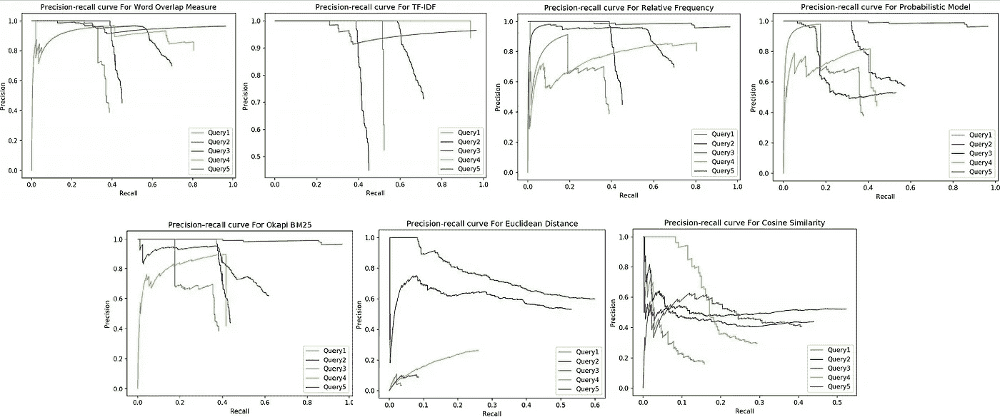
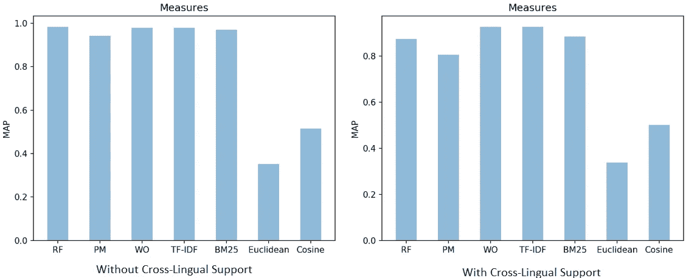
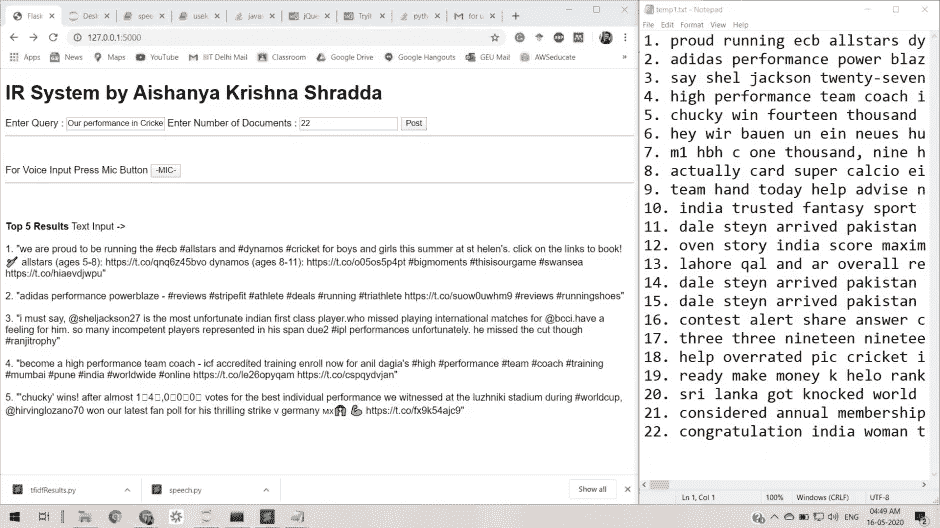
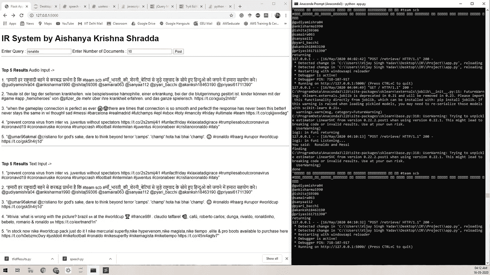
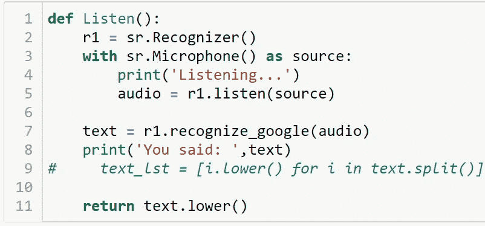
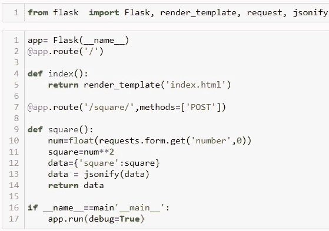

# 文档的自动分类和有效检索

> 原文：<https://medium.com/analytics-vidhya/auto-categorization-and-efficient-retrieval-of-documents-e6e3f766669d?source=collection_archive---------9----------------------->

📷作者:Krishna Yadav |我们从这里获得了这个项目的灵感。

使用机器学习和深度学习模型的文本分类，用于快速有效的信息检索

*信息检索课程最佳项目奖获得者*@ IIITD 2019–2020

> **自从在山里漫游后，我就在想，如果我必须在其中一座山上找到我朋友的家会怎么样。棘手吧？嗯，我很快意识到，如果有人能认出那座山，并告诉我那栋房子就在那里，那就简单多了。瞧啊。这个想法缩小了我的搜索空间。**
> 
> **作者- Krishna Yadav (MT19039)，Aishanya(MT19076)，Shraddha Gupta(MT19072)。从 IIITD，2019–21**

# ****介绍****

****信息检索已经成为一项至关重要的任务。这个项目旨在对书籍、研究论文和推文进行自动分类。对于基线实施，我们对原始数据进行了预处理，并首先使用 SVM、朴素贝叶斯和罗基奥算法将数据分为多个类别。这将有助于有效地检索相关文档，因为语料库将仅限于匹配的类别。此外，信息检索技术将用于根据用户兴趣检索文件。为了简化基线模型，这个项目目前以 twitter 数据为中心。****

****构建了一个 web 应用程序，用户可以输入他的查询，并通过使用能够处理跨语言查询的各种流行的检索模型获得的结果，根据他的搜索获得顶部检索的 tweets。****

# ****数据集信息****

****对于这个项目，我们使用标签(#)作为分类的黄金标准。数据集包含一天的推文，这些推文是使用 tweepy 基于标签从 twitter 上抓取的。为了收集属于上述类别的推文，爬取了每个类别的 15 个最有趋势的标签。收集的推文总数总计 6960 条。下面显示的条形图代表了在每个类别中收集的 tweets 的分布。****

**** [## Krishna 1432/Twitter-情绪分析-在线

### 下载并分析推文，预测他们的情绪，即情感…

github.com](https://github.com/KRISHNA1432/Twitter-Sentiment-Analysis-ONLINE/blob/master/download.py) 

图 1:数据分布

为了分析数据，我们绘制了每条 tweet 对应的 tf-idf 向量的 t-sne 图。从图中可以观察到，tweets 很少重叠，因为相同的标签(#)可以用于多个类别。使用 python 中的 tweepy 库爬取数据。

# 预处理

作为任何文本分类之前的重要部分，我们使用这些技术来提高性能。

删除标点符号。空白处理。非 Ascii 字符删除。Twitter 符号化。处理数字字符。停用词删除。拼写纠正。分词。词汇化。扩展缩写和缩写。语言翻译。

## 第一阶段:分类

对于基线，我们实现了 Kevin 等人的研究论文。艾尔。(1).在这篇论文之后，我们实现了朴素贝叶斯、罗基奥分类和 SVM 模型，以便将推文分类为上述五个类别，从而找到查询分类的最佳模型，并减少搜索空间。

1.  朴素贝叶斯是一种基于贝叶斯定理的监督分类算法，该算法假设所有特征相互独立。朴素贝叶斯计算特定类别中数据出现的概率，同时给出或推断一些先验信息。条件概率可以借助于 P(B/A) = P(A 和 B) / P(A)来计算。新元素将属于具有最大条件概率的类。
2.  Rocchio 分类器是最近质心算法的变体。在 Rocchio 算法中，我们基于 tf-idf 向量执行文本分类。这个想法是通过质心点来表示一个类或类别。该算法根据输入数据计算最近的质心，并将该数据点分配给该类。
3.  SVM 是一个判别分类器，由分离超平面定义。在 SVM 的帮助下，当给定任何新数据作为输入时，该算法生成新的超平面，并通过在给定先验标记训练时制作边界来将数据集划分成类。SVM 可以对线性和非线性数据集进行分类。SVM 使用以下公式计算超平面:w.x + b =0 其中 w 表示向量，x 表示“n”维中的点集，b 是常数。

表 1:分类准确度

对于推文的自动分类，从表中可以清楚地看到，SVM 分类器在 5 折交叉验证集上表现最好，准确率为 0.95。

图 2: SVM 分类

## 第二阶段:检索

1.  单词重叠度量(4)它通过计算出现在 Q 中的单词与出现在 r 中的单词的比例来计算得分。这里的想法是，如果两个文档有共同的单词，那么它们更有可能相似。它确保了高 idf 术语在决定两个句子之间共享信息的程度方面具有更大的重要性。
2.  TF-IDF Measures (4)它通过计算出现在 Q 中也出现在 r 中的单词的比例来计算得分。这里的想法是，如果两个文档有共同的单词，则它们更有可能相似。它确保了高 idf 术语在决定两个句子之间共享信息的程度方面具有更大的重要性。tfw，Q =查询“Q”中单词“w”的词频。tfw，R =单词“w”在文档“R”中的词频。N =文件总数。dfw =包含单词“w”的文档数。
3.  相对频率度量(4)考虑查询和文档之间的所有常用词的 tfidf 来计算相似性得分。通过观察句子“R”和查询“Q”之间单词的相对频率的不平等来施加惩罚。当文档和查询的长度不同时，会增加另一个损失。
4.  概率模型(4)该模型基于给定的目标句子是源句子的翻译的概率。这个概率充当一对句子的相似性得分，因此为查询和查询类中出现的所有 tweets 计算概率。该推文的概率越高，该推文与该查询越相关。
5.  Okapi BM25 (6)这是一个基于概率检索框架的排名模型，它计算文档与查询的相关性。它返回关于文档相关性的排名分数，从而计算查询和查询类中所有 tweets 的概率。推文的排名越高，该推文与该查询的相关性就越大。
6.  余弦相似度(5)在我们使用 word2vec 将 tweets 转换成向量后，计算余弦相似度。基本上，它是两个句子之间角度的量度，因此它是方向的判断，而不是大小。因此，两个相似语句的余弦相似度为 1。计算查询和查询类的所有 tweet 之间的余弦相似性，并且检索具有最高余弦相似性分数的 tweet。
7.  欧几里德距离(5)使用 word2vec 进行检索的另一种方法是欧几里德距离。它计算两个句子之间的距离，因此这里我们计算查询和查询类中所有 tweet 之间的距离，并且检索距离最小的 tweet。

图 3:公式

为了比较各种检索模型的结果，我们采用了如下给出的查询列表:Q1:纳伦德拉·莫迪。Q2 股票市场。Q3 舞蹈和音乐。Q4:板球比分。Q5:技术。使用这个测试查询集，可以绘制所有上述检索模型的 PR 曲线。在缩小的搜索空间中为任何查询找到最佳的检索模型。

图 4:用于比较的精确召回曲线。

图 5:平均检索精度

为每个检索模型的这个查询集计算 MAP，如图 5 中的柱状图所示(RF-相对频率，pm 概率模型，双字重叠)。

# 用户界面

图 6:用户界面

我们制作了一个基于 HTML、python、flask 和 JQuery 的交互式 web 应用程序，使用 ajax API 调用从性能最佳的模型集合中检索 top k 文档。它有两种操作模式，即文本和音频(7)。

图 7:用户界面

*   文本:从键盘输入
*   音频:通过默认麦克风和扬声器与 web 应用程序进行语音交互。用户可以在 web 应用程序屏幕中看到前 5 个结果，并允许应用程序将 k 个结果存储在“temp.txt”文件中以供以后参考。图 6 和图 7 分别显示了为查询“我们在板球中的表现”和“罗纳尔多”创建的 web 应用程序的用户界面。

图 8:文本到语音

*   TTS 是一个很好的工具来改善你的用户体验的影响，这可以通过以下步骤整合到你的界面中。

图 8:使用 Python Flask 的用户界面链接

# 结论

从上面的结果来看，很明显，WordOverlap、TF-IDF、Relative Frequency 和 Okapi BM25 在我们数据集的给定查询集上表现最好。因此，我们使用他们的结果，通过用户输入的查询在 web 应用程序中检索推文。可以看出，基于词频的模型比向量空间模型表现更好，因为当涉及到推文时，用户倾向于使用混合词汇，组合多种语言，并倾向于使用更多的俚语语言(即，没有固定的词汇集)，这导致推文的矢量化较差，因此相似性结果较差。我们的研究证明，Okapi bm25 和相对频率技术在这个问题上表现良好，对于外行和俚语数量不断增加的数据，TF-IDF 赢得了比赛，因为假设用户不知道语料库。因此，当预计会出现大量拼写错误、违反语法规则时，最好不要捕获上下文，因为在这种情况下，位置信息变得毫无意义。另外，在考虑跨语言数据时，最好选择 tf-idf。

参考

[1] Rosa，K.D .，Shah，r .，Lin，b .，Gershman，a .和 Frederking，r .，2011 年。推文的主题聚类。美国计算机学会 SIGIR 会议录:SWSM，63。

[2]李 K，帕尔塞蒂亚 D，纳拉亚南 R，帕特里 MMA，阿格拉瓦尔 A，乔杜里安。Twitter 趋势话题分类。2011 年国际数据挖掘研讨会第 11 届 IEEE 国际会议论文集。2011.第 251-258 页。6137387[https://doi.org/10.1109/ICDMW.2011.171](https://doi.org/10.1109/ICDMW.2011.171)

[3]莫希特·塔雷、因德拉吉特·戈霍卡尔、贾扬特·赛布尔、德文德拉·帕拉特瓦尔、拉希·瓦吉。“使用 Map Reduce 范式的多类推文分类”。国际计算机趋势与技术杂志(IJCTT)第 9 版(2):78–81，2014 年 3 月。刊号:2231–2803。[www.ijcttjournal.org。](http://www.ijcttjournal.org.)第七感研究组发布。

[4]梅茨勒、唐纳德·伯恩斯坦、亚尼夫·克罗夫特、w .莫法特、阿利斯泰尔·佐贝尔、贾斯汀。(2005).跟踪信息流的相似性度量。517–524.10.1145/1099554.1099695.

[5] C. Xia，T. He，W. Li，Z. Qin，Z. Zou，“基于 Word2vec 的法律文档相似性分析”，2019 IEEE 第 19 届国际软件质量、可靠性和安全性伙伴会议(QRS-C)，保加利亚索非亚，2019，第 354–357 页，doi: 10.1109/QRS-C.2019.00072

[6] A. Tamrakar 和 S. K. Vishwakarma，“信息检索中文档检索的概率模型分析”，2015 年计算智能与通信网络国际会议(CICN)，Jabalpur，2015，PP . 760–765，doi: 10.1109/CICN.2015.155

[7]https://www . quora . com/How-do-I-run-python flask-file-when-click-a-HTML-button

[8]https://towards data science . com/understand how-to-transfer-your-paragraph-to-vector-bydoc 2 vec-1e 225 CCF 102

> **投稿**
> 
> 克里希纳:想法，预处理，检索处理，用户界面，音频交互，文档。
> 
> 艾山亚:理念，分类，检索技术，模块集成，文档。
> 
> Shraddha:想法，自动分类，模块集成，文档。
> 
> **鸣谢:**
> 
> 坦莫伊·查克拉博蒂助理教授[https://www.iiitd.ac.in/tanmoy](https://www.iiitd.ac.in/tanmoy)
> 
> 贾斯米特·考尔(博士研究生，IIITD)[https://jasmeetk6.wixsite.com/jasmeetk](https://jasmeetk6.wixsite.com/jasmeetk)
> 
> Anubhav Shrimal (Mtech。http://anubhavshrimal.me/
> 
> 阿比纳夫·古普塔(Mtech。IIITD)、Vrutti Daxeshbhai Patel(Mtech IIITD)、Hridoy Sankar Dutta(博士学者，IIITD)****