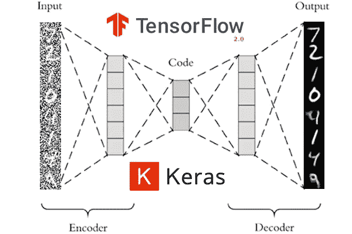

# 自动编码器:正式介绍

> 原文：<https://medium.com/analytics-vidhya/auto-encoders-a-formal-introduction-524ba5a60cd6?source=collection_archive---------23----------------------->

来源:[https://www . pyimagesearch . com/2020/02/24/降噪-auto encoders-with-keras-tensor flow-and-deep-learning/](https://www.pyimagesearch.com/2020/02/24/denoising-autoencoders-with-keras-tensorflow-and-deep-learning/)

自动编码器是神经网络，应该学会复制模型的输入。我知道你一定在想，学习输入特征的好处是什么，而不是从中获得一些有用的信息。

我来说重点。如果自动编码器学习输入特征太完美，它将是没有用的。相反，它以这样的方式被训练，使得它仅复制输入训练数据的有用方面。

如上图所示，自动编码器架构可以分为两个部分。一个是编码器部分，另一个是解码器部分。编码器部分对输入训练数据的特征进行编码。而解码器部分试图将这些编码特征转换回输入特征。

# 自动编码器的类型:

1.  **不完整的自动编码器**
2.  **规则化自动编码器**

# 不完整的自动编码器

不完全自动编码器是输出尺寸小于输入尺寸的自动编码器类型。这就是为什么他们被称为不完全自动编码器。

不完全自动编码器的损失函数可以写成:

> **Loss = L(x，g(f(x)))**

其中 x 是输入，f(x)是编码器的输出，g(f(x))是解码器的输出。

当解码器是线性的并且 L 是均方误差时，不完全的
自动编码器学习跨越与 PCA 相同的子空间。在这种情况下，自动编码器会尝试学习训练数据的最显著特征。

# 正则化自动编码器

正则化的自动编码器对于防止自动编码器复制输入特征以及学习重要特征是有用的。在自动编码器具有相同的输入和输出维度的情况下，以及在过度完整的自动编码器(当输出维度大于输入维度时)的情况下，它们是有用的。

## 稀疏自动编码器

稀疏自动编码器在它们的训练标准中有一个惩罚项以及一般误差。损失函数可以写成:-

> **损耗= L(x，g(f(x))+d(h)**

其中 L(x，g(f(x)))是与不完全自动编码器中相同的损失函数。

可以假设罚项 d(h)与前馈神经网络中的正则项相同，并且 h = f(x)。这样，正则化的自动编码器应该学习有用的特征以及精确的输入特征。它们也用于分类目的。

## 降噪自动编码器

在去噪自动编码器中，一些噪声被添加到输入数据中，然后模型被训练以获得输入数据的去噪版本。用于对自动编码器去噪的损失函数是:-

> **Loss = L(x，g(f(x '))**

其中 x’是有一些噪声的输入数据，x 是没有噪声的输入数据。

## 矛盾的自动编码器

矛盾自动编码器与稀疏自动编码器相同，只是在惩罚项上略有不同。矛盾的自动编码器的损失函数写为:-

> **Loss = L(x，f(g(x))+d(h，x)**

其中 h = f(x)和 d(h，x)可以写成:-

> **d(h，x)=λ* ||∂h/∂x||**

这迫使模型学习一个当 x
轻微变化时变化不大的函数。

> 自动编码器已经成功地应用于降维和信息检索任务。

这是对自动编码器的基本介绍。希望我能解释清楚。