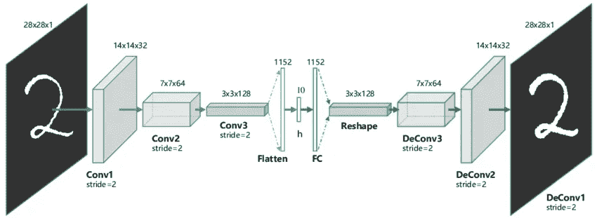

# 自动编码器:文本文档去噪

> 原文：<https://medium.com/analytics-vidhya/auto-encoders-de-noising-text-documents-c58d6950dfad?source=collection_archive---------4----------------------->

图:-自动编码器结构(图- [此处为](https://www.researchgate.net/profile/Xifeng_Guo/publication/320658590/figure/fig1/AS:614154637418504@1523437284408/The-structure-of-proposed-Convolutional-AutoEncoders-CAE-for-MNIST-In-the-middle-there.png))

**什么是自动编码器？**

自动编码器是一种无监督的学习方法。自动编码器背后的思想是压缩潜在空间中的数据，然后再次解压缩潜在空间中的数据以重新创建输入。

**什么是编码器？**

编码器是神经网络的一部分，它压缩潜在空间表示中的输入。

**什么是解码器？**

解码器对于从潜在空间表示中重建输入是有用的。

图 2-编码器和解码器

自动编码器对于 PCA 这样的降维也很有用。如果自动编码器像 PCA 一样工作，那么我们为什么需要自动编码器？自动编码器对于学习最无声的特征非常有用。在潜在空间中，表示包含的维度比输入少得多，这就是自动编码器学习有用信息的原因

**自动编码器的应用:-**

1.  图像去噪
2.  降维
3.  特征变化
4.  图像着色
5.  水印去除

# 文本去噪的自动编码器:-

在这里，我们实现了自动编码器，用于文本文档去噪。文本文档如下:-

Fig-嘈杂的文本文档

该数据集用于此处的[和](https://www.kaggle.com/c/denoising-dirty-documents)。数据集包括脏文档，我们必须从图像中移除脏的部分并清理整个图像。所以在这里，我们使用自动编码器技术去噪的文件

# **自动编码器去噪型号代码:-**

**模型结构:-**

图=模型结构

从上图可以看出输入层和最后一层的形状是一样的。这里，中间层用于降维，并压缩潜在空间中的所有数据，然后我们再次对数据进行上采样/解压缩，以重建图像

**张量板输出:-**

这里我们运行我们的模型 30 个时期。

图-纪元丢失(蓝线=验证，橙线=训练数据

**评估和预测:-**

图 1-评估和预测

**预测值:-**

图=实际值和预测值

***参考文献:-***

 [## 在 Keras 中构建自动编码器

### 在本教程中，我们将回答一些关于自动编码器的常见问题，我们将涵盖代码的例子…

blog.keras.io](https://blog.keras.io/building-autoencoders-in-keras.html)  [## 去噪脏文档

### 消除打印文本中的噪点

www.kaggle.com](https://www.kaggle.com/c/denoising-dirty-documents)