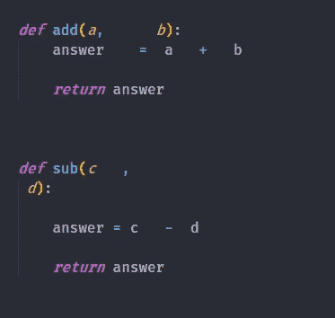
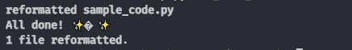
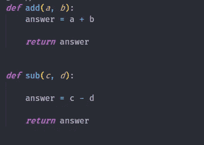
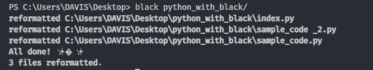
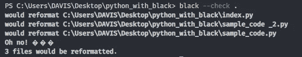
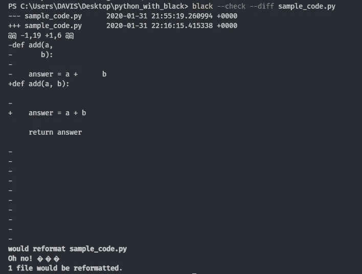
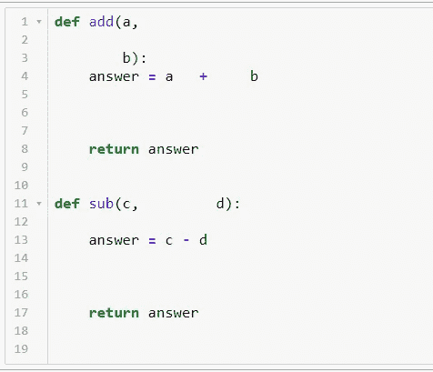
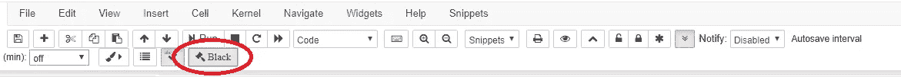
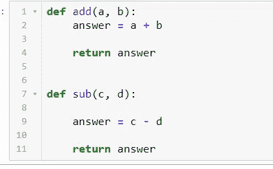

# 用黑色自动格式化你的 Python 代码。

> 原文：<https://medium.com/analytics-vidhya/auto-format-your-python-code-with-black-f74d5f13bd7c?source=collection_archive---------1----------------------->

## 如何停止担心，拥抱自动格式化？


克里斯里德在 [Unsplash](https://unsplash.com/@cdr6934?utm_source=unsplash&utm_medium=referral&utm_content=creditCopyText) 上的照片

编写 python 代码是一回事，以良好的格式编写代码是另一回事。大多数时候，尤其是初级编码员/程序员专注于确保代码正常工作，而忘记了格式化他们的代码。

如果你写一个小程序(有 1000 行代码),你可以不格式化你的代码，但是随着程序变得越来越复杂，它们变得越来越难理解，到了某个时候(大约 15000 行代码),理解你自己写的代码变得越来越难。

处理格式良好的代码和处理格式糟糕的代码之间的区别就像住在宫殿里和住在肮脏的房子里之间的区别。

# **为什么格式化你的 python 代码很重要？**

**1。可读性**
格式化你的代码将有助于**高效地阅读**代码**。它看起来更有条理，当有人看你的代码时，这也有助于给你留下好印象。**

****2。在你的编码面试中提供帮助**
即使在进行编码面试时，有时面试官也会注意你是否给出了正确的代码格式。如果你忘记格式化，你可能会因为这个原因丢掉工作。**

****3。团队支持**
格式当你在一个**团队**中工作时，你的代码变得更加重要，在这个团队中，几个人从事同一个软件项目，你写的代码必须被你的队友理解，否则一起工作会变得更加困难。**

****4。容易发现 bug 格式不良的代码会让你非常非常难以发现 bug，甚至很难编写程序，看起来也非常可怕。这是对你眼睛的冒犯。****

# **Pylint 和 Flake8**

**大多数 Python 开发人员喜欢使用 [Pylint](https://www.pylint.org/) 或 [Flake8](http://flake8.pycqa.org/en/latest/) 来检查他们的代码错误和样式指南。**

****Pylint** 是一个检查 Python 编程语言错误的工具，它试图执行一个编码标准并寻找代码气味。它还可以查找特定的类型错误，它可以推荐关于如何重构特定块的建议，并且可以提供关于代码复杂性的细节。**

****Flake8** 是一个 Python 库，封装了 **PyFlakes** 、 **pycodestyle** 和 **Ned Batchelder 的 McCabe 脚本**。这是一个很棒的工具包，可以根据编码风格 **(PEP8)** 、编程错误如“库已导入但未使用”、“未定义的名称”和未缩进的代码来检查您的代码库。**

**问题是，这些工具只报告它们在源代码中发现的问题，并让 Python 开发人员来解决它们！。但是如果我们有一个工具可以同时识别和解决问题呢？**黑色**是你识别错误*和 ***的正确工具，同时格式化你的 python 代码*** ，让你更有生产力。***

# *****黑色简介*****

******

***黑色标志***

***来自项目自述文件:***

> ***通过使用黑色，你同意放弃对手写格式细节的控制。作为回报， *Black* 给了你速度、确定性和摆脱 pycodestyle 关于格式的唠叨。你将节省时间和精力去做更重要的事情。***

***Black 可以根据 Black code 样式重新格式化您的整个文件。它帮助你的大脑专注于你想要解决的问题和编码解决方案，而不是被代码结构和微小的风格差异分散注意力。***

## *****安装黑色*****

****黑色*可以通过运行`pip install black`来安装。它需要 Python 3.6.0+才能运行。一旦安装了 black，您的 shell 中将有一个名为 Black 的新命令行工具可供您使用，您已经准备好开始了！。***

***要立即开始使用合理的默认值，选择您想要格式化的 python 文件，然后在终端中编写 **black filename.py** ，然后 black 将格式化您的 python 文件。***

## *****格式化单个文件*****

***让我们看看这个简单的例子，这是我的 python 文件 sample_code.py 中的两个 python 函数。***

******

***样本代码. py***

***然后可以在终端中使用`black sample_code.py`来改变格式。运行 black 之后，您将观察到以下输出。***

******

***然后，您可以打开 sample_code.py 来查看格式化的 python 代码***

******

***样本代码. py***

***Python 代码现在已经格式化，可读性更好了。***

## *****格式化多个文件*****

***要格式化多个 python 文件，在终端中写入`black folder_name/`。***

******

***格式化文件夹中的所有 python 文件***

***名为 python_with_black 的文件夹中的三个 python 文件已被重新格式化。***

## ***检查文件格式***

***如果您不希望 Black 更改您的文件，但您想知道 Black 是否认为某个文件应该更改，您可以使用以下命令之一:***

***`black --check .`这将检查哪些 python 文件可以在当前文件夹中格式化，但不会实际修改 python 文件。***

******

***检查要格式化的文件***

***`black --check --diff file_name.py` 这显示了需要对文件做什么，但不修改文件。***

******

***格式化后检查差异***

## ***更改每行的字符数***

***请注意，黑色默认为 88 个字符的行长度，但是您可以使用“-l”或“- -line-length”选项进行更改。***

***示例更改为 60 个字符`black -l 60 python_file.py`。***

# ***Jupyter 笔记本中的黑色***

***对于 Jupyter 笔记本用户来说，你仍然可以用这个叫做 [Jupyter Black](https://github.com/drillan/jupyter-black) 的简单扩展自动格式化你的 python 代码。这个扩展通过[黑色](https://black.readthedocs.io/en/stable/)来重新格式化/修饰笔记本代码单元中的代码。***

***Jupyter Black 扩展提供***

*   ***工具栏按钮。***
*   ***用于重新格式化当前代码单元的键盘快捷键(默认值:Ctrl-B)。***
*   ***用于重新格式化整个代码单元格的键盘快捷键(默认为:Ctrl-Shift-B)。***

*****安装 Jupyter Black*****

***首先确保您已经安装了[jupyter-contrib-nb extensions](https://github.com/ipython-contrib/jupyter_contrib_nbextensions)和 [black](https://black.readthedocs.io/en/stable/) ，然后运行以下命令。***

```
*jupyter nbextension install [https://github.com/drillan/jupyter-black/archive/master.zip](https://github.com/drillan/jupyter-black/archive/master.zip) — user*
```

***然后通过运行。***

```
*jupyter nbextension enable jupyter-black-master/jupyter-black*
```

***现在，您可以开始在每个笔记本单元格中格式化您的 python 代码了。首先，选择想要格式化 python 代码的笔记本单元格，然后单击名为 Black 的扩展按钮。***

******

***使用 Jupyter Black 之前***

***然后点击 Jupyter 黑色按钮。***

******

***Jupyter 黑色按钮***

******

***使用 Jupyter Black 后***

# ***编辑器集成***

***你可以把黑色和你喜欢的编辑器融合在一起。目前黑支持 PyCharm/IntelliJ IDEA，Wing IDE，Vim，Visual Studio Code，Sublime Text 3，Atom/核素，Kakoune，Thonny。按照此处[的说明](https://black.readthedocs.io/en/latest/editor_integration.html)将黑色与你喜欢的编辑器整合。***

***如果你想了解更多关于黑色的知识，我推荐你观看由 ukasz Langa 主持的 [PyCon 2019 演讲](https://youtu.be/esZLCuWs_2Y)。***

***如果你学到了新的东西或者喜欢阅读这篇文章，请分享给其他人看。也可以随意发表评论。在那之前，下一篇文章再见！***

******最后一件事:*** *在以下链接阅读更多类似这样的文章。****

***[](/analytics-vidhya/why-you-need-to-explore-your-data-how-you-can-start-13de6f29c8c1) [## 为什么您需要探索您的数据以及如何开始

### 探索性数据分析逐步指南。

medium.com](/analytics-vidhya/why-you-need-to-explore-your-data-how-you-can-start-13de6f29c8c1) [](https://towardsdatascience.com/how-to-practice-logging-in-python-with-logzero-82e4f9842a5c) [## 如何用 Logzero 练习 Python 中的日志记录

### 为您的 Python 项目提供强大而有效的日志记录。

towardsdatascience.com](https://towardsdatascience.com/how-to-practice-logging-in-python-with-logzero-82e4f9842a5c) [](https://towardsdatascience.com/the-six-key-things-you-need-to-know-about-scikit-plot-119cbd869adb) [## 关于 Scikit-plot 你需要知道的六件关键事情

### 向 scikit-learn 对象添加绘图功能的直观库。

towardsdatascience.com](https://towardsdatascience.com/the-six-key-things-you-need-to-know-about-scikit-plot-119cbd869adb)***