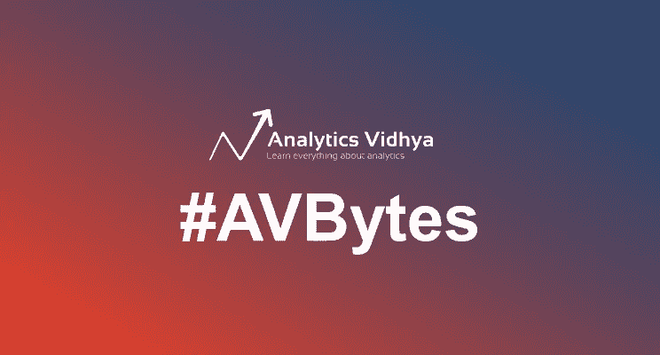

# 自动检测图像中的对象，NVIDIA 的开源视频到视频技术，以及更多的机器学习资源！

> 原文：<https://medium.com/analytics-vidhya/auto-image-detection-vid2vid-avbytes-ml-e6b269e8acd1?source=collection_archive---------0----------------------->

大多数业余和初级数据科学家倾向于发现对象检测是一个棘手的挑战。理解图像的不同参数需要实践和经验，因此 MIT [设计并开源了一种算法，可以自动检测图像中的对象](https://www.analyticsvidhya.com/blog/2018/08/mits-open-source-algorithm-automates-object-detection-images/)！这是开始一周的好方法。

**过去一周的其他亮点:** [chorrrds 是一个精致的 R 包](https://www.analyticsvidhya.com/blog/2018/08/chorrrds-r-package-analyzing-working-music-data/)对于音乐数据，NVIDIA 使用 PyTorch 发布了一个超级令人印象深刻的[视频到视频翻译技术，以及下面更多令人大开眼界的资源和文章！](https://www.analyticsvidhya.com/blog/2018/08/nvidia-open-sourced-video-to-video-translation-pytorch/)

[**订阅此处**](https://feedburner.google.com/fb/a/mailverify?uri=Avbytes) 获取每日 [**AVBytes**](https://www.analyticsvidhya.com/blog/category/avbytes/) 文章，每天早上送到您的收件箱！

*   [**加州大学伯克利分校令人难以置信的姿势检测和翻译技术将让你哑口无言**](https://www.analyticsvidhya.com/blog/2018/08/pose-detection-translation-technique-uc-berkeley/) **:** 加州大学伯克利分校的最新技术确实令人惊叹——它使用姿势估计将一个视频中一个人的动作转移到另一个视频中的另一个人类主题！细节和准确性的水平令人难以置信。看看里面的视频！

*   [**麻省理工学院的开源算法自动化了图像中的物体检测(带 GitHub 链接)**](https://www.analyticsvidhya.com/blog/2018/08/mits-open-source-algorithm-automates-object-detection-images/) **:** 如果你觉得物体检测很棘手，这是最适合你的文章。麻省理工学院已经开源了它的算法，该算法可以自动检测图像中的对象，甚至可以提取这些对象并将其转换为不同的背景！里面包括研究论文、视频和 GitHub 链接。

*   [**NVIDIA 开源了一种使用 PyTorch 的视频到视频翻译技术——它令人印象深刻**](https://www.analyticsvidhya.com/blog/2018/08/nvidia-open-sourced-video-to-video-translation-pytorch/) :这是所有计算机视觉和深度学习爱好者的金矿——NVIDIA 开源了一种令人难以置信的视频到视频翻译技术的 PyTorch 代码！你甚至可以用它来预测视频的下一帧会发生什么。本文涵盖了这种技术，并提供了大量资源帮助您入门。

*   [**chorrrds——一个分析和处理音乐数据的超级 R 包**](https://www.analyticsvidhya.com/blog/2018/08/chorrrds-r-package-analyzing-working-music-data/)**:**R 中的音乐分析？多亏了 *chorrrds* 套装，现在一切都成为可能！这是一个简单易用的包，预装了几个数据集。您可以直接从 CRAN 安装它，现在就动手吧！

*   [**NVIDIA RTX 2080 Ti set 用于实现更快的深度学习**](https://www.analyticsvidhya.com/blog/2018/08/nvidia-rtx-2080-ti-faster-deep-learning/) **:** NVIDIA 已经推出了其 2000 系列显卡，预计将在未来几个月内加速深度学习性能。该公司声称其速度比 GTX 1070 快 40%，这将使它成为一个绝对的野兽！

*   [**脸书和 NYU 强大的人工智能系统将使核磁共振扫描速度提高 10 倍！**](https://www.analyticsvidhya.com/blog/2018/08/facebook-and-nyu-designing-ai-system-mri-scans-quicker/) **:** 人工智能正在改变医疗保健，我们为您带来了另一个巨大的发展。脸书和 NYU 医学院联手设计了一个人工智能系统，将使核磁共振扫描速度提高 10 倍！所提出的系统使用人工神经网络来加速 MRI 扫描。

*以上 AVBytes 发布于 2018 年 8 月 20 日至 26 日。*