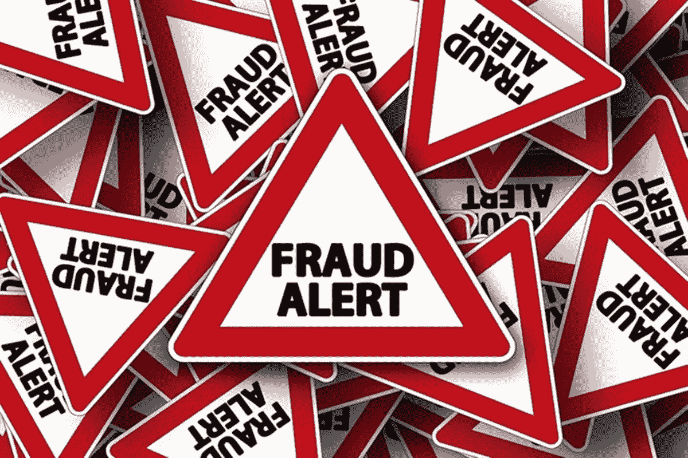

# 汽车保险欺诈预测

> 原文：<https://medium.com/analytics-vidhya/auto-insurance-fraud-prediction-f3e7cfba8f1d?source=collection_archive---------9----------------------->

亲爱的读者，这是我第一篇关于媒介的文章。这是一个关于汽车保险欺诈的预测。欺诈预测通常是一个不平衡的数据集，合法索赔多于欺诈索赔。

问题陈述:

现在很多保险公司都处理欺诈索赔。欺诈可以发生在不同的阶段，既可以发生在填写建议书的阶段，也可以发生在…