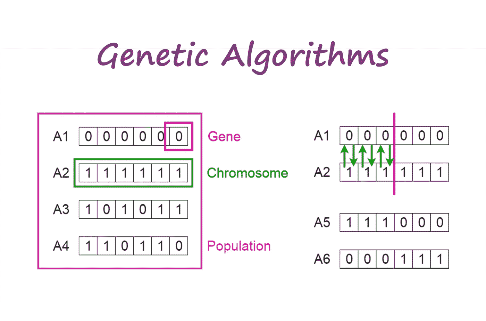
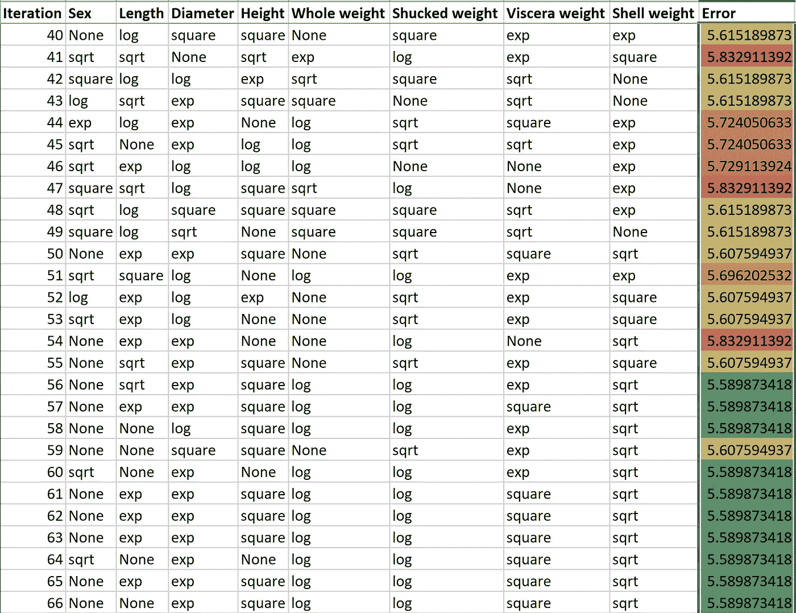
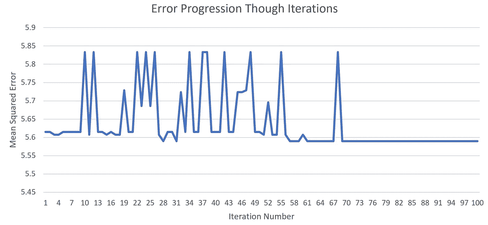

# 基于遗传算法的回归任务自动建模

> 原文：<https://medium.com/analytics-vidhya/auto-ml-using-genetic-algorithm-for-regression-tasks-8b6048fb6344?source=collection_archive---------24----------------------->


来源:[https://www . bio edge . org/bio ethics/will-IVF-affect-human-evolution/13071](https://www.bioedge.org/bioethics/will-ivf-affect-human-evolution/13071)

一些带有分类和回归任务的数据科学项目让我意识到，尽管每个问题都有它自己的解决方案，但在我正在做的事情中肯定有一些冗余。就像许多雄心勃勃的数据科学家一样，我想我会一劳永逸地自动化这个过程。

> 为什么要浪费一个小时手动操作，而你可以花 10 个小时自动操作，对吗？:D

在创建预测模型时，我们会一次又一次地遇到相同的方法——清理数据、对分类变量进行编码、估算缺失值、选择算法并最终训练模型。为了使过程更加复杂，我们对过程的每一步都有同样多的参数。那么，如何在众多配置中进行选择呢？

当然，你可以研究变量的分布，当你有数百个特征时，这是一种痛苦，然后研究离群值，但当我们进行在线学习时，即使离群值的行为也会随着时间而变化。类似地，有无数种方法来准备你的模型，但是大多数工作流程都需要很长时间。但是，由于这种准备是一次性的任务，如果我们有一台计算机通过有组织的方式为我们进行参数搜索，以寻找一个可接受的配置，会怎么样？即使这样的解决方案需要几天的时间，但是只要我们需要创建新的模型，这个解决方案就可以工作。这种方法就是我们所说的 Auto-ML。


来源:[https://robo hub . org/from-disembedded-bytes-to-robots-the-think-and-act-like-humans/](https://robohub.org/from-disembodied-bytes-to-robots-that-think-and-act-like-humans/)

对于这篇文章，我们将保持简单。我们仅尝试解决一个经典回归问题(鲍鱼年龄预测)的特征变换。你可以在这里找到数据的链接——[鲍鱼年龄预测数据](https://archive.ics.uci.edu/ml/datasets/abalone)。鲍鱼是海螺，发现它们年龄的过程是一个漫长的过程。但是有些东西更容易测量，比如体重，它可以用来预测年龄。


来源:[https://www . the guardian . com/environment/2018/aug/19/偷猎者-鲍鱼-南非-海鲜-潜水员](https://www.theguardian.com/environment/2018/aug/19/poachers-abalone-south-africa-seafood-divers)

鲍鱼数据包含以下信息-

*   性
*   长度
*   直径
*   高度
*   整体重量
*   去皮重量
*   内脏重量
*   外壳重量
*   戒指

关于这些栏目的详细说明可以在这里找到—[https://www.kaggle.com/rodolfomendes/abalone-dataset](https://www.kaggle.com/rodolfomendes/abalone-dataset)

目标是预测环的数量。我们把这项任务当作一个回归问题来处理。并且作为子问题，我们试图为每个特征列找到最佳变换，以使环数的预测值和真实值之间的均方误差最小。

# 搜索空间设计

我们在一些标准转换中寻找特性列。在这个问题中，我们将使用以下变换-

*   对数
*   指数的
*   平方
*   平方根

最后，我们可以选择保持功能不变。

```
trans_choices = ['exp','log','square','sqrt','None']
```

如果我们为每一列选择上述转换之一，并将所有转换组合在一起，我们就得到一个配置。这部分是遗传算法的用武之地。



来源:[遗传算法简介—包括示例代码](https://towardsdatascience.com/introduction-to-genetic-algorithms-including-example-code-e396e98d8bf3#:~:text=A%20genetic%20algorithm%20is%20a,offspring%20of%20the%20next%20generation)

遗传算法是一种人工智能技术，经常用于运筹学任务。顾名思义，它的灵感来自于自然选择和进化的过程。它包括以下几个方面

*   使用不同的工艺参数定义染色体结构
*   在这种情况下，每个参数就像是构成染色体的基因
*   每个基因/参数占用不同的值
*   基因的值组成了染色体，可以对染色体的适合度进行评估
*   使用目标函数(在我们的例子中是模型的准确性)来计算适合度

现在，遗传算法的关键要素是，我们使用两种不同的配置，称为父母，并使用他们来创建后代。父母是从一个群体中挑选出来的，随着过程的开始，这个群体不断偏向于更强壮的染色体或配置。因此，简单地说，在每次迭代中，我们从群体中挑选两个亲本配置，并通过组合来自两个亲本的基因/参数值来创建后代。我们根据目标函数计算后代的适应度或强度。如果孩子表现良好，我们会分配给它在群体中更高的生存机会。如果后代表现不佳，我们会减少它存活的机会。

这个过程导致种群包含更多更强的染色体或配置，并且当我们看不到子代配置的任何变化时，该过程收敛。

# 时间到了

让我们看看如何用 python 实现这个过程

## 步骤 1:导入库

```
import numpy as np 
import pandas as pd  
import lightgbm  
import scipy
from sklearn import metrics 
from sklearn.preprocessing 
import StandardScaler 
from sklearn.model_selection import train_test_split 
from sklearn.metrics 
import mean_squared_error as acc  
import random 
import warnings warnings.filterwarnings('ignore') np.random.seed(100)
```

## 步骤 2:创建随机配置

该函数使用转换空间中的一个选项为每个列创建一个配置设置

```
def create_random_config(trans_choices, config_cols):     
    config = []     
    for col in config_cols:
        config.append(random.choice(trans_choices))     
    return config
```

## 第三步:变压器

该函数接收训练数据，并根据“create_random_config”函数选择的配置对其进行转换

```
def transformer(dft, dfv, config, config_cols):
    dft2 = dft.copy()
    dfv2 = dfv.copy()
    for index in range(0,len(config_cols)):
        if config[index] == 'exp':
            dft2[config_cols[index]] = np.exp(dft[config_cols[index]])
            dfv2[config_cols[index]] = np.exp(dfv[config_cols[index]])
        elif config[index] == 'log':
            dft2[config_cols[index]] = np.log(dft[config_cols[index]])
            dfv2[config_cols[index]] = np.log(dfv[config_cols[index]])
        elif config[index] == 'sqrt':
            dft2[config_cols[index]] = np.sqrt(dft[config_cols[index]])
            dfv2[config_cols[index]] = np.sqrt(dfv[config_cols[index]])
        elif config[index] == 'square':
            dft2[config_cols[index]] = np.square(dft[config_cols[index]])
            dfv2[config_cols[index]] = np.square(dfv[config_cols[index]])
        else:
            dft2[config_cols[index]] = dft[config_cols[index]]
            dfv2[config_cols[index]] = dfv[config_cols[index]]
    return dft2, dfv2
```

## 第四步:获得分数

根据模型准确性评估配置。这里出于示例目的选择的模型是 [LightGBM](https://github.com/microsoft/LightGBM) 。

```
def get_score(dft2, dfv2, verbose = False):
        X_train, X_test, y_train, y_test = train_test_split(dft2.drop(columns = ['y']), dft2['y'], test_size=0.20, random_state=1)
        X_train = X_train.fillna(0)
        X_test = X_test.fillna(0)
        y_train = y_train.fillna(0)
        y_test = y_test.fillna(0)trained_model = lightgbm.LGBMRegressor(
                  boosting_type = 'gbdt',
                  max_depth = 6,
                  n_estimators = 100000,  
                  learning_rate = 0.05,
                  objective = 'regression',
                  n_jobs = -1,
                  random_state  = 100,
#                   device = 'gpu',
#                   gpu_platform_id = 0,
#                   gpu_device_id = 0,
                  num_leaves = 7
             trained_model.fit(
                            X_train, y_train,
                            eval_set=[(X_test, y_test)],
                            eval_metric = 'rmse',
                            early_stopping_rounds = 100,
                            verbose = verbose
                        )

        result = trained_model.predict(dfv2.drop(columns = 'y')).round(0)
        score = acc(dfv2['y'],result)
        return score
```

## 步骤 5:创建配置搜索空间

此功能使用所有评分配置创建一个搜索空间，其中包含更多高评分配置实例。这实现了基因进化的过程，通过选择那些得分较高的基因来创建更好的子代配置。该方法中的随机性会导致噪声，但结果显示准确度得分呈上升趋势。偏差因子决定了如何设计配置。对于下面的实现，我们使用范围[(n_iter X 0.1/5，0)，(n_iter/5，0)]之间的随机偏差因子，其中 n_iter 是我们运行算法的总迭代次数。一旦我们有了一定数量的分数配置来创建配置空间，该函数用于创建配置的搜索空间。

```
def create_config_space(all_scored_configs, n_iter):
    sorted_configs = sorted(all_scored_configs, key=lambda row: row[-1], reverse = True)[-1*random.randint(round(n_iter*0.1/5,0),round(n_iter/5,0)):]
    config_space = []
    for index in range(0,len(sorted_configs)):
        repeated_configs = [sorted_configs[index] for i in range((index+1)*random.randint(1,6))]
        config_space.extend(repeated_configs)
    return config_space
```

## 步骤 6:创建子配置

该函数使用从配置空间中随机选择的 2 个父配置，并在每个子基因的父个体基因值之间随机选择

```
def create_child(parent1, parent2):
    child = []
    for index in range(0,len(parent1)-1):
        child.append(random.choice([parent1[index],parent2[index]]))
    return child
```

## 步骤 7:找到最佳配置

该函数将查找最佳配置的过程封装在以下步骤中-

*   对于一半的迭代次数，我们为列转换创建随机配置
*   对于剩余的一半迭代，我们使用配置的分数来创建配置空间，以给予具有较高分数的配置更多的重要性
*   从配置空间中，以相等的概率随机选择 2 个父配置。配置空间本身偏向于具有更多数量的更强的染色体/配置
*   整个过程完成后，选择最佳配置。最终配置是在上述过程中评分的所有配置中得分最高的一个

```
def find_best_config(dft, dfv, config_cols, trans_choices, src, n_iter = 100):
    iter_data = []
    for itr in range(len(iter_data),n_iter):
        if itr < round(n_iter/2,0):
            config = create_random_config(trans_choices = trans_choices, config_cols = config_cols)
            dft2, dfv2 = transformer(dft,dfv,config, config_cols = config_cols)
            score = get_score(dft2, dfv2)
            print('Score = ',score)
            iter_row = config
            iter_row.append(score)
            iter_data.append(iter_row)
        if itr >= round(n_iter/2,0):
            config_space = create_config_space(all_scored_configs = iter_data, n_iter = n_iter)
            parent1, parent2 = random.sample(config_space, 2)
            child = create_child(parent1 = parent1, parent2 = parent2)
            config = child.copy()
            dft2, dfv2 = transformer(dft,dfv,config, config_cols = config_cols)
            score = get_score(dft2, dfv2)
            print('Score = ',score)
            iter_row = config
            iter_row.append(score)
            iter_data.append(iter_row)
    cols = list(dft.columns[:-1])
    cols.append('y')
    results = pd.DataFrame(iter_data, columns = cols) 
    results.to_csv(src+'results.csv') ## Save GA results
    best_config = sorted(iter_data, key=lambda row: row[-1], reverse = True)[-1]
    return best_config
```

## 步骤 8:准备数据

该函数读取数据，并将其分为训练数据和验证数据。验证集将以类似于训练数据的方式进行处理，但是来自验证数据的任何信息都不会用于影响模型训练工作流。

```
def prep_data(pata_path, target_col, mode = 'find_final_accuracy'): ########## Must be user defined to have features with whatever column names and label as 'y'

    df = pd.read_csv(pata_path)

    if mode == 'find_config':
        df = df.sample(min(10000,df.shape[0])).reset_index(drop=True)

    df['Sex'] = df['Sex'].map({'M':1,'F':2, 'I':3})

    df = df.rename(columns = {target_col:'y'})

    s = np.random.uniform(high = df.shape[0]-1, low = 0, size = round(0.1*df.shape[0]))
    s = np.unique(s.round())
    dfv = df.iloc[s,:]
    dft = df.drop(index = s)

    print('shape of the overall, training and validation data are as follows - ',df.shape,dft.shape,dfv.shape)

    return dft, dfv
```

## 第九步:忙碌

这个函数使用输入来计算整个过程并输出结果

```
def main(src, filename, n_iter, target_col):
    ## User Inputs
    trans_choices = ["exp","log","square","sqrt","None"]## Find best config
    dft, dfv = prep_data(pata_path = src+filename, target_col = target_col, mode = 'find_config')
    config_cols = dft.drop(columns = 'y').columns
    best_config = find_best_config(dft, dfv, config_cols, trans_choices, src = src, n_iter = n_iter)## Get final accuracy for the data
    df2t, df2v = prep_data(pata_path = src+filename, target_col = target_col)
    df2t2, df2v2 = transformer(dft = df2t, dfv = df2v, config = best_config, config_cols = config_cols)
    score = get_score(df2t2, df2v2, verbose = True)
    print("Final error is - ", score)
```

## 步骤 10:运行流程

这一步必须使用正确的参数值来运行，我们将根据不同配置的得分来获得输出。

```
main(
        src = ""
        , filename = "Abalone Data.csv"
        , n_iter = 100
        , target_col = 'Rings'
      )
```

对于该代码的简易笔记本，请遵循— [自动数据解释器(ADI)](https://gitlab.scss.tcd.ie/amittal/automated-data-interpreter/-/blob/master/Automated%20Data%20Interpreter%20(ADI).ipynb)

可以看到后续配置的均方误差下降，如下所示



结果

此外，我们看到，对于每一列，配置围绕一个变换收敛。根据当前配置搜索状态空间，这些配置为我们提供了最佳结果。为了获得更好的结果，我们只需要用更多的选项和可学习的参数来扩大搜索空间。



这个过程是优化回归或分类任务的参数搜索的非常简单的方法。参数状态空间可以包括更多的参数，例如

*   分类变量编码器的类型:[http://contrib.scikit-learn.org/category_encoders/](http://contrib.scikit-learn.org/category_encoders/)
*   缺失值估算者的类型:【https://scikit-learn.org/stable/modules/impute.html 
*   异常值检测器类型:【https://pyod.readthedocs.io/en/latest/ 
*   回归算法:[https://towardsdatascience . com/catboost-vs-light-GBM-vs-xgboost-5f 93620723 db](https://towardsdatascience.com/catboost-vs-light-gbm-vs-xgboost-5f93620723db)
*   所有的步骤也可以进一步分解成参数

更多细节请参考我之前的文章:[一个懒惰的数据科学家的更大更黑的盒子](https://www.linkedin.com/pulse/bigger-blacker-box-lazy-data-scientist-adhishwar-mittal/)

感谢您的阅读。我希望这个过程有一天能帮助你完成数据科学任务。:)