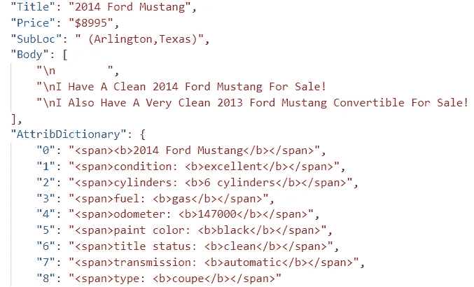

# 汽车价格预测从零开始！第 1 部分:概述

> 原文：<https://medium.com/analytics-vidhya/auto-price-prediction-from-scratch-part-1-overview-a4f331aaad00?source=collection_archive---------10----------------------->

## ***从网络上建立一个数据集。准备数据集并对其建模。***

假设你想卖掉你的车。有了数据在手，预测价格的算法有很多，包括 [k 近邻](https://scikit-learn.org/stable/modules/generated/sklearn.neighbors.KNeighborsRegressor.html)、[线性回归](https://scikit-learn.org/stable/modules/generated/sklearn.linear_model.LinearRegression.html)、约束回归如[岭](https://scikit-learn.org/stable/modules/generated/sklearn.linear_model.Ridge.html)和决策树。这些算法的开源版本可在 [scikit-learn](https://scikit-learn.org/stable/) 中获得。

但是，如果我们没有数据呢？在我们的故事中，我们缺乏对专有 API 或数据库的访问。而且没有第三方数据的预算。

也许我们可以从公共 API 下载汽车数据。但是，许多 API 不能被一般公众使用。例如，埃德蒙兹在 2017 年退役了他们的 auto Open API，并限制相关业务合作伙伴的访问。怎么办？

还有另一条路可走:通过网络搜集创建一个数据集。我们将通过自力更生建立我们的足智多谋！

## 设置场景

业务目标是预测卖方要求的价格。首先，我们必须了解大局。价格预测将如何使用？可以使用现有的解决方案吗？如何衡量成功？有主题专家吗？一个好的项目会有很高的生存能力和很高的价值。

[https://xkcd.com/1781/](https://xkcd.com/1781/)

研究文献，了解其他人是如何处理这个项目的，并确定关键特征。例如，直觉上我们知道车龄和里程很重要。拥有 10K 里程的 2018 款福特 Fusion 将比拥有 9 万英里里程的 2010 款福特 Fusion 价格更高。

我们需要找到一些数据。让我们从一个网站中提取数据，提取相关特征，建立一个整洁的数据集。整齐的数据集是一个表，其中每个要素形成一列，每个观测值形成一行。此外，每个值都有自己的单元格。

为什么每个单元格只有一个值？这张图片显示了一个福特野马上市保存为 JSON 格式。标题中混合了年份和型号。类似地，里程表值 147000 嵌套在`“AttribDictionary: {“4”: “odometer: <b>**147000**</b>`中。显然，这些预测因素必须分开，以模拟它们与价格的关系。

JSON 格式的福特野马数据

我们将使用一个 [Scrapy](https://scrapy.org/) ，一个网络抓取工具，从 CraigsList 中提取相关特征。

## 像《火星救援》中的马特·达蒙那样的工作数据

在电影《火星人》中，宇航员达蒙与一个又一个难题搏斗，由于他的训练、天赋和钢铁般的坚韧而获胜。这种敢做的态度也有利于从原始数据构建数据集。

探索和理解数据至关重要。否则，我们将面临模型结果不佳的风险。此外，理解数据可能会激发设计新功能的想法。

CraigsList 有重复的自动列表。经销商可能会多次发布同一辆汽车进行销售。这导致数据[泄露](https://www.cs.umb.edu/~ding/history/470_670_fall_2011/papers/cs670_Tran_PreferredPaper_LeakingInDataMining.pdf)。问题是:有了副本，同一辆车可以同时坐在火车和我们“看不见的”坚守者中。我们在列车上安装汽车，然后预测**同一个**汽车仍在坚持。因此，模型性能被夸大了。我们通过拟合禁忌维持数据而不是专用的训练数据来降低模型的泛化能力。

> “仔细探索和理解我们收集的原始数据至关重要。”

价格也是个问题。这不是一个干净的教程或者玩具数据。我们正在处理有不一致和错误的“野外”数据。有些价格很糟糕，因为它们是定金，而不是广告上的全价。例如，如果我们对 750 美元的首期付款进行建模，而全价是几千美元，那么我们的预测将会大相径庭。所以我们需要提取正确的价格(regex 在这方面非常有用)。

几个价格……嗯，就是难。最佳模型预测二手 2019 款福特 F-250 的价格为 5.8 万美元。这与第三方车辆识别号报告中的价格相差不到 500 美元。但是，CraigsList 的价格是 7.5 万美元。所以这个模型相差了 17K 美元。

“身体”特征用绿色圈出。

发生了什么事？F-250 被改装成一个花式升力套件(在同一个广告中称为“升力”、“超级升力”和“升降机”)。我们需要强文本特征提取来模拟该信号，而不会将我们的模型淹没在噪声中。数据集有数千个唯一的标记(标记化是将一个字符序列分割成——粗略地说——单词)！每个令牌都是一个列，一个维度。

事实证明，来自“Body”的文本特征矩阵(所有其他特征都被省略)可以预测福特价格+/-4500 美元的平均绝对误差(MAE)。本身还不错，但是其他特性更容易理解，建模成本也更低！对于这个项目，我们将使用 10 个功能，而不是 10，000 个功能。

让我们回到大局。

什么是关键的项目里程碑？我们的原始数据，如上面的 JSON 图片所示，需要采用整洁、一致的格式。数据必须被理解、清理和可视化。必须设计新的有效功能。可以对数据进行聚合、编码、转换和缩放，以进行有效的建模。我们将训练不同的算法来识别该数据集的有前途的算法。

我们能评估这辆汽车的价格吗？哪些特性很重要？

打造一个尽可能自动化的软件管道。代码自动化程度越高，实验和调整模型就越容易。

## 伟大时刻表

为每个里程碑安排一个截止日期。避免让任何里程碑变得太难。将困难的里程碑分解成更小的、更容易实现的里程碑，并为每个里程碑设定一个期限。

甘特图直观地显示项目时间表，包括并行的里程碑。这个时间表是虚构的——可实现的时间表将取决于你的技能。

很容易忽略制定时间表。但是，没有明确时间表的项目会拖延下去。在这里，你是自己的项目经理，决定时间表和资源。达到里程碑并回顾你所学到的和取得的一切是令人满意的！

火车站在他们的时间表上成功和失败。

但是，如果时间表不正确呢？只需相应更新即可。时间表是有益的，因为它提供了组织和纪律。这是对无休止地修补一件事情的障碍。当遇到困难时，回顾里程碑，评估是否要避开这件事，以后再来，给朋友打电话，或者跳过它。不准确的时间表比没有时间表好得多！

**项目知识、技能和能力(KSAs)**

汽车领域知识很有帮助——识别问题和提出正确的问题更容易。重复列表是一个问题吗？里程表数值看起来合理吗？如果你不知道一辆两年前的车的里程表读数，做一点研究将会提高你的直觉！

需要技术技能。Python 编程、Pandas 数据结构、XML Path 语言和 scikit-learn 工具方面的经验将使项目的每个部分变得更加容易。使用的技能包括 Python 中的 scrapy 网站抓取、反序列化 JSON 列表、正则表达式查询、值的高级输入、数据预处理、特征工程、LightGBM 超参数调整、残差分析和异常值检测。

是的，这是我自己用记号笔画的。

最后，汽车价格预测项目需要决心和对细节的关注——即使对于更高级的程序员也是如此。为什么？这里有一个真实的例子。在正则表达式搜索中，删除一个空格会破坏特征结果和云模型解释**。因此，当遇到困难时，保持专注，休息一下，理清思路。将想法和问题写在纸上的“待办事项”清单上。做完后把它们划掉。品味你的成就。**

在 [**第二部分:数据收集和清理**](/@jmackie_13883/auto-price-prediction-from-scratch-part-2-data-collection-and-cleaning-a147b6375b2f) 中，我们解释了如何收集和准备原始数据。前进！

*我欢迎反馈！联系我的最好方式是发表评论。在 LinkedIn 上私信我:*[*http://www.linkedin.com/in/justinmackie*](http://www.linkedin.com/in/justinmackie)

## **尾注:**

[1]这是我们看到的价格。我们不知道买方是否会协商更低的价格。事实证明，由于售后改装或事故等特殊情况，某些挂牌价格远远高于或低于市场价格。

[2] H. Wickham & G. Grolemund， *R for Data Science* ，2017。