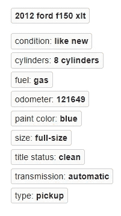

# 汽车价格预测从零开始！第 2 部分:数据收集和清理

> 原文：<https://medium.com/analytics-vidhya/auto-price-prediction-from-scratch-part-2-data-collection-and-cleaning-a147b6375b2f?source=collection_archive---------15----------------------->


## 用 Scrapy 提取数据

我们想预测汽车价格。但是，我们没有数据。没什么。所以让我们建立自己的数据集吧！我们会用 Scrapy 提取网页数据。Scrapy 是一个 Python 网页抓取工具，具有快速的性能。

这是 [**第一部分:概述**](/analytics-vidhya/auto-price-prediction-from-scratch-part-1-overview-a4f331aaad00) 的延续。

## 杂乱无章的新项目

*需求:*使用 Scrapy 1 . 6 . 0 版本，谷歌 Chrome，VS 代码。在 VS 代码中，我们可以在代码编辑器、终端和 Python 环境中的文件之间轻松切换。该项目应该在一个隔离的 Python 环境中完成，以避免软件版本冲突。阅读本文和查看代码时，最好使用两个屏幕。

Python 环境中的 Open VS 代码。在终端中，导航到项目所需的文件夹位置。终端命令`scrapy startproject craigslist_scrapy`将创建项目，包括文件夹和支持文件。我们在下面的资源管理器窗格中看到支持文件。


杂乱的项目文件。蜘蛛文件命名为 clspider.py。

进入文件夹:`cd craigslist_scrapy`。通过键入`scrapy genspider clspider elpaso.craigslist.org`创建蜘蛛。这将使用 classClspiderSpider()创建 clspider.py，并将 URL 插入到类中。

打开 clspider.py，我们看到 URL 将蜘蛛指向该网站，并且仅指向该网站。

将 **start_url** 编辑为`[https://elpaso.craigslist.org/search/cta?auto_make_model=ford](https://elpaso.craigslist.org/search/cta?auto_make_model=ford)`。CraigsList 最多返回 3000 个结果，不管有没有过滤器。我们将只查询福特，因此我们将获得每个福特型号的许多样品。

## 机器人和刮擦许可

在抓取之前，请检查 *robots.txt* 以确认允许抓取。该文件位于域名下方。在下面的 example.com 中，通配符意味着所有用户代理爬虫都是允许的。但是，某些文件夹禁止爬行。例如，`www.example.com/reply`和回复子文件夹不能被抓取。


尊重 robots.txt 权限！

这里的刮擦是出于教育目的。获得书面许可来收集大量数据或为公司收集数据。

## 蜘蛛代码

下面是蜘蛛的完整代码:clspider.py。在与本文并排的新窗口中打开它。

在此要点的底部，右键单击 clspider.py 以在新窗口中打开要点。

在谷歌浏览器中，查看`[https://elpaso.craigslist.org/search/cta?auto_make_model=ford](https://elpaso.craigslist.org/search/cta?auto_make_model=ford)`的搜索结果。我们在第一页上看到 120 个列表，然后在第二页上又看到 120 个，以此类推。如果你点击一个链接，这将把你带到汽车的详细广告，我们称之为“列表”或汽车网址。车辆 URL 包含我们想要提取的数据。


搜索结果第 1 和第 2 页。

现在我们对程序流程有了一个概念。我们需要第 1 页上的 120 个车辆网址，第 2 页上的 120 个车辆网址，等等。对于“all_vehicles”第 1 页中的每个 URL，解析出数据。然后，请求第 2 页并重复。请求新页面，直到我们用完页面(上限为 3000/120 = 25 页)。


结果-行。第一行被展开，以显示蓝色框中的列表 URL。

clspider.py 实现了这个流。第 15 行将页面上 120 个结果的 HTML 保存到“all_vehicles”。

查看“Result-rows”图片，查看 URL 的 HTML 格式。

第 17–18 行遍历每个结果，只获取车辆 URL。第 18 行中，`vehicle.xpath(‘.//a/@href’)`是什么？

对于刚接触蜘蛛的程序员来说——就像我一样——最具挑战性的部分是使用回调和 XPath。

## 复试

让我们回顾一下回调机制。在 clspider.py 的第 19 行，我们**请求**URL“vehicle _ URL”并下载 HTML 作为**响应**对象。请求和响应是内置的战斗能力。

下载响应对象后，调用回调函数 parse_vehicle。回调函数获取响应作为第一个参数，然后函数运行。我们从响应对象的 HTML 中解析价格等特性。

## XPath

XPath 是一种用于在 XML 文档中选择节点的查询语言。以下是基本格式:

> element =//nodename[@ attribute = ' value ']

*   `//`是节点的相对路径。与绝对路径相比，它对元素的完整现有路径中所做的更改具有弹性。
*   `nodename`是特定节点的标记名。示例包括:img、div 或 title。
*   `@`选择具有一定值的节点属性。例如，属性*类*有一个值*价格* : `@class=”price”`。

XPath 查询语言还有很多功能。我们将使用这本入门书来实验在 Chrome 浏览器中选择网页节点。

## 用 XPath 提取数据

通过找到有效的 XPath 并在 scrapy 中测试来查询价格。使用 XPaths 时使用 Google Chrome 浏览器。其他浏览器可能无法成功搜索 XPath。

1.  转到自动列表页面。点击 Ctrl-Shift+C 在“检查元素”模式下打开 Chrome，鼠标悬停在价格上。在元素检查器中，我们应该看到`<span class="price">$5950</span>`以蓝色着色。
2.  按 Ctrl-F 在元素检查器中搜索 HTML，并键入以下 XPath: `//span[@class=”price”]`按 enter 进行搜索。
3.  找到价格节点——黄色阴影！再按几次 enter 键，验证它是我们匹配的唯一节点。


XPath， **//span[@class="price"]** ，查询价格节点。

测试 price XPath 以确认它能与 scrapy 一起工作。在 VS 代码中用“+”打开一个新的终端，并输入`scrapy shell "my_URL”`。将车辆 URL 放在双引号中。shell 是一个交互式测试环境，包含 URL 的响应对象。

接下来，使用价格 XPath 选择价格数据节点:

`**In[1]:** response.xpath(‘//span[@class=”price”]’)`

`**Out[1]:** [<Selector xpath=’//span[@class=”price”]’ data=’<span class=”price”>$5950</span>’>]`

上面，我们看到返回了 xpath 和 HTML 数据。但是，我们想要的只是价格文本“5950 美元”。 **text()** 返回文本并省略 HTML，如下所示。

`**In[2]:** response.xpath(‘//span[@class=”price”]/**text()**’)`

`**Out[2]:** [<Selector xpath=’//span[@class=”price”]/text()’ data=’$5950'>]`

剩下的就是`data=’$5950'`。Scrapy 有内置的“选择器”来解析数据。选择器 extract_first()或 get()将返回第一个匹配项。

`**In[3]:** response.xpath(‘//span[@class=”price”]/text()’).extract_first()`

`**Out[3]:** ‘$5950’`


使用 XPath 技能我们还能做什么？

答对了。只返回“$5950”。我们现在有了从 CraigsList 汽车列表中查询价格的工作代码。

注意只有 XPath `//span[@class=”price”]`在 Chrome 搜索中有效。我们添加到 XPath 的函数 text()和 extract_first()在 scrapy 中工作。

## **蜘蛛的数据提取代码**

我们查看汽车列表，并决定提取以下原始特征:URL_Vehicle、Title、Price、SubLoc、Body、AttribDictionary 和 ImageDictionary。


福特野马 GT 的自动列表。

**要刮除的原始特征:**

*   **URL_Vehicle** 是特定列表的网址。
*   **标题**是图片上方的大号粗体文本。
*   **价格**嵌入**标题**。
*   **SubLoc** 是标题中价格后的任何文字，如“(埃尔帕索)”。
*   **正文**是照片下方的无结构文字。
*   **AttribDictionary** 包含某些车辆属性。
*   **ImageDictionary** 是图片 URL(不下载图片)。

clspider.py 的第 29–32 行用适当的 XPath 获取我们的特性并保存到变量中。对于车辆属性，每个列表有许多属性。字典捕获属性(第 34–39 行)。此外，字典捕获图像 URL。



AttribDictionary 的属性。它们因上市而异。

第 40–48 行将特性变量 AttribDictionary 和 ImageDictionary 插入到主字典中。

## 爬行蜘蛛

我们在 clspider.py 中有完整的蜘蛛代码，在原终端(不是 scrapy shell terminal 2)中键入`scrapy crawl clspider -o elpaso.json`运行蜘蛛。蜘蛛将运行许多秒，解析清单。主字典作为`elpaso.json`写入磁盘。请在几秒钟后用 Ctrl-C 停止蜘蛛，改为在此下载数据[。或者，克隆](https://github.com/jkmackie/car_price_prediction/tree/master/json)[回购](https://github.com/jkmackie/car_price_prediction)。

下面显示了 JSON 文件。在 VS 代码编辑器中打开它，并点击 **Shift-Alt-F** 以下面更易读的格式查看它。这可能需要几秒钟。回想一下 [**第 1 部分**](/analytics-vidhya/auto-price-prediction-from-scratch-part-1-overview-a4f331aaad00) 我们正在处理一个混乱的数据结构。例如，模型“野马”嵌入在标题中。没有人给我们交钥匙数据集-我们必须自己建立它！


混乱的数据结构

这将我们带到项目的下一个阶段——从 JSON 中提取有意义的特性。

# 特征抽出

概括一下，我们在 CraigsList 上搜索了待售的福特**轿车+卡车。数据被保存为 JSON 格式。接下来，我们将从 JSON 中提取特性来预测价格。**

建立准确和完整的特征需要反复试验。Jupyter 笔记本是为快速代码原型设计的。我们将用它来提取数据。**熊猫**用于数据操作。

预处理亮点将在这里讨论。有关完整的预处理细节，请查看 GitHub 上的 [car_preproc_final.ipynb](https://github.com/jkmackie/car_price_prediction/tree/master/jupyter_notebooks) 。

Pandas 包含了一个方便的方法`read_json`，可以将我们的 JSON 导入到 DataFrame 中:

```
#Import JSON to Pandas DataFrame.import pandas as pd
vehicle = pd.read_json(‘elpaso.json’)
```


JSON 数据加载到车辆数据帧中

前面，我们看到模型“野马”是标题的一部分。它也嵌入在 AttribDictionary 中。无论哪种情况，我们都需要从字符串中提取一个字符串。幸运的是，正则表达式是完成这项任务的强大工具。正则表达式模式为可能匹配的字符串集指定规则。

函数`match_regex_patt`从数据帧中的`target_col`中提取正则表达式匹配。重要的是，匹配时忽略大小写。此外，成功的不区分大小写的匹配是小写的。为什么？该算法应该将“f-150”、“f150”、“F150”和“F-150”视为相同的汽车类别。同样，“150000”、“150K”、“150k”、“15 万”都是一样的车里程。

这种不一致性是真实世界特征提取挑战的一个缩影。房源是很多人写的；没有标准格式或保证某个特征(例如里程表)将被包括在内！

将正则表达式匹配作为 Python 列表返回

这是一个用正则表达式提取特征的基本例子。从 **URL_Vehicle** 列提取车辆位置:

```
#Get vehicle Location from URL location.craigslist.orgvehLocList = match_regex_patt(df=vehicle, target_col='URL_Vehicle',\ regex_patt='[https://(.+)\.craigslist',](/(.+)/.craigslist',) no_match_value='None')vehicle['Location'] = vehLocList
```

让我们回顾一下正则表达式模式的含义:

`‘[https://(.+)\.craigslist'](/(.+)/.craigslist',)`

捕获组是括号内的内容。输入字符串的这一部分被保存到一个可被引用的编号组中。捕获组中有一个句号和一个加号。句点表示除新行之外的任何字符。加号表示一个或多个。

在捕获组之外，我们搜索字符串`“https://”`和`“.craigslist”`。`“\.”`逃避了时期的特殊含义。我们想要匹配“city.craigslist”中的*文字句点*。

正则表达式一开始看起来很奇怪。对于更高级的搜索需求，比如提取模型的模式(`r’ford\s(\w+-{0,1}\S+)’`)，搜索答案通常是无效的。花在正则表达式教程或学习上的时间是值得的。相信我，这是我的经验之谈！

# 清洁

## 删除重复项

在 [**第一部分**](/analytics-vidhya/auto-price-prediction-from-scratch-part-1-overview-a4f331aaad00) 中，阐述了重复数据对模型泛化的影响。假设我们在火车上装上复制品。接下来，我们在所谓的“看不见的”维持数据中预测*相同的副本*。在这种情况下，模型性能被夸大了。所以重复的必须被删除。


重复列表:不同 URL 上的相同 VIN。

以下是删除重复项的几种方法。为每辆车创造一个独特的特征。每辆车都有独特的识别码。因此，如果我们在不同的列表中看到相同的 VIN，我们知道该汽车是重复的。当然，这只有在 VIN 可用的情况下才有效！

另一种技术是标记可疑的相似列表。如果它与另一个有相同的标题、里程表读数和价格，它很可能是一个复制品。

```
#Keep only the first in a set of duplicates.  Drop the rest.vehicle.drop_duplicates(subset=['Title', 'Odometer', 'Price'], inplace=True)
```

## 放弃不好的观察

我们的真实世界数据相当混乱。甚至我们的目标变量价格也经常丢失。让我们去掉缺失的价格。

```
**#Price is missing, None, or blank.  Drop corresponding rows.**filt = (vehicle['Price'].isna()) | (vehicle['Price'] == 'None') | (vehicle['Price'] == '')drop_indices = vehicle[filt].index
print(f'Drop missing price rows:', drop_indices)
vehicle.drop(index = drop_indices, inplace = True, errors = 'ignore')**#Output:**
Drop missing price rows: Int64Index([   12,    15,    33,    44,    45,    46,    63,    64,    81,   84,
            ...
20999, 21013, 21014, 21023, 21033, 21035, 21041, 21047, 21060, 21062], dtype='int64', length=2392)
```

缺失的价格被删除，而不是被估算。或者，缺失的价格可以用平均价格代替。因为可以收集更多的数据，而且这是我们的目标变量，所以丢失的价格被删除。

可能是真正异常值的异常可以被丢弃。这改变了模型拟合，并可能影响最佳得分所需的正则化强度。小心地剔除真正的异常值可能会显著提高分数。以下是通常在 VIN 研究后发现的一些异常情况(粗体索引):

*   1997 年的 7504 不是民用汽车，而是起重机。
*   **7413** 从 2017 年开始使用，但列在新的管理建议项目之上。
*   **1991** 因意外低价。同样适用于 **13843** 。

前两个项目符号是离群值，可以删除。第三点中的价格异常是噪音的来源。我们怎样才能做得更好？事实证明，添加“残骸”特征改进了模型。残骸标志可以通过关键字搜索识别的受损汽车的子集。在下一篇文章中会有更多的介绍。

# 结论

我们已经走了很长的路！我们从 CraigsList 中提取 JSON 数据，创建整齐的特征，并为机器学习模型清理数据。这些是我们从零开始预测汽车价格的关键步骤。

这个四部分系列的下一篇文章， [**第 3 部分:特性工程**](/@jmackie_13883/auto-price-prediction-from-scratch-part-3-feature-engineering-a903e2509643) ，将涵盖被忽视的特性工程技术！

*我欢迎反馈！联系我的最好方式是发表评论。在 LinkedIn 上私信我:*[【http://www.linkedin.com/in/justinmackie】T21](http://www.linkedin.com/in/justinmackie)

## **尾注:**

[1]确保您处于安装 scrapy 的隔离 Python 环境中。

[2] extract_first()在以前的 scrapy 版本中有效，包括 1.6.0。