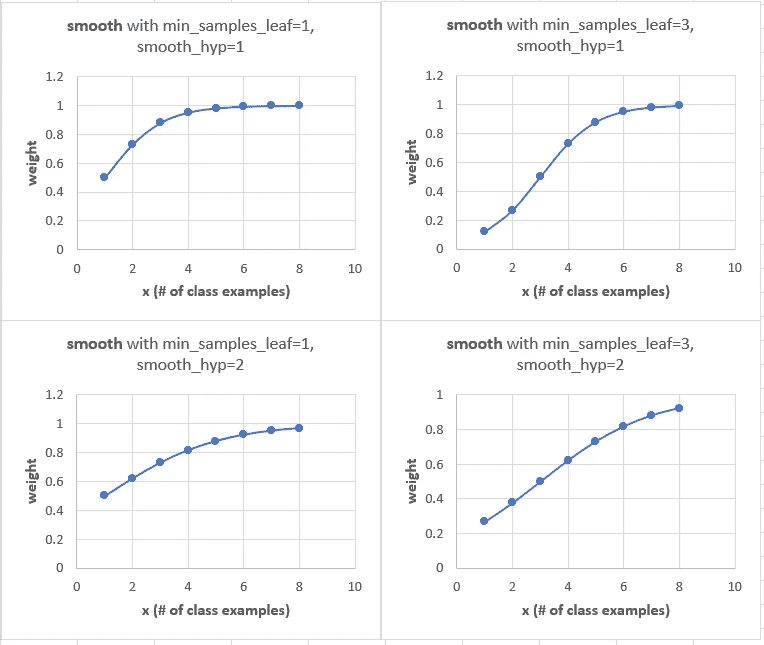
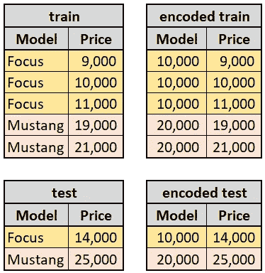
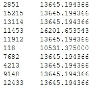
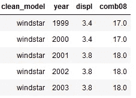
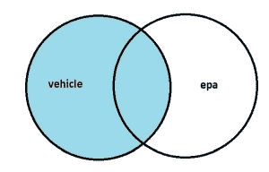
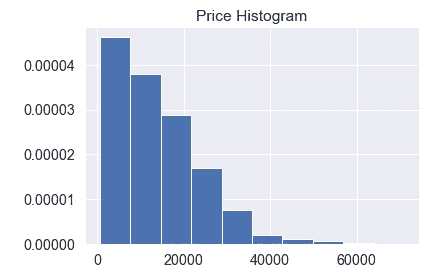
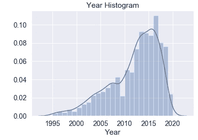
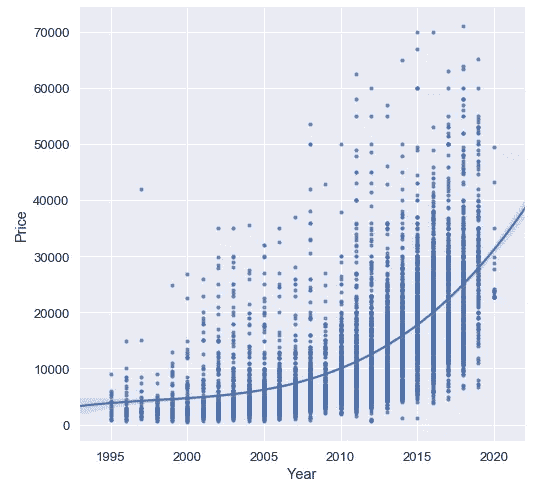
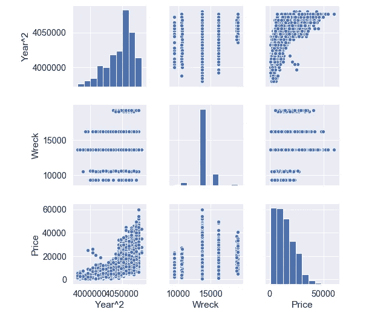
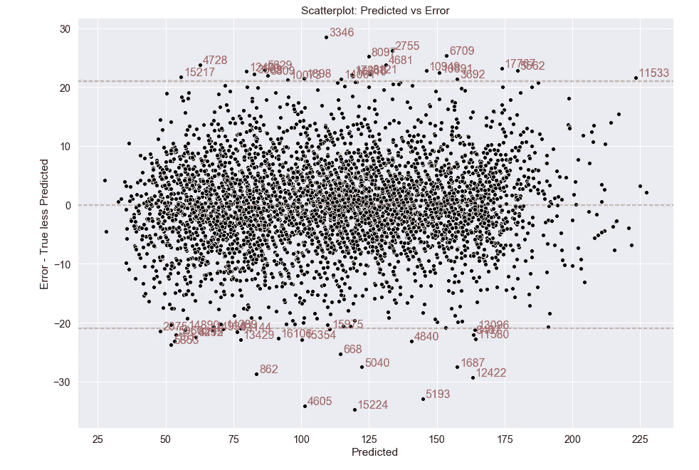

# 汽车价格预测从零开始！第 3 部分:特征工程

> 原文：<https://medium.com/analytics-vidhya/auto-price-prediction-from-scratch-part-3-feature-engineering-a903e2509643?source=collection_archive---------14----------------------->


## 为数据建模构建要素

我们想预测汽车价格。但是，我们没有数据——我们是从零开始。 [**在第二部分:数据收集和清洗**](/analytics-vidhya/auto-price-prediction-from-scratch-part-2-data-collection-and-cleaning-a147b6375b2f) 中，我们从 web 中提取并清洗数据。现在我们设计新的令人兴奋的功能！我们还使用一种被忽略的技术来编码分类数据。

这是我们汽车价格预测项目的下一篇文章。请看 [**Part1:概述**](/analytics-vidhya/auto-price-prediction-from-scratch-part-1-overview-a4f331aaad00) 了解大图。

# 汽车功能概述

我们从网站抓取中获得原始特征。它们是:

*   **URL_Vehicle** 是特定列表的网址。
*   **标题**是图片上方的大号粗体文本。
*   **价格**嵌入**标题**中。
*   **SubLoc** 是标题中价格后的任何文字，如“(埃尔帕索)”。
*   **正文**是照片下面的无结构文字。
*   **AttribDictionary** 包含某些车辆属性。
*   **ImageDictionary** 是图片 URL(不下载图片)。


JSON 原始特性

接下来，我们使用正则表达式将原始特征转换成整齐的格式。这些功能包括以下内容:

*   **车型**是福特车辆的类型，例如野马、F-150、福克斯等。
*   **Trim** 是附加化妆品，技术，性能。例如，F-150 国王牧场装饰增加了一个更大的发动机和类似镀铬格栅的化妆品。
*   **年**是车型年。
*   **里程表**是车辆上行驶的里程。
*   **卖方**是业主或经销商。
*   **位置**是根据 URL 列出的汽车销售城市。

Regex 细节在预处理 Jupyter 笔记本[这里](https://github.com/jkmackie/car_price_prediction/tree/master/jupyter_notebooks)。

## 工程模型 _ 修剪特征并得到分层训练和测试

我们需要多少数据来预测价格？对于每辆车，我们需要最少数量的样品。让我们假设最少是 50 个样本。所以对于逃跑的 XLT，我们要 50 个样本；野马 GT 和 F-150 XLT 也是如此。但是，修剪“XLT”是共享的许多汽车模型！怎么办？

将模型和修剪组合成一个名为 Model_Trim 的特征。“F-150_xlt”样本很多，但“escape_xlt”样本刚好低于最小值。

```
**#Model_Trim feature illustration:**f-150_xlt,f-250_super, mustang_gt,f-150_supercrew,f-150_lariat, focus_se, fusion_se, f-250_super duty, explorer_xlt, 
etc.
```

假设我们保持“escape_xlt ”,我们随机地将我们的车辆数据帧分成训练(90%数据)和测试(10%数据)。如果所有的“escape_xlt”都落入 test only 会怎么样？我们将如何拟合模型？

如果只有一辆便宜的“escape_xlt”在火车上掉下来怎么办？模型如何做出好的预测？

分层抽样将数据分为训练集和测试集。它使类别比例与 Model_Trim 的整体类别比例保持一致。如果“模型 _Trim1”是训练的 5%,则它将是测试的 5%(假设有足够的样本量)。

```
from sklearn.model_selection import StratifiedShuffleSplitsss = StratifiedShuffleSplit(n_splits=1, test_size=0.1, random_state=22)for train_index, test_index in sss.split(vehicle, vehicle['Model_Trim']):
    train = vehicle.iloc[train_index]
    test = vehicle.iloc[test_index]
```

另一种我们可以分层的方法是根据价格，将价格从便宜到贵分为 1-10 个等级。例如，如果所有的廉价汽车都在列车上，这将防止数据偏差。幸运的是，由于最小样本量和分层抽样，培训和测试的平均价格在 200 美元以内。

> 尤达开的是什么车？一个玩具——小田

# 分类特征编码挑战

分类特征在机器学习中是重要且具有挑战性的。在模型中工作之前，需要进行编码。通常，分类特征被一次性编码为每个类别的 1 和 0。每个类别都有一列，增加了维度。随着维度变高，我们增加了过度拟合模型的机会。在高维空间中，成对的观测值变得几乎彼此等距。观察值变得更难聚类，离群值更难区分。

高基数(高唯一性)特性的一个编码选项是用一个整数给每个类别编号。我们称之为整数编码。所以 F-150、F-250、探险者、福克斯、野马等车型。被编号为 0，1，2，3，4 等。这种方法的一个问题是，我们对没有意义的类别强加了一个数字顺序。野马比探险者伟大吗？

如果类别是有序的，比如年轻人、中年人和老年人，那么整数编码是可以的。

## 目标编码

在这个项目中，我们使用鲜为人知的方法叫做[目标编码](https://contrib.scikit-learn.org/categorical-encoding/targetencoder.html)。该特征被替换为(1)给定特征类的预期目标值和(2)所有训练数据的预期目标值的混合。目标是连续变量，价格。所有训练数据的值被称为*全球平均值*或*之前的*。

```
**Equation A:** Encoding equationfor continuous or categorical target:Encoded_Class = ExpectedVal(trainTarget | FeatureClass) * **smooth** 
+ ExpectedVal(trainTarget) * (1-**smooth**)***Where*** ExpectedVal is the average for a continuous target (Price is continuous).  It is the probability for a categorical target.***Where* smooth** =
1/(1+e^-(class_count-min_samples_leaf)/smoothing_hyperparam)***Where*** if class_count = 1, Encoded_Class = Global_Average-----------------------------------------------------------------
**Equation B:** Easy-to-read equationfor continuous target:Encoded_Class = Class_Average * **smooth** + Global_Average * (1-**smooth**)
```

考虑模型类“野马”和**方程 B** 。野马得到平均野马价格混合整体模型价格。*但是，我们不是在利用价格作弊吗？*通过完全忽略测试价格来避免数据泄露。**只有列车价格用于对测试中的特征进行编码。**

对于目标编码，必须减轻过拟合。我们不能通过在特征中编码来记忆价格。该模型在新数据上表现不佳。

我们如下减轻过度拟合。用全局平均项约束(正则化)类平均项。这就是**平滑**发挥作用的地方。平滑是上面灰色框中的`Class_Average`重量。`Global_Average`得到(**1-平滑**)。如果**平滑**上升，(**1-平滑**)下降，反之亦然。



**smooth** 是用于混合 Class_Average 和 Global_Average 的权重。缺省的 min_samples_leaf 和 smooth_hyp 是 1(左上)。提高 min_samples_leaf 和 smooth_hyp 分别通过使曲线变陡和变平来加强正则化。当 **#** class examples = 1 时，平滑权重被覆盖:Encoded_Class 获得 Global_Average。

通过增加两个**平滑**超参数来加强正则化:min_samples_leaf 和 smooth_hyp。参见四个图表，这些图表通过#个类示例绘制了**平滑**。

> 对于目标编码，必须减轻过拟合。我们通过用全局平均项约束(正则化)类平均项来减轻。

选择上面的**平滑**曲线。随着我们从左向右移动，这些类变得越来越常见。对于一个罕见的类，降低类平均权重(**平滑**)和提高全局平均权重(**1-平滑**)更安全。我们更加依赖全球平均水平。

相比之下，对于一个普通类，我们对全球平均值的依赖*要少*。公共课有很多例子可以平均。总之，稀有类比普通类获得更多的全局权重。



目标编码示例。左表是原始的，右表是编码的。模型列使用 train 中的 Class_Average 进行编码。为了可读性，忽略 train 中 Global_Average 价格 14，000 的影响。

如果目标是分类的而不是连续的，则使用概率而不是平均值。我们的目标价格是连续的，所以我们使用平均值。

目标编码不添加新列。当特性是高基数时，这尤其有益。此外，它不会给每个类别分配一个任意的数字。相反，这些类是用来自 train 的预期目标值编码的。换句话说，来自目标的信息被编码到类中。

目标编码的缺点是类平均值和先验值的混合由两个超参数控制:min_samples_leaf 和 smoothing。当存在过度拟合时，更改默认的超参数非常重要。当设置低正则化时，普通类本质上获得 Class_Average。

对于低基数特性来说，一键编码可能是更好的选择。当观测值的数量远大于编码后的最终特征数量时，这也可能是一个更好的选择。

## 领域知识:驾驶室和残骸特征

添加驾驶室功能可改善卡车预测和整体模型。对于卡车来说，超级卡车、超级驾驶室和普通驾驶室与卡车驾驶室相关，**而非**内饰。领域知识有助于快速识别这一事实。混合驾驶室与装饰恶化模型性能。

下面的技术给了我破坏特征的想法。在用算法对数据建模并计算残差之后，该方法是可用的。检查最差残差。这表明，与其他网站相比，某些预测是合理的，但 CraigsList 的价格比 T4 低得多。为什么？VIN 互联网研究揭示汽车是在一次事故中，有时与照片！

> 当恐龙撞坏汽车时，你会得到什么？暴龙残骸

为了对沉船场景建模，我们创建了一个名为 wreck 的新功能。这是一个包含事故相关关键词的分类特征:打捞、残骸、重建等。

`regex_wreck=’(SALVAGE|WRECK|ACCIDENT|CRASH|COLLISION|REBUILT TITLE|REBUILD TITLE)’`


残骸特征(左栏为索引)。

该列表被赋予事故关键字。如果没有关键字，列表将得到“None”。残骸然后被目标编码。



目标编码后的残骸特征与价格。

## 添加第三方数据

我们设计了新的有效功能。万岁！我们现在有以下功能:**里程表**，**年份**2** ，**车型 _ 内饰**，**残骸**，**驾驶室**，**卖家**，**价格**。

我们的研究表明，马力和里程也是重要的特征。这些在 CraigsList 上通常会被忽略。但是，我们希望我们的价格预测尽可能准确。

我们做什么呢第三方数据库中提供了详细的马力和 MPG(每加仑英里数)数据。EPA 有排量(马力的代表)和里程数据[在这里](https://www.fueleconomy.gov/feg/epadata/vehicles.csv.zip)。我们的项目前提是没有第三方数据的预算。因此，我们将使用环保局的数据。

请注意，EPA 数据是**模型级** *，*而不是更细化的**微调级** 数据。

在 EPA 文件 vehicles.csv 中，从 model 列提取有效的 Ford 车型，从 comb08 列提取 MPG。然后按车型年对中值进行分组:

```
#Group median feature values by Model-Year.grouped = epa.groupby(['clean_model','year'])\
             .agg({'displ' : 'median','comb08' : 'median'})\
             .reset_index()
```

分组结果格式:



EPA 表。按车型年分组的排量和综合 MPG 特性。

左连接车辆表到 EPA 表的型号和年份。

`vehicle = vehicle.merge(epa, how=’left’, left_on=[‘Model’,’Year’], right_on=[‘clean_model’,’year’])`



左连接返回蓝色记录。

左加入得到*所有*车辆记录。包括所有汽车通用的*EPA 记录。结果是具有我们新的里程和排量特性的车辆表！`right_on`列是多余的；放下它们。*

EPA 数据忽略了 F-250、F-250 和 F-450 卡车数据。这些是商用级卡车，发动机排量大，里程表值通常很高。因此，这些卡车从数据中删除。

## 带有转换的工程特征

良好的特征工程是高性能模型的基石。通过残骸和驾驶室功能，我们看到提高我们的知识会带来更好的功能。有效的特征工程可能对模型性能有很大的影响。

特征工程的另一种方法是用变换“重塑”特征。

如果你研究数据，你会发现价格分布是右偏的。我们的目标变量**不**具有正态分布。



价格是右偏的。

我们能把价格转换成大致的正态分布吗？如果是这样，模型性能可能会提高。试着取价格的对数或平方根。

> 交通灯对汽车说了什么？别看了，我要变了！

让我们看看年份。直方图显示那一年是向左倾斜的。年份和我们的目标价格之间的关系是非线性的。

将 Year 提升到大于 1 的幂开始拉出右尾。这在理论上降低了偏斜，并使分布更加正常。如果年份是平方，与价格的相关性会增加一点。我们使用年份**2 代替年份，因为模型分数提高了。



年份直方图向左倾斜。它与价格呈非线性关系。

将特征配对在一起——比如模型和修剪——可能会创建一个强大的新特征。假设这两个要素恰好在同一直线上(高度相关)，并且可以在不影响性能的情况下丢弃原始要素。在这种情况下，线性模型系数现在更容易解释，因为我们消除了共线特征。

主成分分析(PCA)也通过组合变量来消除共线性。不幸的是，原来的特征混合在一起。这种转换阻碍了对特定功能影响的理解。

## 离群值和异常值

对于非专业人士来说，找到一个真正的异常值可能很难。有很多关于这个主题的书。

这里有两种方法来标记异常—可疑的异常值。第一种是配对绘制变量图，并直观地寻找异常。然后更详细地检查每个异常，以决定是否保留它。

```
#Investigate outliers in train using pairplot.sns.set(font_scale=1.3)
sns.pairplot(train[['Year^2', 'Wreck','Price']])
plt.show()
```



使用 Seaborn 的结对绘图示例。

第二种方法使用算法中的残差(观察值减去预测值)。如果残值超出平均值的三个标准偏差，则可能是异常(如果残值呈正态分布，则 99.7%的值在三个标准偏差内)。



超过三个标准偏差的误差在橙色虚线之外。更多细节见算法[笔记本](https://github.com/jkmackie/car_price_prediction/tree/master/jupyter_notebooks)。

请注意，不能保证异常是真正的异常值。如果决定是关键的，如医疗问题，请咨询专家。

异常提供了对模型错误的洞察，并且可能提供了如何改进模型的洞察。下一篇文章，**第 4 部分:算法和实验**，包括异常的案例研究。

## 将干净的数据表保存到数据库

我们必须存储我们的数据。PostgreSQL 是大公司使用的商业级数据库。它可以存储 JSON 和 JSON 二进制格式的数据。下载并安装 PostgreSQL。使用以下 Python 代码将数据帧写入 Postgre 表:

将数据帧写入 Postgre 表。

建议使用小写的表名，因为 Postgre 区分大小写。由于在这段代码中出现了大小写混合的情况，所以当它出现在 SQL 语句中时，要在表的两边加上引号。比如`query 1 = ‘SELECT * from “trainClean”’`。对于小写，SQL 简化为`query2 = ‘SELECT * from trainclean’`。

在执行 Python 代码之前，请确保 PostgreSQL 服务器正在运行。在 Windows 10 上，我更喜欢通过在服务应用中右键单击来手动启动它。

或者，将每个数据帧写入名为 auto:

如何将 dataframe 写入 SQLite3 表。

注意 PostgreSQL 允许一次进行多个并发写入。相比之下，SQLite3 只允许一次写操作，限制了数据写入速度。

## 数据存储和可追溯性

原始数据和干净数据应进行版本控制，以便数据可审计。用日期戳对数据进行版本控制。为数据重组等步骤设置随机种子。

当原始数据通过处理管道运行时，清理的结果应该总是相同的！如果它改变了，就有问题了——代码改变了，洗牌种子改变了，或者可能使用了错误的数据。

代码中的数据帧索引被小心地保持完整。这样，编码后的观察结果可以追溯到人类友好的格式。这对于检查异常尤其有用。

当值追溯到最初的 JSON 时，您会放松下来。可追溯的观察像饮用水一样是强制性的。

# 结论

我们解决了特征工程问题，并用新的有效特征改进了模型。特征被编码并转换成模型友好的格式。我们增加了第三方环保局的数据，以填补我们的野外数据的空白。我们讨论了异常值并将可审计的数据保存到数据库中。

从零开始，我们取得了巨大的进步！

[**第四部分:算法和实验**](/@jmackie_13883/auto-price-prediction-from-scratch-part-4-algorithms-and-experiments-e78aa2bf864f) 将涵盖预测算法和评估结果！

*我欢迎反馈！联系我的最好方式是发表评论。在 LinkedIn 上私信我:*[*http://www.linkedin.com/in/justinmackie*](http://www.linkedin.com/in/justinmackie)

## 尾注:

[1]如果 Model_Trim 样本的最小数量足够低——在训练中只有 9 个“escape_xlt ”,在测试中只有 1 个——训练和测试的平均价格可能不一致。

[2] C .阿格沃尔。异常值分析。第 17-18 页。