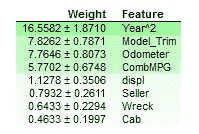
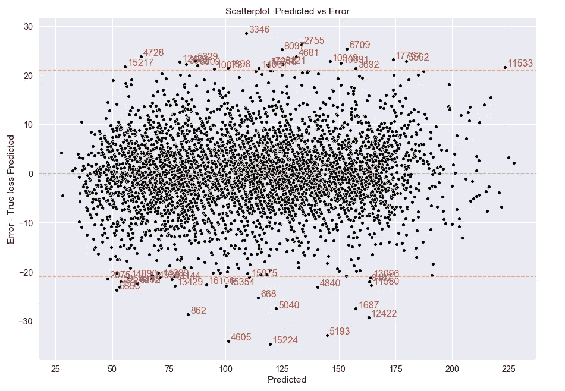
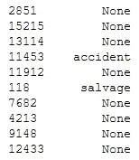
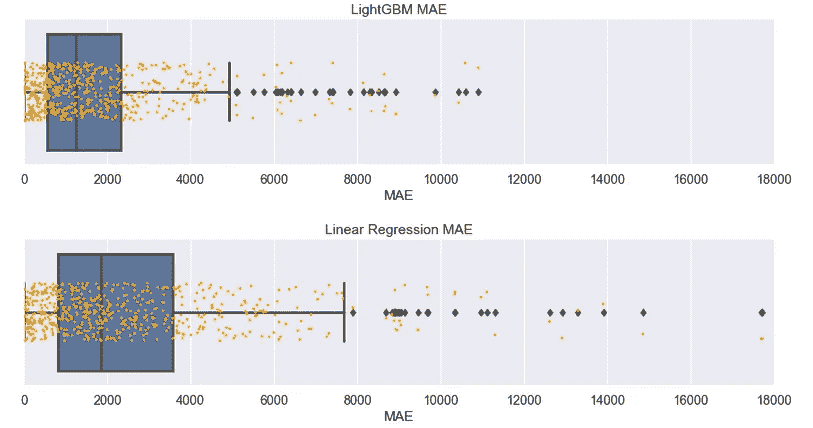

# 汽车价格预测从零开始！第 4 部分:算法和实验

> 原文：<https://medium.com/analytics-vidhya/auto-price-prediction-from-scratch-part-4-algorithms-and-experiments-e78aa2bf864f?source=collection_archive---------19----------------------->


## **为我们来之不易的数据建模**

我们想预测汽车价格。从一无所有开始，我们自己搜集和准备数据。在这里，我们找到有前途的算法，实验，并评估结果。

这是本系列文章 [**第 3 部分:特性工程**](/analytics-vidhya/auto-price-prediction-from-scratch-part-3-feature-engineering-a903e2509643) 的延续。请看 [**Part1:概述**](/analytics-vidhya/auto-price-prediction-from-scratch-part-1-overview-a4f331aaad00) 了解大图。

## 寻找有前途的算法和评分

在项目的早期，花很多时间调整预测算法可能很有诱惑力。当有很多转盘要转的时候，尤其如此。例如，决策树提升算法 LightGBM 有许多超参数。

不要玩弄所有用户指定的参数，而是用标准超参数训练许多快速、普通的模型。模型应该是不同的类型，例如线性、随机森林、神经网络和最近邻。将模型缩小到有希望的模型，避免不停地修改参数！

选择一个与您的问题相关的误差指标。我选择平均绝对误差(MAE ),因为它是直观的，我们希望最小化预测价格和真实价格之间的美元差异。让我们称这个度量为“分数”。

在拟合模型和根据测试数据进行预测时，您可以使用不同的评分方法。为什么？一个原因是某些评分方法对异常值更敏感。例如，均方误差(MSE)比 MAE 对大误差更敏感，因此模型拟合将会改变。

选择与目标一致的评分标准。例如，如果标记所有欺诈性信用卡交易(容忍一些“假警报”)至关重要，那么召回就是一个很好的指标。召回的定义是:

`Recall = (True Positives)/ (True Positives + False Negatives)`

它是正确的欺诈预测与所有欺诈的比率。越大越好，最大值不超过 1。在回忆=1 时，我们预测 100%的欺诈。

也许测试数据度量被转换为准确性，预测的子集匹配地面真相。

`Accuracy = correct predictions / total predictions`

您可以为测试数据计算多个指标，包括召回率和准确度，以便更好地理解二进制分类结果。

在训练期间，调整模型性能和稳定性的普遍方法是 k 倍[交叉验证](https://scikit-learn.org/stable/modules/cross_validation.html#cross-validation)。k 倍的平均分数反映了平均模型性能。k 倍的分数标准差反映了模型的变化。当然，稳定的模型变化较小。

## 分析和改进算法

最有前途的算法是 LightGBM、KNN 和 MLPRegressor。普通的最小二乘回归，线性回归，是我们的基线算法。(这里省略了 KNN 和 MLPRegressor。)

要问关键问题是:

*   哪些特性很重要？
*   我们如何修复算法错误？

排列重要性是量化特征重要性的直观方式。它提出了以下问题:如果一个特性不可用，模型的得分会差多少？但是，如果我们简单地放弃这个特征，模型必须重新调整。排列重要性回避了这个问题。该特征不是被重新训练，而是被混洗以将其转换成噪声。

排列重要性返回权重。权重越大，特征对模型得分的影响越大。下面我们看到**是 Year^2** 最重要的特征。

```
#Get feature importances using eli5.perm = PermutationImportance(lgb_model, n_iter=20).fit(testX, testY)display(eli5.show_weights(perm, feature_names = testX.columns.tolist()))
```



排列重要性—权重越高越重要。

当心在高度相关的特征上使用排列重要性。该子集的重要性可能较低。如果使用重要性阈值自动丢弃特征，则相关的特征可能会被一次性丢弃，而不管它们是否有用。以上，displacement 和 CombMPG 共线，那些重要的不要信！

残差有助于我们理解发生了什么样的建模误差。使用自动化工具快速获得剩余数据点背后的细节。以编程方式构建一个按量值排序的残差列表。残差应与原始要素和原始数据的全部细节相关联。如果索引在整个代码中保持不变，这很容易做到。

`Residual error = Absolute_Value(Actual Value-Predicted Value)`

通过绘制残差来可视化它们。残差图对于查看是否有任何东西看起来有趣(如异方差形状)至关重要。残差代码请看 GitHub 上的 [algo](https://github.com/jkmackie/car_price_prediction/tree/master/jupyter_notebooks) 笔记本。



用 Seaborn 绘制的残差图。橙色线标记了平均值的三个标准偏差。红色数字是熊猫的观察指数。

## 残差案例研究

一些最差的残差具有看似精确的特征和非常高的预测值。价格检查显示，与第三方网站上出售的汽车相比，这一预测是合理的。发生了什么事？CraigsList 的车被撞毁了！这就是实际价格低的原因。于是“残骸”这个功能就产生了。它搜索与沉船相关的关键词。



残骸特征。左边的数字是熊猫指数。

当然，如果缺少相关关键字，就无法捕获沉船状态。在这种情况下，残骸状态为“无”。这是模型预测中噪音/异常值的来源。

噪音的第二个来源是首付被列为价格。我们在模拟全价，而不是付款。如果我们以 1000 美元的价格安装一辆 12000 美元的汽车，我们如何建立一个成功的模型？权宜之计是:删除价格低于 5001 美元、包含“下跌”一词的列表。

逻辑一定要写仔细。我们不想把“down*”车和“市区”车搞混。正则表达式必须考虑这种情况。这种逻辑是脆弱的。例如，根据当前的逻辑，如果汽车列表低于 5001 美元，并且具有单词“楼下”，则列表可能会被错误地丢弃。

模型预测中的另一个噪音来源是环境保护局的规范。EPA 组合和排量数据是模型级的— **不是**修整级的。这意味着一辆普通的 2011 款野马和一辆 2011 款野马 GT 拥有相同的(中值)发动机排量。一个 trim 级别的规格数据库将会改善结果。

> 处理异常的更安全的方法是逐个检查，使用专家判断来确定它是否是真正的异常值。

超过平均值的三个标准偏差阈值的训练数据残差被丢弃。这个做过一次。相对于逐个调查每个异常，这是一种权宜之计。这可能会引起一些人的争议(我们*可能会*删除非常重要的数据)，这也是一个旋转木马。丢弃最差的会改变误差分布，因此新的误差可能会落在阈值之外！我的建议是进行实验，看看什么可以改善训练数据的交叉验证结果。忽略异常也可能带来好的结果！

处理异常的更安全的方法是逐个检查，使用专家判断来确定它是否是真正的异常值。数据集中的一辆卡车实际上是一辆起重机，因此可以安全地放下。

在测试数据中，只有看起来像真正离群值的异常可能会被丢弃。不要通过简单地从测试数据中丢弃不好的预测来扭曲模型的泛化性能。

为了加强项目纪律，**没有从测试数据**中删除异常值。下图中异常值的长尾包括改装车辆。例如，第三和第五大 LightGBM 异常值是 Chip Foose 改装和 Roush 增压车辆。如果我们能捕捉到从卡车升降机到增压器的售后改装，我们的模型将会改进。

## 修剪特征实验

排列重要性表明模型修剪是最重要的特征之一。我们能把功能做得更好吗？

这里有两个想法。我们看到一辆叫做野马 GT 跑车的车。我们是否应该有最多**两个**饰件，“GT”和“Coupe”(野马 _GTCoupe)而不是最多一个？这是一个最大值，因为可能会发现一个或“没有”微调。

我们是否应该按字母顺序排列 Trim，以便将 Mustang_GTCoupe 和 Mustang_CoupeGT 组合在一起？

```
maxi_trims_used = 1 or 2alphabetize = True or False
```

原来改变修剪顺序会丢弃信息。模型性能变差。

如果`maxi_trims_used`变为 2，则产生新的残差分布和新的可疑异常值。五分之一的数据被丢弃。发生丢弃是因为较少的修剪满足 40 个 Model_Trim 示例的最小样本阈值。

当在交叉验证中测量时，最大两个调整模型的美元 MAE 可变性稍小。相比之下，one Trim 模型保留更多的数据，并预测更多的微调。最终的模型坚持一个修剪。

## 模型噪音和限制

到目前为止，我们确定了两个噪声源:(1)具有干净标题的受损汽车和(2)在不同修整水平上固定的里程和位移特征。另外三个来源是(1)售后改装未被捕获。一辆 950 马力的野马；(2)坏数据；以及(3)缺少修剪。

售后改装很难捕捉到特征。车辆“抬”的是怪物卡车吗？或者，它是一个举升门或轮椅升降机？与库存版本相比，怪物升降机价格大幅上涨。标记“怪物电梯”的电梯功能在最终模型中被省略了，因为它很难有效地实现。

有些数据看起来很糟糕，但无法证明是错误的。比如有一辆 1998 年的福特 F-150，只有 22500 英里。没有车辆识别号来验证里程。这是测试数据残差图中的一个异常。

最后，缺失会降低算法性能。某些卖家忽略了修剪，因此修剪值为“无”。在美国，同型号汽车的装饰价格相差几千美元。这是材料差价。

## 哪款比较好？

如果 LightGBM 误差低于线性回归误差，那么 LightGBM 就是更好的独立模型，对吗？没那么快。

LightGBM 中的**平均**误差更低。但是，这个汇总统计并没有说明模型误差的**离差**。也许预测接近 75%的时间，误差被大的异常值抬高了？数据重叠的误差箱线图说明了预测的准确性。请参见下面的箱线图。

蓝框包含 25–75%的百分位数范围，称为四分位数范围(IQR)。将蓝框一分为二的垂直线是中值误差。蓝框两侧的两条垂直线是“胡须”,表示以下内容:

*   最大值=四分位数 3 + 1.5*IQR
*   最小值=四分位数 1-1.5*IQR



测试误差箱线图

最大值和最小值之外的数据点是可疑的异常值。

对于这两个模型，我们看到一半的测试预测，那些低于中位数的，是体面的。它们在两千美元以内。但是，超过最大晶须的预测是不好的！对于线性模型，最高约为 7800 美元。箱线图显示 LightGBM 是更好的模型。

## 异常残差和特征工程

LightGBM 模型做出了许多很好的预测，但是超过第三个四分位数(75%)的预测(误差超过 2400 美元)在商业环境中没有用。

此外，还存在可疑异常值的长尾。十个最大的 LightGBM 异常中有七个是 F-150 卡车。F-150 卡车有许多配置选项和售后改装。如前所述，有 Foose 改进的 F-150 和 Roush 增压野马。请记住，测试数据中没有离群值。

前两个异常的标题暗示有些不对劲:“2018 款福特 F-150 F150 F 150 XLT——中西部排名第一的二手车经销商！!"**子位置**栏写着“明尼苏达州卡车总部”。虽然卡车在 houston.craigslist.org 上市，这两个上市是明尼苏达州！这证明我们需要一个更好的位置特征，比如卖家的纬度和经度。

对于非结构化数据和售后改装，正确的特征工程是很困难的。

尽管测试数据异常，LightGBM MAE 在+/-1900 美元以内。

## 结论

准确完整的数据对于高质量的预测至关重要。它回避了我们遇到的一些建模问题。勤奋的特征工程可以改进模型。但是，这些特征可能很难提取。

这些文章为读者提供了收集、准备和评估数据的真实感受。数据有许多问题:遗漏，重复，错误的数据，以及更小粒度的位移和 MPG 数据。好消息是真实世界的数据很有启发性！习惯于玩具数据的读者可以一窥真实世界的建模挑战。

*我欢迎反馈！联系我的最好方式是发表评论。在 LinkedIn 上私信我:*[*http://www.linkedin.com/in/justinmackie*](http://www.linkedin.com/in/justinmackie)

## **尾注:**

[1]机器学习专家 Aurélien Géron 在*用 Scikit-Learn 动手进行机器学习中的建议，Keras & TensorFlow* ，第 758 页。这本易懂的书是一个极好的资源。

[2]所有欺诈的计数为(真阳性+假阴性)。相比之下，真阴性和假阳性都是合法交易！当然，真正的肯定是正确的欺诈预测。

[3]残差来自 LightGBM。对于最佳的线性回归预测，回归残差应单独分析，并单独丢弃。无论如何，回归都将是最糟糕的模型。跳过了独立的回归管道，因此视觉效果使用一致的数据！