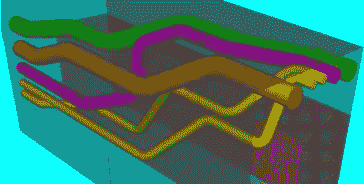
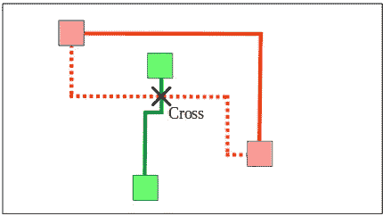
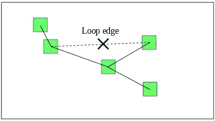
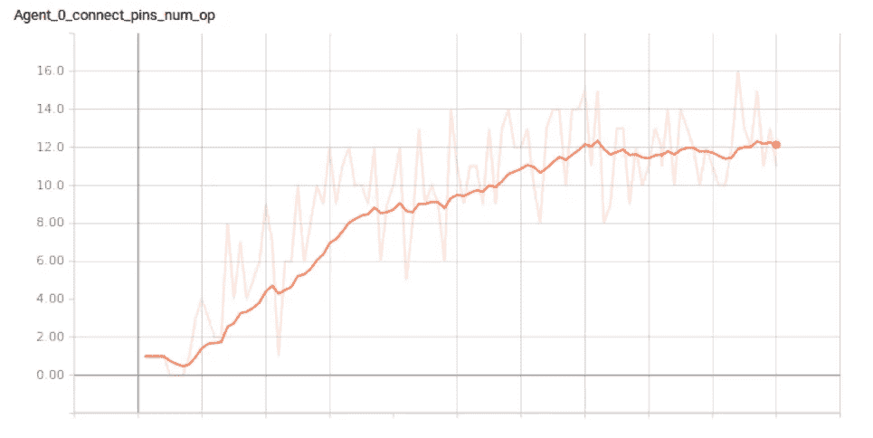
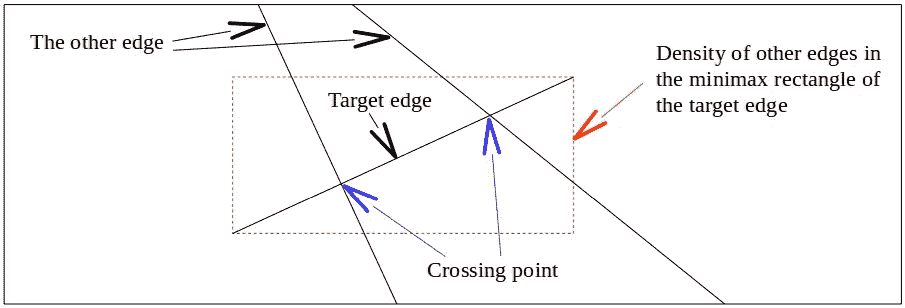
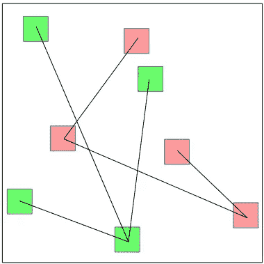
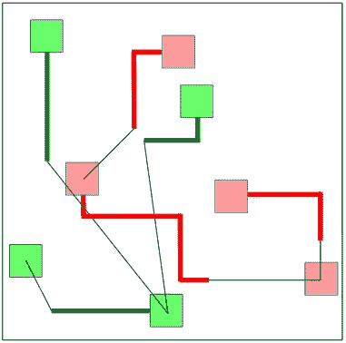
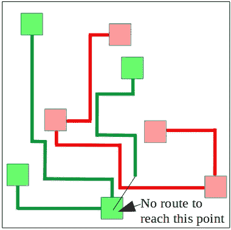
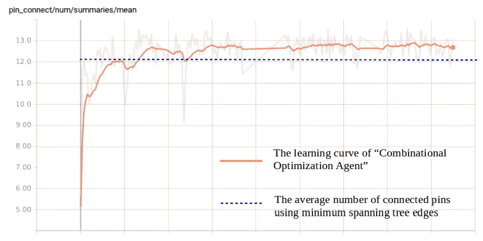

# 具有强化学习的自动路由器引擎

> 原文：<https://medium.com/analytics-vidhya/auto-router-engine-with-reinforcement-learning-39856853207d?source=collection_archive---------6----------------------->

# 介绍

这些天，我们到处都能看到许多人工智能应用。但是我感觉制造业的 AI 应用并不多见。所以我决定尝试将人工智能算法应用到 CAD 系统中，我相信这可能相对容易应用，因为它只由软件组成。

CAD 系统中的自动设计功能可以很好地适用于人工智能算法，因为在许多情况下，它们使用的启发式算法可以被人工智能算法所取代。

这一次，我选择了自动设计功能中的自动布线功能，它在许多 CAD 系统中使用，如管道 CAD 系统。

# 自动路由器要求

“自动布线器”是在要连接的点之间搜索路线的功能，它要求在有限的空间内以适当的路线形状连接尽可能多的点。

老实说，我不是自动路由器功能的专家，可能有很多人会说这与真正实用的自动路由器完全不同。

在这里，我定义了自动路由器功能的最低要求，我想，我试图实现它只有人工智能算法。

要求如下。

> 要求 A

找出要连接的点之间的最短路径，并禁止该路径与其他路径交叉。

> 要求 B

以找到使连接点的数量最大化的点组合。而点的组合应该构成图论中没有圈边的生成树边。

# 算法

经过几次反复试验，我选择了不同的人工智能算法来实现每个需求，并将它们组合成一个功能。
我为需求 A 选择了“平均场多智能体强化学习”算法，为需求 b 选择了“指针网络”算法。
两者都是用强化学习方法学习的。

## 平均场多智能体强化学习

从搜索一条特定路线的角度来看，其他路线成为障碍，需要搜索路线以达到避开这些障碍的目的。

这可以被认为是迷宫，哪些墙是其他路线。
而在同时搜索和创建多条路线的情况下，它需要解决发光的迷宫久而久之。
这一次，我想到了一个模型，将人工智能代理分配到要连接的每个点，每个人工智能代理发现并创建自己的路由，同时避开其他路由。

作为这些智能体的学习方法，我决定尝试使用多智能体强化学习算法，该算法可以将其他智能体作为环境的一部分来处理。
在考察了几种算法后，我选择了“均值场多智能体强化学习”算法。因为它可以在学习过程和玩耍过程之间改变 AI 智能体的数量。这对于自动布线功能是至关重要的，因为用 CAD 系统设计的每个对象都有不同数量的要连接的点。

此后，我称这个人工智能代理为“路径搜索代理”。我用下面这篇论文作为参考。

*   [https://arxiv.org/pdf/1802.05438.pdf](https://arxiv.org/pdf/1802.05438.pdf)

## 指针网络

我认为寻找使连接点的数量最大化的要连接的点的组合是图论中的组合优化问题。
图中的“边”是要连接的点，该问题的“最优值”是通过“路径搜索代理”创建的路径最大化连接点的生成树边的组合。
针对这个需求，我选择了“指针网络”算法。
但是我找不到用文中的神经网络结构来实现的方法，所以我做了如下小小的修改。

*   它不仅不能选择之前已经选择过的边，也不能选择图中形成回路的边。

此后，我把这个人工智能主体称为“组合优化主体”。
这是原纸。

*   https://arxiv.org/pdf/161·1.09940.pdf

# 环境

## 实验环境

对于学习和游戏环境，我使用了“平均场多代理强化学习”一文中介绍的“MAgent(https://github . com/geek-ai/MAgent)”环境，并且我还使用了本文的源代码(https://github.com/mlii/mfrl)作为基础。

“MAgent”是一个可以轻松定制 AI 智能体属性和奖励函数的环境。虽然我需要修改这个环境的一些基本组件，谢天谢地，我可以节省很多编码时间。
我要在重构后打开我的代码。所以请让我知道你是否对这份报告感兴趣。

## 机器学习库

张量流 1.8.0

## PC 规格

*   CPU:英特尔酷睿 i7–8750h CPU
*   GPU:采用 Max-Q 设计的 NVIDIA GeForce GTX 1070
*   内存:16GB
*   操作系统:LTS Ubuntu 16 . 04 . 5

# 实验

正如我上面提到的，有两种人工智能代理。这些人工智能代理是分开训练的，但他们有一些联系。
首先训练“路径搜索代理”。然后训练“组合优化智能体”。
因为计算“组合优化代理”的奖励函数需要经过训练的“路径搜索代理”的输出。

## 路线搜索代理

学习环境详情如下。

*   网格区域的大小:50x50
*   一个图形中的点(顶点)的数量:5
*   图形的数量:4

在每次学习过程中，顶点的位置是随机设置的。
在这个 agent 的学习过程中，我用构成最小生成树(此树的代价是边长)的边作为待连接的点。
因为我不能使用“组合优化代理”产生的边，因为“组合优化代理”在这一点上还没有学会。

报酬获取曲线如下。1 小时左右收敛。

很难测量所学习的“路线搜索代理”的性能，因为没有合适的基准算法或软件能够用作标准，但是可以通过视觉确认看到几个质量标志。

*   在大多数情况下，只要有一条路径没有被其他路径阻挡，点就是连通的。
*   路线似乎是由代理人之间竞争的结果决定的。(找不到合作的效果。)

# 组合优化代理

“组合优化代理”有四种输入信息。

*   边缘的位置(起点和终点的坐标)
*   边缘长度
*   边缘交叉点的数量
*   其他边的密度

输出信息是边的组合。
奖励是“路线搜索代理”完成的连接点数。“路径搜索代理”使用“组合优化代理”创建的边的组合作为输入。

1.待连接的点对由“组合优化代理”的输出决定。

2.“路线搜索代理”开始搜索并同时创建自己的路线。

3.在搜索和创建所有可能的路线后，连接点的数量被用作对“组合优化代理”的奖励。

网格区域的大小和图中顶点的数量与“路径搜索代理”的学习环境相同。
我通过比较使用构成最小生成树的边的组合(这是在“路径搜索代理”学习过程中使用的边组合)的连接点数量和使用“组合优化代理”输出的边的连接点数量，来测量该代理的性能。
奖励获取曲线与比较的结果如下。

奖励获取曲线在 10 小时左右收敛。

这是我记录的真实图像。

[https://youtu.be/mgFv4MpAQepU](https://youtu.be/mgFv4MpAQpU)

# 未来的工作

## 人工智能算法

有一些内容表现不错，但也有一些内容需要改进。例如，如果一个“搜索路线代理”与其他代理合作，他们的表现会好得多。可能需要改进输入数据和奖励函数，并采用其他多智能体强化学习方法。

## 自动路由器

这一次，我认为一个汽车外，有一个非常简单的要求，但其他要求如下，必须是为了开发实用的产品。

*   适应三维环境。
*   构成斯坦纳树的边的确定使得图中有分支点。
*   创建适当的路线形状。

# 结论

如上所述，有很多事情需要改进，但如果有足够的时间开发，其中一些似乎有可能用人工智能算法来实现。
我可以找到一些已经显示出足够潜力的东西。例如，由“组合优化代理”创建的边组合看起来几乎是所看到的最佳组合。
开发一款与当前(基于规则的)auto-outer 具有相同性能水平的产品可能需要很多时间，但即使在这一点上，将一些人工智能算法与当前产品相结合来弥补缺陷也是一种可能的选择。