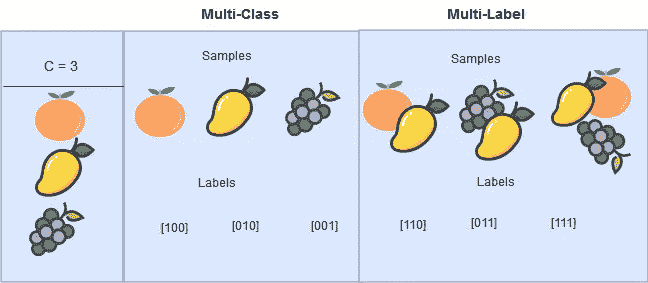
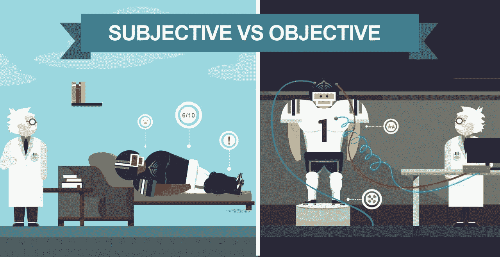
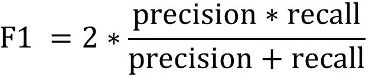
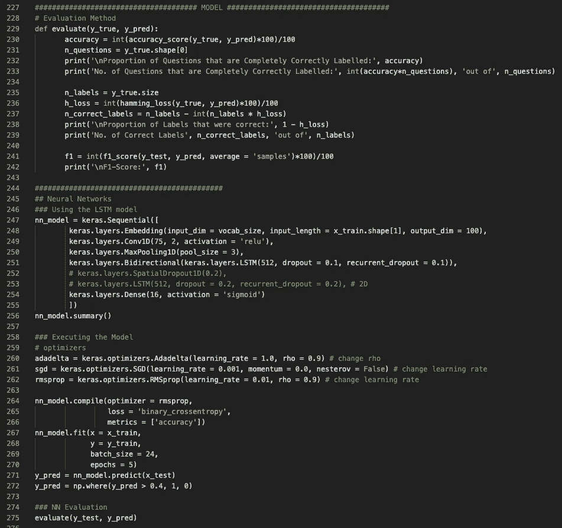
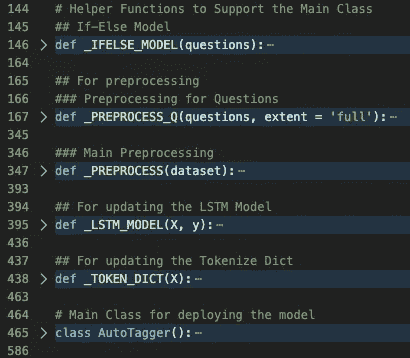
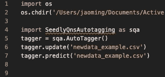
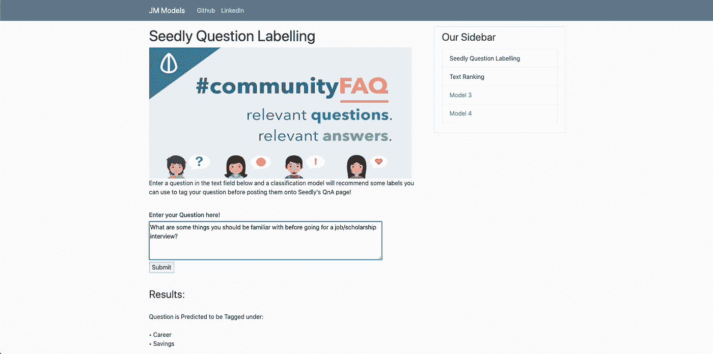

# 使用深度学习自动标记 Seedly 上的问题

> 原文：<https://medium.com/analytics-vidhya/auto-tagging-seedlys-questions-with-deep-learning-2ba597986200?source=collection_archive---------18----------------------->

来源:Kelvestor

# 介绍

一个月前，我和我的朋友开始了一个项目，为 Seedly T1 自动化问题标记过程。由于最初的标记过程是一项手动任务，创建一个自动化的标记系统肯定有助于节省大量的时间和人力。除了自动化带来的明显的[好处](http://blog.soliditech.com/blog/7-benefits-of-business-process-automation)，这种自动标记系统还通过减少用户标记问题所花费的时间和精力来改善用户体验，并且它会以更高的准确性这样做。快进到今天，我们的自动标记系统已经完成，并取得了 90% 的 [**F1 分**](https://deepai.org/machine-learning-glossary-and-terms/f-score) **！虽然 Seedly 还没有在他们的网站上正式部署我们的系统，但我想概述一下我在这个项目中的一些想法和思考过程。**

本文将概述我对这四个要点的想法和发现:

**1。多个标签**

**2。客观和主观标签**

**3。标签不平衡**

**4。易于部署**

# 多个标签

在我作为数据科学家的学术旅程中，为每个数据点处理多个标签并不常见。为了避免使用术语，就机器学习分类问题而言，主要有两种场景——*多类*和*多标签*。多类别问题是指将某样东西从多个类别中归为一个类别。然而，*多标签*问题意味着能够一次将某样东西从多个类别中分成多个类别。Seedly 的问答(Q & A)页面有超过 30 个类别，每个问题可以一次标记为一个以上的类别。这就直接把这个项目放到了*多标*的地盘！然而，在使用*多标签*场景时，出现了相当多的情况。

资料来源:EurLex

首先，多标签场景对我们能够用作自动标记系统基础的机器学习模型施加了限制。这背后的直觉其实比我想象的要简单。多类问题意味着每一类都是互相排斥的。一旦选择了一个类别，显然其他类别就不会被选择，甚至不会被考虑。这对于计算机来说感觉很典型，因为这种模拟二进制决策。仔细想想，二进制分类(1 或 0)是只有两个类别的特殊多类场景。如果您将类别的数量扩展到 3，它看起来就像这样(2 或(1 或 0))。如果它不是 2，那么它不是 1 就是 0。

另一方面，多重标签处理事情的方式有点不同。标记数据点时考虑其他标签是有意义的。更形象的例子，看看这只猫。

来源:AskIdeas

假设我们有这些标签来标注一只猫可能的颜色组合:*【白色、黑色、灰色、橙色】*。现在假设我们知道猫身上有橙色。你认为这些信息会有助于搅动其他标签为阳性的可能性吗？以我目前对猫的了解，我会说我以前从未见过灰色和橙色的猫。因此，如果我知道橙色存在，我会说灰色也存在于猫身上的可能性很低，而白色或黑色的可能性很高！因此，显示了与多类相比，多标签问题的复杂性增加。

第二，由于标签之间的交叉引用，标签准确性出现了一些问题。这完全是由于问题本身的性质。鉴于 Seedly 主要处理金融话题，我们发现他们的大多数关键词也是这种类型的。因此，使得系统难以辨别主财务类别的各种子类别的模式。例如，一个关于*储蓄*的问题可能看起来像是一个关于*退休*的问题，即使这不是本意。

这也提出了一些有趣的问题。如果一个用户问的问题只打算在*储蓄下*使用暗示它也在*退休*的关键字，客观地说，它也应该在*退休*下吗？

# 客观和主观标签

来源:融合体育

我们必须输入机器学习系统的数据只包括用户自己在问题上贴的标签。这肯定不是最好的安排，因为用户可能没有正确地标记该问题，正如任何人的决定一样，这是主观的。因此，如果我们将这种用户倾斜的数据输入自动标记系统，它只会学习用户的标记模式，而不会学习客观上正确的标签。

虽然从直觉上来说，客观比主观更有意义，但是利用用户输入也是有用的。假设主观数据是[让机器学习模型如此有用的东西](https://www.mathworks.com/discovery/machine-learning.html)开始！通过主观数据，机器将能够学习用户的模式，以“理解”为什么做出某些决定，或者为什么用户给问题贴上这样的标签。这完全假设用户确实知道问题应该被标记为什么，不应该被标记为什么。如果我们假定他们是无辜的，那么就很容易看出这些主观标签的实际价值。

最终，在我们考虑主观标签的同时，找到一种客观标签问题的方法肯定是最好的！这就是为什么我们在机器学习模型的基础上开发了一个“if-else”模型，它可以根据相应类别的关键词客观地标记问题。例如，如果问题中有单词“save ”,模型会将其标记为“Savings”。否则，它不会。这将有助于我们生成一组客观的标签，然后我们可以将其与用户标签合并，以训练自动标记系统。

# 标签不平衡

来源:datascience.aero

在 30 多个类别中，每个问题平均分为 3-5 个类别。因此，这种不平衡使得很难评估系统的准确性。例如，假设有 30 个类别，系统会将问题标记为 1，如果它在该类别中，则标记为 0。给定一个只属于 5 个类别的特定问题，如果系统只正确标记了 5 个类别中的 4 个，并继续正确标记剩余的 25 个类别，您认为这种分类有多准确？看到这一点的一些可能的方法是:

1.30 个标签中有 29 个是正确的(96.7%)，

2.在 5 个被认为是 1 的问题中，有 4 个是正确的(80%)。这也被称为*召回*

3.在标记为 1 的 4 个标记中，所有标记都正确(100%)。这也被称为*精度*

但是如果你使用传统的*准确度*度量，这将被认为是 **100%不正确的**分类。

来源:[培养基](/@raghaviadoni/evaluation-metrics-i-precision-recall-and-f1-score-3ec25e9fb5d3)

上面提到的第一种方法(具有 96.7%的方法)代表了一种称为汉明损失的度量，该度量着眼于整体上正确的标签的数量。然而，如果平均只有 3-5 个类别被标记为 1，这是没有意义的。这意味着，即使我们所有的标签都是 0，我们也只能得到大约 25/30 (83%)或更高的评估值。考虑到价值，这可能看起来很棒，但并不能真正代表我们想要评估的东西，即系统在预测标记为 1 的正确类别方面有多好。

精确度和召回率与我们希望如何评估我们的系统更有共鸣。回忆与给所有类别贴上 0 标签的直觉斗争。它查看实际上应该标记为 1 的类别，并将它们与那些相同类别的预测标签进行比较。因此，如果我们都是 0，那么召回率将为 0%。另一方面，Precision 反对将更多类别标签设为 1 的另一面。它只是查看所有标记为 1 的标签，并将它们与应该标记为 1 的实际类别进行比较。因此，如果我们将所有 30 个类别标记为 1，只有 5 个类别实际上为 1，则精度将仅为 5/30 (16.6%)。对我们来说，值得庆幸的是，有一个被称为 F1 分数的指标，它同时利用了召回率和精确度。

资料来源:Qualtrics

基本上，该等式显示了 F1 分数度量如何考虑精确度和召回率。只有当这两个值都是 100%时，F1 分数才会是 100%。反之亦然，如果精确度或召回率有所下降，F1 的分数就会受到影响。正如在介绍中提到的，我们的系统设法达到了 90%的 F1 分数！

# 易于部署

编程不是每个人都有的技能。因此，在我们的项目中，以一种更容易使用和理解的方式包装系统的需求似乎是显而易见的。然后，这需要相当多的代码清理和组织，以适应各种形式的“包装”。老实说，我很喜欢这个过程，因为它感觉很有疗效，无论如何，这是这个自动标记系统的“包装”的 3 次迭代。

在这张图片中，你可以看到代码的原始程度，如果你没有编程经验，这可能会让你感到难以置信。即使你真的知道如何编码，清理并更好地组织它肯定也会有所帮助。

来源:我自己的代码

在下一张图中，工作代码被塞进一个单独的包/模块中，正如你在左边看到的。这个包/模块可以用几行代码来标记问题，如右图所示。很明显，总的来说，所有的东西都更干净，更容易使用！

来源:我自己的代码

在最后一张图中，代码被放在该网站的后端，并离开该网站以展示如何使用这样的自动标记系统。如果有任何意义的话，代码类似于音乐会中的后台工作人员，而网站就像音乐会上的表演者。从第一次迭代开始，如上所示，不需要任何懂代码的人就能使用这个自动标记模型。

来源:我自己的网站

# 结论

瞧啊。差不多就是这样。看到机器学习和编码如何被用于这样的应用程序肯定很有趣。然而，寻找可以通过使用机器学习来改进的东西并不是一项简单的任务。坚持现状总是更舒服，但如果我们这样做，我们很少会看到进步。希望在这个项目之后，我不仅提高了我的编码和解决问题的技能，还发现了世界上可以从编码、机器学习和人工智能中受益的方面。

谢谢你读到这里，注意安全！