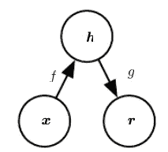
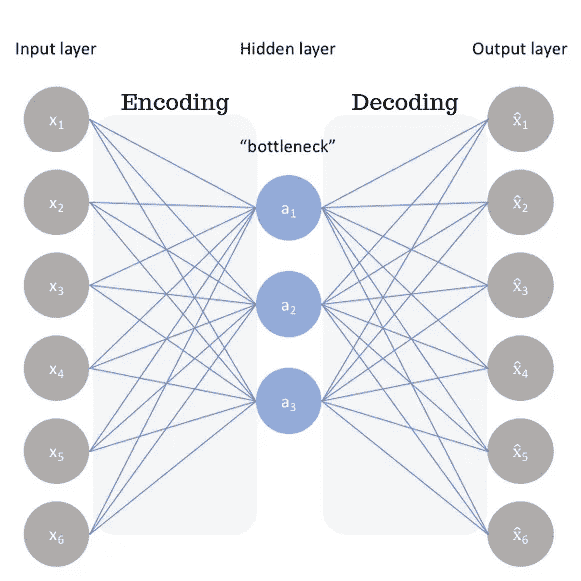
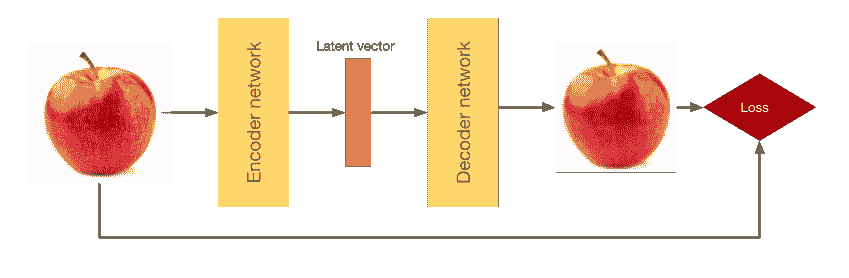
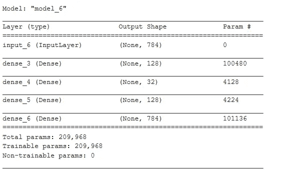
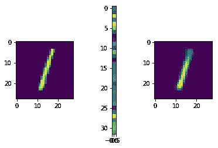
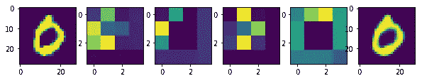
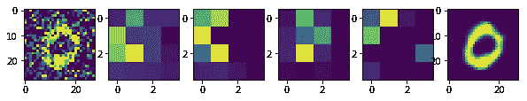

# 自动编码器-去噪理解！

> 原文：<https://medium.com/analytics-vidhya/autoencoders-denoising-understanding-b41315fd7fa?source=collection_archive---------9----------------------->

通过在 MNIST 数据集上训练一个模型来对数字进行分类，在现有的框架下确实是一件有趣的事情，将其投入生产将会非常棒。

代号:[https://github.com/parmarsuraj99/Autoencoders](https://github.com/parmarsuraj99/Autoencoders)

我们知道神经网络可以被视为**【通用函数估值器】**，意味着我们可以将它们映射到正确的标签上。这就是所谓的监督学习方法。

如果我们没有标签呢？我们只剩下图像了？我们能用它们做什么？这越来越有趣了。我们可以训练一个网络来提高图像的分辨率，消除噪声，甚至生成新的样本。在某种程度上，将它们压缩到网络隐藏层的较低维度。

# 自动编码器



[深度学习书籍](https://www.deeplearningbook.org/contents/autoencoders.html)

> "自动编码器是一种神经网络，它被训练成试图将其输入复制到其输出."-深度学习书籍

它有一个学习输入表示的隐藏层。它可以被视为两部分网络:编码器部分， *h=f(x)* 和解码器部分 *r=g(h)* 。目标是学习 *g(f(x))=x* 。但是我们不希望它简单地接受一个输入并产生精确的输出。没用的！相反，我们希望它接近输出。也就是说，要学会用一种能够产生近似输出的方式来表示输入。也就是学习输入的中间表示。

传统上，它们被用于降维和主成分分析，但现在通过稍微改变架构，它们被视为生成模型的前沿。



自动编码器的代表性体系结构

在这里，我们可以看到，我们正在尝试首先学习将输入映射到瓶颈，然后将瓶颈映射到输出。这是一个端到端的过程。

**编码器:**取一个输入 ***x*** (可以是图像、文字嵌入或语音数据)并产生一个输出 ***h*** 。例如，想象一个尺寸为 32x32x1(HxWxC)的图像，它被缩小为 3x1 输出。*把这个想象成 7zip 之类的压缩软件。*

**解码器:**取一个输入 ***h*** (密集表示)并产生一个输出 ***~x.*** 例如，3x1 矢量作为输入产生一个 32x32x1 的图像，它类似于 ***x.*** *它就像从一个 zip 文件中恢复原始数据。*

那么，我们可以使用什么类型的数据呢？这有什么应用？

1.  我们已经看到，编码器可以产生低维数据，这可以用于**降维**，非常类似于主成分分析(PCA ),假设数据来自相同的域(相似的数据)。
2.  它近似图像，所以我们可以将一个有噪声图像映射到一个去噪声图像。从而作为一个**降噪器**！
3.  由于尺寸已经减少，我们可以更快地找到相似的图像比全尺寸的图像。这就像**的语义哈希法。**
4.  以对抗方式训练的自动编码器可以用于**生成**目的。



简单的自动编码器插图

理想的自动编码器模型平衡了以下几点:

*   对输入足够敏感以精确地重建。
*   对输入不够敏感，模型不会简单地记忆或过度拟合训练数据。

# **深度自动编码器**

我们不应该局限于只使用一个隐藏层。这是一个深度完全连接的网络，它获取并处理扁平化的 MNIST 图像。

这里我们将使用 MNIST 数据集。这是手写数字的黑白 28×28 图像，因为它将易于构建和理解简单的自动编码器网络。

```
(x_train, y_train), (x_test, y_test) = mnist.load_data()
x_train = x_train.astype('float32')/255.0
x_test = x_test.astype('float32')/255.0
x_train = x_train.reshape(len(x_train), (x_train.shape[1]*x_train.shape[2]))
x_test = x_test.reshape(len(x_test), (x_test.shape[1]*x_test.shape[2]))
```

深层网络图像的扁平化和规范化加载与处理。

```
encoding_dim = 32input_img = Input(shape = (784, ))
encoded = Dense(128, activation='relu')(input_img)
encoded = Dense(encoding_dim, activation='relu')(encoded)decoded = Dense(128, activation='relu')(encoded)
decoded = Dense(784, activation='sigmoid')(decoded)autoencoder = Model(input_img, decoded)encoder = Model(input_img, encoded)
encoded_input = Input(shape=(encoding_dim, ))
decode_layer1 = autoencoder.layers[-2]
decode_layer2 = autoencoder.layers[-1]
decoder = Model(encoded_input, decode_layer2(decode_layer1(encoded_input)))hist = autoencoder.fit(x_train, x_train, epochs=10, validation_data=(x_test, x_test))
```

一个简单的全连接网络，它采用 784 个扁平像素，并使其流经 128 个神经元，然后流经 32 个神经元。这 32 个神经元的激活是外部潜在空间的表征。然后由 128 和 784 个神经元顺序解码。然后我们再把它重塑成 28x28 的图像。

在这里，我们试图迫使编码器以这样一种方式压缩图像，即解码器可以从这个编码表示(潜在空间)中重建它。



模型摘要

虽然损耗在减少，但是这里需要注意的一点是，重建是有损耗的。



可视化。左:原始图像，中:特征可视化，右:重建

# 使用卷积神经网络获得更好的结果

CNN 已经被证明非常擅长处理图像数据。因此，我们可以直接将图像馈送给 CNN 编码器和解码器，而不是将图像扁平化。通过使用它们，我们可以期望看到更好的结果。


潜在空间自动编码器

这里的想法是，通过使用过滤器学习更多的特征，通过学习更好的方式来表示潜在空间的输入，ConvNets 学习得更好。

```
def CNN_AE():
    input_img = Input(shape=(img_width, img_height, 1))

    # Encoding network
    x = Conv2D(16, (3, 3), activation='relu', padding='same', strides=2)(input_img)
    x = Conv2D(32, (3, 3), activation='relu', padding='same', strides=2)(x)
    encoded = Conv2D(32, (2, 2), activation='relu', padding="same", strides=2)(x)
# Decoding network
    x = Conv2D(32, (2, 2), activation='relu', padding="same")(encoded)x = UpSampling2D((2, 2))(x)
    x = Conv2D(32, (3, 3), activation='relu', padding='same')(x)
    x = UpSampling2D((2, 2))(x)
    x = Conv2D(16, (3, 3), activation='relu')(x)
    x = UpSampling2D((2, 2))(x)
    decoded = Conv2D(1, (3, 3), activation='sigmoid', padding='same')(x)

    encoder = Model(input_img, encoded)

   return Model(input_img, decoded), encoder
```

完整代码在 github repo 中。可以在浏览器的 colab 中打开。



潜在空间表征的 CNN 声发射结果

我们可以清楚地看到，与以前的深度 AE 相比，重建结果更好。我们可以看到潜在空间表征，它是输入的压缩表征。

每个图像都通过相同的编码器功能并被压缩。这导致更小尺寸的图像。我们可以用更少的计算来执行聚类。

# 有趣的应用——图像去噪

因为 AE 可以学习将图像表达到潜在空间中，并从中重建。它还可以学习去除图像中的噪声。例如，如果我们训练它将嘈杂的图像映射到清晰的图像，它可能会学习忽略噪声并进行重建。

```
noise_factor = 0.5
x_train_noisy = x_train + noise_factor * np.random.normal(loc=0.0, scale=1.0, size=x_train.shape) 
x_test_noisy = x_test + noise_factor * np.random.normal(loc=0.0, scale=1.0, size=x_test.shape)x_train_noisy = np.clip(x_train_noisy, 0., 1.)
x_test_noisy = np.clip(x_test_noisy, 0., 1.)cnn_hist = model_cnn.fit(x_train_noisy, x_train, validation_data=(x_test_noisy, x_test))
```



噪声图像重建

在笔记本上，我已经把从前面的例子中学到的东西转移了。也就是说，使用相同的模型，这样它可以学习得更快。我们可以在上面的图中观察到表示的变化。这只是自动编码器的一个应用。

它似乎工作得很好。如果您将此过程扩展到更大的 ConvNet，您可以开始构建文档去噪或音频去噪模型。

# 序列到序列

如果您输入的是序列，而不是矢量或 2D 图像，那么您可能希望使用一种能够捕捉时间结构的模型(如 LSTM)作为编码器和解码器。要构建基于 LSTM 的自动编码器，首先使用 LSTM 编码器将输入序列转换为包含整个序列信息的单个向量，然后重复这个向量`n`次(其中`n`是输出序列中的时间步长数)，并运行 LSTM 解码器将这个常量序列转换为目标序列。

# 可变自动编码器

我们没有让神经网络决定如何在潜在空间中表示，而是对其进行了限制。意味着，限制潜在空间的表达，这样我们就可以用很少的参数进行重建。我们稍后将对此进行探讨。

# 参考

[](https://blog.keras.io/building-autoencoders-in-keras.html) [## 在 Keras 中构建自动编码器

### 在本教程中，我们将回答一些关于自动编码器的常见问题，我们将涵盖代码的例子…

blog.keras.io](https://blog.keras.io/building-autoencoders-in-keras.html) 

https://www.deeplearningbook.org/contents/autoencoders.html

【https://github.com/parmarsuraj99/Autoencoders 