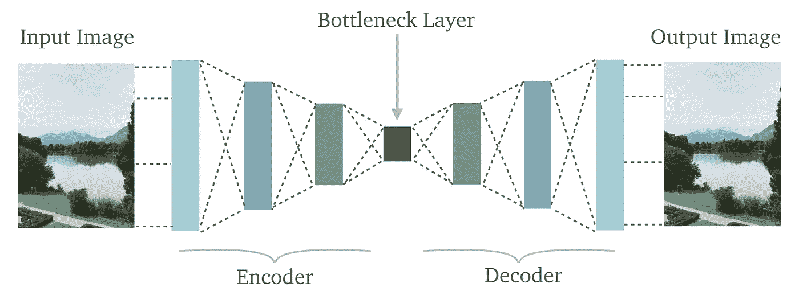
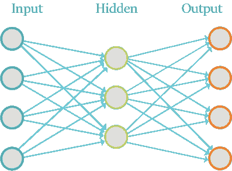
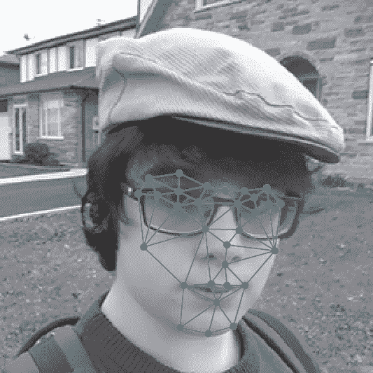
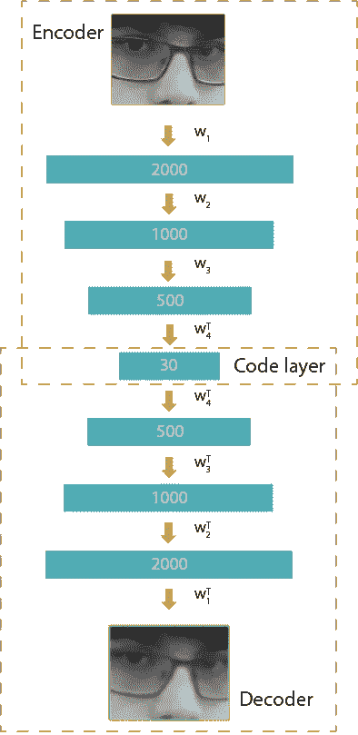
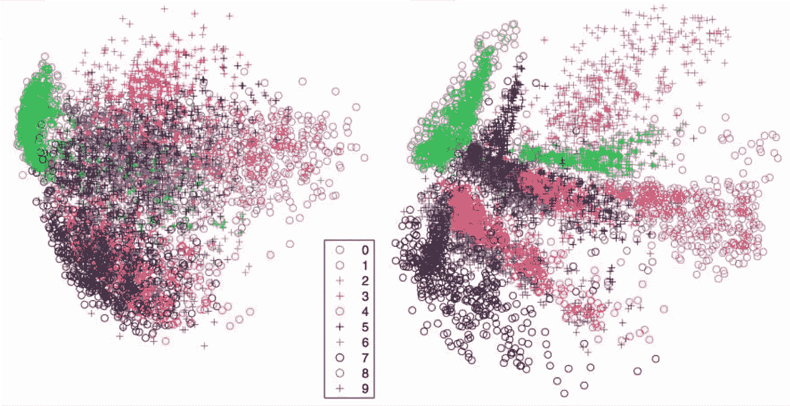
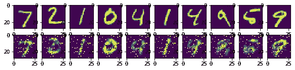

# 自动编码器:无监督人工神经网络(ANN)

> 原文：<https://medium.com/analytics-vidhya/autoencoders-unsupervised-artificial-neural-networks-ann-a276089f0053?source=collection_archive---------10----------------------->



> 欢迎来到这个关于自动编码器的博客。在这篇博客中，你将会找到关于什么是自动编码器，它是如何工作的解释，并看到自动编码器在 **TensorFlow** 中的实现。

# 目录

1.  介绍
2.  特征提取和降维
3.  自动编码器结构
4.  表演
5.  密码

# 1.介绍

一个自动编码器，也被称为**自动联想器**或**空竹网络**，是一个**人工神经网络**，用于重建给定的输入。它获取一组**未标记的**输入，对它们进行编码，然后试图从中提取最有价值的信息。用于**特征提取**，**数据学习生成模型**，**降维**，可用于**压缩**。

G. E. Hinton 和 R. R. Salakhutdinov 在 2006 年发表了一篇名为 [**用神经网络**](https://www.cs.toronto.edu/~hinton/science.pdf) **减少数据维度的论文，显示出比多年来改进其他类型的网络更好的结果，是在**神经网络**领域的突破。**

> “基于**受限玻尔兹曼机器**的自动编码器被用于一些最大的深度学习应用中。他们是**深度信念网络(DBN)** 的组成部分



自动编码器

# **2。特征提取和降维**

**Nikhil Buduma** 在 [**KdNuggets**](http://www.kdnuggets.com/2015/03/deep-learning-curse-dimensionality-autoencoders.html) 中给出了一个例子，很好的解释了这种**神经网络**的效用。

比如说你想提取摄影中的人的情绪。以下面这张 256x256 像素的灰度图片为例:


但是当使用这张图片时，我们开始遇到一个瓶颈！因为这个尺寸为 **256x256 像素**的图像对应于一个尺寸为 **65536 的输入向量！**如果我们使用传统手机相机生成的图像，即生成 **4000 x 3000** 像素的图像，我们将有**1200 万** **个维度来分析。**:

> 正如所见，**它呈指数级增长！**回到我们的例子，**我们不需要使用所有的 65，536 个维度来对情绪进行分类**。人类根据一些特定的面部表情、一些关键特征来识别情绪，比如嘴的形状、眉毛的形状。



# 3.自动编码器结构



自动编码器结构

> **一个*自动编码器*可以分为两部分:**
> 
> ***1。编码器:*******编码器*需要压缩输入**的表示。在这种情况下，我们将**将演员面部的尺寸**、**从 2000 个尺寸减少到只有 30 个尺寸**，通过我们的编码器的层运行数据。*
> 
> ***2*。解码器:*******解码器*的工作原理与编码器网络**相反。**尽可能接近**地重新创建 **输入**、**。这在训练中起着重要的作用，因为它迫使自动编码器在**压缩的**表示中选择最重要的特征。****

# **4.表演**

****

****左:主成分分析**和**右:自动编码器****

**该图像摘自 G. E. Hinton 和 R. R. Salakhutdinovcomparing 的[论文](https://www.cs.toronto.edu/~hinton/science.pdf)，关于 500 位 MNIST 的二维简化，左边是 PCA，右边是 autoencoder。我们可以看到，自动编码器为我们提供了更好的数据分离。**

# **5.密码**

```
**#from __future__ import division, print_function, absolute_import**import tensorflow as tf
import numpy as np
import matplotlib.pyplot as plt
%matplotlib inline**# Import MINST data
**from tensorflow.examples.tutorials.mnist import input_data
mnist = input_data.read_data_sets(“/tmp/data/”, one_hot=True)****
```

> **现在，让我们给出神经网络将要使用的参数。**

```
****learning_rate = 0.01
training_epochs = 20
batch_size = 256
display_step = 1
examples_to_show = 10**# Network Parameters
**n_hidden_1 = 256 # 1st layer num features
n_hidden_2 = 128 # 2nd layer num features
n_input = 784 # MNIST data input (img shape: 28*28)**# tf Graph input (only pictures)
**X = tf.placeholder(“float”, [None, n_input])****weights = {
 ‘encoder_h1’: tf.Variable(tf.random_normal([n_input, n_hidden_1])),
 ‘encoder_h2’: tf.Variable(tf.random_normal([n_hidden_1, n_hidden_2])),
 ‘decoder_h1’: tf.Variable(tf.random_normal([n_hidden_2, n_hidden_1])),
 ‘decoder_h2’: tf.Variable(tf.random_normal([n_hidden_1, n_input])),
}
biases = {
 ‘encoder_b1’: tf.Variable(tf.random_normal([n_hidden_1])),
 ‘encoder_b2’: tf.Variable(tf.random_normal([n_hidden_2])),
 ‘decoder_b1’: tf.Variable(tf.random_normal([n_hidden_1])),
 ‘decoder_b2’: tf.Variable(tf.random_normal([n_input])),
}****
```

> **现在我们需要创建我们的编码器。为此，我们将使用 s 形函数。s 形函数通过这种类型的网络提供了很好的结果。这是因为具有非常适合反向传播的良好导数。我们可以使用 sigmoidal 函数创建编码器，如下所示:**

```
**# Building the Encoder
**def encoder(x):
**    # Encoder first layer with sigmoid activation #1
 **layer_1 = tf.nn.sigmoid(tf.add(tf.matmul(x, weights['encoder_h1']), biases['encoder_b1']))** # Encoder second layer with sigmoid activation #2
 **layer_2 = tf.nn.sigmoid(tf.add(tf.matmul(layer_1,  weights['encoder_h2']), biases['encoder_b2']))
    return layer_2****
```

> **而解码器:你可以看到编码器中的 layer_1 就是解码器中的 layer_2，反之亦然。**

```
**# Building the decoder
**def decoder(x):
**    # Decoder first layer with sigmoid activation #1
 **layer_1 = tf.nn.sigmoid(tf.add(tf.matmul(x, weights['decoder_h1']),biases['decoder_b1']))** # Decoder second layer with sigmoid activation #2
 **layer_2 = tf.nn.sigmoid(tf.add(tf.matmul(layer_1, weights['decoder_h2']), biases['decoder_b2']))
    return layer_2****
```

> **让我们构建我们的模型。在变量`**cost**` 中，我们有损失函数，在变量`**optimizer**` 中，我们有用于反向传播的梯度。**

```
**# Launch the graph
# Using InteractiveSession (more convenient while using Notebooks)
**sess = tf.InteractiveSession()
sess.run(init)****total_batch = int(mnist.train.num_examples / batch_size)** # Training cycle
**for epoch in range(training_epochs):
** # Loop over all batches
 **for i in range(total_batch):
 batch_xs, batch_ys = mnist.train.next_batch(batch_size)** # Run optimization op (backprop) and cost op (to get loss value)
 **_, c = sess.run([optimizer, cost], feed_dict={X: batch_xs})** # Display logs per epoch step
 **if epoch % display_step == 0:
 print(“Epoch:”, ‘%04d’ % (epoch+1),
 “cost=”, “{:.9f}”.format(c))****print(“Optimization Finished!”)****
```

**输出:**

```
****Epoch: 0001 cost= 0.182728916
Epoch: 0002 cost= 0.150434598
Epoch: 0003 cost= 0.130958572
Epoch: 0004 cost= 0.125098571
Epoch: 0005 cost= 0.119374141
Epoch: 0006 cost= 0.116029739
Epoch: 0007 cost= 0.114480294
Epoch: 0008 cost= 0.110542893
Epoch: 0009 cost= 0.107315414
Epoch: 0010 cost= 0.103023507
Epoch: 0011 cost= 0.101529025
Epoch: 0012 cost= 0.097410828
Epoch: 0013 cost= 0.093311585
Epoch: 0014 cost= 0.093811013
Epoch: 0015 cost= 0.090760238
Epoch: 0016 cost= 0.089178301
Epoch: 0017 cost= 0.087290406
Epoch: 0018 cost= 0.085913278
Epoch: 0019 cost= 0.086014777
Epoch: 0020 cost= 0.084903874
Optimization Finished!****
```

> **上面我们已经用了 20 个纪元。**
> 
> **现在，让我们为我们的**测试**应用**编码器**和**解码器**。**

```
**# Applying encode and decode over test set
**encode_decode = sess.run(
 y_pred, feed_dict={X: mnist.test.images[:examples_to_show]})**# Lets Let’s simply visualize our graphs!# Compare original images with their reconstructions
**f, a = plt.subplots(2, 10, figsize=(10, 2))
for i in range(examples_to_show):
 a[0][i].imshow(np.reshape(mnist.test.images[i], (28, 28)))
 a[1][i].imshow(np.reshape(encode_decode[i], (28, 28)))****
```

## **最终输出:**

****

## **如你所见，重建是成功的。可以看出，图像中添加了一些噪声。**

# **感谢您的阅读**

**更多深度学习和神经网络相关的此类内容和知识 [***点击此处***](/@kalamanoj989)**