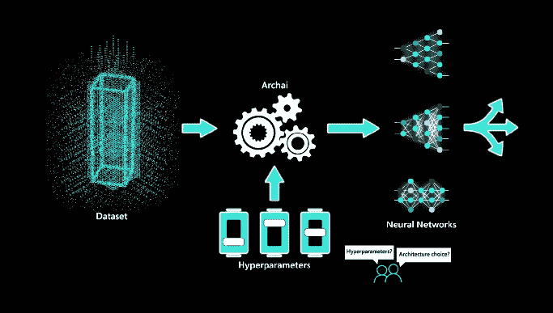
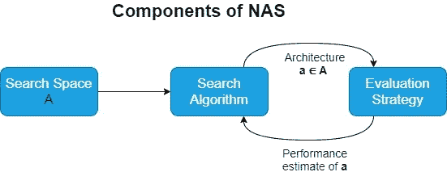
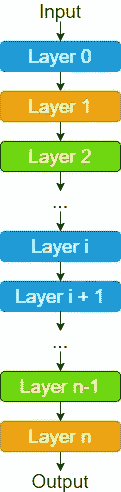
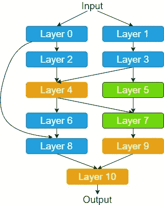
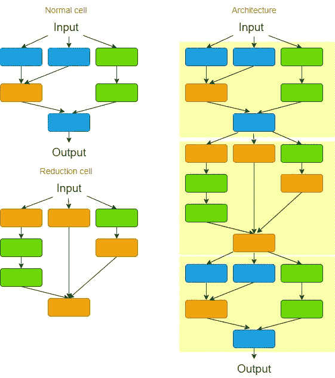

# 使用神经架构搜索(NAS)进行自动化架构建模

> 原文：<https://medium.com/analytics-vidhya/automate-architecture-modelling-with-neural-architecture-search-nas-1388b55fe565?source=collection_archive---------14----------------------->

# 神经架构搜索是怎么回事？

> "**创造 AI 的 AI** —神经架构搜索(NAS)是**自动化设计** [**人工神经网络**](https://en.wikipedia.org/wiki/Artificial_neural_network) (ANN)的技术，是[机器学习](https://en.wikipedia.org/wiki/Machine_learning)领域广泛使用的模型。"

O 多年来，深度学习范式在图像识别、语音识别和机器翻译等各种任务上取得了惊人的进展。许多像谷歌这样的领先公司和个人学术研究人员已经能够提供少量最先进的深度学习模型，以在上述这些应用程序上提供一些令人惊叹的结果。如果我们将这个主题缩小到图像分类，非常复杂的架构(如 VGG16、GoogleNet 和 ResNet)在标准数据集(如 ImageNet 和 CIFAR-10)上表现非常好，但在一些特定于组织的数据集上表现不太好。然而，这些当前采用的机器学习模型大多是由人类专家(如技术熟练的工程师和科学家团队)手动设计的，这是一个困难、耗时且容易出错的过程。

因此，AutoML 的一个称为神经架构搜索的子学科专注于自动设计机器学习模型，同时使这一过程更容易实现。**神经结构搜索旨在自动执行在给定数据集的情况下寻找最佳模型结构的过程。**

当我开始为我的最后一年研究项目研究 NAS 时，我发现了这个关于 NAS 的有趣调查，它非常有帮助，由 [Elsken 等人 2019](https://arxiv.org/abs/1808.05377) 。在这篇博客中，我将尝试以一种非常直观和简单的方式解释 NAS 背后的这些理论，因为我个人在第一次学习它时经历了很多困难。

# NAS 概述

通常，NAS 系统中有三个主要组件。

# 1.搜索空间

该组件描述了原则上 NAS 方法可能发现哪些神经架构。因此，**定义了一组操作(例如卷积、全连接、池化)以及如何连接操作以形成有效的网络架构**。尽管我们将 NAS 称为自动任务，但 NAS 方法的这一阶段需要人工干预来设计特定于给定应用程序的搜索空间。例如，对于计算机视觉任务，搜索空间可以是最先进的卷积网络的空间，而对于语言建模任务，搜索空间可以是递归网络的空间。然而，这在整个过程中引入了人为的偏见，这可能会阻止找到超出当前人类知识的新颖的架构构建块。但是，它仍然有助于减少搜索空间的大小并简化搜索。

## 顺序分层操作

这可能是为神经网络架构设计搜索空间的最天真和相对简单的方法。它由一系列 n 层组成，其中第 *i* 层 L_i 从第*(I-1)*层接收其输入，其输出作为第 *(i +1)* 层的输入。

搜索空间被参数化，

1.  **层数**
2.  **每层执行的操作类型**(例如:卷积、池化、深度可分卷积等)
3.  **与操作**相关的超参数(例如:滤波器数量、内核大小、卷积层的步距、全连接层的单元数量)

图中的每个节点对应于神经网络中的一层，例如卷积层或汇集层。不同的图层类型以不同的颜色显示。

## 链式结构空间

这结合了更复杂的搜索空间，具有一些附加的层类型和多个分支以及跳过连接。

## 基于单元的表示

如果我们要观察一些先进的视觉模型架构，如 Inception、ResNet 和 MobileNet，这些模型是使用重复的模块或单元设计的。因此，我们可以将搜索空间定义为重复多次的同一个单元，每个单元包含 NAS 算法预测的几个操作，而不是手动设计搜索空间的整个架构。这也使得通过调整单元重复的数量来缩小或放大模型尺寸变得容易。实现基于单元的搜索空间的主要优点之一是由于减少了搜索空间而获得了加速。(即，单元通常由比整个架构少得多的层组成)。NASNet 搜索空间学习用于网络构建的两种类型的单元:

1.  ***正常单元*** :输入输出特征图的维数相同。
2.  ***缩小单元*** :输出的特征地图宽度和高度缩小一半。

通过顺序堆叠单元而构建的架构。请注意，单元也可以以更复杂的方式组合，例如在多分支空间中，只需用单元替换层即可。

# 2.搜索算法

这个组件**决定了如何探索搜索空间以找到好的架构**。探索搜索空间的一种简单方法是试错法。随机搜索是一种反复试验的技术，它从搜索空间*中随机抽取一个有效的架构候选者*，不涉及学习模型。然而，这为设计良好的搜索空间提供了最佳结果。

现有的 NAS 搜索算法或搜索策略主要可以分为两类:黑盒优化策略和差分架构搜索策略。

## 黑盒优化策略

黑盒优化策略具有离散的搜索空间，因此梯度下降优化不能直接应用。各种自适应方法，如强化学习、进化编程和贝叶斯优化都属于黑盒范畴。

## 差异架构搜索策略

与黑盒优化策略不同，差分架构搜索策略将搜索空间放宽为连续的，因此使用梯度下降进行优化。 [DARTS](https://arxiv.org/pdf/1806.09055.pdf) 和 [PC-DARTS](https://arxiv.org/abs/1907.05737) 就是两种这样的差分架构搜索策略，它们比早期的黑盒优化策略更高效、更快速。

# 3.评估策略

如前所述，搜索算法的目标是找到一个神经架构，最大限度地提高一些性能指标，如对看不见的数据的准确性。因此，我们需要一种策略来估计或预测给定架构的性能，以指导搜索算法。

## 从头开始训练

一个显而易见的方法是根据训练数据独立地从头开始训练候选模型，然后评估它在验证数据上的性能。然而，这是一项高度计算的任务，需要数千个 GPU 日来从头开始训练每个要评估的架构。因此，已经提出了几种评估策略来加速性能估计。

## 代理任务性能

这种方法通常以更便宜和更快速的方式估计子网络的性能。它包括在一个更小的数据集上进行训练，这个数据集通常被称为代理数据集。从而在较大程度上减少了训练子网络的时间。此外，通过训练更少的时期，减少了训练时间。虽然这些近似降低了计算成本，但是它们也在估计中引入了偏差，因为性能通常会被低估。然而，只要搜索策略仅依赖于对不同架构的排名，并且相对排名保持稳定，这可能仍然不是问题。

# 摘要

在这篇文章中，我们回顾了神经结构搜索的问题，分为三个主要部分:搜索空间、搜索算法和评估策略。在深入研究更深层次的实现之前，这为您提供了对神经架构搜索的基本理解。

我希望这篇文章对你有用。

在后面的文章中，我们将开始更详细地研究一些有效的架构搜索策略，比如 DARTS。

# 参考

[1][https://arxiv.org/pdf/1806.09055.pdf](https://arxiv.org/pdf/1806.09055.pdf)

[2]https://arxiv.org/abs/1806.09055

[3]https://arxiv.org/abs/1806.09055