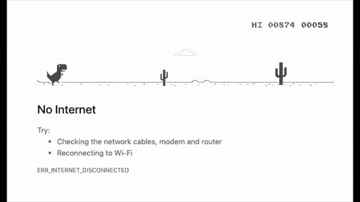
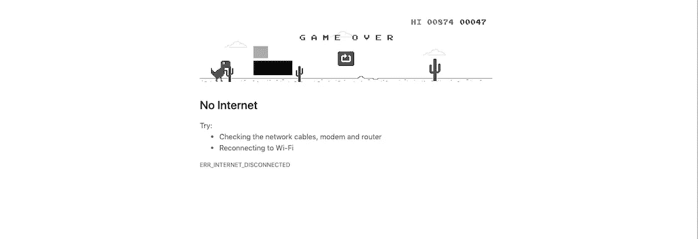

# 使用 Python | pyautogui 和 PIL 自动化 Chrome Dino 游戏

> 原文：<https://medium.com/analytics-vidhya/automate-chrome-dino-game-using-python-pyautogui-and-pil-eeb839005ccf?source=collection_archive---------0----------------------->

嘿，伙计们，今天我们要做一件非常有趣的事情。我们将使用 Python 实现谷歌 Chrome Dino 游戏的自动化。



chrome-dino-游戏-自动化-python

**什么是谷歌 Chrome Dino 游戏？**

谷歌 Chrome Dino 游戏是免费的离线/在线游戏，当没有互联网连接时，你可以在你的 Chrome 浏览器中看到。

**这个游戏有多少个角色？**

这里主要有三个角色。

1.  李灿
2.  仙人掌
3.  鸟

**游戏怎么玩？**

玩这个游戏有两种方法。

1.  脱机的
2.  在线的

**离线:**

当你的笔记本电脑没有互联网连接时，你将重定向到这个游戏，点击进入按钮游戏将开始。在这个游戏中，仙人掌和鸟随机靠近恐龙，恐龙需要通过跳跃或闪避来避免仙人掌和鸟的碰撞。根据你的表现，你会得到你的分数。

**在线:**

如果你想玩在线游戏，那么你可以访问[https://chromedino.com/](https://chromedino.com/)并像在离线时一样开始游戏。

# **如何使用 python 实现 chrome dino 游戏的自动化**

我假设你已经在你的系统中安装了`Python3`。如果没有，请从[这里](https://www.python.org/)下载。之后，为了自动化的过程，我们将需要两个 python 包。

1.  pyautogui
2.  PIL

所以首先我们需要使用给定的命令将`pyautogui`和`PIL`安装到我们的系统中。

> `pip3 install pyautogui
> pip3 install pillow`

好吧，做完这个我们就有 pyautogui 和枕头了。pyautogui 将帮助我们自动按下笔记本电脑的按键。

我想采取什么步骤来做到这一点？

因此，我们将采取什么步骤来实现这一点。

1.  首先，我需要在灰度上捕捉 chrome dino 游戏屏幕的截图。(黑白，因为图像处理在灰度上更好)。
2.  然后，我只是想在这个图像上为 cactus 添加某种矩形，这样，当我在 dino 附近获得矩形的那些像素时，我就可以相应地编写逻辑来跳转 dino(通过按 up 键)。
3.  同样的道理也适用于鸟类，会形成一个矩形，但比仙人掌矩形要轻一点。(区分两个矩形)当我发现这个矩形靠近恐龙时，我将按下向下键来避开恐龙。
4.  就是这样，在这之后，你会看到你的 chrome dino 游戏是使用 python 自动完成的。

现在让我们开始编写代码来实现我们的算法，看看它是如何工作的。

首先，我们需要创建一个文件，比如说`game.py`。在这个文件中，首先你需要导入两个包和时间。

```
import pyautogui 
from PIL import Image, ImageGrab 
import time
```

之后要做一个可以给你按键的功能。

```
def click(key):
   pyautogui.keyDown(key)
   return
```

现在在主界面，你需要按向上键开始游戏

```
if __name__ == "__main__":
    time.sleep(5)
    click('up')
```

正如你所看到的，我们有 5 秒钟的延迟，这样在运行程序后，我们可以有一些时间进入 chrome 浏览器页面，之后，我们只需调用 click 函数按下 up 键，然后我们的游戏就开始了。

现在我们需要不断地用灰度拍摄截图。为此，我们需要使用

```
while True:  # for infinity loop
      # capture image in black & white format
      image = ImageGrab.grab().convert('L')   
      data = image.load()
```

之后，我们需要为仙人掌画一个长方形。

```
# Draw the rectangle for cactus
         for i in range(530, 610):
             for j in range(130, 160):
                  data[i, j] = 0
  image.show()
  break
```

这段代码将在捕获的图像上绘制一个矩形并返回给你。但是你需要根据你的台式机或笔记本电脑在 for 循环中使用 x，y 坐标。这个坐标适用于我的笔记本电脑屏幕尺寸，也许对你来说会有所不同。所以你的矩形应该是这样的。


仙人掌图像中的黑色矩形

现在，你需要为鸟画一个矩形。

```
# Draw the rectangle for birds
        for i in range(530, 560):
            for j in range(100, 125):
                data[i, j] = 171
```

你的屏幕应该看起来像这样，因为你可以看到一个灰色的矩形是鸟。



鸟的灰色矩形

因此，现在一旦你完成了矩形在图像中的位置，下一个任务是检查与恐龙的碰撞。如果你仔细观察，那么在这个游戏中，当仙人掌和鸟靠近恐龙时，恐龙并没有向前移动。因此，让我们看看我们将如何做到这一点。我们将在内部创建 iscollision 函数，我们将检查矩形和恐龙的碰撞。

```
def isCollision(data):
# Check colison for birds
    for i in range(530,560):
        for j in range(80, 127):
            if data[i, j] < 171:
                click("down")
                return
 # Check colison for cactus
    for i in range(530, 620):
        for j in range(130, 160):
            if data[i, j] < 100:
                click("up")
                return
    return
```

现在在主函数中，在 while 循环中，我们将调用这个函数并注释为 rectangle 编写的代码，同时注释 break。因为现在我们不需要他们了。

完成上述所有步骤后，您的文件将如下所示

我们现在准备在终端上使用给定的命令来运行这个程序。

> python3 game.py

然后转到 chrome 浏览器游戏，你会看到你的恐龙在自动运行。

你可以从 [Github](https://github.com/ayushgemini/automate-chrome-dino-game-python.git) 下载源代码。

快乐编码。

下一个故事再见。敬请期待！

**可以在**[**LinkedIn**](https://www.linkedin.com/in/ayush-gemini/)**&**[**Github**](https://github.com/ayushgemini)**上联系我。**