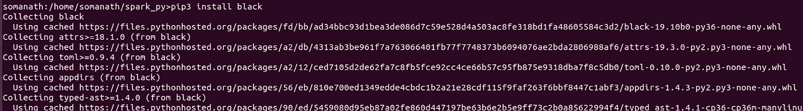
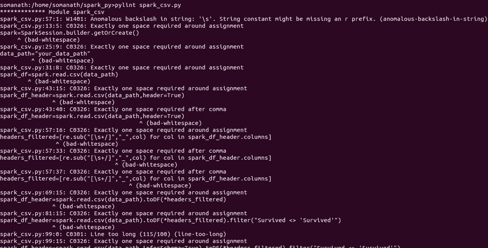
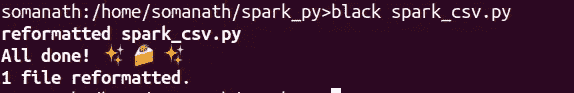
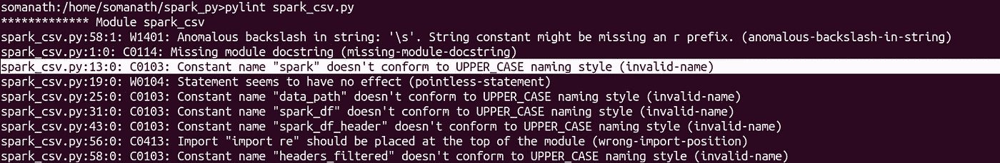

# 使用 Pyspark 和 Python 自动化代码质量

> 原文：<https://medium.com/analytics-vidhya/automate-code-quality-with-pyspark-and-python-1b3948094f01?source=collection_archive---------4----------------------->

这是我在火花深潜系列中的一个故事。

[https://medium.com/@somanathsankaran](/@somanathsankaran)

嗨，这是软件开发中的一个重要模块。**如果你是一名用 Jupyter noteboook 开发代码并将其保存为 python 脚本的开发者，我希望你继续写这篇博客。**python 开发人员的一个常见问题是维护 PEP-8 标准。

因此，在本模块中，让我们考虑下载一个 Jupyter 笔记本并自动清理代码(对于可用的 python 包，这并不奇怪)。

对此有帮助的工具或模块有

1.  皮林特
2.  黑色

皮林特:

根据官方文档，Pylint 是一个 Python 静态代码分析工具，它寻找编程错误，帮助执行编码标准，嗅探代码气味，并提供简单的重构建议。

黑色:

这个工具是 python 开发者的繁荣，它执行将代码重新格式化为 Pip 8 标准的乏味任务。

**第一步:安装 Black 和 Pylint**

**第二步:将 ipynb 转换为 py**

我们可以使用 UI 将 ipynb 文件转换为 py 文件，但是如果我们需要自动完成这一部分，我们也可以使用 jupyter-nbocnvert 将 ipynb 文件转换为 py 文件

转换为 py 文件

**步骤 3:用 pylint 检查 PEP-8 标准**

我们可以使用 pylint <filename>，它会按照 PEP-8 标准列出所有警告。</filename>

**步骤 4:用黑色重新格式化代码**

Black 将代码重新格式化并保存在同一个文件中。两者都适用

样本文件或包含 py 文件的目录

**步骤 5:使用 pylint 检查重新格式化的文件**

注意:上述警告是由于其他 PEP 规则

使用

因此，总结一下，如果你是一个懒惰的编码者，并且摆脱了 PEP-8 的问题，那么将上面的流程自动化为一个脚本，并且可以在 CI/CD 管道中使用

今天就到这里吧！！:)

Github 链接:[https://github . com/SomanathSankaran/spark _ medium/tree/master/spark _ CSV](https://github.com/SomanathSankaran/spark_medium/tree/master/spark_csv)

****学习并让别人学习！！****