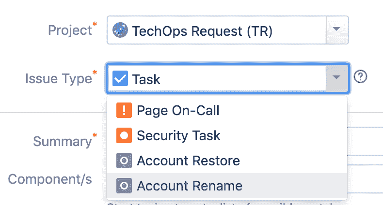
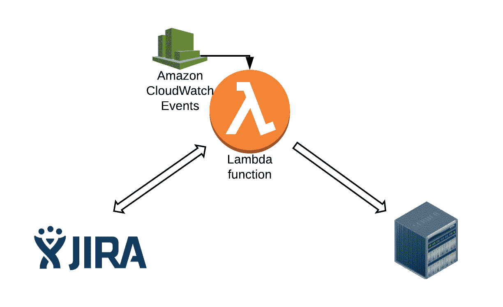
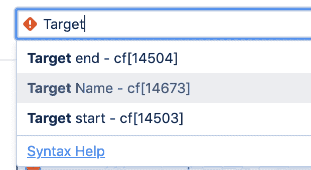
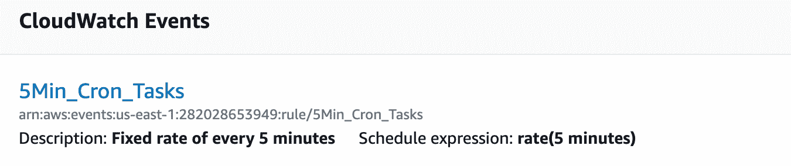
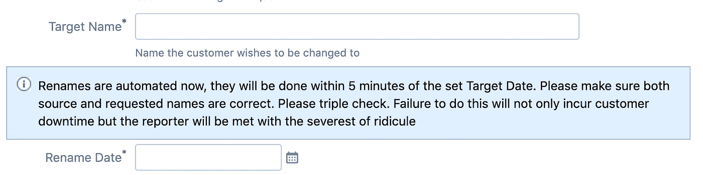

# 使用 Lambda 和 JIRA 自动执行开发运维任务

> 原文：<https://medium.com/analytics-vidhya/automate-devops-tasks-using-lambda-and-jira-29b9eea415fd?source=collection_archive---------0----------------------->

**“值++”**

TechOps 团队的一名工程师创造了这个术语。它引用了各种编码语言中“增量”的简写操作符。这也是我们作为一个团队应该做的事的座右铭…总是增加价值。

以下是我们日常运营中的一些重要的**“价值”——**

*   回答没有描述的吉拉门票
*   "客户有问题 B "..但是这句话中省略了客户名称和问题细节
*   手动做事情，一遍又一遍

在我的公司，TechOps 团队的大部分任务都是以 JIRA 门票的形式出现的。新的应用程序可能已经准备好进行部署。客户帐户需要重命名。我们还必须处理运营任务，例如将新客户帐户从演示环境转移到生产环境。

我总是想通过自动失业来提高效率。所以我开始通过 AWS Lambda 函数、API 调用和 JIRA 票证来自动化我们的部分 DevOps 任务。这使得团队不仅可以跟踪队列中出现的现有任务，还可以将时间花在更重要的事情上。

**【超值++】**

# 项目和问题类型

为了将任务与其他项目区分开来，我们首先必须锁定特定的 JIRA 项目和[问题类型](https://confluence.atlassian.com/adminjiracloud/issue-types-844500742.html)，为我们想要自动化的每个任务创建一个单独的问题类型。这不仅使事情易于组织，而且允许我们锁定谁可以或不可以制作特定的门票。



在这篇博客中，我们将回顾一个更简单的用例:自动执行帐户重命名。

# 简单的愚蠢

这张粗糙的图表展示了我们所做的基本工作。Lambda 函数由设置为每 5 分钟运行一次的 CloudWatch 事件规则触发。该函数将调用 JIRA API 来检索票据列表。使用这些票证，我们将获取必要的信息，并对基础架构中的后端服务进行后续 API 调用，以执行特定的操作…例如重命名。Lambda 还会在任务完成后主动更新并关闭票证。我们需要做的第一件事是知道要找什么票。



# 从 Lambda 查询 JQL

JIRA 查询语言(JQL)是在 JIRA 搜索问题的最灵活的方式之一。我们使用 JIRA REST API 的 JQL 查询来查找问题类型为“帐户重命名”的特定未结票据。这将返回相关票据的列表。

```
endpoint = “https://jira_url/rest/api"
 jql_issuetype = “issuetype=’Account Rename’”
 jql_project = “project=’TechOps Request’”
 status = “status=Open”
 jql = (“jql=” + jql_project +
 “+AND+” + jql_issuetype +
 “+AND+” + status
 )
 r = session.get(endpoint + “/2/search?” + jql % locals(), headers=headers_jira)
 response = json.loads(r.text)
 for issues in response[“issues”]:
 customer = issues[“fields”][“customfield_10001”]
 target_name = issues[“fields”][“customfield_14673”]
```

以开放票据列表为例，我们需要能够从中收集重要的信息，其中一些是定制字段的形式。

# 自定义字段

自定义字段由用户创建，默认情况下在吉拉中找不到。对于我们的特定用例，我们创建了几个字段，如**客户名称**、**目标名称**和**重命名日期。**从上面的代码示例中，您可以看到在 JIRA API 中，您不能只指定字段的名称，您需要添加一个 *customfield_id* 。你可以通过这个网址得到一个列表

[https://jira _ URL/rest/API/2/field](https://jira_url/rest/api/2/field)

专业提示…如果你不想看难看的 json 页面，你也可以进入高级 JIRA 搜索栏，输入域名。



**“值++”**

# 事件驱动计算…大多数时候

通常，当我们在 Lambda 上构建应用时，我们会有 Lambda 函数和事件源之类的组件。事件源是 AWS 中的一项服务，它发布将由 Lambda 函数中的代码处理的事件。在这种情况下，在创建 JIRA 票证时执行重命名可以用 [post 函数](https://confluence.atlassian.com/adminjiracloud/advanced-workflow-configuration-776636620.html#Advancedworkflowconfiguration-postfunctions)和 [API 网关来处理。](https://aws.amazon.com/api-gateway/)但是，客户有自己的维护窗口和帐户重命名的首选时间。有时，客户可能希望在周六凌晨 4 点……在我的个人维护(睡眠)窗口期间进行账户重命名。作为一种变通方法，我们决定使用一个 [cloudwatch 事件作为 lambda 调度器](https://docs.aws.amazon.com/AmazonCloudWatch/latest/events/RunLambdaSchedule.html)。



```
today = datetime.datetime.today() — datetime.timedelta(hours=7)
 desired_date = datetime.datetime.strptime(issues[“fields”][“customfield_16105”].replace(“-0700”,””), “%Y-%m-%dT%H:%M:%S.%f”)
 if today > desired_date:
 create_rename(customer, target_name)
```

我们的 Cloudwatch 事件将每 5 分钟运行一次，触发我们的 lambda 函数。该函数将首先检查当前时间是否超过了我们从自定义字段**重命名日期**解析的值(参见上面的代码)，只有这样我们才会允许该函数继续运行。

# 把所有的放在一起

至此，我们已经收集了我们需要的信息。我们能够对后端微服务进行 API 调用来执行重命名(该代码不会在本博客中显示)。然而，我们也想把 JIRA 票当作一个状态文件。我们不想一次又一次地抢同一个开放票。在这里，我们希望使用另一个 JIRA API 调用将票据移动到不同的工作流步骤(例如，从“打开”到“进行中”)。然而，就像定制字段一样，我们需要一个特定的转换 id，您可以通过[编辑您现有的项目工作流](https://confluence.atlassian.com/adminjiraserver073/working-with-workflows-861253510.html)来找到它。我们现在可以通过编程来更新我们 JIRA 机票的状态

```
def changeStatus(key, id):
 jira_request = {“transition”:{“id”: id }, “fields”: {“resolution”: {“name”: “Done”}}}
 endpoint = “https://jira_url.com/rest/api"
 r = session.post(endpoint + “/2/issue/%(key)s/transitions?expand=transitions.fields” % locals(), data=json.dumps(jira_request), headers=headers_jira)
 return r.text
```

# 从人群中拯救人们

客户重命名对于团队来说曾经是一项极其艰巨的任务。回顾我们的账户重命名手册的 Confluence 修订历史，就像 20 年后清理你的地下室一样。除了非常耗时之外，还有一个混杂的进程，包括停止 puppet 和运行，出于某种原因…一个 ruby 和一个 bash 脚本。有时需要重启应用程序，但并不总是如此。随着我们规模的增长，唯一可扩展的解决方案是自动化重复的、手动的、通常令人难以置信的任务。这不仅让我们能够为客户提供更好的服务，也让我们有机会绕过世俗，拥抱创新。

最后一个提示——这是最重要的部分——当我们想要自动化任何需要其他人手动输入的东西时，我们必须考虑到人类愚蠢的错误。确保创建[验证器和](https://confluence.atlassian.com/adminjiracloud/advanced-workflow-configuration-776636620.html)条件来解决这个问题。

另外，机智的警告信息是一个**“值++”**

