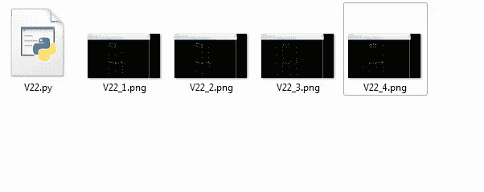

# 自动化 GUI 点击并保存屏幕截图

> 原文：<https://medium.com/analytics-vidhya/automate-gui-clicks-and-save-screenshots-fcbc9d52a08c?source=collection_archive---------5----------------------->


机器人为您服务

想象一下，你有一项繁重的任务，要浏览网站(技术网站、社交媒体，如脸书、Instagram、twitter 等)上的数百张图片..)然后，您必须使用 windows PrntScreen(然后粘贴到 paint 并以某个名称保存)方法手动保存每个图像或图像的一部分。它会很快变得令人沮丧和枯竭。还有一种情况是，当您想要滚动浏览某些程序表单/页面/屏幕，然后以屏幕截图的形式保存每个表单/页面/屏幕的内容。手动完成这项工作也非常累人。

这就是**“Python GUI 自动化”**包来拯救的地方。只需打开您的命令提示符，首先使用 pip 安装 **pyautogui** 包。(假设您的系统上已经安装了 python)

```
pip install pyautogui
```

一旦安装了这个包，你就可以创建非常强大的 GUI 自动化脚本。我将从我自己最近的例子开始，我在一个结构工程软件上工作，想要一些结果输出的部分作为单独的图像文件。

我将整个过程分为两个主要部分，即在第一部分，我需要设置我想要捕捉的屏幕限制和我需要保存多少截图。在第二部分中，我将展示实现这一目标的实际 python 代码。

1.  **设置屏幕限制和目标**


软件输出屏幕—力矩图(可以是任何东西..)

在上面的图像中，我只想捕捉显示结果的屏幕区域，即带有黄色图表的黑色部分。这可能是你的情况，你可以相应地设置目标。上述特殊结果是针对一种载荷组合的。为了获得所有载荷组合的截图，我需要按下屏幕右下角的箭头按钮，结果将在屏幕中央更新。正是这种按下按钮，并采取屏幕截图的特定部分是我想自动化。

首先，我需要得到屏幕的准确坐标。为此，你可以在网上使用任何免费的工具，或者如果你够极客的话，你可以自己建一个简单的工具。我在这里网上下载了一个免费的程序:[https://www . adminsehow . com/2012/03/real time-mouse-position-monitor-tool/](https://www.adminsehow.com/2012/03/realtime-mouse-position-monitor-tool/)

所以在第一部分，当我想第一次运行脚本时，我需要为我的程序激活窗口，从那里我想抓取屏幕截图。接下来，我需要采取一个屏幕截图只为特定部分的屏幕。然后我想用一个有用的名字保存这个截图，最后我必须**在我的程序中点击**下一步按钮(使用上面的工具在预定的位置)。

这整个过程应该发生在一个定时的方式，所以我需要 Python 的时间库。这将照顾到最初的滞后以及输出屏幕更新所需的时间，这样我就不会得到混乱的结果。


下一步按钮的鼠标位置(1208，714)

如上所示，下一个按钮位于坐标 1208、714 处。这大约是按钮的中心。只要鼠标停留在按钮的可点击部分，1210、715 就可以了。

**2。Python 自动化代码**

下面是实际的代码(我故意粘贴为图像，以便您手动输入；总是手写代码而不是复制粘贴是一个很好的学习习惯，因为打字可以增强学习体验。我将一步一步地解释代码。


屏幕截图和 GUI 点击自动化代码

首先，我正在导入 **pyautogui** (确保它已安装) **time** 以及 **winsound** python 库。在认为合适的地方暂停代码执行需要时间。当代码执行停止时，Winsound 会发出蜂鸣声。

**pyautogui.click(940，740)** 会激活我们要截图的窗口。这将随着您在窗口栏中打开和关闭选项卡而变化。我使用了一个“try-catch”块，以便**捕捉**任何异常，并且不会突然结束程序。

**im=pyautogui .截图(region=(375，0，1145，700))**

所有的魔法都发生在上面的语句中，因为这是捕获活动屏幕的代码部分。前两个参数是从屏幕左上角开始的 x 和 y 坐标。接下来的两个参数是图像的大小。


屏幕的 x 和 Y 轴

接下来，我们需要以一种合乎逻辑的方式保存我们得到的图像文件。如果你正在拍摄一些漂亮的猫咪照片，给它们连续命名为“cat-”+str(I)是有意义的，这样它们就可以保存为“cat-1”、“cat-2”等..

接下来引入休眠，以确保图像被正确保存并写入磁盘，程序为下一步做好准备。接下来，我们通过 **pyautogui.click(1210，715)单击一个预定义的位置。**然后我们需要一个小的停顿来确保屏幕更新了最新的结果。

最终蜂鸣器用于标志程序执行的结束。这是非常有用的，如果你有 100 或 1000 的图像处理，并为一个新的程序运行，你需要改变一些参数。你可能想知道第一次运行什么时候结束，这样你就可以回到电脑前(是的，只要机器人循环运行并生成截图文件，你就不能做任何其他事情)。不要害怕，如果在 IDE 中运行，您可以随时通过 **Ctrl + C** 来结束程序。

下面是一张漂亮的 **gif** 展示了整个过程(4 个循环)。


截图，保存并点击下一步

截图将按照程序中提供的命名约定保存在您的工作目录中。



保存为单独文件的屏幕截图

欢迎任何意见/建议。

*谢谢*